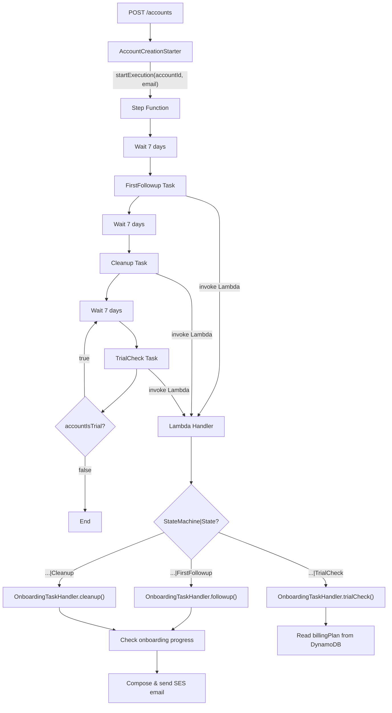

# Design Document: Account Creation Flow

## Overview

This feature adds an AWS Step Functions onboarding workflow that starts automatically when a new account is created via `POST /accounts`. The workflow sends contextual follow-up emails over several weeks based on onboarding progress (domain setup, sender configuration, email reception) and periodically checks whether the account has upgraded from the Trial plan — terminating the loop once it has.

The implementation spans two repositories:
1. **Backend** (`email-catcher/backend`) — Account creation starter, Step Function task handler, onboarding progress checker, email composer
2. **Infrastructure** (`email-catcher/infrastructure` or `email-catcher/backend/deploy`) — Step Function state machine definition, IAM permissions, Lambda environment variable

Key design constraints:
- Single Lambda architecture — Step Function tasks are a new event shape routed through the existing handler
- `neverthrow` Result types for all fallible operations
- SESv2 for email sending (existing pattern in `SesForwarder`, `SesReplySender`, verification mailer)
- `@aws-sdk/client-sfn` for starting executions
- OpenTofu for infrastructure (not Terraform)

## Architecture



### Key Design Decisions

1. **`billingPlan` field added to Account creation** — The `POST /accounts` handler sets `billingPlan: "Trial"` on the new account record. The existing `BillingPlan` type already includes `"Trial"` as a valid value (mapped from the existing `"Free"` tier in retention logic — but the requirements specify `Trial`, `Paid`, `Lifetime`, `Internal` as the valid set). We'll add `"Trial"` to the `BillingPlan` union type.

2. **Step Function start is fire-and-forget** — After persisting the account, the starter calls `StartExecution`. If it fails (except `ExecutionAlreadyExists`), the error is logged but the API response still returns 201. The account is already persisted — the Step Function is a non-blocking side effect.

3. **Account ID as execution name** — Guarantees at-most-once execution per account. `ExecutionAlreadyExists` is treated as success (idempotent).

4. **Route by `StateMachineName|StateName`** — The handler detects Step Function invocations by checking for `context.StateMachine` in the event. It routes using a `processorId` of `${StateMachine.Name}|${State.Name}` — the same pattern as the reference implementation. Each Task passes `'context.$': '$$'` so the handler receives the full execution context (state machine name, state name, execution input, execution ARN). Task results are stored back into `$` via `ResultPath`.

5. **OnboardingTaskHandler as a standalone module** — Encapsulates progress checking, email composition, and trial status logic. Injected with `AccountDatabase` and SES client dependencies.

6. **ARN always available** — The `ACCOUNT_CREATION_SFN_ARN` environment variable is always set when the Lambda runs. No guard for missing ARN is needed.

## Components and Interfaces

### AccountCreationStarter

Responsible for starting the Step Function execution after account creation.

```typescript
import { SFNClient, StartExecutionCommand } from "@aws-sdk/client-sfn";

export interface AccountCreationStarter {
  start(accountId: string, email: string): Promise<void>;
}

export class SfnAccountCreationStarter implements AccountCreationStarter {
  constructor(
    private readonly sfn: SFNClient,
    private readonly stateMachineArn: string,
    private readonly logger: Logger,
  ) {}

  async start(accountId: string, email: string): Promise<void> {
    try {
      await this.sfn.send(new StartExecutionCommand({
        stateMachineArn: this.stateMachineArn,
        name: accountId,
        input: JSON.stringify({ accountId, email }),
      }));
    } catch (e: unknown) {
      if ((e as { name?: string }).name === "ExecutionAlreadyExists") {
        // Idempotent — execution already running for this account
        return;
      }
      this.logger.error("Failed to start account creation Step Function — account is persisted, workflow will not run", {
        code: "account_creation_starter.start_failed",
        accountId,
        error: e,
      });
    }
  }
}
```

### OnboardingTaskHandler

Handles all three task types dispatched by the Step Function.

```typescript
export interface OnboardingProgress {
  domainAdded: boolean;
  senderSetupComplete: boolean;
  emailsReceived: boolean;
}

export interface OnboardingTaskHandler {
  handleFollowup(accountId: string, email: string): Promise<Result<void, DbError>>;
  handleCleanup(accountId: string, email: string): Promise<Result<void, DbError>>;
  handleTrialCheck(accountId: string): Promise<Result<{ accountIsTrial: boolean }, DbError>>;
}
```

### StepFunctionTaskEvent

The event shape for Step Function task invocations (using `'context.$': '$$'`):

```typescript
export interface StepFunctionTaskEvent {
  context: {
    Execution: {
      Id: string;        // execution ARN
      Input: { accountId: string; email: string };
      Name: string;      // execution name (= accountId)
    };
    StateMachine: {
      Id: string;        // state machine ARN
      Name: string;      // e.g. "email-catcher-AccountCreation"
    };
    State: {
      Name: string;      // e.g. "FirstFollowup", "Cleanup", "TrialCheck"
      EnteredTime: string;
    };
  };
}
```

### Handler Routing (addition to existing handler)

```typescript
function isStepFunctionTaskEvent(event: unknown): event is StepFunctionTaskEvent {
  const e = event as Record<string, unknown>;
  return typeof e === "object" && e !== null && typeof e.context === "object" && e.context !== null
    && "StateMachine" in (e.context as Record<string, unknown>);
}
```

The handler checks `isStepFunctionTaskEvent` before the existing `isEventBridgeEvent`, `isSqsEvent`, etc. checks. On match, it builds a `processorId` from `${StateMachine.Name}|${State.Name}` and routes to the appropriate handler method:

```typescript
if (isStepFunctionTaskEvent(event)) {
  const { context } = event;
  const processorId = `${context.StateMachine.Name}|${context.State.Name}`;
  const payload = context.Execution.Input;

  const processors: Record<string, () => Promise<unknown>> = {
    "email-catcher-AccountCreation|FirstFollowup": () => onboardingHandler.handleFollowup(payload.accountId, payload.email),
    "email-catcher-AccountCreation|Cleanup": () => onboardingHandler.handleCleanup(payload.accountId, payload.email),
    "email-catcher-AccountCreation|TrialCheck": () => onboardingHandler.handleTrialCheck(payload.accountId),
  };

  const processor = processors[processorId];
  if (!processor) {
    logger.warn("Unknown Step Function task", { code: "handler.sfn.unknown_task", processorId });
    return {};
  }
  return processor();
}
```

### Email Composition

The follow-up email content is determined by the `OnboardingProgress` result:

```typescript
export function composeFollowupEmail(progress: OnboardingProgress, email: string): { subject: string; textBody: string } {
  if (progress.domainAdded && progress.senderSetupComplete && progress.emailsReceived) {
    return {
      subject: "You're all set!",
      textBody: "Congratulations — your account is fully configured. ...",
    };
  }

  const suggestions: string[] = [];
  if (!progress.domainAdded) suggestions.push("• Add a custom domain to start receiving emails");
  if (!progress.senderSetupComplete) suggestions.push("• Complete sender setup (DKIM, SPF, DMARC) to enable replies and forwarding");
  if (!progress.emailsReceived) suggestions.push("• Send a test email to your domain to verify everything works");

  return {
    subject: "Next steps for your account",
    textBody: `Here's what's left to get the most out of your account:\n\n${suggestions.join("\n")}\n\n...`,
  };
}
```

## Data Models

### Account (updated)

The `billingPlan` field becomes non-optional and is set to `"Trial"` on creation:

| Field | Type | Change |
|-------|------|--------|
| billingPlan | `BillingPlan` | Was optional (`billingPlan?`), becomes required on new accounts. Existing accounts without the field default to `"Paid"` at read time (existing behaviour in `getProcessorAccountContext`). |

The `BillingPlan` type is updated to include `"Trial"`:

```typescript
export type BillingPlan = 'Trial' | 'Free' | 'Beta' | 'Paid' | 'Lifetime' | 'Premium' | 'Internal';
```

### Step Function Input

```json
{
  "accountId": "acc-abc123xyz",
  "email": "user@example.com"
}
```

### Step Function Task Payload (Lambda input)

The Lambda receives the full Step Function context via `'context.$': '$$'`:

```json
{
  "context": {
    "Execution": {
      "Id": "arn:aws:states:eu-central-1:342695602194:execution:email-catcher-AccountCreation:acc-abc123xyz",
      "Input": { "accountId": "acc-abc123xyz", "email": "user@example.com" },
      "Name": "acc-abc123xyz"
    },
    "StateMachine": {
      "Id": "arn:aws:states:eu-central-1:342695602194:stateMachine:email-catcher-AccountCreation",
      "Name": "email-catcher-AccountCreation"
    },
    "State": {
      "Name": "FirstFollowup",
      "EnteredTime": "2025-06-01T10:00:00Z"
    }
  }
}
```

### Trial Check Response (Lambda output → Step Function)

```json
{
  "accountIsTrial": true
}
```

### Step Function State Machine Definition (ASL)

```json
{
  "StartAt": "InitialWait",
  "States": {
    "InitialWait": {
      "Type": "Wait",
      "Seconds": 604800,
      "Next": "FirstFollowup"
    },
    "FirstFollowup": {
      "Type": "Task",
      "Resource": "arn:aws:lambda:...:function:...:production",
      "Parameters": {
        "context.$": "$$"
      },
      "ResultPath": "$.firstFollowupResult",
      "Next": "SecondWait",
      "Retry": [{ "ErrorEquals": ["States.ALL"], "IntervalSeconds": 60, "MaxAttempts": 5, "BackoffRate": 2 }]
    },
    "SecondWait": {
      "Type": "Wait",
      "Seconds": 604800,
      "Next": "Cleanup"
    },
    "Cleanup": {
      "Type": "Task",
      "Resource": "arn:aws:lambda:...:function:...:production",
      "Parameters": {
        "context.$": "$$"
      },
      "ResultPath": "$.cleanupResult",
      "Next": "TrialCheckWait",
      "Retry": [{ "ErrorEquals": ["States.ALL"], "IntervalSeconds": 60, "MaxAttempts": 5, "BackoffRate": 2 }]
    },
    "TrialCheckWait": {
      "Type": "Wait",
      "Seconds": 604800,
      "Next": "TrialCheck"
    },
    "TrialCheck": {
      "Type": "Task",
      "Resource": "arn:aws:lambda:...:function:...:production",
      "Parameters": {
        "context.$": "$$"
      },
      "ResultPath": "$.trialCheckResult",
      "Next": "IsStillTrial",
      "Retry": [{ "ErrorEquals": ["States.ALL"], "IntervalSeconds": 60, "MaxAttempts": 5, "BackoffRate": 2 }]
    },
    "IsStillTrial": {
      "Type": "Choice",
      "Choices": [
        {
          "Variable": "$.trialCheckResult.accountIsTrial",
          "BooleanEquals": true,
          "Next": "TrialCheckWait"
        }
      ],
      "Default": "Done"
    },
    "Done": {
      "Type": "Succeed"
    }
  }
}
```

## Error Handling

| Scenario | Behaviour |
|----------|-----------|
| `ExecutionAlreadyExists` from StartExecution | Treat as success (idempotent) |
| Other StartExecution error | Log error, return 201 (account already persisted) |
| Account already exists (409) | Return 409, do not start Step Function |
| Unknown `processorId` received | Log warning, return `{}` |
| Missing `context.Execution.Input` fields | Log warning, return `{}` |
| Account not found during progress check | Skip email, return success to Step Function |
| DynamoDB query failure for domains/signals | Treat milestone as incomplete (false), continue |
| SES SendEmail failure | Return error to Step Function (built-in retry handles it) |
| Account not found during trial check | Return `{ accountIsTrial: false }` to terminate loop |
| DynamoDB read failure during trial check | Throw error → Step Function Task retry |

## Testing Strategy

### Approach

Property-based testing is not used in this project. All tests use static, deterministic inputs with explicit expected outputs via `it.each` tables where multiple cases exercise different code paths.

### Unit Tests (vitest)

**AccountCreationStarter:**
| Case | Input | Expected |
|------|-------|----------|
| Happy path | valid accountId + email | `StartExecutionCommand` called with correct params |
| ExecutionAlreadyExists | SFN throws ExecutionAlreadyExists | No error thrown, treated as success |
| Other SFN error | SFN throws generic error | Error logged, no exception propagated |

**OnboardingTaskHandler.handleFollowup / handleCleanup:**
| Case | Account state | Expected progress | Email content |
|------|--------------|-------------------|---------------|
| No milestones complete | No domains, no signals | `{false, false, false}` | All 3 suggestions |
| Domain added only | 1 domain (senderSetup=false), no signals | `{true, false, false}` | 2 suggestions |
| All complete | Domain with senderSetup=true, 1+ signals | `{true, true, true}` | Congratulatory email |
| Account not found | getAccount returns null | No email sent, returns Ok |
| Domain query fails | listDomains returns Err | `domainAdded=false`, continues |
| SES failure | SendEmail throws | Returns Err (Step Function retries) |

**OnboardingTaskHandler.handleTrialCheck:**
| Case | Account state | Expected output |
|------|--------------|-----------------|
| Trial plan | `billingPlan: "Trial"` | `{ accountIsTrial: true }` |
| Paid plan | `billingPlan: "Paid"` | `{ accountIsTrial: false }` |
| Missing billingPlan | `billingPlan: undefined` | `{ accountIsTrial: false }` |
| Account deleted | getAccount returns null | `{ accountIsTrial: false }` |
| DynamoDB failure | getAccount returns Err | Throws error (Step Function retries) |

**Handler routing:**
| Case | Event shape | Expected |
|------|-------------|----------|
| Valid FirstFollowup task | `{ context: { StateMachine: { Name: "email-catcher-AccountCreation" }, State: { Name: "FirstFollowup" }, Execution: { Input: { accountId, email } } } }` | Routes to handleFollowup |
| Valid TrialCheck task | `{ context: { ..., State: { Name: "TrialCheck" }, ... } }` | Routes to handleTrialCheck |
| Unknown state name | `{ context: { ..., State: { Name: "Unknown" }, ... } }` | Logs warning, returns `{}` |
| Missing Execution.Input | `{ context: { StateMachine: {...}, State: {...}, Execution: {} } }` | Logs warning, returns `{}` |
| SQS event (existing) | `{ Records: [...] }` | Routes to existing SQS handler |
| EventBridge event (existing) | `{ source, detail-type }` | Routes to existing EventBridge handler |

**Email composition:**
| Case | Progress | Expected subject |
|------|----------|-----------------|
| All incomplete | `{false, false, false}` | "Next steps for your account" |
| All complete | `{true, true, true}` | "You're all set!" |
| Partial (domain only) | `{true, false, false}` | "Next steps..." with 2 suggestions |

**Account creation (billingPlan):**
| Case | Request body | Expected billingPlan on persisted account |
|------|-------------|------------------------------------------|
| No billingPlan in body | `{}` | `"Trial"` |
| billingPlan in body (ignored) | `{ billingPlan: "Paid" }` | `"Trial"` |

### Integration Tests

- End-to-end `POST /accounts` → verify account has `billingPlan: "Trial"` and Step Function start was attempted
- Step Function task event → Lambda handler → verify correct routing and response shape

### Infrastructure Tests

The Step Function state machine definition and IAM permissions are validated via `tofu plan` and manual review. No automated infrastructure tests for this feature (the state machine is declarative configuration).

### Library Choices

- **Test runner**: vitest (existing)
- **Mocking**: vitest built-in `vi.fn()` for SFN client, AccountDatabase, SES client
- **AWS SDK mock**: `aws-sdk-client-mock` (existing in project) for `SFNClient`
