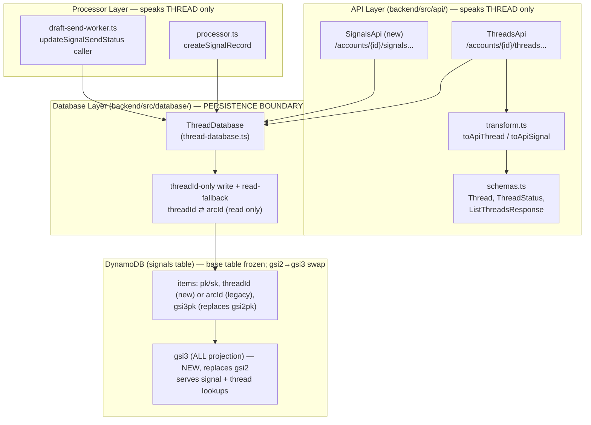

# Design Document

## Overview

This migration completes the backend rename from the domain term "arc" to "thread" so the backend contract matches the already-migrated `site-ui` frontend. The work spans four layers, but the guiding principle is a strict separation between **the code interface** (renamed to "thread" everywhere) and **the physical base-table persistence shape** (retained exactly as-is, still "arc"-flavored). The one physical layout change is a scoped index swap on the signals table: the `gsi2` message-id index is replaced by a new `gsi3` index with `ALL` projection that serves both the In-Reply-To signal lookup and the grouping-key thread lookup.

Concretely the migration:

1. Reshapes the `/threads` API responses so they emit a `threads` list envelope, a `threadId` field only (never `arcId`), and a quarantine-approval body keyed on `thread` (Requirements 1, 2, 6).
2. Relocates the account-level, non-thread-scoped `Signals_Routes` out of `arcsApi.ts` into a retained `signalsApi.ts` module, validates that `ThreadsApi` provides full functional parity with `ArcsApi`, then removes the `/arcs` route family and the `ArcsApi` class (Requirements 3, 4, 5, 7).
3. Renames the database module's **code interface** — class `ArcDatabase` → `ThreadDatabase`, methods `getArc`/`listArcs`/... → `getThread`/`listThreads`/..., exported type `UpdateArcFields` → `UpdateThreadFields`, in-code property `arcId` → `threadId`, and the file `arc-database.ts` → `thread-database.ts` — while retaining the physical persistence shape (Requirement 10).
4. Introduces a single **persistence boundary** inside `backend/src/database/` that writes ONLY the `threadId` attribute on new records (no `arcId`), and resolves reads universally as `record.threadId ?? record.arcId` before returning any thread-named object to a caller (Requirement 9).
5. Swaps the signals-table message-id index: it **adds** a new `gsi3` global secondary index with `ALL` projection serving two access patterns (signal In-Reply-To lookup and thread grouping-key lookup), **migrates** reads onto `gsi3`, **writes** the new `gsi3pk` attribute *in place of* `gsi2pk`, eliminates the separate GKEY pointer items, and then **drops** the `gsi2` index (and its now-unused `gsi2pk` attribute declaration). Because DynamoDB permits only one GSI add/delete per `UpdateTable`, the `gsi3` addition + read cutover deploy before the `gsi2` drop (a separate apply). No history is backfilled; the In-Reply-To lookup stays best-effort (Requirements 11, 12, 14).
6. Migrates the API test suite to exercise `/threads`, assert the `threads` envelope and `threadId`, and assert the absence of `arcId` (Requirement 13).

### Key design principle: two invariants that never change

- **Base-table persistence is frozen.** The partition-key value format `ACCT#{accountId}#ARC#{id}`, the generic key attributes (`pk`, `sk`, `gsi1pk`, `gsi1sk`), and the `gsi1` index name are all retained unchanged because real persisted records already depend on them (Requirements 10.6, 11.3–11.5). The persisted `arcId` attribute exists only on pre-migration items; new writes produce `threadId` only. The one exception to "frozen" is the message-id index: `gsi2`/`gsi2pk` are removed and replaced by `gsi3`/`gsi3pk` (Requirements 11, 12).
- **"Arc" awareness is confined to `backend/src/database/`.** Every layer above the database module speaks only "thread". The database module is the only place that knows the physical attribute is still called `arcId` on pre-migration records (Requirements 9, 10.9, 10.10).

## Architecture

### Layered view



> Note: the former `gsi2` (INCLUDE: `arcId`, …) is **dropped** by this migration. `gsi3` replaces it with `ALL` projection, serving both the In-Reply-To signal lookup and the grouping-key thread lookup. The base table is otherwise unchanged.

### Where the "arc" term is allowed to remain (post-migration)

| Location | Retained "arc" token | Reason |
| --- | --- | --- |
| DDB partition-key **values** | `ACCT#{accountId}#ARC#{id}` | Real persisted keys; changing them is a data migration (out of scope) — Req 10.6 |
| DDB stored attribute on pre-migration items | `arcId` (base-table only, legacy rows) | Historical records carry it; the boundary reads it via fallback — Req 9.5 |
| `thread-database.ts` internal helpers | key-builder `ACCT#...#ARC#...`, read-fallback mapping | This is the persistence boundary — Req 10.9 |

Everywhere else — API paths, schemas, transforms, error codes, processor code, worker code, DB method/type/class names, in-code identifier properties — uses "thread" only.

### The persistence boundary: threadId-only write + universal read fallback

The database module is the single translation point between the thread-named application world and the arc-named physical store.

**On write (threadId only — Req 9.1, 9.2, 9.10, 10.7):** new records are written with ONLY the `threadId` attribute. The `arcId` attribute is NOT written on new records. The partition-key value keeps the `ACCT#{accountId}#ARC#{id}` format (Req 9.3). Both `threadId` and `gsi3pk` are non-key attributes, so neither affects any `pk`/`sk`/`gsi1pk`/`gsi1sk` key (Req 9.4).

**On read (universal fallback — Req 9.5, 9.6, 9.7, 9.8, 9.9):** every read/get/query path that maps a stored record to an application object resolves the identifier as `record.threadId ?? record.arcId` — preferring the migrated attribute, falling back to the legacy one. The fallback is applied on **every** read method, not a subset, because historical thread and signal items written before this migration carry only `arcId` and no `threadId` (Req 9.8). The boundary always populates `threadId` on the object it returns to any caller outside the module (Req 9.9).

**Reads served by `gsi3` (ALL projection — Req 9.7):** because `gsi3` uses `ALL` projection, items are returned in full with whatever attributes they carry. Post-migration items have `threadId`; pre-migration items have only `arcId`. The same `record.threadId ?? record.arcId` fallback applies universally — no special-casing needed for gsi3-served reads.

### gsi3 replaces gsi2: two access patterns, ALL projection, add then drop gsi2

`gsi3` is a new index with `ALL` projection that serves **two** access patterns via key-prefix discrimination on the `gsi3pk` attribute:

- **Signal items (In-Reply-To lookup):** `gsi3pk = ACCT#{accountId}#MSGID#{msgId}` — same format as today's `gsi2pk`. Queried by `findSignalByEmailMessageId`. Returns the full signal item (ALL projection — single read, no second base-table fetch).
- **Thread items (grouping-key lookup):** `gsi3pk = ACCT#{accountId}#GKEY#{groupingKey}` — written directly on the thread item when a `groupingKey` is present. Queried by `findThreadByGroupingKey` (replaces `fastFindArcByAlternativeLookupKey`). Returns the full thread item (ALL projection — single read, no second base-table fetch).

With `ALL` projection, both access patterns return complete items. There is no `non_key_attributes` list to maintain, no projection-completeness concern, and no second base-table read needed for either lookup.

**GKEY pointer items are eliminated:** `saveThread` no longer writes a separate `{ pk: GKEY#{accountId}#{key}, sk: "GKEY", arcId }` row. Instead it writes `gsi3pk = ACCT#{accountId}#GKEY#{groupingKey}` directly on the thread item. Historical GKEY pointer rows remain as dead data (never read); they expire via TTL or are cleaned up separately — but no code in this migration reads or depends on them.

**Write sites for `gsi3pk`:**
- Signal ingestion (`createSignalRecord`): writes `gsi3pk = ACCT#{accountId}#MSGID#{msgId}` on the signal item.
- Signal send (`updateSignalSendStatus`): writes `gsi3pk = ACCT#{accountId}#MSGID#{msgId}` on the signal item.
- Thread save (`saveThread`): writes `gsi3pk = ACCT#{accountId}#GKEY#{groupingKey}` on the thread item when `groupingKey` is present.

Since `gsi2` is being dropped, there is **no** `gsi2pk`/`gsi3pk` lockstep dual-write — the boundary writes `gsi3pk` *instead of* `gsi2pk`. The message-id value builder (formerly `buildGsi2pk`) is reused/renamed to produce the signal `gsi3pk` value; its output (`ACCT#{accountId}#MSGID#{msgId}`) is identical (Req 12.3).

**Deploy sequencing (Req 11.6, 11.7, 12.14):** DynamoDB allows only one GSI add or delete per `UpdateTable` operation. Therefore the `gsi3` addition **and** the read cutover onto `gsi3` are deployed first; only once no read depends on `gsi2` is the `gsi2` index dropped, in a **separate** apply.

## Components and Interfaces

### 1. Database layer — `thread-database.ts` (renamed from `arc-database.ts`)

**File rename** (Req 10.5): `backend/src/database/arc-database.ts` → `backend/src/database/thread-database.ts`.

**Class rename** (Req 10.1): `ArcDatabase` → `ThreadDatabase`.

**Exported type rename** (Req 10.3): `UpdateArcFields` → `UpdateThreadFields`.

**Method renames** (Req 10.2) — the code interface only; DDB operations inside are unchanged except for the threadId-only write and read-fallback mapping:

| Current method | Renamed method |
| --- | --- |
| `getArc` | `getThread` |
| `listArcs` | `listThreads` |
| `updateArc` | `updateThread` |
| `createArc` | `createThread` |
| `saveArc` | `saveThread` |
| `searchArcs` | `searchThreads` |
| `fastFindArcByAlternativeLookupKey` | `findThreadByGroupingKey` |
| `listActiveArcs` | `listActiveThreads` |
| `listActiveArcsBefore` | `listActiveThreadsBefore` |
| `listPreArcSignals` | `listPreThreadSignals` |
| `getSignalById(…, arcId?)` | `getSignalById(…, threadId?)` |
| `listSignals(…, arcId, …)` | `listSignals(…, threadId, …)` |
| `unblockSignal(…, arcId)` | `unblockSignal(…, threadId)` |
| `getLinkedCalendarSignal(…, arcId, …)` | `getLinkedCalendarSignal(…, threadId, …)` |
| `getLatestCalendarResponse(…, arcId, …)` | `getLatestCalendarResponse(…, threadId, …)` |

`findSignalByEmailMessageId` now queries the `gsi3` index (`IndexName: "gsi3"`) with `gsi3pk = ACCT#{accountId}#MSGID#{msgId}` and resolves the owning thread from the returned item via the universal `record.threadId ?? record.arcId` fallback (ALL projection returns the full item); its return type's `arcId?` field becomes `threadId?`. A miss returns `null` (best-effort — Req 14.2, 14.4).

`findThreadByGroupingKey` (replaces `fastFindArcByAlternativeLookupKey`) queries `gsi3` with `gsi3pk = ACCT#{accountId}#GKEY#{groupingKey}` and returns the full thread item directly (ALL projection — single read, no second base-table fetch). The returned thread has `threadId` resolved via the universal fallback.

**Internal persistence-boundary helpers (new, private to the module):**

```ts
// Physical base-table key value format is RETAINED (Req 9.3, 10.6)
const threadPk = (accountId: string, id: string) => `ACCT#${accountId}#ARC#${id}`;

// WRITE: threadId only — new records do NOT carry arcId (Req 9.1, 9.2, 9.10)
// The caller speaks threadId; the boundary stores it as-is.
// No arcId is written on new items.

// WRITE: gsi3pk builders for the two access patterns
const buildSignalGsi3pk = (accountId: string, msgId: string) => `ACCT#${accountId}#MSGID#${msgId}`;
const buildThreadGsi3pk = (accountId: string, groupingKey: string) => `ACCT#${accountId}#GKEY#${groupingKey}`;

// READ: universal fallback, applied on EVERY read/get/query path (Req 9.5–9.9)
function resolveThreadId(record: { threadId?: string; arcId?: string }): string | undefined {
  return record.threadId ?? record.arcId;
}
function hydrateThreadObject<T extends { threadId?: string; arcId?: string }>(record: T): T {
  const threadId = resolveThreadId(record);
  return threadId === undefined ? record : { ...record, threadId };
}
```

The existing `hydrateSignal` read helper is extended to also apply `hydrateThreadObject`, and every read path that currently returns a raw `Arc`/`Signal` (`getThread`, `listThreads`, `searchThreads`, `listActiveThreads*`, `findThreadByGroupingKey`, `getSignalById`, `listSignals`, `findSignalByEmailMessageId`, `getLinkedCalendarSignal`, `getLatestCalendarResponse`, and the `ReturnValues: "ALL_NEW"` results of update methods) is routed through it so `threadId` is always populated before returning (Req 9.9).

**Write sites (threadId only — Req 9.1, 9.2, 9.10):** `saveSignal`, `saveThread`, `unblockSignal`, `updateThread`, and `updateSignalSendStatus` all write `threadId` only. No `arcId` attribute is written on new records.

**`saveThread`** (Req 12.6, 12.11): when the thread has a `groupingKey`, writes `gsi3pk = ACCT#{accountId}#GKEY#{groupingKey}` directly on the thread item. Does NOT write a separate GKEY pointer item — the pointer row pattern is eliminated.

**`updateSignalSendStatus`** (send path, Req 12.5, 12.7): writes `gsi3pk = ACCT#{accountId}#MSGID#{msgId}` on the signal item (in place of the removed `gsi2pk`), and writes `threadId` on the item. The caller (`draft-send-worker.ts`) already has the loaded signal, so its resolved `threadId` is passed in.

### 2. Processor layer — `processor.ts`, `draft-send-worker.ts`, `message-id.ts`

- `processor.ts` `createSignalRecord` and all in-code references to `signal.arcId` become `signal.threadId` (Req 10.4, 10.10). The record it builds now carries `gsi3pk` (in place of `gsi2pk`); because writes flow through the persistence boundary (`saveSignal`/`createSignal`), `gsi3pk` and `threadId` are attached there (Req 12.4). No "arc" token remains in processor code.
- **Processor Tier 1 caller (grouping key):** now calls `findThreadByGroupingKey` (which queries `gsi3` with the `GKEY` prefix) instead of the old `fastFindArcByAlternativeLookupKey` that looked up GKEY pointer items. Same semantics: returns the matched thread or `null`.
- **Processor Tier 1.5 caller (Arc_Matching_Cascade, Req 14.1):** the In-Reply-To tier still calls `findSignalByEmailMessageId`; its behavior is unchanged except that it now resolves the owning `threadId` (from the `gsi3` ALL-projected item) instead of an `arcId`. The lookup remains best-effort — a miss (or a logged error) falls through to the remaining tiers, and a total cascade miss creates a new thread (Req 14.2, 14.3, 14.4).
- `draft-send-worker.ts` passes the message-id key value and the resolved `threadId` into `updateSignalSendStatus`; the boundary writes `gsi3pk` (in place of `gsi2pk`) and `threadId` only (Req 12.5).
- `message-id.ts` `buildGsi2pk` is reused/renamed to `buildSignalGsi3pk` — its output value (`ACCT#{accountId}#MSGID#{msgId}`) is unchanged and now populates the `gsi3pk` attribute (Req 12.3).

### 3. API layer — transforms, schemas, requests, error codes

**`transform.ts` (Req 2, 6, 7.4):**
- `toApiArc` → `toApiThread`, returning `threadId` **only** (the current `arcId: arc.id` line is removed) — Req 2.1, 2.2.
- `toApiSignal`: emit `threadId` from the resolved identifier and **never** `arcId` (Req 2.5). When a signal has no thread association, emit `threadId: null` explicitly (Req 2.4) rather than omitting it.

```ts
// toApiSignal base — Req 2.3, 2.4, 2.5
const base = {
  signalId: signal.id,
  threadId: signal.threadId ?? null,   // always present; null when unassigned
  source: toApiSource(signal.source),
  status: signal.status,
  createdAt: signal.createdAt,
};
```

**`schemas.ts` (Req 7.3, 8.2):**
- `Arc` z-schema → `Thread`, `.openapi("Arc")` → `.openapi("Thread")`; drop the `arcId` property, keep `threadId` (required).
- `ArcStatus` → `ThreadStatus`, `ArcUrgency` → `ThreadUrgency`.
- `ListArcsResponse` → `ListThreadsResponse = z.object({ threads: z.array(Thread), pagination: Pagination })` — the envelope key becomes `threads` (Req 1.1, 1.3).
- `SignalBase`: remove the `arcId` property; make `threadId` a nullable-but-present field (Req 2.3–2.5).
- `ErrorCode` enum: `ARC_NOT_FOUND` → `THREAD_NOT_FOUND`, `SIGNAL_ARC_MISMATCH` → `SIGNAL_THREAD_MISMATCH` (Req 7.6). No error code value SHALL contain the substring `ARC` (Req 15.1).

**`requests.ts`:** `UpdateArcRequest` → `UpdateThreadRequest`; `ArcStatus`/`ArcUrgency` local enums → `ThreadStatus`/`ThreadUrgency`.

**Error codes and messages (Req 7.6, 15.1–15.4):** every `"ARC_NOT_FOUND"` → `"THREAD_NOT_FOUND"`, every `"SIGNAL_ARC_MISMATCH"` → `"SIGNAL_THREAD_MISMATCH"`, and human messages `"Arc not found"` → `"Thread not found"`, `"Signal does not belong to this arc"` → `"Signal does not belong to this thread"`. A test validates no `ErrorCode` enum value contains the substring `ARC`.

### 4. API layer — route module reorganization

**`ThreadsApi` (`threadsApi.ts`) — fixes to the existing class (Req 1, 2, 3, 6, 7):**
- List handlers page under the `"threads"` key (`page("threads", …)`) instead of `"arcs"` (Req 1.1, 1.2, 1.3).
- Use renamed DB methods, `toApiThread`, `THREAD_NOT_FOUND`, `SIGNAL_THREAD_MISMATCH`.
- Constructor field `arcDb: ArcDatabase` → `threadDb: ThreadDatabase`; imports come from `thread-database.js`.
- Imports of `SignalReprocessor` / `ListArcsParams` move off `arcsApi.js` (see below); `ListArcsParams` → `ListThreadsParams`.
- Tag stays `"Threads"` (Req 7.5). All nine thread capabilities (Req 3.1–3.9) already exist here; the parity gate confirms this before removal.

**`SignalsApi` (`signalsApi.ts`) — new retained module (Req 5.8):** the non-thread-scoped `Signals_Routes` are relocated here verbatim from `arcsApi.ts`:
- `GET /accounts/{accountId}/signals` (quarantine list) — Req 5.1
- `GET /accounts/{accountId}/signals/{id}` — Req 5.2
- `GET /accounts/{accountId}/signals/{id}/raw` — Req 5.3
- `PATCH /accounts/{accountId}/signals/{id}` — Req 5.4
- `DELETE /accounts/{accountId}/signals/{id}` — Req 5.5
- `POST /accounts/{accountId}/signals/{id}/quarantineResponse` — Req 5.6
- `POST /accounts/{accountId}/signals/{id}/reprocess` — Req 5.7

The `quarantineResponse` success body changes from `{ arc: toApiArc(arc), signal: … }` to `{ thread: toApiThread(thread), signal: … }` — a `thread` object containing `threadId`, and **no** `arc` key (Req 6.1, 6.2, 6.3). The shared types currently exported from `arcsApi.ts` (`SignalReprocessor`, `ListArcsParams`) are moved: `SignalReprocessor` into `signalsApi.ts`, and the list-params type into `threadsApi.ts` renamed `ListThreadsParams`.

**`ArcsApi` removal (Req 4):** after the parity gate passes, delete `arcsApi.ts` (the `ArcsApi` class and every `/accounts/{accountId}/arcs...` route). No route path may contain the `arcs` segment (Req 4.1); requests under `/accounts/{accountId}/arcs` fall through to the existing `app.notFound` handler and return 404 (Req 4.2).

**`app.ts` wiring (Req 4, 5):**
- Remove `import { ArcsApi }` and its `new ArcsApi(...).register(...)` line.
- Add `import { SignalsApi }` and `new SignalsApi(...).register(app, helpers)`.
- `AppDeps.arcDb: ArcDatabase` → `threadDb: ThreadDatabase`; update the re-exports `SignalReprocessor` (from `signalsApi.js`) and `ListArcsParams` → `ListThreadsParams` (from `threadsApi.js`).

### 5. OpenAPI generation — `scripts/openapi.ts` (Req 8)

`openapi.ts` instantiates the app and serializes the document; it needs no direct edits — the migrated schemas, tags, paths, and error codes flow through automatically. After the code changes, regenerating yields a document that: exposes `/accounts/{accountId}/threads` paths (8.1), contains no `Arc` component schema (8.2), no `Arcs` tag (8.3), and no `arcId` identifier anywhere (8.4). The generator must still run successfully and emit a valid document (8.5).

### 6. Infrastructure — `deploy/storage.tf` (Req 11, 12)

The infrastructure change is a scoped index swap on the `aws_dynamodb_table.signals` resource: **add** `gsi3` (with its `gsi3pk` attribute of type `S` and projection type `ALL`) and **remove** the existing `gsi2` global secondary index along with its now-unused `gsi2pk` attribute declaration (Req 11.1, 12.1, 12.2, 12.13). Everything else under `backend/deploy/` is untouched (Req 11.2), including the key schema (Req 11.3), `gsi1` (Req 11.4), and table settings (ttl / PITR / deletion protection / streams / `eu-central-2` replica — Req 11.5).

**Deploy sequencing (Req 11.6, 11.7, 12.14):** DynamoDB permits only one GSI add or delete per `UpdateTable` operation. The `gsi3` addition and the read cutover onto `gsi3` are therefore applied first; the `gsi2` removal (and dropping the `gsi2pk` attribute declaration) is a **separate** apply performed only once no read depends on `gsi2`.

## Data Models

### Persisted signal item (physical shape — base table; gsi2pk→gsi3pk)

```jsonc
{
  "pk": "ACCT#acc-1#SIG#sgn-abc",     // generic key (retained)
  "sk": "#",
  "gsi1pk": "ACCT#acc-1#ARC#thr-9",   // partition-key VALUE keeps ARC token (Req 9.3, 10.6)
  "gsi1sk": "sgn-abc",
  "gsi3pk": "ACCT#acc-1#MSGID#<abc@x>",   // replaces gsi2pk — In-Reply-To lookup key (Req 12.3, 12.4)
  "threadId": "thr-9",                     // new writes: threadId only (Req 9.1, 9.2)
  "accountId": "acc-1",
  "id": "sgn-abc",
  "signalLookupId": "sgn-abc",
  "source": "email",
  "status": "active",
  "type": "email",
  "data": { /* ... */ }
}
```

> New signal items carry `threadId` only — no `arcId`. Pre-migration items carry `arcId` only — no `threadId`. The read fallback `record.threadId ?? record.arcId` handles both.

### Persisted thread item (physical shape — base table; with gsi3pk for grouping key)

```jsonc
{
  "pk": "ACCT#acc-1#ARC#thr-9",       // partition-key VALUE keeps ARC token (Req 9.3, 10.6)
  "sk": "#",
  "gsi1pk": "ACCT#acc-1#ARC#thr-9",
  "gsi1sk": "#",
  "gsi3pk": "ACCT#acc-1#GKEY#order-12345",  // grouping-key lookup (Req 12.6) — present when groupingKey exists
  "threadId": "thr-9",                      // new writes: threadId only (Req 9.1, 9.2)
  "accountId": "acc-1",
  "id": "thr-9",
  "workflow": "email",
  "status": "active",
  "groupingKey": "order-12345",
  "data": { /* ... */ }
}
```

> No separate GKEY pointer item is written. The `gsi3pk` attribute on the thread item itself serves the grouping-key lookup via `gsi3`.

### Pre-migration items (legacy shape — arcId only, no threadId)

```jsonc
// Pre-migration signal (has arcId, no threadId, no gsi3pk)
{
  "pk": "ACCT#acc-1#SIG#sgn-old",
  "sk": "#",
  "gsi1pk": "ACCT#acc-1#ARC#thr-5",
  "gsi1sk": "sgn-old",
  "gsi2pk": "ACCT#acc-1#MSGID#<old@x>",  // legacy — gsi2 is dropped, this attribute is dead
  "arcId": "thr-5",                        // legacy attribute — read via fallback
  "accountId": "acc-1",
  "id": "sgn-old",
  // ...
}

// Pre-migration thread (has arcId, no threadId, no gsi3pk)
{
  "pk": "ACCT#acc-1#ARC#thr-5",
  "sk": "#",
  "arcId": "thr-5",                        // legacy attribute — read via fallback
  "accountId": "acc-1",
  "id": "thr-5",
  // ...
}
```

### GSI comparison table

| Index | Key | Projection type | Notes |
| --- | --- | --- | --- |
| `gsi2` (**removed** by this migration — Req 11.1, 12.13) | ~~`gsi2pk`~~ | ~~`INCLUDE`~~ | ~~Projected `arcId`, `accountId`, `id`, `signalLookupId`, `source`, `status`, `type`~~ |
| `gsi3` (new, replaces `gsi2` — Req 12.1, 12.3) | `gsi3pk` | `ALL` | Projects every attribute on the item. Serves signal items (MSGID prefix) and thread items (GKEY prefix). |

### `gsi2`→`gsi3` Terraform swap (target state of `deploy/storage.tf`)

```hcl
# ADD to aws_dynamodb_table.signals — new attribute declaration
attribute {
  name = "gsi3pk"
  type = "S"
}

# ADD to aws_dynamodb_table.signals — new index, alongside the untouched gsi1.
# Deploy this (plus the read cutover) FIRST.
global_secondary_index {
  name            = "gsi3"
  projection_type = "ALL"

  key_schema {
    attribute_name = "gsi3pk"
    key_type       = "HASH"
  }
}

# REMOVE from aws_dynamodb_table.signals (in a SEPARATE apply, after the read is on gsi3):
#   - the `gsi2` global_secondary_index block (INCLUDE: arcId, ...)
#   - the now-unused `gsi2pk` attribute { name = "gsi2pk", type = "S" } declaration
# DynamoDB allows only one GSI add/delete per UpdateTable, so the gsi3 add and the
# gsi2 delete MUST be applied in separate steps (Req 11.6, 11.7, 12.13, 12.14).
```

### Application object (thread-named — what every caller outside the DB module sees)

```ts
// Signal in-code interface (types/index.ts) — Req 10.4
interface SignalBase {
  id: string;
  signalLookupId: string;
  threadId?: string;   // renamed from arcId; undefined only while unassigned (blocked/quarantined)
  // gsi3pk (message-id or grouping-key lookup key) is a boundary-managed persisted attribute,
  // written in place of the removed gsi2pk; it is not part of the app-facing interface
  accountId: string;
  source: SignalSource;
  type: SignalType;
  status: SignalStatus;
  // ...
}
```

The DB `Arc` type → `Thread`, `ArcStatus` → `ThreadStatus`; the thread's own identifier stays `id`, and `toApiThread` maps `thread.id` → `threadId` on the wire. Signals reference their owning thread via `threadId` (resolved from the physical `arcId` on pre-migration records at the boundary).

### Identifier resolution truth table (read path — Req 9.5–9.8)

| Stored record | `threadId` | `arcId` | Resolved `threadId` returned |
| --- | --- | --- | --- |
| Written after migration (threadId only) | `thr-9` | absent | `thr-9` |
| Legacy base-table record (pre-migration) | absent | `thr-9` | `thr-9` (fallback) |
| Served via `gsi3` (ALL projection, post-migration item) | `thr-9` | absent | `thr-9` |
| Served via `gsi3` (ALL projection, pre-migration item) | absent | `thr-9` | `thr-9` (fallback) |
| Unassigned (blocked/quarantined) | absent | absent | `undefined` → `null` on API |

## Correctness Invariants

*An invariant is a characteristic or behavior that should hold true across all valid executions of a system — a formal statement about what the system should do. These invariants are verified by static example-based tests (table-driven `test.each` assertion sets in Vitest), not by property-based testing or random generation.*

Much of this migration is a rename plus a scoped `gsi2`→`gsi3` index swap, but several areas carry genuine logic that invariant-based testing protects: the **pure API transforms** (`toApiThread`/`toApiSignal`), the **persistence-boundary mapping** (threadId-only write and read-fallback), and the **`gsi3pk` write / read-cutover logic**. The IaC change (`gsi3` added and `gsi2` removed in `storage.tf`) and the pure structural renames are verified by other means (see Testing Strategy).

### Invariant 1: Thread-list responses use the `threads` envelope with pagination and never `arcs`

*For any* list of threads returned by the store — via either the plain list path or the search (`q`) path — the serialized `GET /accounts/{accountId}/threads` response body SHALL contain the collection under a `threads` key, SHALL contain a `pagination` object, and SHALL NOT contain a key named `arcs`.

**Validates: Requirements 1.1, 1.2, 1.3, 1.4**

### Invariant 2: Thread serialization exposes `threadId` and never `arcId`

*For any* database Thread object, the output of `toApiThread` SHALL include a `threadId` field equal to the thread's `id` and SHALL NOT include an `arcId` field.

**Validates: Requirements 2.1, 2.2**

### Invariant 3: Signal serialization exposes `threadId` (or null) and never `arcId`

*For any* signal — whether it has an assigned thread or not — the output of `toApiSignal` SHALL include a `threadId` field (equal to the signal's resolved thread identifier, or `null` when unassigned) and SHALL NOT include an `arcId` field.

**Validates: Requirements 2.3, 2.4, 2.5**

### Invariant 4: Quarantine-approval body references a `thread` and never an `arc`

*For any* quarantined signal approved into a thread (whether a newly created thread or a matched existing one), the `POST /accounts/{accountId}/signals/{id}/quarantineResponse` response body SHALL contain a `thread` object bearing a `threadId` field, and SHALL NOT contain a key named `arc`.

**Validates: Requirements 6.1, 6.2, 6.3**

### Invariant 5: threadId is persisted correctly on new writes (no arcId written)

*For any* thread or signal application object carrying a `threadId`, when the persistence boundary writes it, the persisted item SHALL carry a `threadId` attribute with that value, SHALL NOT carry an `arcId` attribute (new writes do not produce it), and the partition-key value SHALL use the `ACCT#{accountId}#ARC#{id}` format.

**Validates: Requirements 9.1, 9.2, 9.3, 9.10, 10.6, 10.7**

### Invariant 6: Universal read fallback resolves `threadId ?? arcId` on every read path

*For any* stored record and *for any* read/get/query path in the database module, the resolved identifier SHALL be `record.threadId` when present and `record.arcId` otherwise; the returned object SHALL have its `threadId` populated whenever an identifier exists. This holds for: new records (threadId only), legacy records (arcId only), and records served via `gsi3` ALL projection (which returns whatever attributes the item carries).

**Validates: Requirements 9.5, 9.6, 9.7, 9.8, 9.9, 10.8**

### Invariant 7: Adding `threadId` and `gsi3pk` never mutates any key attribute

*For any* record written through the persistence boundary, adding the non-key `threadId` and `gsi3pk` attributes SHALL leave the `pk`, `sk`, `gsi1pk`, and `gsi1sk` attributes byte-for-byte identical to what they would be without those additions.

**Validates: Requirements 9.4, 12.8**

### Invariant 8: `gsi3pk` is written at all write sites with the correct value format

*For any* signal write that carries a message id — at ingestion (`createSignalRecord`) or on send (`updateSignalSendStatus`) — the persisted item SHALL carry a `gsi3pk` attribute whose value matches `ACCT#{accountId}#MSGID#{msgId}`. *For any* thread write where `groupingKey` is present (`saveThread`), the persisted item SHALL carry a `gsi3pk` attribute whose value matches `ACCT#{accountId}#GKEY#{groupingKey}`. No write site SHALL produce a `gsi2pk` attribute.

**Validates: Requirements 12.4, 12.5, 12.6, 12.7**

### Invariant 9: In-Reply-To read cutover queries `gsi3` and returns a `threadId` (miss → null)

*For any* In-Reply-To lookup, `findSignalByEmailMessageId` SHALL issue its query against `IndexName: "gsi3"`; when the query returns a matching item it SHALL resolve and return the owning `threadId` via the universal fallback, and when the query returns no item it SHALL return `null` (best-effort, so the matching cascade can fall through).

**Validates: Requirements 12.9, 14.2**

### Invariant 10: `findThreadByGroupingKey` queries `gsi3` and returns the full thread (miss → null)

*For any* grouping-key lookup, `findThreadByGroupingKey` SHALL issue its query against `IndexName: "gsi3"` with `gsi3pk = ACCT#{accountId}#GKEY#{groupingKey}`; when the query returns a matching item it SHALL return the full thread object with `threadId` resolved, and when the query returns no item it SHALL return `null`.

**Validates: Requirements 12.10, 12.11**

### Invariant 11: No error code contains the substring "ARC"

*For every* value in the `ErrorCode` enum, the string SHALL NOT contain the substring `ARC` (case-sensitive) at any position — prefix, infix, or suffix.

**Validates: Requirements 15.1, 15.2, 15.3, 15.4**

## Error Handling

The migration preserves the existing error model (neverthrow `Result` in the DB/processor layers, `err(c, status, title, errorCode?, details?)` at the API layer); only the arc-flavored codes and messages change.

- **Renamed error codes (Req 7.6):** `ARC_NOT_FOUND` → `THREAD_NOT_FOUND`; `SIGNAL_ARC_MISMATCH` → `SIGNAL_THREAD_MISMATCH`. Both are updated in the `ErrorCode` enum in `schemas.ts` and at every call site in `threadsApi.ts` and `signalsApi.ts`. Human-readable titles change correspondingly (`"Arc not found"` → `"Thread not found"`, `"Signal does not belong to this arc"` → `"Signal does not belong to this thread"`).
- **Thread not found:** `getThread` returning `null` yields `404` with `THREAD_NOT_FOUND`, unchanged in behavior.
- **Signal/thread mismatch:** a signal whose resolved `threadId` differs from the path `threadId` yields `400` with `SIGNAL_THREAD_MISMATCH`.
- **Removed arcs routes (Req 4.2):** requests to `/accounts/{accountId}/arcs...` are not registered and fall through to the existing `app.notFound` handler, returning `404` (or `405` where another method is registered on a matching pattern — not applicable to arcs).
- **Read-fallback safety (Req 9.5–9.8):** the boundary never throws when `threadId` is absent; on base-table reads it silently falls back to `arcId`, so legacy records continue to resolve, while `gsi3`-served reads (ALL projection) carry whatever attributes the item has and the same fallback applies. A record with neither attribute (unassigned signal) resolves to `undefined`, surfaced as `threadId: null` at the API (Req 2.4) — not an error.
- **Best-effort In-Reply-To lookup (Req 14.2, 14.3, 14.4):** when `findSignalByEmailMessageId` (querying `gsi3`) returns no match it yields `null`, and the Arc_Matching_Cascade falls through to the remaining tiers; a total cascade miss creates a new thread rather than raising a critical failure. If the `gsi3` query itself raises, the processor logs the error, treats it as a lookup miss, and continues the cascade. Pre-migration signals carry no `gsi3pk` and are simply not matchable via this tier — an accepted, non-critical degradation (Req 14.5).
- **DDB and downstream errors** continue to be wrapped in `dbError` and mapped to `500 Internal Server Error`; no error-handling flow is altered by the rename.
- **OpenAPI generation (Req 8.5):** the generator must complete without throwing; a schema/tag rename mistake surfaces as a generation failure caught by the OpenAPI generation check.

## Testing Strategy

### Approach: static Vitest example-based tests

Per the project convention (Vitest static expectations only — no fast-check, no random generation), all invariants are verified by **static example-based tests** using table-driven `test.each` assertion sets. No property-based testing library is used.

### Invariant verification via `test.each` tables

Each correctness invariant (1–11) is verified by a dedicated `test.each` block that exercises representative boundary examples:

**Invariants 1–4 (API transforms and responses):**
- `test.each` tables with thread/signal objects covering: threads with various statuses, signals with and without `threadId`, quarantine-approval responses.
- Each row asserts the output includes `threadId`, uses the `threads` envelope key, and does NOT contain `arcId` or `arcs` or `arc` keys.

**Invariant 5 (threadId-only write):**
- `test.each` table of write inputs: thread objects, signal objects with `threadId`.
- Mocked DynamoDB client captures the `PutCommand`/`UpdateCommand` item.
- Asserts: `threadId` is present, `arcId` is NOT present, `pk` uses `ACCT#...#ARC#...` format.

**Invariant 6 (universal read fallback):**
- `test.each` table covering the four stored-record shapes: `{threadId only}`, `{arcId only}`, `{both}`, `{neither}`.
- Each row feeds through `resolveThreadId`/`hydrateThreadObject` and asserts the expected resolved value.

**Invariant 7 (key attribute immutability):**
- `test.each` table of records with known `pk`/`sk`/`gsi1pk`/`gsi1sk` values.
- After boundary write logic applies `threadId` and `gsi3pk`, asserts key attributes are unchanged.

**Invariant 8 (gsi3pk write format):**
- `test.each` table of signal writes (ingestion + send) and thread writes (with groupingKey).
- Mocked DynamoDB captures the persisted item.
- Asserts: `gsi3pk` matches the expected `ACCT#...#MSGID#...` or `ACCT#...#GKEY#...` format; no `gsi2pk` attribute is present.

**Invariant 9 (In-Reply-To read cutover):**
- Mocked DynamoDB client returns a matching item (post-migration with `threadId`) and a miss (empty result).
- Asserts: query uses `IndexName: "gsi3"`, hit → resolved `threadId`, miss → `null`.

**Invariant 10 (findThreadByGroupingKey):**
- Mocked DynamoDB client returns a matching thread item and a miss.
- Asserts: query uses `IndexName: "gsi3"` with `gsi3pk = ACCT#...#GKEY#...`, hit → full thread with resolved `threadId`, miss → `null`.

**Invariant 11 (no ARC in error codes):**
- Single test iterates all values of the `ErrorCode` enum and asserts none contains the substring `ARC`.

### Example-based and structural tests

- **Parity gate (Req 3.1–3.10):** one example request per thread operation (list, get, patch, list signals, create draft, replace draft, send, unsubscribe, RSVP) asserting the route is registered and behaves equivalently to its legacy arc counterpart. These MUST pass **before** the `ArcsApi` removal commit (Req 3.10) — this is the sequencing gate.
- **Signals_Routes preservation (Req 5.1–5.8):** one example per relocated endpoint asserting it still resolves after `ArcsApi` is removed.
- **In-Reply-To best-effort cutover (Req 14.2, 14.3, 14.4):** an example test that, with a mocked `findSignalByEmailMessageId`, a Tier 1.5 miss causes the Arc_Matching_Cascade to fall through to the remaining tiers and — on a total miss — create a new thread; and that a lookup error is logged and treated as a miss rather than raising a critical failure.
- **Arcs removal (Req 4.1, 4.2):** assert `app.routes` contains no `arcs` segment, and representative `/arcs...` requests return `404`.
- **Migrated suite (Req 13.1–13.4):** `tests/api/api.spec.ts` is updated to hit `/threads`, assert the `threads` envelope and `threadId`, assert `arcId` is absent from thread and signal payloads, and use the renamed mock (`ThreadDatabase`, `threadDb`); the full suite must pass green.
- **Structural / rename checks (Req 2.6, 2.7, 4.3, 8.1–8.5, 10.1–10.5, 10.9, 10.10):** generate the OpenAPI document once and assert it exposes `/accounts/{accountId}/threads` paths, contains no `Arc` schema, no `Arcs` tag, and no `arcId` token; a repository scan asserts no `arcId`/`Arc`/`arcs` code identifiers exist outside `backend/src/database/` (and the physical key-string literals within it). TypeScript compilation enforces the class/method/type/file renames.
- **Error code ARC validation (Req 15.1–15.4):** a test iterates all `ErrorCode` enum values and asserts `!value.includes('ARC')` (case-sensitive). This catches any unmigrated arc-flavored codes beyond the two specifically named renames.

### Infrastructure verification (Req 11, 12 IaC criteria)

The `gsi2`→`gsi3` swap is declarative IaC, so it is verified by structural assertion:
- Assert (by reading `deploy/storage.tf` and/or `tofu validate` / `plan`) that `gsi3` is **added** — the `gsi3pk` attribute (type `S`) and the `gsi3` index with `ALL` projection (Req 12.1–12.3).
- Assert `gsi2` is **removed** — no `gsi2` `global_secondary_index` block and no `gsi2pk` attribute declaration remain (Req 11.1, 12.13). This replaces the previous "gsi2 unchanged" assertion.
- Assert the key schema and `gsi1` are unchanged (Req 11.3, 11.4), and table settings (`ttl`, PITR, deletion protection, streams, `eu-central-2` replica) are unchanged (Req 11.5).
- Assert the deploy sequencing is respected: the `gsi3` addition + read cutover is a distinct apply from the `gsi2` drop, since only one GSI add/delete is allowed per `UpdateTable` (Req 11.6, 11.7, 12.14).
- Assert `findSignalByEmailMessageId` issues its query against `IndexName: "gsi3"` (Req 12.9) and that no historical `gsi3pk` backfill code was introduced — the backfill is recorded as OUT OF SCOPE in `backend/TODO.md` (Req 12.15, 14.6).

### Sequencing (guarantees parity before removal)

1. **DB layer:** rename to `thread-database.ts`/`ThreadDatabase`, add threadId-only write + universal base-table read fallback, eliminate GKEY pointer items, write `gsi3pk` in place of `gsi2pk` at signal write sites and on thread items with `groupingKey`, implement `findThreadByGroupingKey`, and migrate `findSignalByEmailMessageId` to query `gsi3` and resolve `threadId` (Req 9, 10, 12.4–12.11). Run Invariant tests 5–10.
2. **Infra — add `gsi3` + read cutover (first apply):** add the `gsi3pk` attribute and `gsi3` index (ALL projection) to `storage.tf` and deploy together with the `findSignalByEmailMessageId` and `findThreadByGroupingKey` cutover, so reads are on `gsi3` before `gsi2` is touched (Req 11.1, 11.6, 11.7, 12.1–12.3). Run IaC checks.
3. **Infra — drop `gsi2` (separate apply):** remove the `gsi2` index and the now-unused `gsi2pk` attribute declaration in a subsequent apply, since DynamoDB allows only one GSI add/delete per `UpdateTable` (Req 11.1, 12.13, 12.14).
4. **API surface:** fix `ThreadsApi` responses (envelope, `threadId`, error codes), create `signalsApi.ts` and relocate `Signals_Routes` (including the `thread`-keyed quarantine body), rename transforms/schemas/requests (Req 1, 2, 5, 6, 7). Run Invariant tests 1–4, 11.
5. **Parity gate:** confirm all nine thread operations (Req 3) and all seven Signals_Routes (Req 5) are registered and behave equivalently — the parity and preservation example tests pass. **Only after this gate passes** proceed to removal.
6. **Removal:** delete `arcsApi.ts`/`ArcsApi` and its `/arcs` routes; update `app.ts` wiring (Req 4).
7. **OpenAPI + tests:** regenerate the OpenAPI document (Req 8), migrate `api.spec.ts` (Req 13), run the full suite green.
