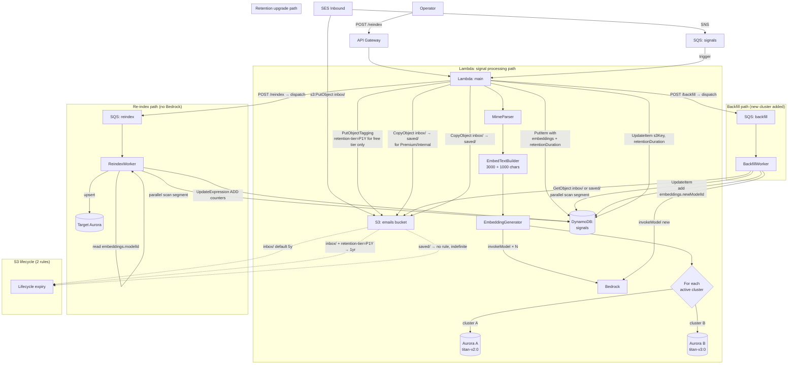

# Design Document

## Overview

This design implements an Aurora vector embedding strategy that supports zero-downtime model migration via blue/green clusters. It pivots the existing single-cluster, single-model embedding pipeline (see `src/database/arc-database.ts` and `src/classifier/classifier.ts`) into a multi-cluster pipeline driven by a source-coded `Cluster_Registry`.

The central insight is that **a re-index becomes a pure copy** instead of an expensive regeneration. Every Signal carries its embedding for every active model on its DynamoDB record (`Embedding_Cache`), so re-populating a freshly created Aurora cluster never calls Bedrock and never reads S3 — it just scans DynamoDB and writes vectors. Bedrock cost is paid once at signal creation, amortised across every subsequent cluster the embedding lands in.

A second job — `Backfill_Job` — covers the only case where regeneration is unavoidable: introducing a new model. When an entry is added to the `Cluster_Registry`, every existing Signal needs an embedding for the new model, generated from the original raw MIME body in S3 (subject to S3 retention). After the backfill completes, the new cluster is re-indexed from DynamoDB normally.

S3 retention is per-account, driven by billing plan. Free/Beta plans tag inbox objects with `retention-tier=P1Y` (1-year lifecycle expiry). Paid/Lifetime plans leave objects untagged in `inbox/` (5-year default lifecycle). Premium/Internal plans copy objects to `saved/` (no lifecycle rule — effectively forever). The `retentionDuration` (ISO 8601: P1Y/P5Y/P1000Y) is stored on the DynamoDB Signal record. The user-facing display value (`getUserDisplayedRetention`) is derived at API response time and never stored.

### Design decisions and rationale

| Decision | Rationale |
|---|---|
| `Cluster_Registry` in source code, not Parameter Store | Type-checked, code-reviewed, atomic with deploy. A blue/green migration is a code change, not a runtime config change — the deploy IS the cutover. |
| Generate embeddings for every active cluster at signal time | Pays Bedrock once. Re-index becomes free. The alternative — regenerating on re-index — pays Bedrock per cluster per re-index, which is unbounded. |
| Embedding cache on the Signal record itself, keyed by model ID | Single-table reads. No extra DynamoDB lookups during re-index. The cache grows linearly in `(active_models × signals)` — bounded by the registry size cap of ~4 active clusters. |
| Parallel DynamoDB scan + SQS dispatch | Standard AWS pattern for high-throughput full-table scans. SQS gives free retries and visibility timeouts. Workers are stateless and idempotent — no DLQ needed because retries are safe. |
| API Gateway endpoint for dispatch (not EventBridge or Step Functions) | The dispatcher is a single Lambda call. EventBridge adds an extra hop with no benefit. Step Functions add cost per state transition and IaC surface — the workers are already idempotent so durable orchestration is unnecessary. |
| Idempotent Aurora upserts as the "checkpoint" | No separate progress table. The current state of `arc_embeddings` IS the progress. SQS visibility timeout + redelivery handles partial failures. |
| Prefix-based S3 retention (`inbox/` 5y default, `saved/` indefinite, `inbox/` + tag `retention-tier=P1Y` for free tier) | Two lifecycle rules total. No tagging required for paid-tier defaults. Long-term retention is an explicit object move, not a tag flip — making the S3 location the source of truth. |
| `retentionDuration` stored, `userDisplayedRetention` derived | Only `retentionDuration` (P1Y/P5Y/P1000Y) is persisted on the Signal record. The user-facing display label is computed at API response time via `getUserDisplayedRetention()` — never stored. This decouples storage semantics from presentation. |
| Cutover by flipping a source-coded entry | A code change is reviewable, atomic, and reversible by `git revert`. Runtime feature flags would split read traffic across clusters mid-migration with no audit trail. |

## Architecture

### High-level component diagram



### Data flow: signal creation with multi-cluster writes

```mermaid
sequenceDiagram
    participant SES
    participant S3
    participant SQS as SQS: signals
    participant Lambda
    participant Bedrock
    participant DDB as DynamoDB: signals
    participant AuroraA as Aurora A (model X)
    participant AuroraB as Aurora B (model Y)

    SES->>S3: PutObject emails/{key} (untagged)
    SES->>SQS: SNS notification
    SQS->>Lambda: receive message
    Lambda->>S3: GetObject emails/{key}
    Lambda->>Lambda: parse MIME, sanitize body,<br/>build Embed_Text (3000+1000 chars)
    Lambda->>Lambda: lookup recipient → account → plan
    par Bedrock × N active clusters
        Lambda->>Bedrock: invokeModel(X, embedText)
        Bedrock-->>Lambda: embeddingX[]
    and
        Lambda->>Bedrock: invokeModel(Y, embedText)
        Bedrock-->>Lambda: embeddingY[]
    end
    par Aurora upserts
        Lambda->>AuroraA: BEGIN; SET LOCAL account_id;<br/>UPSERT arc_embeddings (X)
        AuroraA-->>Lambda: ok
    and
        Lambda->>AuroraB: BEGIN; SET LOCAL account_id;<br/>UPSERT arc_embeddings (Y)
        AuroraB-->>Lambda: ok
    and DynamoDB
        Lambda->>DDB: PutItem signal {<br/>embeddings: { X: [...], Y: [...] },<br/>retentionDuration: 'P1Y' }
        DDB-->>Lambda: ok
    end
    Lambda->>S3: PutObjectTagging retention-tier=P1Y (free/beta only)
```

### Data flow: re-index dispatch and worker (handles both pure-copy and regeneration)

```mermaid
sequenceDiagram
    participant Op as Operator
    participant API as API Gateway
    participant Dispatcher as JobDispatcher
    participant SQS as SQS: reindex
    participant Worker as ReindexWorker (×N)
    participant DDB as DynamoDB: signals
    participant S3
    participant Bedrock
    participant Aurora as Target Aurora

    Op->>API: POST /reindex { targetClusterId, segments=32 }
    API->>Dispatcher: dispatchReindex
    Dispatcher->>Dispatcher: validate cluster in Registry,<br/>resolve modelId
    loop for segment in 0..31
        Dispatcher->>SQS: SendMessage { jobId, segment, total, targetCluster, modelId }
    end
    Dispatcher-->>API: { jobId, segmentCount, startedAt }
    API-->>Op: 202 Accepted

    par Workers process segments concurrently
        SQS->>Worker: receive segment message
        loop scan pages
            Worker->>DDB: Scan(Segment, TotalSegments)
            DDB-->>Worker: signals[]
            loop for each signal
                alt embeddings[modelId] present (cache hit)
                    Worker->>Aurora: BEGIN; SET LOCAL account_id;<br/>UPSERT (idempotent)
                    Aurora-->>Worker: ok
                    Worker->>DDB: ADD copiedCount 1
                else embeddings[modelId] missing AND s3Key retrievable
                    Worker->>S3: GetObject {s3Key}
                    S3-->>Worker: raw MIME
                    Worker->>Worker: parse, sanitize, build Embed_Text
                    Worker->>Bedrock: invokeModel(modelId, embedText)
                    Bedrock-->>Worker: embedding
                    Worker->>DDB: UpdateItem SET embeddings.modelId = :v
                    Worker->>Aurora: BEGIN; SET LOCAL account_id;<br/>UPSERT (idempotent)
                    Aurora-->>Worker: ok
                    Worker->>DDB: ADD regeneratedCount 1
                else s3 object expired
                    Worker->>DDB: ADD unrecoverableCount 1
                end
            end
        end
        Worker-->>SQS: ack
    end

    Op->>API: GET /reindex/{jobId}
    API->>Dispatcher: getReport
    Dispatcher->>DDB: read job counters
    Dispatcher->>Aurora: SELECT count(*), sample 10 vectors
    Dispatcher-->>API: { scanned, copied, regenerated, unrecoverable, validation }
    API-->>Op: 200 OK
```

**Key insight**: there is no separate "backfill" job. A reindex against a target cluster handles both modes per-signal:
- If the embedding is already in the DynamoDB cache (`embeddings[modelId]` present), it's a pure copy to Aurora. Cheap.
- If the embedding is missing (e.g. a new model just added to the registry), the worker fetches S3, regenerates via Bedrock, stores it back to the cache, and writes to Aurora. Expensive.
- If S3 retention has expired, the signal is recorded as unrecoverable for this model.

This means the operator's workflow when adding a new cluster + model is:
1. Add the new entry to the `Cluster_Registry`, deploy. Live signals begin generating embeddings for the new model.
2. Call `POST /reindex { targetClusterId }`. The worker handles both historical signals (regenerate from S3) and new signals (copy from cache) in one pass.
3. Monitor `GET /reindex/{jobId}` until complete.
4. Cut over by promoting the cluster in the registry.

## Components and Interfaces

The new code lives in `src/embedding/` (cluster registry, generator, embed-text builder), `src/jobs/reindex/`, and `src/jobs/backfill/`. Existing code in `src/database/arc-database.ts`, `src/processor/processor.ts`, and `src/classifier/classifier.ts` is refactored to consume these.

### `ClusterRegistry` (`src/embedding/cluster-registry.ts`)

Single source of truth for active Aurora clusters and their models.

```typescript
export interface ClusterRegistryEntry {
  clusterId: string;          // 'aurora-prod-titan-v2'
  clusterArn: string;         // arn:aws:rds:eu-west-1:...:cluster:...
  secretArn: string;          // Secrets Manager ARN for this cluster's master credentials
  databaseName: string;
  modelId: string;            // 'amazon.titan-embed-text-v2:0'
  dimensions: number;         // 1024
  active: boolean;            // false = stop writing, retain reads + cache
}

export const CLUSTER_REGISTRY: readonly ClusterRegistryEntry[] = [
  { clusterId: 'aurora-prod-titan-v2', clusterArn: '...', secretArn: '...', databaseName: 'signals', modelId: 'amazon.titan-embed-text-v2:0', dimensions: 1024, active: true },
  // Add new entries here for blue/green migration. Flip `active` to retire.
] as const;

export function getActiveClusters(): readonly ClusterRegistryEntry[];
export function getClusterById(clusterId: string): ClusterRegistryEntry | null;
export function getReadCluster(): ClusterRegistryEntry; // first active entry
```

**Constraint**: `CLUSTER_REGISTRY` is `readonly` and asserted with a type predicate at module load to enforce ≤ 4 active entries.

### `EmbedTextBuilder` (`src/embedding/embed-text.ts`)

Pure function. Deterministic. No I/O.

```typescript
export interface EmbedTextInput {
  accountId: string;
  from: string;
  replyTo?: string;
  returnPath?: string;
  recipientAddress: string;
  subject: string;
  rawTextBody: string;        // already extracted from MIME (text/plain or html-stripped)
}

export function buildEmbedText(input: EmbedTextInput): string;
//   1. sanitize rawTextBody: strip CSS, HTML tags, , alt text
//   2. reduce links to "domain/firstPathSegment"
//   3. body = sanitized.length > 4000
//          ? sanitized.slice(0, 3000) + sanitized.slice(-1000)
//          : sanitized
//   4. join header lines + body with '\n'
```

This replaces the inline `embedText` construction in `processor.ts` lines around the `slice(0, 4000)` call. The existing logic is moved here, then refined to apply the sanitization and the 3000+1000 split.

### `EmbeddingGenerator` (`src/embedding/embedding-generator.ts`)

Wraps Bedrock per active cluster. Replaces `SignalClassifier.embed()`.

```typescript
export interface EmbeddingResult {
  modelId: string;
  vector: number[];
  dimensions: number;
}

export interface EmbeddingGenerator {
  generateForActiveClusters(embedText: string): Promise<EmbeddingResult[]>;
  generateForModel(embedText: string, modelId: string): Promise<EmbeddingResult>;
}

export class BedrockEmbeddingGenerator implements EmbeddingGenerator {
  constructor(private readonly bedrock: BedrockRuntimeClient) {}
  // generateForActiveClusters runs all Bedrock calls in parallel
  // generateForModel resolves dimensions from CLUSTER_REGISTRY by modelId
}
```

Failures for individual models are caught at this layer — they return `null` for the failed model rather than throwing, and the processor records a metric.

### `MultiClusterAuroraWriter` (`src/database/multi-cluster-aurora-writer.ts`)

Sibling to `ArcDatabase`. Wraps a per-cluster `RDSDataClient`.

```typescript
export interface MultiClusterAuroraWriter {
  upsertEmbedding(opts: {
    clusterId: string;          // resolved against CLUSTER_REGISTRY internally
    arcId: string;
    accountId: string;
    recipientAddress: string;
    embedding: number[];
  }): Promise<void>;

  findMatch(opts: {
    clusterId: string;
    accountId: string;
    recipientAddress: string;
    embedding: number[];
  }): Promise<{ arcId: string } | null>;
}
```

The existing `ArcDatabase.upsertEmbedding` and `findMatch` move here. `ArcDatabase` keeps the DynamoDB Signal/Arc operations and depends on `MultiClusterAuroraWriter` for vector ops.

### `EmbeddingCache` write path (extension to `ArcDatabase`)

`saveSignal` already accepts the full `Signal` object. Extending `Signal` with an optional `embeddings: Record<string, number[]>` map means `saveSignal` writes the cache transparently. A new method handles partial updates during backfill:

```typescript
// in arc-database.ts
async addEmbeddingToCache(
  accountId: string,
  signalId: string,
  modelId: string,
  vector: number[]
): Promise<void> {
  await dynamo.send(new UpdateCommand({
    TableName: SIGNALS_TABLE,
    Key: { pk: sigPk(accountId, signalId), sk: ITEM_SK },
    UpdateExpression: 'SET embeddings.#mid = :v',
    ExpressionAttributeNames: { '#mid': modelId },
    ExpressionAttributeValues: { ':v': vector },
  }));
}
```

### `RetentionResolver` (`src/embedding/retention-tier.ts`)

```typescript
export type RetentionDuration = 'P1Y' | 'P5Y' | 'P1000Y';
export type UserDisplayedRetention = '1 year' | '5 years' | 'forever';
export type BillingPlan = 'Free' | 'Beta' | 'Paid' | 'Lifetime' | 'Premium' | 'Internal';

export interface RetentionForPlan {
  s3Tag: RetentionTag | null;        // 'retention-tier=P1Y' for free/beta, null otherwise
  retentionDuration: RetentionDuration;
  copyToSaved: boolean;              // true for Premium/Internal
}

export function getRetentionForPlan(plan: BillingPlan): RetentionForPlan;
//   Free/Beta     → { s3Tag: 'retention-tier=P1Y', retentionDuration: 'P1Y', copyToSaved: false }
//   Paid/Lifetime → { s3Tag: null, retentionDuration: 'P5Y', copyToSaved: false }
//   Premium/Internal → { s3Tag: null, retentionDuration: 'P1000Y', copyToSaved: true }

export function getUserDisplayedRetention(retentionDuration: RetentionDuration): UserDisplayedRetention;
//   P1Y → '1 year', P5Y → '5 years', P1000Y → 'forever'
//   NEVER stored — derived at API response time only.

export function retentionDurationToSeconds(duration: RetentionDuration): number;
export function tierIndex(duration: RetentionDuration): number;
export function isWithinPlanLimit(requestedDuration: RetentionDuration, plan: BillingPlan): boolean;
```

### `S3RetentionService` (`src/embedding/s3-retention-service.ts`)

```typescript
export interface S3RetentionInput {
  s3Tag: string | null;
  copyToSaved: boolean;
}

export interface S3RetentionService {
  // Called from processor.ts after signal save, depending on the plan:
  //   Free/Beta     → calls PutObjectTagging on inbox/{key} with retention-tier=P1Y
  //   Paid/Lifetime → no-op (default 5-year rule applies via no-tag)
  //   Premium/Internal → copies inbox/{key} → saved/{key}, returns the new s3Key
  applyPlanRetention(s3Key: string, input: S3RetentionInput): Promise<{ s3Key: string }>;
}
```

### Job Dispatcher API endpoints (`src/api/job-dispatch-handler.ts`)

API Gateway routes to a single Lambda handler, which routes by HTTP method + path:

```typescript
// POST /reindex
async dispatchReindex(body: { targetClusterId: string; segmentCount?: number }): Promise<ReindexJob>;

// GET /reindex/{jobId}
async getReindexReport(jobId: string): Promise<ReindexReport>;
```

Retention is not a user-facing API. Plan-driven retention is applied at signal creation time inside the processor (free-tier tagging or inbox→saved copy for indefinite-retention plans). There is no PATCH endpoint for changing retention after the fact.

### `ReindexDispatcher` (`src/jobs/reindex/reindex-dispatcher.ts`)

Handles both pure-copy and regenerate-from-S3 modes in a single job. There is no separate "backfill" entity — when a signal lacks the target model's embedding, the worker falls through to regeneration.

```typescript
export interface ReindexJob {
  jobId: string;
  targetClusterId: string;
  modelId: string;
  segmentCount: number;
  startedAt: string;
}

export interface ReindexReport {
  jobId: string;
  signalsScanned: number;
  copiedCount: number;            // cache hit, pure copy to Aurora
  regeneratedCount: number;       // cache miss + S3 retrievable, called Bedrock and updated cache
  unrecoverableCount: number;     // cache miss + S3 expired, signal cannot be embedded for this model
  validationOk: boolean;
  validationDetail: string;
  durationMs: number;
}

export class ReindexDispatcher {
  async dispatch(targetClusterId: string, segmentCount = 32): Promise<ReindexJob>;
  async getReport(jobId: string): Promise<ReindexReport>;
}
```

### `ReindexWorker` (`src/jobs/reindex/reindex-worker.ts`)

SQS consumer. Per signal in the scanned segment:

1. If `embeddings[modelId]` is present → upsert to Aurora, increment `copiedCount`.
2. Else if S3 raw email is retrievable → fetch, sanitize, build embed text, call Bedrock, store back to `embeddings[modelId]`, upsert to Aurora, increment `regeneratedCount`.
3. Else (S3 expired) → log signal ID, increment `unrecoverableCount`.

**Per-message log-level escalation** (per `_Strategy/conventions.md` SQS retries rule): each SQS message carries an `ApproximateReceiveCount` attribute. When a message is being processed and an error is thrown, the failure log uses `track` level if `receiveCount <= 30`, and `error` level if `receiveCount > 30`. This surfaces real bugs through the existing alerting pipeline once a message has been retried more than 30 times — at that point it is no longer a transient hiccup.

```typescript
export interface ReindexSegmentMessage {
  jobId: string;
  segment: number;
  totalSegments: number;
  targetClusterId: string;
  modelId: string;
}

export class ReindexWorker {
  async process(event: SQSEvent): Promise<void>;
}
```

No checkpoint state. SQS visibility timeout (15 min default) + redelivery handles retries; the upsert idempotency and the `embeddings[modelId]` presence check guarantee no duplicate Bedrock calls or Aurora rows on retry. There is no DLQ — failures escalate via the receive-count log level.

### Lambda routing (`src/handler.ts`)

The existing handler already discriminates by event source. Add three new SQS sources:

```typescript
if (isSqsEvent(event)) {
  const arn = event.Records[0]?.eventSourceARN ?? '';
  if (arn.includes('-feedback'))      await feedbackProcessor.process(event);
  else if (arn.includes('-reindex'))  await reindexWorker.process(event);
  else if (arn.includes('-backfill')) await backfillWorker.process(event);
  else                                await processor.process(event);
  return;
}
```

EventBridge events are extended to dispatch reindex/backfill jobs:

```typescript
if (isEventBridgeEvent(event)) {
  const source = event.detail?.source;
  if (source === 'reindex-dispatch')  await reindexDispatcher.dispatch(event.detail.targetClusterId, event.detail.segments);
  if (source === 'backfill-dispatch') await backfillDispatcher.dispatch(event.detail.modelId, event.detail.segments);
  // ...existing domain-health-job branch
}
```

## Data Models

### DynamoDB `signals` table — extended Signal record

The existing `Signal` interface (`src/types/index.ts`) gains two optional fields:

```typescript
export interface Signal {
  // ...existing fields...

  // New: embedding cache, keyed by Bedrock model ID
  // Absent on quarantined/blocked signals (no Aurora write happened).
  // Partially populated if individual Bedrock calls failed (see processor metrics).
  embeddings?: Record<string, number[]>;

  // ISO 8601 retention duration — the ONLY retention field stored in DynamoDB.
  // Free/Beta: 'P1Y' (S3 object tagged retention-tier=P1Y, expires after 365 days)
  // Paid/Lifetime: 'P5Y' (S3 object untagged in inbox/, expires after 1825 days)
  // Premium/Internal: 'P1000Y' (S3 object moved to saved/, no lifecycle rule)
  // userDisplayedRetention is NEVER stored — derived at API response time via getUserDisplayedRetention().
  retentionDuration?: RetentionDuration;
}
```

Storage layout in DynamoDB:

```json
{
  "pk": "ACCT#a1#SIG#SES#abc123",
  "sk": "#",
  "id": "SES#abc123",
  "accountId": "a1",
  "arcId": "arc_xyz",
  "recipientAddress": "me@example.com",
  "s3Key": "emails/2025/01/abc123.eml",
  "embeddings": {
    "amazon.titan-embed-text-v2:0": [0.012, -0.034, ...],
    "amazon.titan-embed-text-v3:0": [0.041, -0.012, ...]
  },
  "retentionDuration": "P1Y",
  "...": "all other Signal fields"
}
```

**Size analysis**: a 1024-dim float32 vector serialised as JSON is ~12 KB. Two vectors = ~24 KB. DynamoDB item limit is 400 KB; 4 active clusters → ~48 KB per Signal item, well within the limit. If 8-cluster scenarios become real, switch to base64-encoded `Buffer` — ~4 KB per vector — but the registry cap of 4 makes this premature.

### Aurora `arc_embeddings` table (per cluster)

Schema unchanged from `deploy/search.tf` except the conflict target widens to match the requirements:

```sql
CREATE TABLE arc_embeddings (
  arc_id            TEXT NOT NULL,
  account_id        TEXT NOT NULL,
  recipient_address TEXT NOT NULL,
  embedding         vector(1024) NOT NULL,
  updated_at        TIMESTAMPTZ NOT NULL DEFAULT NOW(),
  PRIMARY KEY (arc_id, account_id, recipient_address)
);

CREATE INDEX ON arc_embeddings USING hnsw (embedding vector_cosine_ops);

ALTER TABLE arc_embeddings ENABLE ROW LEVEL SECURITY;
ALTER TABLE arc_embeddings FORCE ROW LEVEL SECURITY;
CREATE POLICY arc_tenant_isolation ON arc_embeddings
  USING      (account_id = current_setting('app.current_account_id', true))
  WITH CHECK (account_id = current_setting('app.current_account_id', true));
```

The dimension may differ between clusters (e.g. `vector(1536)` for a future model). The schema lives in a per-cluster migration script keyed on `clusterId` — the registry entry's `dimensions` field drives the migration.

The existing `(arc_id) PRIMARY KEY` from `deploy/search.tf` is widened to a composite key. This is a non-trivial migration for the existing single cluster; it runs once via a forward migration script before the multi-cluster code ships.

### S3 lifecycle rules (terraform)

Two rules total, structured around prefix + optional tag.

```hcl
resource "aws_s3_bucket_lifecycle_configuration" "emails" {
  bucket = aws_s3_bucket.emails.id

  # Rule 1: free-tier 1-year expiry (only applies to objects tagged retention-tier=P1Y)
  rule {
    id     = "inbox-free-tier-1yr"
    status = "Enabled"
    filter {
      and {
        prefix = "inbox/"
        tags = {
          "retention-tier" = "P1Y"
        }
      }
    }
    expiration { days = 365 }
  }

  # Rule 2: default 5-year expiry on the inbox prefix (applies to all inbox/ objects, including the tagged ones)
  # When both rules apply, S3 takes the shorter expiration — so free-tier objects (tagged) expire at 365 days, paid-tier (untagged) at 1825 days.
  rule {
    id     = "inbox-default-5yr"
    status = "Enabled"
    filter {
      prefix = "inbox/"
    }
    expiration { days = 1825 }
  }

  # No rule for saved/ — objects there have no lifecycle expiration.
}
```

The SES receipt rule writes to `inbox/`:

```hcl
resource "aws_ses_receipt_rule" "store_and_notify" {
  # ...
  s3_action {
    bucket_name       = aws_s3_bucket.emails.id
    object_key_prefix = "inbox/"
    topic_arn         = aws_sns_topic.ses_notifications.arn
    position          = 1
  }
}
```

## Correctness Properties


*A property is a characteristic or behavior that should hold true across all valid executions of a system — essentially, a formal statement about what the system should do. Properties serve as the bridge between human-readable specifications and machine-verifiable correctness guarantees.*

The properties below cover the testable, universally-quantified parts of this feature: pure functions (embed text builder, retention resolver), stateful logic with mocked I/O (signal processing, reindex worker, backfill worker, dispatchers), and Aurora upsert semantics. Infrastructure shape, SES tag-on-PUT behavior, and S3 lifecycle expiry timing are deferred to integration and smoke tests (see Testing Strategy).

After reflection, idempotence claims that appeared at multiple layers (live writes, reindex worker, backfill worker, Aurora upsert) collapse into one property over the underlying upsert. Similarly, "active flag controls writes" and "embedding generated for each active cluster" collapse into a single property over the active cluster set.

### Property 1: Embed text is deterministic, bounded, and contains all input fields

*For any* `EmbedTextInput` with arbitrary string content, calling `buildEmbedText` is pure (same input → same output), produces an output whose body portion is exactly `min(4000, len(sanitized))` characters, follows the `first 3000 + last 1000` rule when `len(sanitized) > 4000`, and contains every present input field (accountId, from, replyTo, returnPath, recipient, subject) on its own line.

**Validates: Requirements 2.4, 2.5, 2.6, 2.7**

### Property 2: Sanitization removes all structural HTML/CSS/image artifacts

*For any* HTML body input, the sanitized output contains no `<style>` blocks, no HTML tags (no `<` followed by an alpha character followed by `>`), no `` references, and no `alt=` attribute content.

**Validates: Requirements 2.2**

### Property 3: Links reduce to domain plus first path segment

*For any* URL input, the sanitized output reduces it to `{domain}/{firstPathSegment}` — no query string, no fragment, no path segments beyond the first.

**Validates: Requirements 2.3**

### Property 4: MIME parse round-trips header fields

*For any* synthetic MIME message constructed from a `(from, replyTo, returnPath, subject, textBody)` tuple of arbitrary valid strings, parsing it via the `MimeParser` returns those exact field values.

**Validates: Requirements 2.1**

### Property 5: Active cluster set drives embedding generation

*For any* `ClusterRegistry` configuration and any embed text, `generateForActiveClusters` produces exactly one `EmbeddingResult` per registry entry where `active === true`, each carrying that entry's `modelId`, and the underlying Bedrock invocation uses that entry's `modelId`, `dimensions`, and `normalize=true`. Inactive entries produce zero results and zero Bedrock calls.

**Validates: Requirements 1.3, 1.5, 3.1, 3.2, 7.4**

### Property 6: Multi-cluster fanout writes vectors to every active target

*For any* signal processed against a registry of N active clusters, the resulting DynamoDB Signal record contains an `embeddings` map with exactly N entries (one per active modelId, each holding that model's generated vector), and each of the N Aurora clusters receives one upsert with that cluster's vector for `(arc_id, account_id, recipient_address)`.

**Validates: Requirements 3.3**

### Property 7: Bedrock failure for one model preserves all other writes

*For any* signal processed against a registry where Bedrock fails for one model after retries, the DynamoDB Signal record is still persisted; its `embeddings` map contains entries only for the succeeding models; the failure is reported via the `embedding_generation_failed` metric tagged with the failing model ID; and the succeeding clusters' Aurora rows are unaffected.

**Validates: Requirements 3.5**

### Property 8: Aurora cluster failure preserves the DynamoDB cache entry

*For any* signal processed against a registry where the Aurora upsert fails for one cluster after retries, the DynamoDB Signal record's `embeddings` map still contains that model's vector. The cache is the recovery mechanism — a subsequent reindex restores the missing Aurora row.

**Validates: Requirements 3.6**

### Property 9: All embedding upserts and job operations are idempotent

*For any* sequence of operations performed against the same `(arc_id, account_id, recipient_address)` tuple — repeated live signal processing, repeated reindex segment processing, repeated backfill processing, or any combination — the final DynamoDB Signal record state and the final Aurora `arc_embeddings` row state are identical to running the operations once. Crashes and retries preserve this invariant.

**Validates: Requirements 3.4, 4.5, 4.6, 5.6, 6.1, 6.3**

### Property 10: Reindex dispatcher emits exactly N well-formed segment messages

*For any* `targetClusterId` resolvable in the registry and any `segmentCount` N, calling `dispatch` produces exactly N SQS messages whose `segment` fields form the set `{0, 1, ..., N-1}`, each carrying `totalSegments=N`, the input `targetClusterId`, and the registry-resolved `modelId` for that cluster.

**Validates: Requirements 4.2, 4.3**

### Property 11: Reindex worker uses cache exclusively and never calls Bedrock

*For any* SQS reindex segment message, the worker scans only its assigned segment of the signals table, upserts to Aurora exactly the signals where `embeddings[targetModelId]` is present (using the cached vector), logs every signal where it is missing, and makes zero Bedrock invocations across the entire run.

**Validates: Requirements 4.4, 4.7**

### Property 12: Backfill targets exactly the signals missing the new model

*For any* set of signals scanned during a backfill for `modelId=Z`, the worker:

1. invokes Bedrock with `modelId=Z` exactly once per signal whose `embeddings[Z]` is absent and whose S3 raw email is retrievable;
2. updates DynamoDB to add `embeddings[Z]` for those signals using the freshly-computed vector;
3. makes zero changes for signals that already have `embeddings[Z]` populated.

**Validates: Requirements 5.1, 5.3**

### Property 13: Backfill handles expired S3 objects without DynamoDB writes

*For any* signal whose `s3Key` returns `NoSuchKey` from S3 during backfill, no Bedrock call is made for that signal, no DynamoDB UpdateItem is issued for it, and the signal ID is recorded in the per-job unrecoverable counter.

**Validates: Requirements 5.4**

### Property 14: Job reports preserve scan accounting

*For any* completed reindex or backfill job, the report's numeric fields satisfy: `scanned === written + skipped + alreadyPresent` (for backfill: `scanned === generated + unrecoverable + alreadyPresent`); `durationMs > 0`; and the per-stage counts match the actual DynamoDB and Aurora row counts within the validation tolerance defined in Property 17.

**Validates: Requirements 5.5, 9.1, 9.2**

### Property 15: Aurora upserts run inside an RLS-scoped transaction

*For any* upsert call against a target cluster, the RDS Data API call sequence is exactly: `BeginTransaction` → `ExecuteStatement(SET LOCAL app.current_account_id = :accountId)` → `ExecuteStatement(INSERT ... ON CONFLICT ...)` → `CommitTransaction`, all sharing the same `transactionId`. The `accountId` parameter to `SET LOCAL` matches the upsert's `accountId`.

**Validates: Requirements 6.2**

### Property 16: Aurora retries with exponential backoff up to 3 attempts

*For any* sequence of K transient Aurora Data API failures followed by a success (where K ∈ {0, 1, 2}), the upsert eventually succeeds, the elapsed delays before retry attempts 2, 3, 4 are 1s, 2s, 4s respectively. For K = 3 transient failures, the upsert throws after the third retry, the failure is logged with the Signal ID and arc ID.

**Validates: Requirements 6.4**

### Property 17: Validation flags discrepancies above 1%

*For any* `(auroraCount, ddbCount)` pair after a reindex, `report.validationOk` is true if and only if `abs(auroraCount - ddbCount) / max(ddbCount, 1) <= 0.01`, and the 10 sampled cosine similarity values are all non-NaN finite floats in `[-1, 1]`.

**Validates: Requirements 9.3, 9.4**

### Property 18: Retention tier on S3 tag and DynamoDB record always agree

*For any* signal processed by the Lambda, the S3 retention action (tag or copy-to-saved) and the `retentionDuration` persisted on the DynamoDB Signal record always agree according to the plan-to-retention mapping defined in `getRetentionForPlan`. Free/Beta plans produce `retention-tier=P1Y` tag + `retentionDuration: 'P1Y'`; Paid/Lifetime produce no tag + `retentionDuration: 'P5Y'`; Premium/Internal produce copy-to-saved + `retentionDuration: 'P1000Y'`.

**Validates: Requirements 8.4, 8.5**

### Property 19: Plan changes never retroactively retag

*For any* plan change event applied to an account, no `S3.PutObjectTagging` or `S3.CopyObject` calls are made against existing email objects belonging to that account, and no DynamoDB `UpdateItem` calls modifying `retentionDuration` are issued for existing Signal records of that account. The retention decision is computed once at signal creation time from the current plan.

**Validates: Requirements 8.7**

### Property 20: Tier requests above plan max are rejected

*For any* `(plan, requestedDuration)` pair, `isWithinPlanLimit(requestedDuration, plan)` returns true if and only if `tierIndex(requestedDuration) <= tierIndex(PLAN_MAX_TIER[plan])`.

**Validates: Requirements 8.9**

### Property 21: Persistent failures surface via SQS metrics, not DLQ

*For any* set of segment messages that have repeatedly failed processing, no message is moved to a dead-letter queue (none exists). Instead, `ApproximateAgeOfOldestMessage` and `ApproximateNumberOfMessagesVisible` increase monotonically until the operator intervenes — the test asserts that no DLQ resource exists in the deployed infrastructure and that the worker's failure path does not include any DLQ-related code.

**Validates: Requirements 10.4**

### Property 22: Worker isolates per-signal failures within a segment

*For any* segment containing K malformed signals (missing required fields, undecodable embeddings) and M valid signals, the worker upserts all M valid signals to Aurora, logs each of the K malformed signals individually with its signal ID, and acknowledges the SQS message (no segment-level retry triggered).

**Validates: Requirements 10.5**

## Error Handling

The system has three independent failure surfaces — Bedrock, Aurora, and DynamoDB — plus the S3-tag side effect. Each is handled with bounded retries, with the unrecoverable case always preserving the most recoverable state for the operator.

| Failure | Detection | Handling | Operator action |
|---|---|---|---|
| Bedrock model invocation fails (transient) | AWS SDK throws `ThrottlingException`, `ModelNotReadyException`, etc. | SDK adaptive retry (3 attempts, exponential backoff). | None unless persistent. |
| Bedrock model invocation fails (persistent) | All retries exhausted | Continue processing the signal — DDB save proceeds without that model's entry. Emit metric `embedding_generation_failed{modelId}`. | Trigger a backfill for the affected modelId once root cause is fixed. |
| Aurora upsert fails (transient) | RDS Data API returns retryable error (e.g. `BadRequestException` with retryable code, network timeout) | Custom retry: 3 attempts, 1s/2s/4s exponential backoff. | None unless persistent. |
| Aurora upsert fails (persistent) | Retry budget exhausted | DDB write still proceeds with embeddings cache. Log with `signalId`, `arcId`, `clusterId`. Emit metric `aurora_upsert_failed{clusterId}`. | Operator triggers a reindex for the affected cluster once Aurora is healthy. |
| DynamoDB save fails (transient) | SDK retry layer | SDK adaptive retry. | None. |
| DynamoDB save fails (persistent) | Retry budget exhausted | The signal SQS message returns to the queue (visibility timeout); on next attempt, the dedupe check (`getSignalByMessageId`) skips already-processed signals. SQS redelivers indefinitely — no DLQ. Sustained failure surfaces via SQS metrics. | Investigate via SQS metrics + CloudWatch logs. Fix root cause; messages drain naturally once the database recovers. |
| S3 PutObjectTagging fails | S3 SDK throws | Log warning. The default 5-year lifecycle rule covers any signal where the free-tier 1-year tag failed to apply. On the next signal for the same account, no retroactive retag occurs. | None unless the failure is widespread — then operator runs a one-off retag job. |
| S3 raw email missing during regenerate-mode reindex | `GetObject` returns `NoSuchKey` | Log signal ID as unrecoverable for the target model. Increment per-job `unrecoverableCount`. | After the reindex, operator reviews the unrecoverable list. Affected signals will simply not match in the new cluster but remain valid in older clusters. |
| Reindex worker crash mid-segment | SQS visibility timeout expires without `DeleteMessage` | SQS redelivers the segment message indefinitely. Worker re-runs the parallel scan idempotently — already-upserted rows are no-ops. | None unless the queue depth grows continuously; if so, investigate worker logs and SQS metrics. |
| Reindex worker crash mid-signal (regenerate mode) | Same as above | SQS redelivers. The DDB UpdateItem and Aurora upsert are both idempotent. | None. |
| Persistent reindex segment failure | SQS `ApproximateAgeOfOldestMessage` and queue depth metrics climb | CloudWatch alarms surface the issue. Operator inspects worker logs. | Fix root cause and let SQS retries drain the queue. There is no DLQ; the same idempotent worker handles every retry. |

### Cutover failure handling

The cutover (Requirement 7) is a code change. If the new cluster proves underpopulated or buggy:

- **Roll back via `git revert`** of the registry change. The previous cluster is still active (held for one continuous-write cycle per Requirement 7.3) so reads route back to it immediately.
- **No data loss**: the previous cluster has continued receiving live writes during the cutover window, so its data is current.
- **No replay needed**: signals processed during the new-cluster window were also written to the previous cluster (because it was still `active`), so the embeddings cache covers both paths.

This is the explicit reason the previous cluster is held active across one write cycle: it makes rollback a code-only operation with zero data recovery work.

## Testing Strategy

### Tools

- **Unit + property tests**: Vitest (already used — `vitest.config.ts`).
- **Property-based testing library**: `fast-check` (industry standard for TypeScript; not currently in `package.json` — this design adds it as a dev dependency).
- **AWS SDK mocking**: `aws-sdk-client-mock` for `BedrockRuntimeClient`, `RDSDataClient`, `DynamoDBClient`, `S3Client`, `SQSClient`. Already mocked manually in existing tests; standardising via the library reduces boilerplate.
- **Infrastructure tests**: `tofu test` (existing pattern in `_rhosys-apps-infra/tests/kms_protection.tftest.hcl`) for lifecycle rule shape and SQS configuration.

### Test types

| Type | Where | Purpose |
|---|---|---|
| **Property tests** | `src/embedding/*.spec.ts`, `src/jobs/**/*.spec.ts` | Universal correctness — every property listed above. Minimum 100 iterations per property. |
| **Unit tests (example)** | Same files | Specific scenarios that motivate the property (e.g. tier defaults: Free → P1Y, Paid → P5Y, Premium → P1000Y). |
| **Smoke tests** | `src/embedding/cluster-registry.spec.ts` | Registry shape, plan-to-retention mapping, no env-var override paths in production code. |
| **Integration tests (LocalStack)** | `src/integration/*.spec.ts` | SQS redelivery, S3 lifecycle expiry behavior, RLS enforcement against a real Postgres. Optional in CI; manual run for release verification. |
| **Infrastructure tests** | `deploy/tests/*.tftest.hcl` | 2 lifecycle rules, SQS visibility ≥ 15min, no DLQ resources, two SQS event source mappings (signals, reindex). |

### Property test conventions

Each property test:
- Uses a comment header `// Feature: aurora-reindex-strategy, Property N: <title>`.
- Runs at least 100 iterations (`fc.assert(prop, { numRuns: 100 })`).
- Generates inputs via composable `fc.Arbitrary<T>` builders (e.g. `arbSignal`, `arbRegistry`, `arbEmbedTextInput`).
- Mocks I/O at the boundary (Bedrock, RDS Data API, DynamoDB, S3).

Example skeleton (Property 1):

```typescript
// Feature: aurora-reindex-strategy, Property 1: Embed text is deterministic, bounded, and contains all input fields
import fc from 'fast-check';
import { buildEmbedText } from './embed-text.js';

it('embed text is deterministic, bounded, and contains all input fields', () => {
  fc.assert(fc.property(arbEmbedTextInput, (input) => {
    const a = buildEmbedText(input);
    const b = buildEmbedText(input);
    expect(a).toBe(b);

    const lines = a.split('\n');
    expect(lines).toContain(`Account: ${input.accountId}`);
    expect(lines).toContain(`From: ${input.from}`);
    if (input.replyTo) expect(lines).toContain(`Reply-To: ${input.replyTo}`);
    if (input.returnPath) expect(lines).toContain(`Return-Path: ${input.returnPath}`);
    expect(lines).toContain(`To: ${input.recipientAddress}`);
    expect(lines).toContain(`Subject: ${input.subject}`);

    const sanitized = sanitize(input.rawTextBody);
    const expectedBody = sanitized.length > 4000
      ? sanitized.slice(0, 3000) + sanitized.slice(-1000)
      : sanitized;
    expect(a).toContain(expectedBody);
  }), { numRuns: 100 });
});
```

### Coverage policy

- Every correctness property has exactly one property-based test.
- Edge cases (empty body, body of exactly 4000 chars, body of 4001 chars, unicode boundaries, malformed MIME) are covered by the `fast-check` shrinking — no separate edge-case tests.
- Example-based tests are reserved for cases where the property is too narrow to be universal (e.g. specific plan-to-tier defaults — Requirement 8.2).

## Source Code Structure

New TypeScript layout, additive to the existing `src/`:

```
backend/
├── src/
│   ├── embedding/                          # NEW
│   │   ├── cluster-registry.ts             # CLUSTER_REGISTRY constant + lookup helpers
│   │   ├── cluster-registry.spec.ts        # smoke tests for registry shape
│   │   ├── embed-text.ts                   # buildEmbedText pure function
│   │   ├── embed-text.spec.ts              # property tests for sanitization, link reduction, body truncation
│   │   ├── embedding-generator.ts          # BedrockEmbeddingGenerator class
│   │   ├── embedding-generator.spec.ts     # property tests for fanout + per-model failure isolation
│   │   ├── retention-tier.ts               # Plan-to-retention mapping + helpers
│   │   ├── retention-tier.spec.ts          # property tests for plan-limit logic
│   │   ├── s3-retention-service.ts         # S3 tagging + copy-to-saved wrapper
│   │   └── s3-retention-service.spec.ts
│   ├── database/
│   │   ├── arc-database.ts                 # MODIFIED: drop Aurora ops, add addEmbeddingToCache
│   │   ├── multi-cluster-aurora-writer.ts  # NEW: per-cluster RDSDataClient + RLS upserts
│   │   └── multi-cluster-aurora-writer.spec.ts
│   ├── jobs/
│   │   ├── reindex/                        # NEW
│   │   │   ├── reindex-dispatcher.ts
│   │   │   ├── reindex-dispatcher.spec.ts
│   │   │   ├── reindex-worker.ts
│   │   │   └── reindex-worker.spec.ts
│   │   └── backfill/                       # NEW
│   │       ├── backfill-dispatcher.ts
│   │       ├── backfill-dispatcher.spec.ts
│   │       ├── backfill-worker.ts
│   │       └── backfill-worker.spec.ts
│   ├── processor/
│   │   └── processor.ts                    # MODIFIED: replace classifier.embed with EmbeddingGenerator,
│   │                                       #           write multi-cluster, persist retentionDuration + embeddings
│   ├── classifier/
│   │   └── classifier.ts                   # MODIFIED: drop embed() method (moved to EmbeddingGenerator)
│   ├── types/
│   │   └── index.ts                        # MODIFIED: add embeddings + retentionDuration to Signal
│   └── handler.ts                          # MODIFIED: route reindex/backfill SQS sources + EventBridge dispatch events
└── deploy/
    ├── storage.tf                          # MODIFIED: 2 lifecycle rules (free-tier P1Y tag + default 5yr inbox/)
    ├── search.tf                           # MODIFIED: per-cluster Aurora resources via for_each over CLUSTER_REGISTRY
    ├── compute.tf                          # MODIFIED: add SQS event source mappings for reindex + backfill queues
    └── tests/
        ├── lifecycle_rules.tftest.hcl      # NEW: assert 2 lifecycle rules, no rule on saved/
        └── sqs_reindex.tftest.hcl          # NEW: assert reindex queue with no DLQ
```

### Module boundaries

- **`embedding/`** owns the registry, embed-text construction, Bedrock fanout, and retention semantics. No DynamoDB or Aurora dependencies — pure functions and Bedrock/S3 wrappers.
- **`database/multi-cluster-aurora-writer.ts`** owns Aurora vector ops across all clusters. `arc-database.ts` keeps DynamoDB Signal/Arc operations and depends on the writer for vector ops via constructor injection.
- **`jobs/reindex/`** and **`jobs/backfill/`** are independent. They share no code except via the `embedding/` and `database/` modules.
- **`handler.ts`** is the only place that wires concrete dependencies (the composition root). Existing pattern, unchanged in shape.

### Migration sequence

1. Add `src/embedding/` and `src/database/multi-cluster-aurora-writer.ts`. Tests pass — no callers yet.
2. Migrate the existing single Aurora cluster's `arc_embeddings` schema to the composite primary key `(arc_id, account_id, recipient_address)`. One-shot migration script.
3. Refactor `processor.ts` to use `EmbeddingGenerator` and `MultiClusterAuroraWriter`. With one entry in the registry, behavior is unchanged.
4. Add `embeddings` cache writes to existing signals (live-write only — historical signals get the cache populated by Backfill_Job when the second cluster is added).
5. Add `retentionDuration` field; deploy 2-rule S3 lifecycle config; live signals start carrying the field.
6. Ship `ReindexDispatcher` + `ReindexWorker`; smoke-test by reindexing the existing cluster onto itself (no-op idempotent verification).
7. Ship `BackfillDispatcher` + `BackfillWorker` — first real use is the next blue/green migration.
