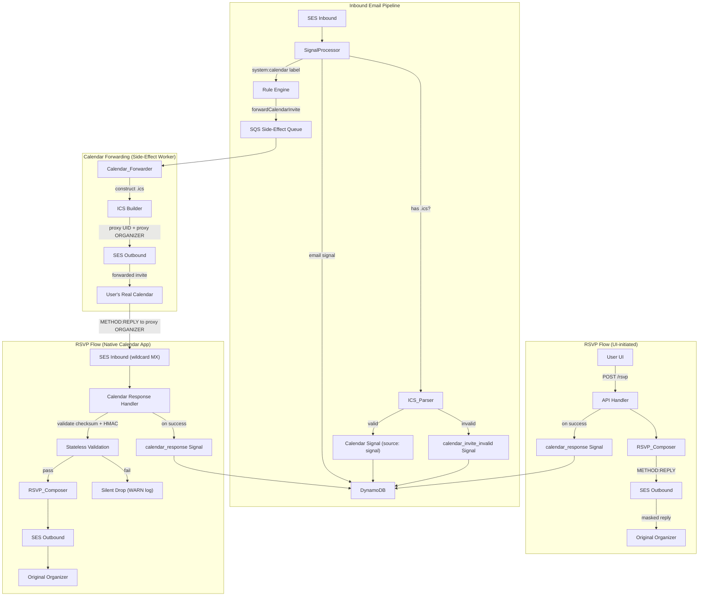

# Design Document: Calendar Proxy

## Overview

The calendar proxy layer intercepts `.ics` attachments on any inbound email signal, parses them into structured `CalendarData`, creates a derived calendar signal keyed by organizer + VEVENT_UID, and forwards a reconstructed `.ics` to the user's real calendar. When the user RSVPs (via UI or native calendar app), the system sends a masked REPLY back to the original sender using the alias address — the organizer never learns the user's real calendar email.

The design introduces four new signal types (`calendar_event`, `calendar_response`, `calendar_invite_invalid`, `domain_misconfiguration`), a new signal source (`"signal"` for derived signals), removes the `scheduling` workflow entirely, and adds a new rule action (`forwardCalendarInvite`) to the existing side-effect pipeline.

### Design Decisions

1. **Two-UID-space proxy model**: The forwarded `.ics` uses a proxy UID (`{accountId}.{arcId}.{originalVeventUid}.{hmac}@{serviceDomain}`) so the user's calendar treats each proxied event as distinct from the original. The HMAC suffix (16 chars, base64url, truncated) enables stateless validation of inbound REPLY routing without database lookup.
2. **Proxy ORGANIZER as routing address**: The constructed `.ics` sets ORGANIZER to `mailto:{arcId}@{accountId}.{serviceDomain}`, leveraging wildcard MX to route native calendar RSVPs back through the inbound pipeline.
3. **RSVP targets ORGANIZER mailto: address (RFC 6047)**: The REPLY is sent to the ORGANIZER address inside the `.ics` per the iMIP standard. This is the correct routing target — calendar systems like Google Calendar, Calendly, and Outlook all expect RSVPs at the ORGANIZER address, which may differ from the email envelope From.
4. **Calendar signal keyed by organizer + VEVENT_UID**: `signalLookupId` format `cal-{organizerEmail}-{veventUid}` enables O(1) event state lookup and coexistence of REQUEST/CANCEL/RESCHEDULE under the same PK.
5. **Reconstruct, never forward original**: Calendar_Forwarder builds a new `.ics` from CalendarData — strips VALARM, injects proxy UID and proxy ORGANIZER, sets correct ATTENDEE. The original `.ics` is stored as a raw attachment but never forwarded.
6. **Send-first, record-second for RSVP**: The RSVP_Composer sends the masked REPLY before creating the `calendar_response` signal. If send fails, no signal is created — prevents recording a decision that was never delivered.
7. **No forwarding gate on domain setup**: Invites are forwarded regardless of sender domain configuration. Domain misconfiguration is only surfaced at RSVP time (when the system needs to send FROM the alias).
8. **HMAC secret as KMS-encrypted `.kms` file**: 32-byte random secret, encrypted with `alias/default` KMS key, decrypted once at Lambda cold start. No per-request KMS calls.

## Architecture



## Components and Interfaces

### ICS_Parser

Detects `.ics` attachments on email signals and parses them into `CalendarData`. Runs during signal processing, before the calendar signal is written to DynamoDB. Uses `ical.js` (kewisch/ical.js) for both parsing inbound `.ics` and composing outbound `.ics` (forwarding and REPLY). The same library serves as the conformance oracle in tests — our output is parsed back through ical.js to verify structural correctness.

```typescript
interface IcsParseResult {
  calendarData: CalendarData;
  rawIcsContent: string;  // stored as S3 attachment on calendar signal
}

interface IcsParseError {
  reason: string;  // human-readable rejection reason for calendar_invite_invalid signal
}

// Pure function — no I/O. Receives the raw .ics bytes from S3.
function parseIcs(icsBytes: Uint8Array): Result<IcsParseResult, IcsParseError>;

// Attachment detection — examines signal attachments metadata
function findCalendarAttachment(attachments: Attachment[]): Attachment | null;
```

**Limits enforced:**
- Max file size: 1 MB
- Max VTIMEZONE components: 100
- Max ATTENDEE properties: 100 (silently truncated)
- Max nesting depth: 5
- Parse timeout: 5 seconds
- Output CalendarData JSON: max 100 KB

**Security:**
- All VALARM components stripped
- URL schemes restricted to `https:`, `http:`, `mailto:`
- `mailto:` URIs validated for syntactic email correctness
- `http`/`https` URLs validated: no IP literals, no localhost, no private ranges

### Calendar_Forwarder

Constructs a new `.ics` from `CalendarData` and sends it to the user's `calendarForwardingAddress`. Triggered as a side-effect via the `forwardCalendarInvite` rule action.

```typescript
interface CalendarForwarderDeps {
  emailService: EmailService;
  hmacSecret: Uint8Array;       // 32-byte secret, decrypted at cold start
  serviceDomain: string;        // e.g. "cal.numaeel.com"
}

interface ForwardCalendarInviteOpts {
  calendarSignal: Signal<CalendarEventData>;
  calendarForwardingAddress: string;
  accountId: string;
  arcId: string;
  aliasAddress: string;         // the alias that received the original invite
}

// Constructs .ics with proxy UID and proxy ORGANIZER, sends via SES
async function forwardCalendarInvite(
  opts: ForwardCalendarInviteOpts,
  deps: CalendarForwarderDeps
): Promise<Result<void, DbError>>;
```

**Construction rules:**
- UID: `{accountId}.{arcId}.{originalVeventUid}.{hmac}@{serviceDomain}`
- ORGANIZER: `mailto:{arcId}@{accountId}.{serviceDomain}` with CN from original organizer
- ATTENDEE: `mailto:{calendarForwardingAddress}` with `PARTSTAT=NEEDS-ACTION;RSVP=TRUE`
- Preserves: SEQUENCE, DTSTART, DTEND, SUMMARY, LOCATION, DESCRIPTION, STATUS, METHOD
- Strips: all VALARM components
- Includes header: `X-Numaeel-Calendar-Signal-Id: {calendarSignalId}`

### RSVP_Composer

Composes iCal METHOD:REPLY messages and sends them from the alias address to the ORGANIZER address from the original invite.

```typescript
interface RsvpComposeOpts {
  decision: "accepted" | "declined" | "tentative";
  originalCalendarData: CalendarData;
  aliasAddress: string;          // ATTENDEE in the REPLY
  organizerAddress: string;      // ORGANIZER mailto: from original .ics (RSVP target)
  fromAddress: string;           // same as aliasAddress (send FROM alias)
}

// Returns the SES message ID on success
async function sendRsvp(
  opts: RsvpComposeOpts,
  deps: { emailService: EmailService }
): Promise<Result<{ messageId: string }, DbError>>;
```

**REPLY construction:**
- METHOD: REPLY
- ATTENDEE: `mailto:{aliasAddress}` with PARTSTAT matching decision
- VEVENT_UID: original UID (not proxy UID)
- SEQUENCE: copied from original CalendarData
- Sent TO: `organizerAddress` (ORGANIZER mailto: from original `.ics`, per RFC 6047)
- Sent FROM: `aliasAddress`

### Calendar Response Handler

Routes inbound emails at `{arcId}@{accountId}.{serviceDomain}` — these are native calendar REPLY messages from the user's calendar app.

```typescript
interface CalendarResponseHandlerDeps {
  hmacSecret: Uint8Array;
  serviceDomain: string;
  arcDatabase: ArcDatabase;
  rsvpComposer: typeof sendRsvp;
  signalStore: SignalStore;
}

// Called when inbound email matches proxy ORGANIZER address pattern
async function handleCalendarResponse(
  message: InboundSignalMessage,
  deps: CalendarResponseHandlerDeps
): Promise<Result<void, DbError>>;
```

**Validation sequence (all pure computation, no I/O until both pass):**
1. Extract `{arcId}` and `{accountId}` from recipient address local-part and domain
2. Validate accountId checksum: last 3 chars = SHA-256 prefix of preceding chars (base58-filtered)
3. Validate arcId checksum: same algorithm
4. Parse `.ics` attachment, extract proxy UID
5. Decompose proxy UID: `{accountId}.{arcId}.{originalVeventUid}.{hmac}@{serviceDomain}`
6. Recompute HMAC-SHA256 over `{accountId}.{arcId}.{originalVeventUid}` using secret
7. Compare first 16 chars of base64url-encoded HMAC with the `{hmac}` segment
8. On any failure: silent drop + WARN log with failing validation type and recipient address

### Proxy UID Builder

Pure function that constructs and validates proxy UIDs.

```typescript
// Construct proxy UID for forwarding
function buildProxyUid(opts: {
  accountId: string;
  arcId: string;
  originalVeventUid: string;
  hmacSecret: Uint8Array;
  serviceDomain: string;
}): string;

// Validate and decompose an inbound proxy UID
function validateProxyUid(opts: {
  proxyUid: string;
  hmacSecret: Uint8Array;
  serviceDomain: string;
}): Result<{ accountId: string; arcId: string; originalVeventUid: string }, string>;
```

### ICS Builder

Pure function that constructs a valid `.ics` string from `CalendarData` + proxy metadata.

```typescript
function buildForwardIcs(opts: {
  calendarData: CalendarData;
  proxyUid: string;
  proxyOrganizer: string;       // mailto:{arcId}@{accountId}.{serviceDomain}
  organizerCn: string;          // original organizer display name
  attendeeAddress: string;      // calendarForwardingAddress
}): string;

function buildReplyIcs(opts: {
  veventUid: string;
  sequence: number;
  attendeeAddress: string;      // alias address
  decision: "ACCEPTED" | "DECLINED" | "TENTATIVE";
  organizerAddress: string;     // original organizer (for ORGANIZER field in REPLY)
}): string;
```

## Data Models

### CalendarData (stored on calendar signal's `data` property)

```typescript
interface CalendarEventData {
  // Parsed VEVENT fields
  title: string;                          // SUMMARY
  description?: string;                   // DESCRIPTION
  startTime: string;                      // DTSTART as ISO 8601
  endTime?: string;                       // DTEND as ISO 8601
  location?: string;                      // LOCATION
  url?: string;                           // URL (sanitized)
  organizer: string;                      // ORGANIZER as email address
  organizerCn?: string;                   // ORGANIZER CN parameter
  attendees: CalendarAttendee[];          // ATTENDEE list (max 100)
  veventUid: string;                      // UID
  method: string;                         // METHOD (REQUEST, CANCEL, COUNTER, etc.)
  sequence: number;                       // SEQUENCE
  status?: string;                        // STATUS (CONFIRMED, TENTATIVE, CANCELLED)
  transparency?: string;                  // TRANSP (OPAQUE, TRANSPARENT)
  created?: string;                       // CREATED as ISO 8601
  lastModified?: string;                  // LAST-MODIFIED as ISO 8601
  recurrenceRule?: string;                // RRULE value
  recurrenceId?: string;                  // RECURRENCE-ID as ISO 8601
  xProperties?: Record<string, string>;   // X-* properties

  // Proxy metadata (populated at forward time)
  proxyUid?: string;                      // proxy UID sent to user's calendar
  originalVeventUid: string;              // always the original UID

  // Linkage
  linkedSignalId: string;                 // ID of originating email signal
}

interface CalendarAttendee {
  address: string;                        // email address
  cn?: string;                            // display name
  partstat?: string;                      // NEEDS-ACTION, ACCEPTED, DECLINED, TENTATIVE
  role?: string;                          // REQ-PARTICIPANT, OPT-PARTICIPANT, etc.
}
```

### CalendarResponseData (stored on calendar_response signal's `data` property)

```typescript
interface CalendarResponseData {
  decision: "accepted" | "declined" | "tentative";
  respondedAt: string;                    // ISO 8601
  veventUid: string;                      // copied from calendar signal's CalendarData
  linkedSignalId: string;                 // ID of the calendar signal being responded to
  sendStatus?: "sent" | "send_failed";    // tracks delivery outcome
  sendFailureReason?: string;             // e.g. "domain_misconfiguration"
}
```

### CalendarInviteInvalidData (stored on calendar_invite_invalid signal's `data` property)

```typescript
interface CalendarInviteInvalidData {
  reason: string;                         // human-readable rejection reason
  linkedSignalId: string;                 // ID of originating email signal
}
```

### DomainMisconfigurationData (stored on domain_misconfiguration signal's `data` property)

```typescript
interface DomainMisconfigurationData {
  reason: string;                         // e.g. "DKIM + SPF not configured for alias domain"
  linkedSignalId: string;                 // ID of the calendar signal the RSVP was for
  aliasAddress: string;                   // the alias that needs sender setup
  domain: string;                         // the domain missing configuration
}
```

### Updated Type Constants

```typescript
// SIGNAL_SOURCES — add "signal" for derived signals
const SIGNAL_SOURCES = ["email", "user", "ses_feedback", "signal"] as const;

// SIGNAL_TYPES — add calendar types
const SIGNAL_TYPES = [
  "deliverability",
  "invalid_rule_function",
  "invalid_template_function",
  "auto_send_blocked",
  "calendar_event",
  "calendar_response",
  "calendar_invite_invalid",
  "domain_misconfiguration",
] as const;

// RULE_ACTION_TYPES — add forwardCalendarInvite
const RULE_ACTION_TYPES = [
  ...existing,
  "forwardCalendarInvite",
] as const;

// WORKFLOWS — remove "scheduling"
const WORKFLOWS = [
  "auth", "conversation", "crm", "package", "travel",
  "payments", "alert", "content", "onboarding", "status",
  "healthcare", "job", "support", "test",
] as const;
```

### Account Interface Extension

```typescript
interface Account {
  // ... existing fields ...
  calendarForwardingAddress?: string;  // verified real calendar email
}
```

### DynamoDB Key Structure for Calendar Signals

```
PK: ACCT#{accountId}#SIG#cal-{organizerEmail}-{veventUid}
SK: {signalId}   (allows multiple signals per event: REQUEST, CANCEL, etc.)

GSI1PK: ACCT#{accountId}#ARC#{arcId}
GSI1SK: {signalId}
```

Multiple calendar signals for the same event coexist under the same PK with distinct SKs. This enables:
- O(1) lookup of all signals for a given event (Query on PK)
- Coexistence of REQUEST → CANCEL → RESCHEDULE sequences
- No conflict with the email signal (which uses `ses-{messageId}` as its signalLookupId)

## Correctness Properties

*Correctness properties are invariants that must hold across all valid inputs. Since this project uses vitest with static expectations only (no property-based testing), each property is verified with a deterministic `it.each` table covering the finite set of meaningfully different cases.*

### Property 1: Attachment detection is purely MIME/extension-based

*For any* signal with attachments, `findCalendarAttachment` returns a result based solely on MIME type (`text/calendar`) or filename extension (`.ics`) — the signal's workflow has no effect on detection.

| Attachment MIME | Filename | Workflow | Detected? |
|---|---|---|---|
| `text/calendar` | `invite.ics` | `job` | yes |
| `text/calendar` | `meeting.dat` | `healthcare` | yes |
| `application/pdf` | `invite.ics` | `crm` | yes |
| `application/pdf` | `document.pdf` | `conversation` | no |
| `text/calendar` | `invite.ics` | `alert` | yes |

**Validates: Requirements 2.1, 2.4**

### Property 2: Multi-attachment priority selects first with METHOD

*For any* signal with multiple `.ics` attachments, the parser selects the first attachment containing a METHOD property. If none has METHOD, it falls back to the first `.ics` attachment.

| Attachments (in order) | Selected |
|---|---|
| `[no-method.ics, has-method.ics]` | `has-method.ics` |
| `[has-method-1.ics, has-method-2.ics]` | `has-method-1.ics` |
| `[no-method-1.ics, no-method-2.ics]` | `no-method-1.ics` |
| `[single.ics]` | `single.ics` |

**Validates: Requirements 2.3, 2.5**

### Property 3: signalLookupId format is deterministic

*For any* organizer email and VEVENT_UID, the calendar signal's `signalLookupId` is exactly `"cal-{organizerEmail}-{veventUid}"`.

| Organizer | VEVENT_UID | signalLookupId |
|---|---|---|
| `alice@example.com` | `uid-123` | `cal-alice@example.com-uid-123` |
| `bob@corp.io` | `event-abc-def` | `cal-bob@corp.io-event-abc-def` |

**Validates: Requirements 3.2**

### Property 4: VALARM never appears in any output

*For any* `.ics` input containing VALARM components, neither the parsed `CalendarData` nor the constructed forwarding `.ics` contains any VALARM data.

| Input | VALARM in CalendarData? | VALARM in constructed .ics? |
|---|---|---|
| `.ics` with no VALARM | no | no |
| `.ics` with 1 DISPLAY VALARM | no | no |
| `.ics` with 3 mixed VALARMs (DISPLAY, EMAIL, AUDIO) | no | no |
| `.ics` with VALARM containing ACTION:PROCEDURE | no | no |

**Validates: Requirements 4.4, 10.6**

### Property 5: URL sanitization rejects disallowed schemes and invalid hosts

*For any* URL extracted from iCal properties, only `https:`, `http:`, and `mailto:` schemes are preserved. Disallowed schemes produce empty string. `mailto:` must contain valid email. `http`/`https` must have valid public hostname.

| URL | Output |
|---|---|
| `https://meet.google.com/abc` | `https://meet.google.com/abc` |
| `http://example.com/event` | `http://example.com/event` |
| `mailto:org@example.com` | `mailto:org@example.com` |
| `javascript:alert(1)` | `""` |
| `data:text/html,<script>` | `""` |
| `file:///etc/passwd` | `""` |
| `ftp://files.example.com` | `""` |
| `mailto:not-an-email` | `""` |
| `https://192.168.1.1/admin` | `""` |
| `https://localhost/api` | `""` |
| `https://10.0.0.1/internal` | `""` |

**Validates: Requirements 6.1, 6.2, 6.3, 6.4, 6.5**

### Property 6: RSVP always targets ORGANIZER mailto: address

*For any* RSVP composition, the REPLY is sent to the ORGANIZER mailto: address from the original `.ics` — per RFC 6047 (iMIP), the ORGANIZER property is the authoritative routing target for REPLY messages.

| Email From | iCal ORGANIZER | RSVP sent to |
|---|---|---|
| `alice@company.com` | `alice@company.com` | `alice@company.com` |
| `noreply@calendar.google.com` | `alice@company.com` | `alice@company.com` |
| `notifications@calendly.com` | `host@company.com` | `host@company.com` |
| `info@meetup.com` | `organizer@meetup.com` | `organizer@meetup.com` |

**Validates: Requirements 7.1, 14.3**

### Property 7: Constructed .ics preserves required fields from CalendarData

*For any* `CalendarData` input, the constructed forwarding `.ics` contains SEQUENCE, DTSTART, DTEND, SUMMARY, LOCATION, DESCRIPTION, STATUS, and METHOD from the source data.

| CalendarData field | Present in constructed .ics? |
|---|---|
| `sequence: 3` | `SEQUENCE:3` |
| `startTime: "2025-03-15T10:00:00Z"` | `DTSTART:20250315T100000Z` |
| `endTime: "2025-03-15T11:00:00Z"` | `DTEND:20250315T110000Z` |
| `title: "Team Standup"` | `SUMMARY:Team Standup` |
| `location: "Room 4B"` | `LOCATION:Room 4B` |
| `description: "Weekly sync"` | `DESCRIPTION:Weekly sync` |
| `status: "CONFIRMED"` | `STATUS:CONFIRMED` |
| `method: "REQUEST"` | `METHOD:REQUEST` |

**Validates: Requirements 10.5**

### Property 8: All calendar methods are forwarded without filtering

*For any* valid iCal METHOD value on a calendar signal, the Calendar_Forwarder forwards the constructed `.ics` — no method is rejected or filtered.

| METHOD | Forwarded? |
|---|---|
| `REQUEST` | yes |
| `CANCEL` | yes |
| `COUNTER` | yes |
| `REPLY` | yes |
| `ADD` | yes |

**Validates: Requirements 10.7, 8.1**

### Property 9: Proxy UID construction is deterministic and correctly formatted

*For any* accountId, arcId, and originalVeventUid, `buildProxyUid` produces a string matching `{accountId}.{arcId}.{originalVeventUid}.{hmac16}@{serviceDomain}` where `{hmac16}` is exactly 16 characters of base64url (no padding). The same inputs always produce the same output.

| accountId | arcId | originalVeventUid | serviceDomain | Format matches? | Deterministic? |
|---|---|---|---|---|---|
| `acc-abc123` | `arc-def456` | `uid-789` | `cal.numaeel.com` | `acc-abc123.arc-def456.uid-789.{16 base64url}@cal.numaeel.com` | yes |
| `acc-xyz` | `arc-000` | `long-uid-with-dashes` | `cal.numaeel.com` | `acc-xyz.arc-000.long-uid-with-dashes.{16 base64url}@cal.numaeel.com` | yes |

**Validates: Requirements 11.1, 11.2, 14.6**

### Property 10: REPLY .ics uses original VEVENT_UID, not proxy UID

*For any* RSVP composition, the METHOD:REPLY `.ics` contains the original VEVENT_UID from the inbound invite — never the proxy UID that was sent to the user's calendar.

| Original UID | Proxy UID | UID in REPLY .ics |
|---|---|---|
| `uid-original-123` | `acc.arc.uid-original-123.hmac@cal.numaeel.com` | `uid-original-123` |
| `event-abc` | `acc.arc.event-abc.hmac@cal.numaeel.com` | `event-abc` |

**Validates: Requirements 11.3**

### Property 11: Proxy ORGANIZER address format

*For any* arcId, accountId, and serviceDomain, the constructed `.ics` ORGANIZER is exactly `mailto:{arcId}@{accountId}.{serviceDomain}` with CN set to the original organizer's display name.

| arcId | accountId | serviceDomain | ORGANIZER |
|---|---|---|---|
| `arc-def456` | `acc-abc123` | `cal.numaeel.com` | `mailto:arc-def456@acc-abc123.cal.numaeel.com` |

**Validates: Requirements 12.1, 12.4**

### Property 12: Stateless validation gate — no I/O on failure

*For any* inbound email at the proxy ORGANIZER address, if either the ID checksum or the proxy UID HMAC fails validation, the system performs zero database lookups, creates no signals, and sends no responses. Only a WARN log is emitted.

| Checksum valid? | HMAC valid? | DB called? | Signal created? | Response sent? |
|---|---|---|---|---|
| yes | yes | yes | yes | yes |
| yes | no | no | no | no |
| no | (not checked) | no | no | no |
| no | no | no | no | no |

**Validates: Requirements 14.1, 14.2, 14.4, 14.5**

### Property 13: Send-first ordering — no signal without successful send

*For any* RSVP submission (UI or native), the `calendar_response` signal is created only after the RSVP_Composer successfully sends the masked REPLY. If sending fails, no signal is created.

| Send result | Signal created? | API response |
|---|---|---|
| success | yes | 200 OK |
| SES transient failure | no | 502 |
| domain misconfiguration | no (domain_misconfiguration signal instead) | 422 |

**Validates: Requirements 12.1, 12.5**

### Property 14: PARTSTAT correctly maps decision to iCal value

*For any* user RSVP decision, the composed METHOD:REPLY `.ics` contains the correct PARTSTAT value on the ATTENDEE property.

| User decision | PARTSTAT in REPLY |
|---|---|
| `"accepted"` | `ACCEPTED` |
| `"declined"` | `DECLINED` |
| `"tentative"` | `TENTATIVE` |

**Validates: Requirements 14.1**

### Property 15: Parser rejection produces calendar_invite_invalid signal with reason

*For any* `.ics` rejection by the ICS_Parser (not unexpected crashes), the system creates a `calendar_invite_invalid` signal on the same arc with a human-readable reason string.

| Rejection cause | Reason string |
|---|---|
| File exceeds 1 MB | `"File exceeds 1 MB size limit"` |
| >100 VTIMEZONE components | `"Suspected VTIMEZONE bomb"` |
| Nesting depth >5 | `"Excessive nesting depth"` |
| Malformed RFC 5545 structure | `"Malformed iCal structure: {parse error}"` |
| CalendarData exceeds 100 KB | `"Parsed calendar data exceeds 100 KB limit"` |

**Validates: Requirements 18.1, 18.2, 18.5**

### Property 16: Address pattern routing

*For any* inbound email, the system routes to the calendar response handler if and only if the recipient address matches `{id}@{id}.{serviceDomain}` where both IDs pass checksum validation.

| Recipient address | Routed to calendar handler? |
|---|---|
| `arc-validchk@acc-validchk.cal.numaeel.com` | yes |
| `user@example.com` | no |
| `arc-badchk@acc-validchk.cal.numaeel.com` | no (checksum fails) |
| `me@mydomain.com` | no |

**Validates: Requirements 13.1, 13.2**

## Error Handling

| Scenario | Handling |
|---|---|
| `.ics` exceeds 1 MB | Reject, create `calendar_invite_invalid` signal, log WARN. Email signal proceeds normally. |
| VTIMEZONE bomb (>100 components) | Reject, create `calendar_invite_invalid` signal, log WARN. Email signal proceeds normally. |
| Malformed `.ics` (parse failure) | Reject, create `calendar_invite_invalid` signal, log WARN. Email signal proceeds normally. |
| Parser timeout (>5 seconds) | Abort, create `calendar_invite_invalid` signal, log WARN. Email signal proceeds normally. |
| Unexpected parser exception (crash) | Do NOT create `calendar_invite_invalid` signal. Let SQS retry naturally. Log ERROR. |
| CalendarData exceeds 100 KB serialized | Reject, create `calendar_invite_invalid` signal, log WARN. |
| Nesting depth >5 | Reject, create `calendar_invite_invalid` signal, log WARN. |
| Inbound REPLY with invalid checksum | Silent drop. Log WARN with recipient address and "checksum_failed". No DB lookup. |
| Inbound REPLY with invalid HMAC | Silent drop. Log WARN with recipient address and "hmac_failed". No DB lookup. |
| Inbound REPLY without METHOD:REPLY `.ics` | Silent drop. Log WARN with signal ID and "no_valid_reply_ics". |
| RSVP send fails (SES transient) | Return error to API caller. No `calendar_response` signal created. Retry via SES Feedback SQS loop. |
| RSVP send fails (domain misconfiguration) | Create `domain_misconfiguration` signal on arc. Return 422 to API caller. No `calendar_response` signal. |
| `calendarForwardingAddress` not configured | `forwardCalendarInvite` side-effect is a no-op (rule action value is empty). Log TRACK. |
| Calendar signal write fails (DynamoDB) | Standard retry via SQS. Email signal already written (separate PutItem). |
| Forwarding SES send fails | Standard SQS retry for side-effect. Calendar signal already persisted. |

## Testing Strategy

**Approach**: Unit tests with static expectations (vitest). No property-based testing — the project uses deterministic inputs with explicit expected outputs. Correctness properties are implemented as `it.each` tables over the finite set of meaningfully different cases.

**Test categories:**

### 1. ICS_Parser Unit Tests

- **Attachment detection** (`findCalendarAttachment`): `it.each` over MIME types, extensions, and combinations (Property 1)
- **Multi-attachment priority**: `it.each` over attachment orderings with/without METHOD (Property 2)
- **VEVENT extraction**: Tests with real-world `.ics` samples from Google Calendar, Outlook, Apple Calendar (Req 19.3)
- **VALARM stripping**: `it.each` over VALARM configurations (Property 4)
- **URL sanitization**: `it.each` over URL schemes and hostnames (Property 5)
- **Size/complexity limits**: Edge case tests at boundaries (1 MB, 100 VTIMEZONEs, 100 attendees, nesting depth 5)
- **Malformed input**: Tests with invalid `.ics` structures, verifying graceful rejection

### 2. Proxy UID Builder Unit Tests

- **Construction format**: `it.each` verifying format matches spec (Property 9)
- **Determinism**: Same inputs → same output across calls
- **HMAC validation**: `it.each` over valid/invalid/tampered HMACs (Property 12)
- **Checksum validation**: `it.each` over valid/invalid IDs

### 3. ICS Builder Unit Tests

- **Field preservation**: `it.each` verifying all required fields appear in output (Property 7)
- **Proxy UID injection**: Verify constructed `.ics` uses proxy UID, not original
- **Proxy ORGANIZER**: Verify format and CN (Property 11)
- **ATTENDEE**: Verify `calendarForwardingAddress` with correct parameters
- **REPLY construction**: `it.each` over decisions mapping to PARTSTAT (Property 14)
- **Original UID in REPLY**: Verify REPLY uses original UID (Property 10)

### 4. Calendar Response Handler Unit Tests

- **Routing**: `it.each` over address patterns (Property 16)
- **Validation gate**: `it.each` verifying no I/O on checksum/HMAC failure (Property 12)
- **Happy path**: Valid inbound REPLY → signal created → masked REPLY sent

### 5. RSVP_Composer Unit Tests

- **Target address**: `it.each` verifying RSVP always goes to ORGANIZER mailto: address (Property 6)
- **Send-first ordering**: Verify signal only created after successful send (Property 13)
- **Domain misconfiguration**: Verify `domain_misconfiguration` signal on sender setup failure

### 6. Calendar_Forwarder Unit Tests

- **Method forwarding**: `it.each` over all METHOD values (Property 8)
- **signalLookupId format**: `it.each` verifying key construction (Property 3)
- **Header inclusion**: Verify `X-Numaeel-Calendar-Signal-Id` header present

### 7. Conformance Tests (Req 19)

- **ical.js corpus**: Parse real-world `.ics` fixtures covering RFC 5545 edge cases
- **Provider samples**: Google Calendar, Outlook, Apple Calendar `.ics` files
- **REPLY round-trip**: Compose REPLY → parse back through ical.js → assert structure
- **Adversarial samples**: Oversized, VTIMEZONE bombs, excessive nesting, malformed

### 8. Scenario Tests (Req 20)

Named end-to-end scenario tests with static inputs and explicit expected outputs:

1. `"calendar invite from approved sender is forwarded because the proxy must deliver all valid invites"`
2. `"CANCEL for existing event is forwarded because user's calendar must stay in sync"`
3. `"RESCHEDULE with higher SEQUENCE is forwarded because calendar updates must propagate"`
4. `"user RSVP via UI creates calendar_response and sends masked REPLY because organizer must receive the decision"`
5. `"native calendar REPLY routes through proxy because HMAC validates the return path"`
6. `"inbound REPLY with invalid HMAC is silently dropped because unauthenticated requests must not reach the database"`
7. `"inbound REPLY with invalid checksum is silently dropped because malformed addresses indicate probing"`
8. `"quarantined email with .ics approved triggers forwarding because approval unblocks all pending actions"`
9. `"API returns CalendarData from calendar signal because the calendar card renders from the derived signal"`
10. `"API returns most recent decision alongside calendar signal because UI shows current RSVP state"`

Each scenario test includes a comment explaining WHY the expected behavior must never change.
