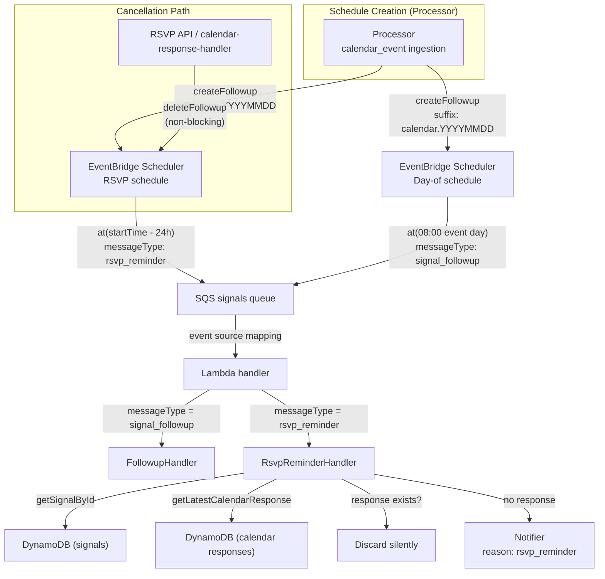

# Design Document: Calendar RSVP Reminder

## Overview

Adds a 24-hour-before RSVP reminder notification for calendar invites. When a `calendar_event` signal with `method: "REQUEST"` is ingested and the event is more than 24 hours away, the processor creates a second one-shot EventBridge schedule (alongside the existing day-of schedule) that fires at `eventStart - 24h`. At fire time, a dedicated handler checks whether the user has already RSVP'd — if yes, the reminder is silently discarded; if no, a push notification with `reason: "rsvp_reminder"` is sent.

The feature introduces a new SQS message type `"rsvp_reminder"` with its own routing branch in handler.ts (per Rule 26: every distinct message purpose gets its own messageType). The handler composes existing database methods (`getSignalById`, `getLatestCalendarResponse`) rather than duplicating logic.

Cancellation path: when a `calendar_response` signal is created (via RSVP API endpoint or native calendar reply handler), the system attempts to delete the pending RSVP reminder schedule. This is non-blocking — failure does not prevent the response signal from being persisted, since the fire-time check provides a safety net.

## Architecture



## Components and Interfaces

### Component 1: RSVP Reminder Constant (`src/scheduler/rsvp-reminder.ts`)

Single named constant for the 24-hour offset. All RSVP fire-time computations reference this.

```typescript
/** Hours before event start to fire the RSVP reminder. */
export const RSVP_REMINDER_HOURS_BEFORE = 24;
```

### Component 2: RSVP Reminder Handler (`src/scheduler/rsvp-reminder-handler.ts`)

Processes `rsvp_reminder` SQS messages. Same message shape as `FollowupMessage`. Composes existing DB methods.

```typescript
import type { Result, DbError } from "../errors.js";
import type { Signal, CalendarEventData } from "../types/index.js";
import type { Notifier, NotificationReason } from "../notifier/types.js";
import type { Logger } from "../logger.js";

export interface RsvpReminderMessage {
  accountId: string;
  signalId: string;
  arcId: string;
}

export class RsvpReminderHandler {
  constructor(deps: {
    signalDb: {
      getSignalById(accountId: string, signalId: string, arcId?: string): Promise<Result<Signal | null, DbError>>;
    };
    calendarDb: {
      getLatestCalendarResponse(accountId: string, arcId: string, veventUid: string): Promise<Result<Signal | null, DbError>>;
    };
    notifier: Notifier;
    logger: Logger;
  });

  async process(message: RsvpReminderMessage): Promise<Result<void, DbError>>;
}
```

**Handler logic (sequential):**

1. Fetch signal by `signalId` + `arcId` → if null → TRACK `"signal_missing"`, return `ok()` (discard)
2. Extract `veventUid` and `startTime` from signal data (cast to `CalendarEventData`)
3. If `startTime` is in the past → TRACK `"event_passed"`, return `ok()` (discard)
4. Call `getLatestCalendarResponse(accountId, arcId, veventUid)` → if DB error → return `err()` (SQS retries)
5. If response exists → TRACK `"already_responded"`, return `ok()` (discard)
6. If no response → call `notifier.notify(accountId, arc, signal, urgency, "rsvp_reminder")`, return result

Note: the handler does NOT check arc status (no reactivation logic). It only cares about whether the user has responded.

### Component 3: Processor RSVP Schedule Creation

Extension to the existing calendar processing section in `processor.ts`. Runs after the day-of schedule creation, guarded independently.

```typescript
// After day-of schedule creation:
if (this.schedulerClient && calendarData.startTime && calendarData.method?.toUpperCase() === "REQUEST") {
  const eventStart = DateTime.fromISO(calendarData.startTime, { zone: "utc" });
  const now = DateTime.utc();
  const reminderTime = eventStart.minus({ hours: RSVP_REMINDER_HOURS_BEFORE });

  if (eventStart.isValid && reminderTime > now) {
    const fireAt = reminderTime.toISO()!;
    const suffix = `rsvp.${eventStart.toFormat("yyyyMMdd")}`;
    const rsvpResult = await this.schedulerClient.createFollowup({
      accountId,
      signalId: calendarSignalId,
      arcId: arc.id,
      fireAt,
      suffix,
      sqsMessageAttributeMessageType: "rsvp_reminder",
    });
    if (rsvpResult.isErr()) {
      this.logger.error("Failed to create RSVP reminder schedule.", {
        code: "processor.calendar.rsvp_schedule_failed",
        accountId, arcId: arc.id, signalId: calendarSignalId, fireAt,
        error: rsvpResult.error,
      });
    }
  }
}
```

Key: RSVP schedule creation failure does NOT affect the day-of schedule (they are independent calls).

### Component 4: Scheduler Client Extension

The `FollowupScheduleParams` interface includes a required `sqsMessageAttributeMessageType` field for routing:

```typescript
export interface FollowupScheduleParams {
  accountId: string;
  signalId: string;
  arcId: string;
  fireAt: string;         // ISO 8601
  suffix: string;         // schedule name suffix
  sqsMessageAttributeMessageType: string; // body-level routing discriminator (e.g. "signal_followup", "rsvp_reminder")
}
```

The `createFollowup` implementation includes `sqsMessageAttributeMessageType` in the `Target.Input` JSON body so the handler can discriminate:

```typescript
Target: {
  Input: JSON.stringify({
    sqsMessageAttributeMessageType: params.sqsMessageAttributeMessageType,
    accountId: params.accountId,
    signalId: params.signalId,
    arcId: params.arcId,
  }),
}
```

Handler adjustment: when `record.messageAttributes?.["messageType"]` is absent (EventBridge Scheduler messages don't have SQS message attributes), fall back to reading `body.sqsMessageAttributeMessageType` from the parsed body.

### Component 5: Handler Routing Extension (`handler.ts`)

```typescript
const SQS_MESSAGE_TYPES = ["reindex", "side_effect", "draft_send", "signal_followup", "rsvp_reminder"] as const;

// In the SQS routing section:
const [MSG_TYPE_REINDEX, MSG_TYPE_SIDE_EFFECT, MSG_TYPE_DRAFT_SEND, MSG_TYPE_SIGNAL_FOLLOWUP, MSG_TYPE_RSVP_REMINDER] = SQS_MESSAGE_TYPES;

// Routing logic reads messageType from attribute OR body fallback:
const messageType = record.messageAttributes?.["messageType"]?.stringValue
  ?? (body as { sqsMessageAttributeMessageType?: string }).sqsMessageAttributeMessageType;

// New branch:
} else if (messageType === MSG_TYPE_RSVP_REMINDER) {
  const message = body as RsvpReminderMessage;
  if (!message.accountId || !message.signalId || !message.arcId) {
    logger.error("Malformed rsvp_reminder payload.", { code: "handler.sqs.malformed_rsvp_reminder", messageId: record.messageId });
    continue;
  }
  const result = await rsvpReminderHandler.process(message);
  failed = result.isErr();
}
```

### Component 6: NotificationReason Extension (`src/notifier/types.ts`)

```typescript
export type NotificationReason = "new_signal" | "followup" | "rsvp_reminder";
```

No other changes to the Notifier interface — it already accepts `reason?: NotificationReason`.

### Component 7: RSVP Schedule Cancellation

Added to both RSVP creation paths (API endpoint and calendar-response-handler). After the `calendar_response` signal is saved:

```typescript
// Non-blocking RSVP schedule cancellation
// Find the calendar_event signal on the same arc with matching veventUid
const calEventResult = await arcDb.getCalendarEventByVeventUid(accountId, arcId, veventUid);
if (calEventResult.isErr()) {
  logger.warn("Failed to look up calendar_event for RSVP schedule cancellation.", { code: "rsvp.cancel.lookup_failed", accountId, arcId, veventUid });
} else if (!calEventResult.value) {
  logger.track("Calendar event signal not found for RSVP cancellation — skipping.", { code: "rsvp.cancel.signal_missing", accountId, arcId, veventUid });
} else {
  const calEvent = calEventResult.value;
  const eventStart = DateTime.fromISO(calEvent.data.startTime, { zone: "utc" });
  if (eventStart.isValid && eventStart > DateTime.utc()) {
    const scheduleName = buildScheduleName(accountId, calEvent.id, `rsvp.${eventStart.toFormat("yyyyMMdd")}`);
    const deleteResult = await schedulerClient.deleteFollowup(scheduleName);
    if (deleteResult.isErr()) {
      logger.warn("Failed to delete RSVP reminder schedule — fire-time check will handle.", { code: "rsvp.cancel.delete_failed", scheduleName, error: deleteResult.error });
    }
  }
}
```

This requires a new DB method `getCalendarEventByVeventUid(accountId, arcId, veventUid)` — or reuse `getLinkedCalendarSignal` with different lookup criteria. The existing `getLatestCalendarResponse` pattern (scan arc signals, filter by type+veventUid) can be replicated for calendar_event signals.

## Data Models

### SQS Message Body (rsvp_reminder)

```json
{
  "sqsMessageAttributeMessageType": "rsvp_reminder",
  "accountId": "acc-abc123",
  "signalId": "sgn-xyz789",
  "arcId": "arc-def456"
}
```

The `sqsMessageAttributeMessageType` field in the body serves as the routing discriminator (EventBridge Scheduler → SQS does not support arbitrary SQS message attributes on the target). The handler reads `record.messageAttributes.messageType.stringValue` first, falling back to `body.sqsMessageAttributeMessageType`.

### Schedule Name Examples

| accountId | signalId (calendar_event) | suffix | Result |
|-----------|---------------------------|--------|--------|
| `acc-abc` | `sgn-cal-001` | `rsvp.20250715` | `acc-abc.sgn-cal-001.rsvp.20250715` |
| `acc-abc` | `sgn-cal-001` | `calendar.20250715` | `acc-abc.sgn-cal-001.calendar.20250715` |

Both schedules share the same `accountId.signalId` prefix but differ by suffix — they coexist independently.

### RSVP Reminder Handler Decision Table

| Signal exists? | Event in future? | Response exists? | Action |
|---------------|-----------------|-----------------|--------|
| No | — | — | Discard (TRACK: signal_missing) |
| Yes | No | — | Discard (TRACK: event_passed) |
| Yes | Yes | Yes | Discard (TRACK: already_responded) |
| Yes | Yes | No | Notify (reason: rsvp_reminder) |

### Fire Time Computation

```
fireAt = eventStart - RSVP_REMINDER_HOURS_BEFORE (24h)
suffix = "rsvp." + eventStart.toFormat("yyyyMMdd")  // UTC date
```

Guard: only create if `method.toUpperCase() === "REQUEST"` AND `fireAt > now`.

## Correctness Properties

*A property is a characteristic or behavior that should hold true across all valid executions of a system — essentially, a formal statement about what the system should do. Properties serve as the bridge between human-readable specifications and machine-verifiable correctness guarantees.*

### Property 1: RSVP schedule creation guard and computation

*For any* calendar_event signal with a valid ISO startTime: an RSVP reminder schedule is created if and only if `method` equals `"REQUEST"` (case-insensitive) AND `startTime - 24h > now`. When created, the fire time SHALL equal `startTime - 24 hours` and the suffix SHALL equal `rsvp.YYYYMMDD` where YYYYMMDD is the event start date formatted in UTC.

**Validates: Requirements 1.1, 1.2, 1.3, 1.4, 6.1**

### Property 2: Fire-time notification decision

*For any* RSVP reminder message arriving at the handler: the handler sends a notification if and only if the referenced signal exists AND the event startTime is in the future AND no `calendar_response` signal exists for the event's `veventUid`. In all other cases the handler discards the message (returns `ok()`) without side effects.

**Validates: Requirements 2.1, 2.2, 2.3, 5.1, 5.2**

### Property 3: Cancellation schedule name derivation

*For any* calendar_response creation where the linked calendar_event signal exists and its startTime is in the future: the system attempts to delete a schedule named `buildScheduleName(accountId, calendarEventSignal.id, "rsvp.YYYYMMDD")` where YYYYMMDD is the event start date in UTC. When the event startTime is in the past, no deletion is attempted.

**Validates: Requirements 4.1, 4.2**

## Error Handling

| Scenario | Behavior | Severity |
|----------|----------|----------|
| RSVP schedule creation fails (processor) | Log ERROR, continue — day-of schedule unaffected | ERROR |
| RSVP handler: signal not found | Discard message (return ok), log TRACK "signal_missing" | TRACK |
| RSVP handler: event passed | Discard message (return ok), log TRACK "event_passed" | TRACK |
| RSVP handler: already responded | Discard message (return ok), log TRACK "already_responded" | TRACK |
| RSVP handler: getLatestCalendarResponse DB error | Return err → SQS retries via batch item failure | ERROR |
| RSVP handler: getSignalById DB error | Return err → SQS retries via batch item failure | ERROR |
| RSVP handler: malformed message body | Log ERROR, discard (continue, no batch failure) | ERROR |
| Cancellation: calendar_event not found | Log TRACK, skip deletion, continue | TRACK |
| Cancellation: event in past | Skip deletion, continue | — |
| Cancellation: deleteFollowup fails (any reason) | Log WARN, continue — fire-time check is safety net | WARN |
| Cancellation: lookup DB error | Log WARN, continue — non-blocking | WARN |

Critical design constraint: the RSVP handler returns `ok()` (discard) for ALL non-transient failures. Only DB errors return `err()` to trigger SQS retry. This prevents poison-pill messages from retrying for 14 days on the DLQ-less queue.

## Testing Strategy

### Unit Tests (Vitest — static expectations, no fast-check)

| Area | Tests |
|------|-------|
| **RsvpReminderHandler** | Property 2 via deterministic boundary enumeration: all 4 rows of the decision table with specific timestamps |
| **Processor RSVP schedule** | Property 1 via parameterized arrays: future dates crossing midnight UTC, method variations (REQUEST/Cancel/Reply/request) |
| **Cancellation derivation** | Property 3 via specific examples: known accountId + signalId + date → expected schedule name |
| **Handler routing** | Example: SQS record with `messageType: "rsvp_reminder"` attribute routes to `RsvpReminderHandler.process()` |
| **Body fallback routing** | Example: SQS record with no message attribute but `body.sqsMessageAttributeMessageType: "rsvp_reminder"` routes correctly |
| **Failure isolation** | Example: RSVP schedule creation failure does not affect day-of schedule creation |
| **Cancellation non-blocking** | Example: deleteFollowup failure does not prevent calendar_response save |
| **Invalid startTime** | Edge case: missing/malformed startTime → no RSVP schedule, WARN logged |
| **messageType in body** | Example: scheduler client includes `sqsMessageAttributeMessageType` in Target.Input JSON |

### Testing Approach

Per the project's testing constraint ("static expectations only — no fast-check, no random generation"), property tests use **deterministic boundary enumeration**:

- **Property 1**: Parameterized test arrays with timestamps at key boundaries (exactly 24h, 24h+1s, 23h59m, far future, midnight crossings)
- **Property 2**: All 4 decision table rows as explicit test cases with mocked DB returns
- **Property 3**: Known inputs → expected `buildScheduleName` output (reuses existing schedule-name tests)

Each test references the design property it validates via comment tag:
```typescript
// Feature: calendar-rsvp-reminder, Property 2: Fire-time notification decision
```
