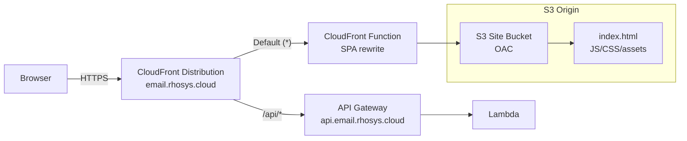

# Design Document: CloudFront Frontend Hosting

## Overview

This design adds an S3-backed static site origin to the existing CloudFront distribution so the email-catcher front-end can be served from the apex domain. The existing API Gateway origin moves from the default behavior to an ordered `/api/*` behavior, and the S3 origin becomes the new default.

All S3 buckets are recreated using the AWS account regional namespace format (`{prefix}-{account_id}-{region}-an`). No migration needed — there is no existing data.

### Key Design Decisions

1. **S3 becomes default, API becomes ordered** — Flipping the default behavior means unknown paths serve the SPA while `/api/*` is explicitly routed to the API origin.
2. **Keep API Gateway stage as `$default`** — CloudFront forwards `/api/*` to the API Gateway custom domain. The `/api` prefix arrives at the Lambda as part of the path. The Hono router handles routes with or without a prefix — no code changes needed since the API Gateway custom domain mapping strips nothing.
3. **OAC over OAI** — Origin Access Control is the AWS-recommended mechanism; OAI is deprecated.
4. **CloudFront Function for SPA routing** — Custom error responses are distribution-level (apply to ALL behaviors including `/api/*`), so we cannot use them for SPA fallback. Instead, a CloudFront Function on the default behavior rewrites non-file requests to `/index.html`.
5. **Custom cache policy for API** — Forwards `Authorization`, `Content-Type`, query strings, and enables compression. Default TTL 0 (no caching unless origin sends `Cache-Control`), max TTL 1 year.
6. **Account regional namespace for all buckets** — Prevents bucket name squatting and guarantees uniqueness per account+region.

## Architecture



### Request Flow

1. **Static assets** (`/assets/*` — JS, CSS, images, fonts with hashed filenames):
   - CloudFront ordered behavior → S3 origin via OAC (no CloudFront Function)
   - Cache policy: 1 year default TTL, 1 year max — files are immutable (content-hashed names)
   - No SPA rewrite — these are real files, never HTML routes

2. **SPA pages** (`/`, `/dashboard`, `/login`, any non-`/api/*` and non-`/assets/*` path):
   - CloudFront default behavior → CloudFront Function (SPA rewrite) → S3 origin via OAC
   - CloudFront Function: if the URI has no file extension, rewrite to `/index.html`
   - Cache policy: honour `Cache-Control`, default 1 day TTL, max 1 year

3. **API requests** (`/api/*`):
   - CloudFront ordered behavior → API Gateway custom domain origin
   - Custom cache policy: forward `Authorization`, `Content-Type`, all query strings; default TTL 0
   - All HTTP methods forwarded
   - `x-origin-verify` header preserved
   - API errors (4xx/5xx) pass through to the client unchanged

## Components and Interfaces

### New Resources

| Resource | Type | File | Purpose |
|----------|------|------|---------|
| `aws_s3_bucket.web` | S3 bucket | `cdn.tf` | Static site assets (account regional namespace) |
| `aws_s3_bucket_public_access_block.web` | S3 config | `cdn.tf` | Block all public access |
| `aws_s3_bucket_server_side_encryption_configuration.web` | S3 config | `cdn.tf` | AES256 encryption |
| `aws_s3_bucket_lifecycle_configuration.web` | S3 config | `cdn.tf` | Abort incomplete multipart uploads (7 days) |
| `aws_s3_bucket_policy.web` | S3 policy | `cdn.tf` | OAC access grant (CloudFront only) |
| `aws_cloudfront_origin_access_control.s3` | OAC | `cdn.tf` | S3 signing (sigv4, always) |
| `aws_cloudfront_cache_policy.s3_cache` | Cache policy | `cdn.tf` | S3 default behavior caching (1 day default, 1 year max) |
| `aws_cloudfront_cache_policy.assets_cache` | Cache policy | `cdn.tf` | S3 /assets/* behavior caching (1 year default, 1 year max — immutable hashed filenames) |
| `aws_cloudfront_cache_policy.api_cache` | Cache policy | `cdn.tf` | API behavior caching (0 default, forwards auth/content-type/query strings) |
| `aws_cloudfront_function.spa_rewrite` | CF Function | `cdn.tf` | Rewrites non-file URIs to `/index.html` |

### Modified Resources

| Resource | Change | File |
|----------|--------|------|
| `aws_cloudfront_distribution.api` | Add S3 origin, flip default/ordered behaviors, remove custom error responses, attach CF Function | `cdn.tf` |
| `aws_s3_bucket.emails` | Recreate with account regional format + `bucket_namespace` | `storage.tf` |
| All references to `aws_s3_bucket.emails.id` / `.arn` / `.bucket` | Update to new bucket name | `storage.tf`, `compute.tf` |
| `outputs.tf` | Add `site_bucket_name`, `site_bucket_arn`, `cloudfront_distribution_id`; update `email_bucket_name` | `outputs.tf` |

### Removed Resources

| Resource | Reason |
|----------|--------|
| Old `aws_s3_bucket.emails` (global namespace name) | Replaced by account regional format bucket |

## Data Models

### S3 Bucket Naming

| Bucket | Old Name | New Name |
|--------|----------|----------|
| Emails | `${var.service_name}-emails` | `${var.service_name}-emails-${var.aws_account_id}-eu-west-1-an` |
| Site (new) | N/A | `${var.service_name}-web-${var.aws_account_id}-eu-west-1-an` |

### CloudFront Behavior Routing

| Priority | Path Pattern | Origin | Cache Policy | Function |
|----------|-------------|--------|--------------|----------|
| Default | `*` | S3 (Site_Bucket via OAC) | Custom: 1 day default, 1 year max, honour origin headers, gzip+brotli | SPA rewrite (viewer-request) |
| Ordered 1 | `/api/*` | API Gateway (custom domain) | Custom: 0 default, 1 year max, forward Authorization+Content-Type+query strings, gzip+brotli | None |
| Ordered 2 | `/assets/*` | S3 (Site_Bucket via OAC) | Custom: 1 year default, 1 year max, immutable hashed filenames, gzip+brotli | None |

### API Cache Policy

```hcl
resource "aws_cloudfront_cache_policy" "api_cache" {
  name        = "${var.service_name}-api-cache"
  default_ttl = 0
  max_ttl     = 31536000
  min_ttl     = 0

  parameters_in_cache_key_and_forwarded_to_origin {
    cookies_config {
      cookie_behavior = "whitelist"
      cookies { items = ["authorization"] }
    }
    headers_config {
      header_behavior = "whitelist"
      headers { items = ["Authorization", "Content-Type", "Origin", "Accept"] }
    }
    query_strings_config {
      query_string_behavior = "all"
    }
    enable_accept_encoding_brotli = true
    enable_accept_encoding_gzip   = true
  }
}
```

### CloudFront Function (SPA Rewrite)

```javascript
function handler(event) {
  var request = event.request;
  var uri = request.uri;
  // If the URI has no file extension, serve index.html (SPA client-side routing)
  if (!uri.includes('.')) {
    request.uri = '/index.html';
  }
  return request;
}
```

This runs on viewer-request for the default behavior only. It does NOT affect the `/api/*` behavior.

### API Gateway Path Handling

- CloudFront forwards `/api/accounts/123/arcs` to the API Gateway custom domain as `/api/accounts/123/arcs`
- The API Gateway custom domain mapping maps to the `$default` stage (unchanged)
- The Lambda receives the full path including `/api` prefix
- The Hono app's `$default` route catches all paths — the `/api` prefix is part of the path the app sees
- **Action needed:** The Hono app routes must be updated to include the `/api` prefix, OR a base path must be configured on the Hono app

**Simplest approach:** Configure Hono with a base path of `/api`:
```typescript
const app = new OpenAPIHono<AppEnv>({ basePath: '/api' });
```

This means all existing route definitions (`/accounts/:accountId/arcs`) continue to work — Hono strips the base path before matching.

## Error Handling

### SPA Client-Side Routing

The CloudFront Function handles SPA routing by rewriting non-file URIs to `/index.html`. This only applies to the default behavior (S3 origin). The `/api/*` behavior is unaffected.

If S3 returns 403 for a path that has a file extension but doesn't exist (e.g. `/old-asset.js`), CloudFront returns the 403 to the client. This is correct — missing assets should 404/403, not silently serve `index.html`.

### API Origin Errors

API errors (4xx/5xx) pass through to the client unchanged. No custom error responses are configured at the distribution level, so there is no interference between the S3 SPA behavior and API error responses.

## Testing Strategy

### OpenTofu Native Tests (`.tftest.hcl`)

File: `deploy/tests/cdn_hosting.tftest.hcl`

1. Site bucket uses account regional namespace (name ends with `-an`, has `bucket_namespace`)
2. Site bucket has public access blocked (all four settings true)
3. OAC is configured with `always` signing and `sigv4` protocol
4. CloudFront distribution has both S3 and API origins
5. Email bucket uses account regional namespace
6. CloudFront Function exists and is associated with default behavior

### Integration Verification (Post-Deploy)

1. `curl -I https://email.rhosys.cloud/` → 200, serves `index.html`
2. `curl -I https://email.rhosys.cloud/nonexistent` → 200, serves `index.html` (SPA rewrite)
3. `curl https://email.rhosys.cloud/api/openapi.json` → 200, returns OpenAPI spec
4. `curl https://email.rhosys.cloud/api/nonexistent` → 404 JSON error from API (not `index.html`)

### CI Pipeline

No structural changes to `.github/workflows/build.yml`. The site repo will need its own workflow for `aws s3 sync` + CloudFront invalidation — enabled by the outputs (`site_bucket_name`, `cloudfront_distribution_id`).
