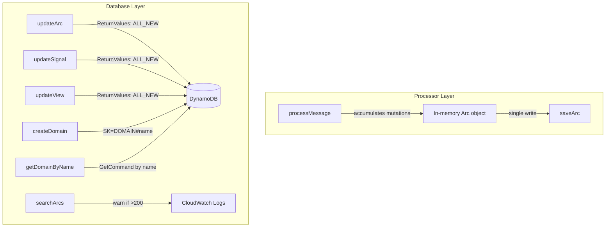

# Design Document: DynamoDB Storage Optimization

## Overview

This design addresses four optimization opportunities in the email-catcher backend's DynamoDB storage layer:

1. **Batch arc writes** — Restructure `processMessage` to accumulate all arc mutations in memory and issue a single `saveArc` call at the end, eliminating redundant full-item overwrites during retention, pong, and auto-reply steps.
2. **ReturnValues elimination** — Refactor all `update*` methods to use `ReturnValues: "ALL_NEW"` and strip DynamoDB key attributes from the response, removing follow-up `GetCommand` calls.
3. **Domain re-keying** — Change domain items from `DOMAIN#{uuid}` to `DOMAIN#{domainName}` so `getDomainByName` is a direct GetCommand instead of a scan-and-filter.
4. **Search observability** — Add a structured warning log when `searchArcs` fetches more than 200 items for in-memory filtering.

These changes reduce DynamoDB consumed WCUs on the hot path (processor), eliminate redundant RCUs on API mutations, and provide observability for the search bottleneck.

## Architecture

The changes are confined to two layers:



No new tables, GSIs, or infrastructure changes are required. The domain re-keying is a data-level change within the existing single-table design.

## Components and Interfaces

### 1. Processor Mutation Accumulation

**Current behavior:** `processMessage` calls `saveArc` up to 3 times:
- After step 12 (main arc save)
- After step 13 (retention TTL update)
- After step 15 (each successful auto-reply appends to `sentMessageIds`)

**New behavior:** A single `saveArc` call at the end of `processMessage` after all mutations are accumulated on the in-memory `arc` object.

```typescript
// Pseudocode for the restructured processMessage tail
// Steps 12-17 accumulate mutations on `arc` without calling saveArc

// Step 12: pong — append messageId to arc.sentMessageIds (no saveArc)
// Step 13: retention — set arc.ttl (no saveArc)  
// Step 15: auto-reply — append messageIds to arc.sentMessageIds (no saveArc)

// Final write: single saveArc with all accumulated mutations
await this.store.saveArc(arc);
await this.store.saveSignal(signal);
```

The blocked/quarantined early-return paths remain unchanged — they never call `saveArc`.

### 2. ReturnValues Key Stripping

Each `update*` method gains `ReturnValues: "ALL_NEW"` on its `UpdateCommand` and uses a shared utility to strip DynamoDB internal keys from the response.

```typescript
// New utility in shared.ts
const DDB_INTERNAL_KEYS = ["pk", "sk", "gsi1pk", "gsi1sk"] as const;

export function stripDdbKeys<T extends Record<string, unknown>>(item: T): Omit<T, typeof DDB_INTERNAL_KEYS[number]> {
  const result = { ...item };
  for (const key of DDB_INTERNAL_KEYS) {
    delete (result as Record<string, unknown>)[key];
  }
  return result as Omit<T, typeof DDB_INTERNAL_KEYS[number]>;
}
```

Affected methods:
- `ArcDatabase`: `updateArc`, `updateSignal`, `blockSignal`
- `AccountDatabase`: `updateAccount`, `updateView`, `updateLabel`, `updateRule`, `updateTemplate`

### 3. Re-key Domains by Name

**Current behavior:** Domains are stored with SK `DOMAIN#{uuid}`. `getDomainByName` queries all domains for the account and filters in-memory.

**New behavior:** Domains are stored with SK `DOMAIN#{domainName}`. The `id` field on the Domain type becomes the domain name itself. `getDomainByName` becomes a direct GetCommand.

```typescript
// createDomain — use domain name as both id and SK suffix
const item: Domain = {
  id: domain,  // "example.com" — the natural key
  accountId,
  domain,
  receivingSetupComplete: false,
  senderSetupComplete: false,
  createdAt: now,
  updatedAt: now,
};
await dynamo.send(new PutCommand({
  TableName: ACCOUNTS_TABLE,
  Item: { ...item, pk: pk(accountId), sk: `DOMAIN#${domain}` },
}));

// getDomainByName — direct GetCommand, no scan
async getDomainByName(accountId: string, domainName: string): Promise<Domain | null> {
  const result = await dynamo.send(new GetCommand({
    TableName: ACCOUNTS_TABLE,
    Key: { pk: pk(accountId), sk: `DOMAIN#${domainName}` },
  }));
  return result.Item ? stripDdbKeys(result.Item as Domain) : null;
}
```

**API route compatibility:** Routes use `/domains/:id` where `:id` is now the domain name (e.g. `/domains/example.com`). No route changes needed — just the internal key generation.

**No migration needed:** The product hasn't launched, so there are no existing UUID-keyed domains to migrate.

### 4. Search Warning Log

```typescript
// In searchArcs, after the QueryCommand returns
const items = (res.Items ?? []) as Arc[];
if (items.length > 200) {
  console.warn(JSON.stringify({
    level: "warn",
    message: "searchArcs.large_result_set",
    accountId,
    query,
    itemsFetched: items.length,
    timestamp: new Date().toISOString(),
  }));
}
```

## Data Models

### stripDdbKeys Return Type

The `stripDdbKeys` utility produces a type that excludes `pk`, `sk`, `gsi1pk`, `gsi1sk` from the DynamoDB item, returning only domain-relevant fields.

### Domain Item (re-keyed)

```typescript
// Stored in ACCOUNTS_TABLE
// PK: ACCT#{accountId}
// SK: DOMAIN#{domainName}  (was DOMAIN#{uuid})
interface DomainItem {
  id: string;              // equals domainName (natural key)
  accountId: string;
  domain: string;          // same as id
  receivingSetupComplete: boolean;
  senderSetupComplete: boolean;
  // ... health fields, timestamps
}
```

### No Schema Changes

No changes to existing DynamoDB table schemas, GSIs, or TTL configurations. The domain re-keying is a data-level change within the existing accounts table's single-table design.

## Correctness Properties

*A property is a characteristic or behavior that should hold true across all valid executions of a system — essentially, a formal statement about what the system should do. Properties serve as the bridge between human-readable specifications and machine-verifiable correctness guarantees.*

### Property 1: Single saveArc call with complete mutations

*For any* non-blocked, non-quarantined signal processing path through `processMessage`, the store's `saveArc` method SHALL be called exactly once, and the arc argument SHALL contain the union of all mutations accumulated during processing (TTL, sentMessageIds, status, labels, urgency).

**Validates: Requirements 1.1, 1.2, 1.3, 1.4, 1.6**

### Property 2: Blocked/quarantined signals never trigger saveArc

*For any* signal processing path where the outcome is blocked or quarantined, the store's `saveArc` method SHALL never be called.

**Validates: Requirements 1.5**

### Property 3: Key stripping removes all DynamoDB internal attributes

*For any* object containing a mix of domain fields and DynamoDB internal key attributes (`pk`, `sk`, `gsi1pk`, `gsi1sk`), applying `stripDdbKeys` SHALL produce an object that contains all domain fields and none of the internal key attributes.

**Validates: Requirements 2.9**

### Property 4: Domain re-key round-trip

*For any* valid accountId and domain name, after `createDomain` is called, `getDomainByName` SHALL return the domain; and after `deleteDomain` is called, `getDomainByName` SHALL return null.

**Validates: Requirements 3.1, 3.3, 3.4, 3.5**

### Property 5: Search warning threshold is bidirectional

*For any* `searchArcs` invocation, a warning log SHALL be emitted if and only if the number of items fetched from DynamoDB exceeds 200.

**Validates: Requirements 4.1, 4.3**

## Error Handling

| Scenario | Handling |
|----------|----------|
| `saveArc` fails after signal is saved | Signal is persisted but arc may be stale. Existing retry logic (SQS redelivery) handles this — dedup check finds the signal and skips reprocessing. No change needed. |
| `ReturnValues` response missing `Attributes` | Throw an error — this indicates a DynamoDB SDK bug or conditional check failure. Callers already handle exceptions. |
| `getDomainByName` for non-existent domain | Returns null — direct GetCommand returns empty response. No fallback needed. |

## Testing Strategy

### Property-Based Tests (fast-check)

Property-based testing is appropriate here because the processor and key-stripping logic have clear input/output behavior with universal properties that hold across a wide input space.

**Library:** fast-check (already in the project)
**Minimum iterations:** 100 per property test
**Tag format:** `Feature: dynamodb-storage-optimization, Property {N}: {title}`

| Property | Generator Strategy |
|----------|-------------------|
| 1: Single saveArc | Generate random `InboundSignalMessage` + classification + rule outcomes + pong/auto-reply results. Mock store, count `saveArc` calls, verify arc contents. |
| 2: No saveArc on block/quarantine | Generate random inputs that produce block/quarantine outcomes (high spam scores, untrusted senders, block rules). Verify zero `saveArc` calls. |
| 3: Key stripping | Generate arbitrary objects with random domain fields plus random subsets of `pk`/`sk`/`gsi1pk`/`gsi1sk`. Verify output excludes all four keys. |
| 4: Domain re-key round-trip | Generate random `accountId` (uuid) and `domainName` (valid domain string). Exercise create → lookup → delete → lookup cycle. |
| 5: Search warning threshold | Generate random item counts (0–500). Mock DynamoDB to return that many items. Verify warning emitted iff count > 200. |

### Unit Tests (example-based)

| Test | What it verifies |
|------|-----------------|
| `updateArc` uses `ReturnValues: "ALL_NEW"` | Mock DynamoDB, verify UpdateCommand params |
| `updateSignal` uses `ReturnValues: "ALL_NEW"` | Same pattern |
| `blockSignal` uses `ReturnValues: "ALL_NEW"` | Same pattern |
| `updateView` uses `ReturnValues: "ALL_NEW"` | Same pattern |
| `updateLabel` uses `ReturnValues: "ALL_NEW"` | Same pattern |
| `updateRule` uses `ReturnValues: "ALL_NEW"` | Same pattern |
| `updateTemplate` uses `ReturnValues: "ALL_NEW"` | Same pattern |
| `updateAccount` uses `ReturnValues: "ALL_NEW"` | Same pattern |
| `getDomainByName` issues GetCommand (not Query) | Verify command type |
| `getDomainByName` returns null for non-existent domain | Mock empty response |
| Search warning log includes accountId, query, count | Trigger with known values, verify log structure |

### Integration Considerations

- The processor tests should use the existing `ProcessorDatabase` interface mock pattern already established in the test suite.
- Domain tests can use the existing dynamo mock pattern.
- No infrastructure changes needed — all tests run against mocked DynamoDB clients.
