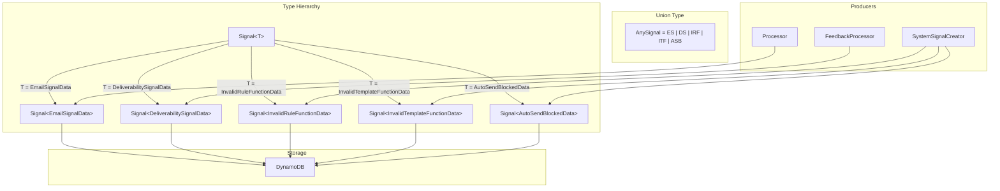

# Design Document: Generic Signal Types

## Overview

This design introduces a parameterised `Signal<T>` type that separates base signal metadata from type-specific data payloads. The current flat `Signal` interface forces non-email signals (deliverability, system alerts) to populate email-specific fields with meaningless placeholders. The generic approach eliminates this dishonesty by encoding the signal variant in the type system.

The refactoring is purely a TypeScript-level change. DynamoDB storage format changes minimally — the type-specific fields move into a nested `data` map attribute. No table schema migration is needed since there are no existing signals in the database.

### Design Decisions

1. **Default type parameter = EmailSignalData**: Existing code referencing `Signal` without a type parameter continues to compile. Migration is incremental.
2. **Discriminated union via `type` field**: The required `type` field on every signal enables runtime narrowing to the correct data payload type.
3. **`data` stored as nested DynamoDB map**: The `data` property serialises naturally as a DynamoDB map attribute. No flattening or custom marshalling needed — the DynamoDB Document Client handles nested objects natively.
4. **No migration**: Since there are no existing signals in the database, the new format applies to all future writes without backward-compatibility shims.
5. **One payload type per signal type value**: Each of the five `type` values maps to its own distinct data payload interface. No generic "subject" field stuffed with a description — each type carries only the structured fields meaningful to it.

## Architecture



The architecture preserves the existing producer/consumer pattern. Each producer constructs the specific signal variant it owns. The database layer accepts `AnySignal` for writes and returns `AnySignal` for reads, with consumers narrowing via the `type` discriminator.

## Components and Interfaces

### Signal<T> (Generic Type)

```typescript
// Base fields shared by all signal types
interface SignalBase {
  id: string;
  signalLookupId: string;
  arcId?: string;
  accountId: string;
  source: SignalSource;
  type: SignalType;
  status: SignalStatus;
  createdAt: string;
  ttl?: number;
  retentionDuration?: RetentionDuration;
}

// The generic signal type
interface Signal<T = EmailSignalData> extends SignalBase {
  data: T;
}
```

### EmailSignalData

```typescript
interface EmailSignalData {
  receivedAt: string;
  summary: string;
  urgency?: ArcUrgency;
  embeddings?: Record<string, number[]>;
  from: EmailAddress;
  to: EmailAddress[];
  cc: EmailAddress[];
  replyTo?: EmailAddress;
  subject: string;
  sentAt?: string;
  textBody?: string;
  htmlBody?: string;
  attachments: Attachment[];
  headers: Record<string, string>;
  recipientAddress: string;
  workflow: Workflow;
  workflowData: WorkflowData;
  spamScore: number;
  s3Key: string;
  matchedRules?: MatchedRuleResult[];
  sesMessageId?: string;
  sendInitiatedAt?: string;
  sendFailureReason?: string;
}
```

### DeliverabilitySignalData

```typescript
interface DeliverabilitySignalData {
  relatedSignalId: string;
  bouncedRecipients: Array<{
    address: string;
    bounceType: "permanent" | "transient";
    reason?: string;
  }>;
  subject: string;
}
```

### InvalidRuleFunctionData

```typescript
interface InvalidRuleFunctionData {
  resourceName: string;
  issue: string;
}
```

### InvalidTemplateFunctionData

```typescript
interface InvalidTemplateFunctionData {
  resourceName: string;
  functionName: string;
  issue: string;
}
```

### AutoSendBlockedData

```typescript
interface AutoSendBlockedData {
  fromAddress: string;
  replyToAddress: string;
  recipientAddress: string;
}
```

### AnySignal (Union Type)

```typescript
type AnySignal =
  | Signal<EmailSignalData>
  | Signal<DeliverabilitySignalData>
  | Signal<InvalidRuleFunctionData>
  | Signal<InvalidTemplateFunctionData>
  | Signal<AutoSendBlockedData>;
```

### Type Narrowing Helpers

```typescript
// Type guard functions for narrowing AnySignal by type field
function isEmailSignal(signal: AnySignal): signal is Signal<EmailSignalData> {
  return signal.type === "email";
}

function isDeliverabilitySignal(signal: AnySignal): signal is Signal<DeliverabilitySignalData> {
  return signal.type === "deliverability";
}

function isInvalidRuleFunctionSignal(signal: AnySignal): signal is Signal<InvalidRuleFunctionData> {
  return signal.type === "invalid_rule_function";
}

function isInvalidTemplateFunctionSignal(signal: AnySignal): signal is Signal<InvalidTemplateFunctionData> {
  return signal.type === "invalid_template_function";
}

function isAutoSendBlockedSignal(signal: AnySignal): signal is Signal<AutoSendBlockedData> {
  return signal.type === "auto_send_blocked";
}
```

### Updated Producers

**SystemSignalCreator** — produces three distinct signal types:

```typescript
// invalid_rule_function
const signal: Signal<InvalidRuleFunctionData> = {
  id, signalLookupId: id, arcId, accountId,
  source: "email", type: "invalid_rule_function", status: "active",
  createdAt: timestamp, ttl,
  data: { resourceName, issue },
};

// invalid_template_function
const signal: Signal<InvalidTemplateFunctionData> = {
  id, signalLookupId: id, arcId, accountId,
  source: "email", type: "invalid_template_function", status: "active",
  createdAt: timestamp, ttl,
  data: { resourceName, functionName, issue },
};

// auto_send_blocked
const signal: Signal<AutoSendBlockedData> = {
  id, signalLookupId: id, arcId, accountId,
  source: "email", type: "auto_send_blocked", status: "active",
  createdAt: timestamp, ttl,
  data: { fromAddress, replyToAddress, recipientAddress },
};
```

**FeedbackProcessor** — deliverability signal construction becomes `Signal<DeliverabilitySignalData>`:
```typescript
const signal: Signal<DeliverabilitySignalData> = {
  id, signalLookupId: id, arcId, accountId,
  source: "ses_feedback", type: "deliverability",
  status: "active", createdAt: timestamp,
  data: {
    relatedSignalId: sentSignal.id,
    bouncedRecipients,
    subject: `Delivery failure: ${bouncedRecipients.length} recipient(s) bounced`,
  },
};
```

### Database Layer Changes

**saveSignal** — accepts `AnySignal`. The `data` property is stored as-is (DynamoDB Document Client serialises nested objects as map attributes automatically).

**getSignalById / getSignalByMessageId** — returns `AnySignal`. The raw DynamoDB item is cast to `AnySignal`. Consumers narrow via type guards.

The `FeedbackSignalStore` interface in feedback-processor.ts updates its signatures to use `AnySignal` where it currently uses `Signal`.

## Data Models

### DynamoDB Item Structure (after refactoring)

For an email signal:
```json
{
  "pk": "ACCT#acc-123#SIG#ses-abc",
  "sk": "ITEM",
  "id": "sgn-xyz",
  "signalLookupId": "ses-abc",
  "arcId": "arc-456",
  "accountId": "acc-123",
  "source": "email",
  "type": "email",
  "status": "active",
  "createdAt": "2025-01-01T00:00:00.000Z",
  "data": {
    "receivedAt": "2025-01-01T00:00:00.000Z",
    "summary": "...",
    "classificationModelId": "model-v1",
    "from": { "address": "sender@example.com", "name": "Sender" },
    "to": [{ "address": "me@mydomain.com" }],
    "cc": [],
    "subject": "Hello",
    "attachments": [],
    "headers": {},
    "recipientAddress": "me@mydomain.com",
    "workflow": "conversation",
    "workflowData": { "workflow": "conversation", "isReply": false, "sentiment": "neutral", "requiresReply": false },
    "spamScore": 0.1,
    "s3Key": "emails/abc.eml"
  },
  "gsi1pk": "ACCT#acc-123#ARC#arc-456",
  "gsi1sk": "sgn-xyz"
}
```

For an invalid_rule_function signal:
```json
{
  "pk": "ACCT#acc-123#SIG#sgn-def",
  "sk": "ITEM",
  "id": "sgn-def",
  "signalLookupId": "sgn-def",
  "arcId": "arc-456",
  "accountId": "acc-123",
  "source": "email",
  "type": "invalid_rule_function",
  "status": "active",
  "createdAt": "2025-01-01T00:00:00.000Z",
  "data": {
    "resourceName": "my-rule",
    "issue": "syntax error in condition"
  },
  "ttl": 1740000000,
  "gsi1pk": "ACCT#acc-123#ARC#arc-456",
  "gsi1sk": "sgn-def"
}
```

For an invalid_template_function signal:
```json
{
  "pk": "ACCT#acc-123#SIG#sgn-ghi",
  "sk": "ITEM",
  "id": "sgn-ghi",
  "signalLookupId": "sgn-ghi",
  "arcId": "arc-456",
  "accountId": "acc-123",
  "source": "email",
  "type": "invalid_template_function",
  "status": "active",
  "createdAt": "2025-01-01T00:00:00.000Z",
  "data": {
    "resourceName": "welcome-template",
    "functionName": "formatDate",
    "issue": "formatDate is not defined"
  },
  "ttl": 1740000000,
  "gsi1pk": "ACCT#acc-123#ARC#arc-456",
  "gsi1sk": "sgn-ghi"
}
```

For an auto_send_blocked signal:
```json
{
  "pk": "ACCT#acc-123#SIG#sgn-jkl",
  "sk": "ITEM",
  "id": "sgn-jkl",
  "signalLookupId": "sgn-jkl",
  "arcId": "arc-456",
  "accountId": "acc-123",
  "source": "email",
  "type": "auto_send_blocked",
  "status": "active",
  "createdAt": "2025-01-01T00:00:00.000Z",
  "data": {
    "fromAddress": "me@mydomain.com",
    "replyToAddress": "other@example.com",
    "recipientAddress": "recipient@example.com"
  },
  "ttl": 1740000000,
  "gsi1pk": "ACCT#acc-123#ARC#arc-456",
  "gsi1sk": "sgn-jkl"
}
```

### Type Mapping

| `type` value | Data payload type | Producer |
|---|---|---|
| `"email"` | `EmailSignalData` | Processor (inbound), API (user drafts) |
| `"deliverability"` | `DeliverabilitySignalData` | FeedbackProcessor |
| `"invalid_rule_function"` | `InvalidRuleFunctionData` | SystemSignalCreator |
| `"invalid_template_function"` | `InvalidTemplateFunctionData` | SystemSignalCreator |
| `"auto_send_blocked"` | `AutoSendBlockedData` | SystemSignalCreator |

## Correctness Properties

*Correctness properties are invariants that must hold across all valid inputs. Since this project uses vitest with static expectations only (no property-based testing), each property is verified with a deterministic `it.each` table covering the finite set of meaningfully different cases.*

### Property 1: Type narrowing correctness

*For each* signal type value in SIGNAL_TYPES, exactly one type guard returns `true` and the other four return `false`.

| `type` value | `isEmailSignal` | `isDeliverabilitySignal` | `isInvalidRuleFunctionSignal` | `isInvalidTemplateFunctionSignal` | `isAutoSendBlockedSignal` |
|---|---|---|---|---|---|
| `"email"` | `true` | `false` | `false` | `false` | `false` |
| `"deliverability"` | `false` | `true` | `false` | `false` | `false` |
| `"invalid_rule_function"` | `false` | `false` | `true` | `false` | `false` |
| `"invalid_template_function"` | `false` | `false` | `false` | `true` | `false` |
| `"auto_send_blocked"` | `false` | `false` | `false` | `false` | `true` |

**Validates: Requirements 12.1, 12.2, 12.3, 12.4, 12.5**

### Property 2: Data payload completeness

*For each* producer, the constructed signal's `data` property contains only the fields appropriate for its type — no email-specific fields leak into non-email signals.

| Producer | Signal type | `data` contains | `data` must NOT contain |
|---|---|---|---|
| SystemSignalCreator | `"invalid_rule_function"` | `resourceName`, `issue` | `from`, `to`, `cc`, `attachments`, `headers`, `spamScore`, `classificationModelId`, `s3Key`, `workflow`, `workflowData`, `subject`, `receivedAt`, `summary`, `embeddings` |
| SystemSignalCreator | `"invalid_template_function"` | `resourceName`, `functionName`, `issue` | `from`, `to`, `cc`, `attachments`, `headers`, `spamScore`, `classificationModelId`, `s3Key`, `workflow`, `workflowData`, `subject`, `receivedAt`, `summary`, `embeddings` |
| SystemSignalCreator | `"auto_send_blocked"` | `fromAddress`, `replyToAddress`, `recipientAddress` | `from`, `to`, `cc`, `attachments`, `headers`, `spamScore`, `classificationModelId`, `s3Key`, `workflow`, `workflowData`, `subject`, `receivedAt`, `summary`, `embeddings` |
| FeedbackProcessor | `"deliverability"` | `relatedSignalId`, `bouncedRecipients`, `subject` | `from`, `to`, `cc`, `attachments`, `headers`, `spamScore`, `classificationModelId`, `s3Key`, `workflow`, `workflowData`, `receivedAt`, `summary`, `embeddings` |

**Validates: Requirements 10.1, 10.2, 10.3, 10.4, 11.1, 11.2**

### Property 3: DynamoDB round-trip fidelity

*For each* signal variant, saving to DynamoDB and reading back preserves the `data` property unchanged (deep equality).

| Signal variant | `data` payload |
|---|---|
| `Signal<EmailSignalData>` | Full email payload (from, to, subject, attachments, etc.) |
| `Signal<DeliverabilitySignalData>` | `{ relatedSignalId, bouncedRecipients, subject }` |
| `Signal<InvalidRuleFunctionData>` | `{ resourceName, issue }` |
| `Signal<InvalidTemplateFunctionData>` | `{ resourceName, functionName, issue }` |
| `Signal<AutoSendBlockedData>` | `{ fromAddress, replyToAddress, recipientAddress }` |

**Validates: Requirements 9.1, 9.2**

### Property 4: Type parameter default

*When* `Signal` is referenced without an explicit type parameter, it resolves to `Signal<EmailSignalData>` — meaning `signal.data.from` and `signal.data.to` are accessible without type narrowing.

This is primarily a compile-time invariant enforced by TypeScript strict mode. The test verifies it by constructing a `Signal` (no type argument) and asserting access to email-specific data fields compiles and returns the expected values.

**Validates: Requirements 1.4, 8.1, 8.2**

## Error Handling

| Scenario | Handling |
|---|---|
| DynamoDB read returns item without `data` field | Treat as legacy format — should not occur since no existing signals exist. Log a warning and return null. |
| `type` field has unknown value | TypeScript exhaustiveness check at compile time. At runtime, treat as `Signal<unknown>` — log and skip type-specific processing. |
| Consumer accesses `signal.data` without narrowing | Compile-time error — `T` defaults to `EmailSignalData` only when `Signal` is used without explicit parameterisation. `AnySignal` requires narrowing. |

## Testing Strategy

**Approach**: Unit tests with static expectations (vitest). No property-based testing — the project uses deterministic inputs with explicit expected outputs.

**Test categories**:

1. **Type narrowing tests** — Verify that type guard functions (`isEmailSignal`, `isDeliverabilitySignal`, `isInvalidRuleFunctionSignal`, `isInvalidTemplateFunctionSignal`, `isAutoSendBlockedSignal`) correctly narrow `AnySignal` based on the `type` field. Use `it.each` over the five signal types.

2. **Producer tests** — Verify that `SystemSignalCreator` produces the correct payload type for each of its three signal types (`InvalidRuleFunctionData`, `InvalidTemplateFunctionData`, `AutoSendBlockedData`) with only base fields + data payload (no email-specific fields). Verify that `FeedbackProcessor` produces `Signal<DeliverabilitySignalData>` with only base fields + data payload.

3. **Database round-trip tests** — Verify that `saveSignal` followed by `getSignalById` preserves the `data` nested map for each signal variant. Use one representative signal per type (five total).

4. **Backward compatibility tests** — Verify that code using `Signal` (no type parameter) resolves to `Signal<EmailSignalData>` and can access `signal.data.from`, `signal.data.to` etc. without narrowing. This is primarily a compile-time check enforced by the type system.

5. **Compile-time checks** — TypeScript strict mode with `exactOptionalPropertyTypes: true` ensures that:
   - `Signal<InvalidRuleFunctionData>` cannot have email-specific fields in `data`
   - `Signal<InvalidTemplateFunctionData>` cannot have email-specific fields in `data`
   - `Signal<AutoSendBlockedData>` cannot have email-specific fields in `data`
   - `Signal<DeliverabilitySignalData>` cannot have email-specific fields in `data`
   - Accessing `signal.data.from` on `AnySignal` without narrowing is a type error

**Test structure**: Each test file mirrors the source file it tests. Existing test files for `system-signal-creator` and `feedback-processor` are updated to assert the new signal shape (no placeholder fields).
