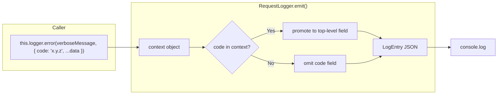

# Design Document: Log Message Review

## Overview

Rewrite all TRACK/WARN/ERROR/CRITICAL log messages in the email-catcher backend from terse dot-separated identifiers to verbose human-readable strings following a WHAT/HOW/WHY/DO pattern. Introduce a `code` field in the context object that carries the original terse identifier for programmatic filtering. Extend the existing structured-logging design document with formal log level semantics and message format guidance.

The Logger interface remains unchanged — `code` is simply a field in the existing `context?: Record<string, unknown>` parameter. The `RequestLogger` class is updated to promote `code` from context to a top-level field in the emitted `LogEntry`.

## Architecture



**Key design decisions:**

1. **No interface change** — The `Logger` interface signature stays the same. `code` is an optional key in the context object, not a new parameter.
2. **Promotion semantics** — When `code` is present in context, `RequestLogger` extracts it and places it as a top-level field in the `LogEntry` (alongside `level`, `message`, `timestamp`). It is removed from the spread context to avoid duplication.
3. **Message becomes verbose** — The `message` field now carries a full sentence describing WHAT/HOW/WHY/DO. The `code` field carries the terse machine-readable identifier previously used as the message.
4. **Backward-compatible** — Existing DEBUG/INFO calls that don't pass `code` continue to work unchanged. The `code` field is optional in `LogEntry`.
5. **Single-pass rewrite** — All TRACK/WARN/ERROR/CRITICAL calls across the six source files are rewritten in one pass.

## Components and Interfaces

### LogEntry Type Update

```typescript
export interface LogEntry {
  level: LogLevel;
  message: string;
  code?: string;           // NEW: optional machine-readable identifier
  timestamp: string;
  invocationId: string;
  containerId: string;
  trackPoints?: TrackPoint[];
  stack?: string;
  _truncated?: boolean;
  [key: string]: unknown;
}
```

### RequestLogger.emit() Update

The `emit` method extracts `code` from context before spreading:

```typescript
private emit(level: LogLevel, message: string, context?: Record<string, unknown>): void {
  const includeTrackPoints = level === "track" || level === "error" || level === "critical";
  const includeStack = level === "error" || level === "critical";

  // Extract code from context if present
  let code: string | undefined;
  let restContext: Record<string, unknown> | undefined;
  if (context && "code" in context && typeof context.code === "string") {
    const { code: extractedCode, ...rest } = context;
    code = extractedCode;
    restContext = Object.keys(rest).length > 0 ? rest : undefined;
  } else {
    restContext = context;
  }

  const entry: LogEntry = {
    ...(restContext ?? {}),
    level,
    message,
    ...(code !== undefined ? { code } : {}),
    timestamp: new Date().toISOString(),
    invocationId: this.invocationId,
    containerId: this.containerId,
    ...(includeTrackPoints && this.trackPoints.length > 0 ? { trackPoints: this.trackPoints } : {}),
    ...(includeStack ? { stack: new Error().stack ?? "" } : {}),
  };

  // Re-assign required fields AFTER spread to guarantee context cannot overwrite them
  entry.level = level;
  entry.message = message;
  entry.invocationId = this.invocationId;
  entry.containerId = this.containerId;
  if (code !== undefined) entry.code = code;

  // ... serialization and truncation logic unchanged ...
}
```

### Message Format Pattern: WHAT/HOW/WHY/DO

Each verbose message follows this structure (not all parts required for every level):

| Level | Required Parts | Example |
|-------|---------------|---------|
| ERROR | WHAT + HOW + WHY + DO | "Failed to upsert embedding to Aurora cluster. The Data API call returned a connection error. This signal's embedding won't be searchable until the next reindex. Check Aurora cluster health and retry via reindex job." |
| WARN | WHAT + HOW + WHY + DO | "Search query returned an unusually large result set before client-side filtering. DynamoDB scan fetched more items than expected. Repeated occurrences indicate the account's arc count exceeds efficient scan limits. Consider adding a secondary index or pagination." |
| TRACK | WHAT + HOW + WHY | "Signal processing failed after exceeding retry threshold. SQS message was redelivered beyond the configured limit. Tracked for dead-letter queue monitoring and alerting dashboards." |
| CRITICAL | WHAT + HOW + WHY + DO | (same as ERROR but for system-compromising failures) |

### Code Field Convention

Code identifiers follow the pattern: `{module}.{entity}.{outcome}`

Examples:
- `processor.signal.failed`
- `reindex.worker.s3_fetch_failed`
- `domain_health.notification_failed`
- `feedback.parse_failed`

Rules:
- Lowercase, dot-separated
- 2–4 segments
- Final segment describes the outcome (usually a failure mode)
- Stable across releases — used in CloudWatch alarms and metric filters

## Log Level Semantics

| Level | Purpose | Audience | Alerting | When to Use |
|-------|---------|----------|----------|-------------|
| DEBUG | Development-time diagnostic detail | Developer (local) | None — disabled in production | Tracing control flow, inspecting intermediate values during development |
| INFO | Routine operational milestones | Operator (dashboards) | None — confirms healthy operation | Invocation start/end, job completion summaries, configuration loaded |
| TRACK | Per-invocation outcome records | Metrics/dashboards | Threshold-based (CloudWatch metric filters) | Per-signal outcomes, per-item failures within a batch, non-fatal side-effect failures |
| WARN | Degraded-but-recoverable conditions | Operator (review queue) | Pattern-based (if frequency exceeds threshold) | Large result sets, fallback paths taken, approaching limits |
| ERROR | Operation failed, system operational | On-call operator | Immediate (CloudWatch alarm) | Database write failed, external service call failed, message processing failed after retries |
| CRITICAL | System compromised | On-call operator | Immediate + escalation | Cannot connect to database, Lambda runtime error, configuration missing |

## Message Rewrite Catalog

### processor.ts

| Original Message | Level | New Message | Code |
|-----------------|-------|-------------|------|
| `"processor.signal.failed"` | error | "Signal processing failed after exceeding retry threshold. SQS message was redelivered {receiveCount} times without successful completion. This message will move to the DLQ and the email won't be processed. Investigate the root cause in earlier track-level logs for this messageId." | `processor.signal.failed` |
| `"processor.signal.failed"` | track | "Signal processing failed on attempt {receiveCount}. The SQS message will be retried automatically. Tracked for retry-rate monitoring." | `processor.signal.failed` |
| `"pong_reply_failed"` | error | "Failed to send pong reply to test email sender. The SES send call returned an error. The sender won't receive the automated test confirmation. Check SES sending limits and verify the from-address domain is configured." | `processor.pong_reply_failed` |
| `"s3_retention_failed"` | error | "Failed to apply S3 retention policy to signal object. The S3 tagging or copy operation returned an error. The signal is saved but will use the default 5-year lifecycle rule instead of the plan-specific retention. Non-fatal — no operator action required unless pattern persists." | `processor.s3_retention_failed` |
| `"aurora_upsert_failed"` | error | "Failed to upsert embedding to Aurora cluster. The Data API call returned an error for the target cluster. This signal's embedding won't be searchable on that cluster until the next reindex run. Check Aurora cluster health in the AWS console." | `processor.aurora_upsert_failed` |
| `"forward_failed"` | error | "Failed to forward email to configured address. The SES send-raw-email call returned an error. The recipient won't receive the forwarded copy. Check SES sending quota and verify the forward address isn't suppressed." | `processor.forward_failed` |
| `"auto_reply_failed"` | error | "Failed to send auto-reply from template. The SES send call returned an error. The sender won't receive the automated response. Check SES limits and template configuration." | `processor.auto_reply_failed` |
| `"reputation_update_failed"` | track | "Failed to update global sender reputation after signal processing. The DynamoDB update returned an error. Reputation data may be stale for this domain. Tracked for consistency monitoring." | `processor.reputation_update_failed` |
| `"quarantine_notification_failed"` | track | "Failed to send quarantine notification to user. The notification service returned an error. The signal is quarantined but the user won't be alerted. Tracked for notification reliability monitoring." | `processor.quarantine_notification_failed` |
| `"retention_metadata_save_failed"` | track | "Failed to persist retention metadata on signal record. The DynamoDB update returned an error. The S3 retention is applied but the signal record won't reflect the retention duration. Tracked for data consistency monitoring." | `processor.retention_metadata_save_failed` |
| `"calendar_signal_save_failed"` | track | "Failed to save synthetic calendar signal for scheduling workflow. The DynamoDB put returned an error. The email signal is saved but the calendar entry won't appear. Tracked for scheduling feature reliability." | `processor.calendar_signal_save_failed` |
| `"auto_draft_save_failed"` | track | "Failed to save auto-draft signal from template. The DynamoDB put returned an error. The draft won't appear in the user's arc. Tracked for auto-draft feature reliability." | `processor.auto_draft_save_failed` |
| `"notification_failed"` | track | "Failed to send new-signal notification to user. The notification service returned an error. The signal is processed but the user won't be alerted. Tracked for notification reliability monitoring." | `processor.notification_failed` |

### reindex-worker.ts

| Original Message | Level | New Message | Code |
|-----------------|-------|-------------|------|
| `"reindex.worker.segment_failed"` | error | "Reindex segment failed after exceeding retry threshold. SQS message was redelivered {receiveCount} times without successful completion. This segment's signals won't be reindexed until the job is re-triggered. Investigate DynamoDB scan or Aurora write failures." | `reindex.worker.segment_failed` |
| `"reindex.worker.segment_failed"` | track | "Reindex segment failed on attempt {receiveCount}. The SQS message will be retried automatically. Tracked for segment retry-rate monitoring." | `reindex.worker.segment_failed` |
| `"reindex.worker.malformed_signal"` | track | "Skipped malformed signal during reindex scan. The DynamoDB item is missing required fields (accountId, arcId, or recipientAddress). This signal cannot be reindexed and will be counted as unrecoverable. Tracked for data quality monitoring." | `reindex.worker.malformed_signal` |
| `"reindex.worker.signal_upsert_failed"` | track | "Failed to upsert cached embedding to Aurora during reindex pure-copy. The Aurora Data API call returned an error for this signal. The signal will be skipped and counted toward failure metrics. Tracked for per-signal reindex reliability." | `reindex.worker.signal_upsert_failed` |
| `"reindex.worker.s3_fetch_failed"` | track | "Failed to fetch raw MIME from S3 during reindex regeneration. A non-NoSuchKey S3 error occurred. This signal's embedding cannot be regenerated in this run. Tracked for S3 access reliability during reindex." | `reindex.worker.s3_fetch_failed` |
| `"reindex.worker.regeneration_failed"` | track | "Failed to regenerate embedding from S3 source during reindex. The MIME parse, Bedrock call, or Aurora write failed. This signal will be skipped. Tracked for regeneration pipeline reliability." | `reindex.worker.regeneration_failed` |
| `"reindex.worker.unrecoverable"` | track | "Signal marked unrecoverable during reindex — cannot regenerate embedding. The signal record lacks an s3Key or the S3 object no longer exists (NoSuchKey). This signal will never be reindexed. Tracked for data loss monitoring." | `reindex.worker.unrecoverable` |

### domain-health-job.ts

| Original Message | Level | New Message | Code |
|-----------------|-------|-------------|------|
| `"domain_health.accounts_fetch_failed"` | error | "Failed to fetch account list for domain health check run. The DynamoDB scan of all domains returned an error. No domains will be checked in this invocation. Investigate DynamoDB table health and retry on next scheduled run." | `domain_health.accounts_fetch_failed` |
| `"domain_health.account_fetch_failed"` | error | "Failed to fetch account details during domain health check. The DynamoDB get for the account record returned an error. This account's domains will be skipped. Check DynamoDB read capacity." | `domain_health.account_fetch_failed` |
| `"domain_health.update_health_failed"` | error | "Failed to persist domain health check results. The DynamoDB update for the domain record returned an error. Health status won't be reflected in the UI until the next successful check. Check DynamoDB write capacity." | `domain_health.update_health_failed` |
| `"domain_health.notification_failed"` | error | "Failed to send DNS health alert email to account owner. The SESv2 send call returned an error. The owner won't be notified of failing DNS records. Check SES sending limits and verify the notification from-address." | `domain_health.notification_failed` |
| `"staleness_checker.account_error"` | error | "Failed to query stale arcs for account during staleness check. The DynamoDB query returned an error. This account's staleness report will be skipped. Check DynamoDB read capacity." | `staleness_checker.account_error` |
| staleness track (via buildAccountLogEntry) | track | (unchanged — message comes from `buildAccountLogEntry` helper) | — |

### feedback-processor.ts

| Original Message | Level | New Message | Code |
|-----------------|-------|-------------|------|
| `"feedback.parse_failed"` | error | "Failed to parse SES feedback notification from SQS record. The JSON payload could not be deserialized as a valid SesFeedback structure. This feedback event will be skipped and the bounce/complaint won't be recorded. Check the SNS subscription format." | `feedback.parse_failed` |
| `"feedback.process_failed"` | error | "Failed to process SES bounce/complaint feedback. A database operation failed while suppressing the address or disabling forward rules. The suppression entry may be incomplete. Retry will occur on next SQS delivery." | `feedback.process_failed` |
| `"feedback.disable_forward_failed"` | error | "Failed to disable forward actions after permanent bounce. The DynamoDB update for the forward rule returned an error. Emails may continue to be forwarded to the bouncing address. Investigate and manually disable if pattern persists." | `feedback.disable_forward_failed` |

### arc-database.ts

| Original Message | Level | New Message | Code |
|-----------------|-------|-------------|------|
| `"searchArcs.large_result_set"` | warn | "Arc search query returned an unusually large result set before client-side filtering. DynamoDB scan fetched more items than expected for this account. Repeated occurrences indicate the account's active arc count exceeds efficient scan limits. Consider adding a filtered GSI or prompting the user to archive old arcs." | `arc_database.search_arcs.large_result_set` |

### rule-evaluator.ts

| Original Message | Level | New Message | Code |
|-----------------|-------|-------------|------|
| `"rule-evaluator.condition.failed"` | warn | "Rule condition evaluation threw an exception. The json-logic engine failed to evaluate the condition expression. The rule will be treated as non-matching and processing continues. Check the rule condition syntax for this ruleId." | `rule_evaluator.condition.failed` |

## Data Models

### Updated LogEntry (emitted JSON)

Before (current):
```json
{
  "level": "error",
  "message": "processor.signal.failed",
  "timestamp": "2025-01-15T10:30:00.000Z",
  "invocationId": "a1b2c3d4-...",
  "containerId": "f8a2b1c3",
  "messageId": "msg-456",
  "receiveCount": 35
}
```

After (new):
```json
{
  "level": "error",
  "message": "Signal processing failed after exceeding retry threshold. SQS message was redelivered 35 times without successful completion. This message will move to the DLQ and the email won't be processed. Investigate the root cause in earlier track-level logs for this messageId.",
  "code": "processor.signal.failed",
  "timestamp": "2025-01-15T10:30:00.000Z",
  "invocationId": "a1b2c3d4-...",
  "containerId": "f8a2b1c3",
  "messageId": "msg-456",
  "receiveCount": 35
}
```

## Error Handling

| Scenario | Behaviour |
|----------|-----------|
| `code` field in context is not a string | Treated as regular context data — not promoted to top-level `code` field |
| `code` field in context is empty string | Promoted as-is (empty string) — caller's responsibility to provide meaningful codes |
| Context contains both `code` and other fields | `code` is extracted and promoted; remaining fields spread into entry as before |
| Existing DEBUG/INFO calls without `code` | No change — `code` field omitted from output |

## Correctness Properties

*A property is a characteristic or behavior that should hold true across all valid executions of a system — essentially, a formal statement about what the system should do. Properties serve as the bridge between human-readable specifications and machine-verifiable correctness guarantees.*

### Property 1: Code field promotion and omission

*For any* log call at any level, if the context object contains a `code` field with a string value, the emitted LogEntry JSON SHALL contain `code` as a top-level field with that value. Conversely, if no `code` field is present in context (or it is not a string), the emitted LogEntry SHALL NOT contain a `code` field.

**Validates: Requirements 2.2, 2.4, 7.2**

### Property 2: Code field does not duplicate in context

*For any* log call where `code` is provided in the context object, the emitted LogEntry SHALL NOT contain `code` as both a top-level field and nested within the spread context data. The `code` key SHALL appear exactly once in the serialized output.

**Validates: Requirements 2.1, 2.2**

### Property 3: No terse-only messages at TRACK/WARN/ERROR/CRITICAL level (static analysis)

*For any* source file in the backend `src/` directory (excluding test files and `logger.ts`), every call to `.track()`, `.warn()`, `.error()`, or `.critical()` SHALL have a message argument that is NOT a simple dot-separated identifier (i.e., the message must contain at least one space character).

**Validates: Requirements 6.1, 6.3, 6.4, 6.5, 6.6, 6.7, 6.8**

### Property 4: All TRACK/WARN/ERROR/CRITICAL calls include a code field (static analysis)

*For any* source file in the backend `src/` directory (excluding test files and `logger.ts`), every call to `.track()`, `.warn()`, `.error()`, or `.critical()` that passes a context object SHALL include a `code` field in that context object.

**Validates: Requirements 6.2**

## Testing Strategy

### Property-Based Tests (fast-check)

**Library**: `fast-check` (already in devDependencies)

**Test file**: `src/logger.property.spec.ts` (extend existing file)

Properties 1 and 2 are tested by generating:
- Random log levels
- Random message strings
- Random context objects (with and without `code` field)
- Random `code` values (valid dot-separated identifiers)

Then asserting the output JSON structure matches the promotion/omission rules.

**Configuration**: Minimum 100 iterations per property test.

**Tag format**: `Feature: log-message-review, Property N: <title>`

### Static Analysis Tests

**Test file**: `src/log-message-static-analysis.spec.ts`

Properties 3 and 4 are tested by:
1. Reading all `.ts` source files (excluding tests and `logger.ts`)
2. Parsing log calls via regex
3. Asserting message arguments contain spaces (not terse identifiers)
4. Asserting context objects contain `code` field

### Unit Tests

- Verify specific before/after message rewrites match expected verbose format
- Verify `code` field extraction from context works with edge cases (missing, non-string, empty)
- Verify existing DEBUG/INFO calls still work without `code`

### Existing Test Updates

The existing `processor.side-effect-logging.property.spec.ts` tests that validate log message format will need updating — they currently expect dot-separated identifiers as messages. After the rewrite, messages are verbose strings and the dot-separated identifier moves to the `code` field.
