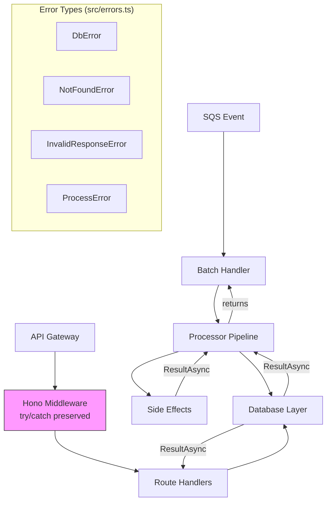
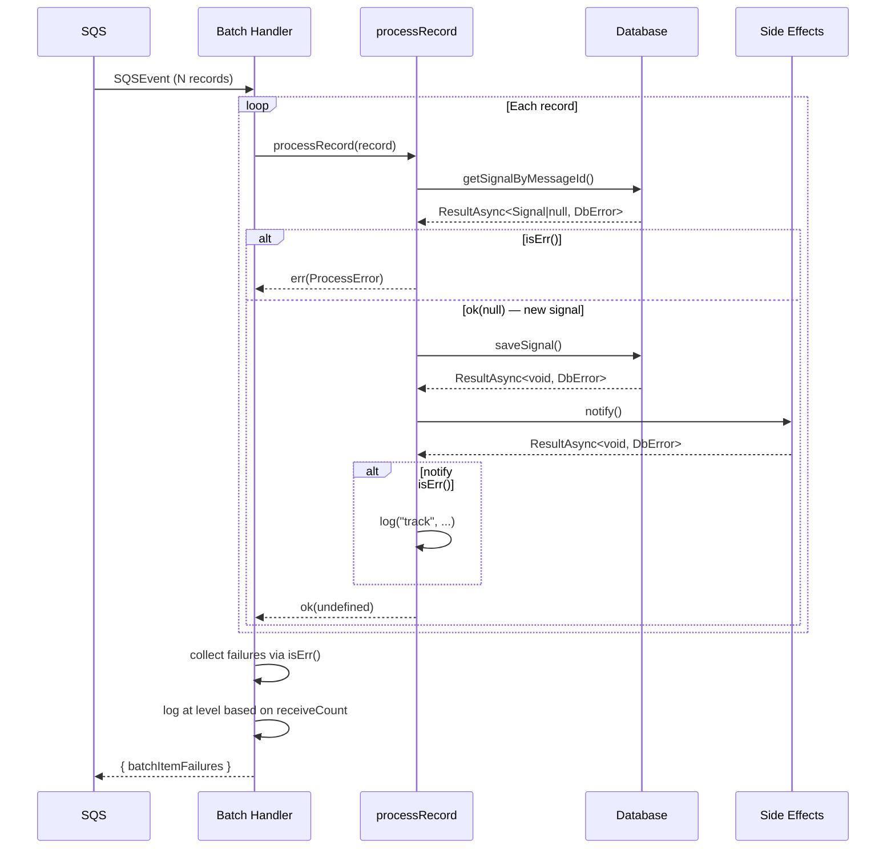
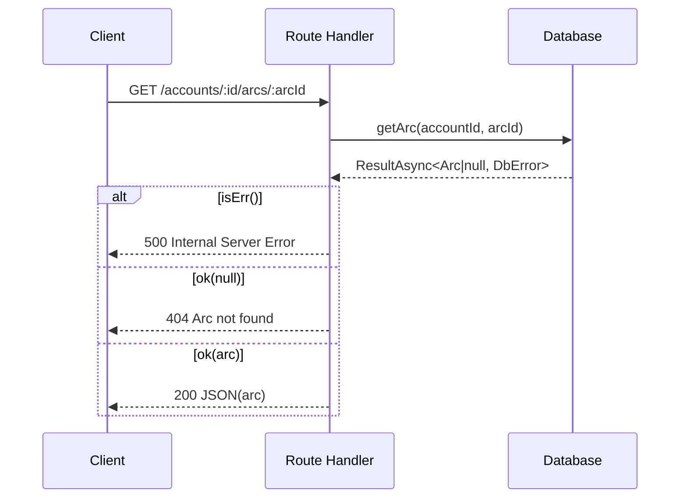

# Design Document: neverthrow Error Handling Migration

## Overview

Migrate the email-catcher/backend from implicit throw/catch error handling to explicit `Result` and `ResultAsync` types from neverthrow. The migration touches four layers: database methods wrap SDK calls at the boundary, the processor pipeline composes Results with sequential `isErr()` checks, API routes unwrap Results inline to produce HTTP responses, and side-effect services return Results so callers log explicitly. Hono middleware is the sole exception.

The design follows ADR-005 strictly: no `.andThen()`, no `.map()`, no `.catch()`, no composite error types. Every failure is visible in the function signature and handled linearly.

## Architecture



## Components and Interfaces

### Component 1: Error Types Module (`src/errors.ts`)

```typescript
import type { Result, ResultAsync } from "neverthrow";
import { ok, err } from "neverthrow";

// --- Standalone error types (no composite unions) ---

export type DbError = { kind: "db_error"; cause: Error };
export type NotFoundError = { kind: "not_found"; resource: string; id: string };
export type InvalidResponseError = { kind: "invalid_response" };
export type ProcessError = { kind: "process_error"; messageId: string };

// --- Constructor helpers ---

export const dbError = (cause: Error): DbError => ({ kind: "db_error", cause });
export const notFoundError = (resource: string, id: string): NotFoundError => ({ kind: "not_found", resource, id });
export const invalidResponseError = (): InvalidResponseError => ({ kind: "invalid_response" });
export const processError = (messageId: string): ProcessError => ({ kind: "process_error", messageId });

// Re-export neverthrow primitives for convenience
export { ok, err };
export type { Result, ResultAsync };
```

No composite union types are defined here. Unions only exist inline at return sites:

```typescript
// At the call site, not in errors.ts:
renameAlias(accountId: string, old: string, new_: string): ResultAsync<Alias, DbError | NotFoundError>
```

### Component 2: Database Layer

**Purpose**: Wrap every AWS SDK call (DynamoDB, RDS Data API) with `ResultAsync.fromPromise()` at the boundary. Public methods never throw.

**Interface pattern** (applied to `AccountDatabase`, `ArcDatabase`, `ProcessingDatabase`, `AuditDatabase`):

```typescript
import { ResultAsync } from "neverthrow";
import { dbError, notFoundError, ok, err } from "../errors.js";
import type { DbError, NotFoundError } from "../errors.js";

export class ArcDatabase {
  // Read: null is a success case
  getArc(accountId: string, id: string): ResultAsync<Arc | null, DbError> {
    return ResultAsync.fromPromise(
      dynamo.send(new GetCommand({
        TableName: SIGNALS_TABLE,
        Key: { pk: arcPk(accountId, id), sk: ITEM_SK },
      })).then(res => res.Item ? (res.Item as Arc) : null),
      (e) => dbError(e instanceof Error ? e : new Error(String(e)))
    );
  }

  // Mutation requiring existing resource
  renameAlias(accountId: string, oldName: string, newName: string): ResultAsync<Alias, DbError | NotFoundError> {
    return ResultAsync.fromPromise(
      this.doRenameAlias(accountId, oldName, newName),
      (e) => dbError(e instanceof Error ? e : new Error(String(e)))
    );
  }

  // Write: void success
  saveSignal(signal: Signal): ResultAsync<void, DbError> {
    return ResultAsync.fromPromise(
      dynamo.send(new PutCommand({
        TableName: SIGNALS_TABLE,
        Item: { /* ... */ },
      })).then(() => undefined),
      (e) => dbError(e instanceof Error ? e : new Error(String(e)))
    );
  }
}
```

**Key rules**:
- `ResultAsync.fromPromise(promise, errorMapper)` is the only wrapping mechanism
- The error mapper always produces `DbError` — it captures the original SDK error in `cause`
- Read methods return `ResultAsync<T | null, DbError>` — null means "not found" and is a valid success
- Mutation methods that require an existing resource return `ResultAsync<T, DbError | NotFoundError>`
- No internal try/catch — `fromPromise` handles the boundary

### Component 3: Processor Pipeline

**Purpose**: Compose multiple fallible operations sequentially using explicit `isErr()` checks. Return `ProcessError` to the batch handler.

```typescript
import { ResultAsync, ok, err } from "neverthrow";
import type { Result } from "neverthrow";
import type { ProcessError, DbError, InvalidResponseError } from "../errors.js";
import { processError, dbError } from "../errors.js";

export class SignalProcessor {
  async processRecord(record: SQSRecord): Promise<Result<void, ProcessError>> {
    const receiveCount = Number(record.attributes?.ApproximateReceiveCount ?? "1");

    // Parse the SQS message body
    let message: ReindexSegmentMessage;
    try {
      const sns = JSON.parse(record.body) as { Message: string };
      message = JSON.parse(sns.Message) as SesReceiptNotification & { accountId?: string };
    } catch {
      return err(processError(record.messageId));
    }

    const msg: InboundSignalMessage = { /* ... build from message ... */ };

    // Dedup check on redelivery
    if (receiveCount > 1) {
      const existingResult = await this.store.getSignalByMessageId(msg.accountId, msg.sesMessageId);
      if (existingResult.isErr()) return err(processError(record.messageId));
      if (existingResult.value) return ok(undefined); // already processed
    }

    const processResult = await this.processMessage(msg);
    if (processResult.isErr()) return err(processError(record.messageId));

    return ok(undefined);
  }

  private async processMessage(msg: InboundSignalMessage): Promise<Result<void, DbError | InvalidResponseError>> {
    // 1. Dedup
    const existingResult = await this.store.getSignalByMessageId(msg.accountId, msg.sesMessageId);
    if (existingResult.isErr()) return err(existingResult.error);
    if (existingResult.value) return ok(undefined);

    // 2. Parse MIME
    const parseResult = await this.mimeParser.parse(msg.s3Key);
    if (parseResult.isErr()) return err(parseResult.error);
    const parsed = parseResult.value;

    // 3. Classify + embed in parallel
    const [embeddingResults, classificationResult] = await Promise.all([
      this.embeddingGenerator.generateForActiveClusters(embedText),
      this.classifier.classify(input),
    ]);
    if (classificationResult.isErr()) return err(classificationResult.error);
    const classification = classificationResult.value;

    // 4. Fetch account context
    const ctxResult = await this.store.getProcessorAccountContext(msg.accountId, recipientAddress);
    if (ctxResult.isErr()) return err(ctxResult.error);
    const accountCtx = ctxResult.value;

    // ... continue with arc matching, rule evaluation, save ...

    // Side effects: caller logs on error
    const notifyResult = await this.notifier.notify(accountId, arc, signal);
    if (notifyResult.isErr()) {
      log("track", "notification_failed", { accountId, error: notifyResult.error });
    }

    return ok(undefined);
  }
}
```

**Pattern**: Each fallible step is three lines:
1. `const xResult = await fn();`
2. `if (xResult.isErr()) return err(xResult.error);`
3. `const x = xResult.value;`

No `.andThen()`, no `.map()`, no `.mapErr()`.

### Component 4: Batch Handler

**Purpose**: Collect Results from all records and build `batchItemFailures`.

```typescript
async process(event: SQSEvent): Promise<{ batchItemFailures: Array<{ itemIdentifier: string }> }> {
  const results = await Promise.all(
    event.Records.map(record => this.processRecord(record))
  );

  const failures: Array<{ itemIdentifier: string }> = [];
  for (let i = 0; i < results.length; i++) {
    const result = results[i]!;
    if (result.isErr()) {
      const record = event.Records[i]!;
      const receiveCount = Number(record.attributes?.ApproximateReceiveCount ?? "1");
      const level = receiveCount > RETRY_TRACK_THRESHOLD ? "error" : "track";
      log(level, "processor.signal.failed", {
        messageId: result.error.messageId,
        receiveCount,
      });
      failures.push({ itemIdentifier: result.error.messageId });
    }
  }

  return { batchItemFailures: failures };
}
```

**Key rules**:
- Log level is determined by the caller (batch handler) based on `receiveCount`, not carried on the error type
- No try/catch — the batch handler never catches
- `batchItemFailures` is built from error results using `isErr()` checks

### Component 5: API Routes

**Purpose**: Unwrap Results inline. Map errors to HTTP responses directly in the handler.

```typescript
app.get("/accounts/:accountId/arcs/:id", authz(...), async (c) => {
  const { accountId } = c.req.param("auth");
  const arcResult = await store.getArc(accountId, c.req.param("id"));
  if (arcResult.isErr()) return err(c, 500, "Internal Server Error");
  const arc = arcResult.value;
  if (!arc) return err(c, 404, "Arc not found", "ARC_NOT_FOUND");
  if (arc.accountId !== accountId) return err(c, 403, "Forbidden");
  return c.json(arc);
});

app.patch("/accounts/:accountId/arcs/:id", authz(...), async (c) => {
  const { accountId } = c.req.param("auth");
  const arcResult = await store.getArc(accountId, c.req.param("id"));
  if (arcResult.isErr()) return err(c, 500, "Internal Server Error");
  const arc = arcResult.value;
  if (!arc) return err(c, 404, "Arc not found", "ARC_NOT_FOUND");
  if (arc.accountId !== accountId) return err(c, 403, "Forbidden");

  const body = await zParse(UpdateArcRequest, c.req.raw); // zParse still throws HTTPException (Hono middleware contract)

  const updateResult = await store.updateArc(accountId, arc.id, { ...body, lastSignalAt: arc.lastSignalAt });
  if (updateResult.isErr()) return err(c, 500, "Internal Server Error");
  return c.json(updateResult.value);
});
```

**Mapping rules**:
- `isErr()` with `kind: "db_error"` → HTTP 500
- `ok(null)` on a read → HTTP 404
- `isErr()` with `kind: "not_found"` on a mutation → HTTP 404
- No global error middleware, no error-to-response mapping layer
- `zParse` continues throwing `HTTPException` — it's consumed by Hono middleware

### Component 6: Side Effects

**Purpose**: `SesNotifier`, `SesForwarder`, and `TestReplier` return `ResultAsync` so callers log explicitly.

```typescript
export class SesNotifier implements Notifier {
  notify(accountId: string, arc: Arc, signal: Signal): ResultAsync<void, DbError> {
    return ResultAsync.fromPromise(
      this.doNotify(accountId, arc, signal),
      (e) => dbError(e instanceof Error ? e : new Error(String(e)))
    );
  }

  notifyBlocked(accountId: string, signal: Signal): ResultAsync<void, DbError> {
    return ResultAsync.fromPromise(
      this.doNotifyBlocked(accountId, signal),
      (e) => dbError(e instanceof Error ? e : new Error(String(e)))
    );
  }

  // Private methods contain the actual implementation (unchanged logic)
  private async doNotify(accountId: string, arc: Arc, signal: Signal): Promise<void> { /* ... */ }
  private async doNotifyBlocked(accountId: string, signal: Signal): Promise<void> { /* ... */ }
}
```

**Caller pattern** (in the processor):

```typescript
// No .catch(), no fire-and-forget
const notifyResult = await this.notifier.notify(accountId, arc, signal);
if (notifyResult.isErr()) {
  log("track", "notification_failed", { accountId, error: notifyResult.error });
}

const forwardResult = await this.forwarder.forward(s3Key, toAddress, accountId, opts);
if (forwardResult.isErr()) {
  log("error", "forward_failed", { accountId, toAddress, error: forwardResult.error });
}
```

Log level is determined by the caller based on context:
- Notification failures → `"track"` (non-critical, user still gets the signal)
- Forward failures → `"error"` (user explicitly requested forwarding)
- Reputation update failures → `"track"` (background enrichment)

### Component 7: Job Workers

**Reindex worker** — same batch pattern as the processor:

```typescript
export class ReindexWorker {
  async process(event: SQSEvent): Promise<{ batchItemFailures: Array<{ itemIdentifier: string }> }> {
    const results = await Promise.all(
      event.Records.map(record => this.processRecord(record))
    );

    const failures: Array<{ itemIdentifier: string }> = [];
    for (let i = 0; i < results.length; i++) {
      const result = results[i]!;
      if (result.isErr()) {
        const record = event.Records[i]!;
        const receiveCount = Number(record.attributes?.ApproximateReceiveCount ?? "1");
        const level = receiveCount > RETRY_TRACK_THRESHOLD ? "error" : "track";
        logAtLevel(level, "reindex.worker.segment_failed", {
          messageId: record.messageId,
          receiveCount,
          error: result.error,
        });
        failures.push({ itemIdentifier: record.messageId });
      }
    }

    return { batchItemFailures: failures };
  }

  private async processRecord(record: SQSRecord): Promise<Result<void, ProcessError>> {
    // Parse message
    let message: ReindexSegmentMessage;
    try {
      message = JSON.parse(record.body) as ReindexSegmentMessage;
    } catch {
      return err(processError(record.messageId));
    }

    // Validate cluster
    const cluster = getClusterById(message.targetClusterId);
    if (!cluster) return err(processError(record.messageId));

    // Process segment
    const segmentResult = await this.processSegment(message);
    if (segmentResult.isErr()) return err(processError(record.messageId));

    return ok(undefined);
  }
}
```

**Domain health job** — logs per-account failures and continues:

```typescript
export async function handler(): Promise<void> {
  const accountsResult = await store.listActiveAccounts();
  if (accountsResult.isErr()) {
    log("error", "domain_health.accounts_fetch_failed", { error: accountsResult.error });
    return;
  }

  for (const account of accountsResult.value) {
    const healthResult = await checkAccountDomainHealth(account);
    if (healthResult.isErr()) {
      log("track", "domain_health.account_failed", {
        accountId: account.id,
        error: healthResult.error,
      });
      continue; // next account
    }
  }
}
```

**Staleness logic** (`staleness-logic.ts`) — pure functions with no I/O, does NOT use Result types:

```typescript
// Pure computation — no Result wrapping needed
export function isStale(lastSignalAt: string, thresholdDays: number): boolean {
  const age = Date.now() - new Date(lastSignalAt).getTime();
  return age > thresholdDays * 86_400_000;
}
```

## Data Models

### Error Type Shapes

```typescript
type DbError = { kind: "db_error"; cause: Error };
type NotFoundError = { kind: "not_found"; resource: string; id: string };
type InvalidResponseError = { kind: "invalid_response" };
type ProcessError = { kind: "process_error"; messageId: string };
```

### Return Type Patterns

| Layer | Success | Error | Return Type |
|-------|---------|-------|-------------|
| DB read | `T \| null` | SDK failure | `ResultAsync<T \| null, DbError>` |
| DB mutation (existing) | `T` | SDK failure or missing | `ResultAsync<T, DbError \| NotFoundError>` |
| DB write | `void` | SDK failure | `ResultAsync<void, DbError>` |
| Processor record | `void` | processing failure | `Result<void, ProcessError>` |
| Processor internal | `void` | any I/O failure | `Result<void, DbError \| InvalidResponseError>` |
| Side effect | `void` | SDK failure | `ResultAsync<void, DbError>` |
| Classifier | `Classification` | parse failure | `ResultAsync<Classification, InvalidResponseError>` |

## Sequence Diagrams

### SQS Batch Processing Flow



### API Route Flow



## Correctness Properties

Properties for fast-check property-based testing:

### Property 1: Database boundary completeness

For any database method `m` and any input `i`, `m(i)` returns a `ResultAsync` that resolves to either `ok(value)` or `err({ kind: "db_error", cause })` — never throws, never rejects.

```typescript
fc.asyncProperty(fc.anything(), async (input) => {
  const result = await store.getArc("account", "id");
  expect(result.isOk() || result.isErr()).toBe(true);
  if (result.isErr()) {
    expect(result.error.kind).toBe("db_error");
    expect(result.error.cause).toBeInstanceOf(Error);
  }
});
```

### Property 2: Batch handler failure collection

For any list of `Result<void, ProcessError>` values, the batch handler produces exactly one `batchItemFailure` entry per `err` result, and zero entries for `ok` results.

```typescript
fc.property(
  fc.array(fc.record({
    isError: fc.boolean(),
    messageId: fc.uuid(),
  })),
  (records) => {
    const results = records.map(r =>
      r.isError ? err(processError(r.messageId)) : ok(undefined)
    );
    const failures = collectFailures(results);
    const expectedCount = records.filter(r => r.isError).length;
    expect(failures.length).toBe(expectedCount);
    for (const r of records.filter(r => r.isError)) {
      expect(failures.some(f => f.itemIdentifier === r.messageId)).toBe(true);
    }
  }
);
```

### Property 3: No `.catch()` in codebase (static analysis property)

The codebase contains zero occurrences of `.catch(` outside of test files and Hono middleware.

```typescript
// Enforced via grep in CI or as a lint rule
fc.property(fc.constant(null), () => {
  const violations = findCatchUsages(sourceFiles);
  expect(violations).toEqual([]);
});
```

### Property 4: No `.andThen()` / `.map()` / `.mapErr()` in codebase

The codebase contains zero occurrences of `.andThen(`, `.map(`, `.mapErr(` on Result/ResultAsync values.

### Property 5: Side effect caller logging

For any side effect that returns `err`, the immediate caller logs at TRACK or ERROR level. No error result is silently discarded.

```typescript
fc.asyncProperty(
  fc.record({ shouldFail: fc.boolean() }),
  async ({ shouldFail }) => {
    const logs: string[] = [];
    const mockNotifier = createMockNotifier(shouldFail);
    const processor = createProcessor({ notifier: mockNotifier, logger: (msg) => logs.push(msg) });

    await processor.processMessage(validMessage);

    if (shouldFail) {
      expect(logs.some(l => l.includes("notification_failed"))).toBe(true);
    }
  }
);
```

### Property 6: API route error mapping consistency

For any store method returning `err({ kind: "db_error" })`, the route handler responds with HTTP 500. For any store method returning `ok(null)` on a read, the route handler responds with HTTP 404.

```typescript
fc.asyncProperty(
  fc.oneof(
    fc.constant({ type: "db_error" as const }),
    fc.constant({ type: "null_read" as const }),
    fc.constant({ type: "success" as const }),
  ),
  async (scenario) => {
    const store = createMockStore(scenario);
    const res = await app.request("/accounts/acct/arcs/arc-id", { headers: authHeaders });

    switch (scenario.type) {
      case "db_error": expect(res.status).toBe(500); break;
      case "null_read": expect(res.status).toBe(404); break;
      case "success": expect(res.status).toBe(200); break;
    }
  }
);
```

### Property 7: ProcessError always carries the SQS messageId

For any SQS record processed by the batch handler, if the result is `err`, the `ProcessError.messageId` matches the original `record.messageId`.

```typescript
fc.asyncProperty(
  fc.record({ messageId: fc.uuid(), body: fc.string() }),
  async (record) => {
    const result = await processor.processRecord(asSQSRecord(record));
    if (result.isErr()) {
      expect(result.error.messageId).toBe(record.messageId);
    }
  }
);
```

### Property 8: Pure functions never return Result types

`staleness-logic.ts` exports only pure functions that return plain values (boolean, number, string) — never `Result` or `ResultAsync`.

## Error Handling

### Error Scenario 1: SDK Timeout / Network Error

**Condition**: AWS SDK call (DynamoDB, RDS Data API, SES, S3) times out or encounters a network error
**Response**: `ResultAsync.fromPromise` catches the rejection, wraps it as `DbError { kind: "db_error", cause: <original Error> }`
**Recovery**: Caller decides — processor returns `ProcessError` (SQS redelivers), API returns 500, side-effect caller logs

### Error Scenario 2: Resource Not Found on Mutation

**Condition**: A mutation (e.g. `renameAlias`) targets a resource that doesn't exist
**Response**: Method returns `err({ kind: "not_found", resource: "alias", id: "..." })`
**Recovery**: API route returns 404; processor logs and continues

### Error Scenario 3: Classifier Returns Unparseable Response

**Condition**: Bedrock returns a response that doesn't match the expected schema
**Response**: Classifier returns `err({ kind: "invalid_response" })`
**Recovery**: Processor wraps as `ProcessError`, SQS redelivers

### Error Scenario 4: Side Effect Failure (Non-Fatal)

**Condition**: Notification or forwarding fails
**Response**: Side effect returns `err({ kind: "db_error", cause })`
**Recovery**: Caller logs at appropriate level (TRACK for notifications, ERROR for forwarding) and continues processing — the signal is already saved

## Testing Strategy

### Unit Testing Approach

- Assert `result.isOk()` and inspect `result.value` for success paths
- Assert `result.isErr()` and inspect `result.error.kind` for failure paths
- Never use `expect(...).rejects.toThrow()` for functions returning Result types
- Mock AWS SDK to return rejections, verify they become `DbError`

### Property-Based Testing Approach

**Library**: fast-check (already in devDependencies)

- Batch handler failure collection (Property 2)
- Side effect caller logging (Property 5)
- API route error mapping (Property 6)
- ProcessError messageId preservation (Property 7)

### Integration Testing Approach

- Verify end-to-end SQS → processor → database flow with injected failures
- Verify `batchItemFailures` contains correct messageIds when database calls fail
- Verify API routes return correct HTTP status codes for each error scenario

## Dependencies

- `neverthrow` (already in package.json, currently unused)
- No new dependencies required
- `vitest` + `fast-check` for property-based testing (already in devDependencies)
