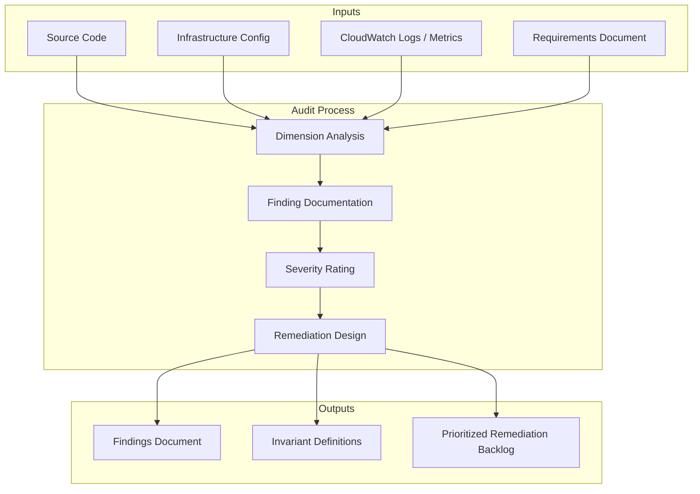

# Design Document: Performance & Architecture Audit

## Overview

This design describes the methodology for conducting a 13-dimension performance and architectural audit of the email-catcher backend. The audit is a structured code review process — not a feature implementation. Its deliverable is a prioritized findings document with actionable remediation recommendations.

The audit examines the backend through 13 lenses:

1. Scale bottlenecks
2. Race conditions
3. Edge cases
4. Conflicting states / logic bugs
5. Cost optimization
6. Naming / semantic clarity
7. Database access pattern violations
8. Convention coupling
9. API surface / information leakage
10. Architectural pits of failure
11. Testability / observability gaps
12. Security boundary violations
13. Formal correctness invariants

Each dimension produces findings rated by severity and effort, enabling prioritized remediation.

## Architecture

The audit is a manual analytical process supported by tooling. There is no runtime component to build.



### Audit Execution Model

The audit executes as a series of spec tasks — one per dimension. Each task:

1. Reads the relevant source files identified in the requirements
2. Analyzes the code against the dimension's criteria
3. Produces findings in the standardized format
4. Assigns severity and effort ratings

Tasks are independent and can execute in any order. The final task consolidates findings into a prioritized backlog.

## Components and Interfaces

### Audit Dimensions (Analysis Components)

Each dimension is a self-contained analysis pass with defined inputs, techniques, and output format.

#### Dimension 1: Scale Bottleneck Analysis

**Technique:** Static analysis of access patterns, algorithmic complexity assessment, and throughput modeling.

- Identify O(n) or worse operations where n grows with user/account count
- Quantify read/write costs at target scale (100K+ accounts, 1M+ signals)
- Flag client-side filtering, N+1 queries, and unbounded fetches
- Assess Lambda concurrency model and cold start impact

**Key files:** `arc-database.ts`, `account-database.ts`, `handler.ts`, `processor.ts`, `multi-cluster-aurora-writer.ts`

#### Dimension 2: Race Condition Analysis

**Technique:** Concurrent execution modeling — identify all code paths where two Lambda invocations can interleave, and trace the state mutations to find conflicts.

- Map all write operations that lack conditional expressions
- Identify non-atomic multi-step sequences (read-modify-write without optimistic locking)
- Trace SQS at-least-once delivery implications for side-effects
- Model concurrent signal processing for the same account/arc

**Key files:** `processor.ts`, `arc-database.ts`, `handler.ts`, `app.ts` (quarantineResponse)

#### Dimension 3: Edge Case Analysis

**Technique:** Boundary value analysis and failure mode enumeration.

- Identify inputs that exceed DynamoDB/S3/SQS limits
- Trace error propagation paths for external service failures (Bedrock, SES, Aurora)
- Enumerate key generation collision scenarios
- Assess cursor/pagination correctness under concurrent mutations

**Key files:** `processor.ts`, `mime.ts`, `classifier.ts`, `arc-database.ts`, `shared.ts`

#### Dimension 4: Conflicting State Analysis

**Technique:** State machine extraction and transition validation.

- Extract implicit state machines (arc status, signal status) from code
- Identify unguarded transitions and missing validation
- Trace dual-write failure modes across DynamoDB + Aurora + S3
- Identify order-dependent behavior in rule evaluation

**Key files:** `processor.ts`, `arc-database.ts`, `app.ts`, `stats-writer.ts`

#### Dimension 5: Cost Optimization Analysis

**Technique:** Cost modeling based on AWS pricing and observed access patterns.

- Quantify wasted compute (embedding generation for blocked signals)
- Identify over-fetching (missing ProjectionExpression, unused query results)
- Assess Lambda memory/timeout configuration efficiency
- Model Aurora Data API call overhead

**Key files:** `processor.ts`, `arc-database.ts`, `handler.ts`, `account-database.ts`

#### Dimension 6: Naming & Semantic Clarity Analysis

**Technique:** API surface review — assess whether names communicate intent without requiring implementation reading.

- Identify misleading class/method names
- Flag god classes that violate single-responsibility
- Identify methods that bundle unrelated concerns
- Assess naming consistency across the codebase

**Key files:** All `src/` files, focusing on public interfaces and class names

#### Dimension 7: Database Access Pattern Violation Analysis

**Technique:** Dependency graph analysis — trace all imports of `database/shared.ts` and identify direct table access outside XDatabase classes.

- Map which modules import `dynamo` and table name constants directly
- Identify parallel access paths that bypass the designated database class
- Flag duplicated transaction/query logic across modules
- Assess interface synchronization burden

**Key files:** `database/shared.ts`, `notifier/device-store.ts`, `jobs/reindex/reindex-worker.ts`, `database/multi-cluster-aurora-writer.ts`

#### Dimension 8: Convention Coupling Analysis

**Technique:** Change impact analysis — for each convention, enumerate all locations that must change in coordination and assess enforcement mechanisms.

- Identify string-literal conventions (key prefixes, sort key formats) scattered across files
- Map the "add a workflow" change set and count required coordinated edits
- Identify array-order dependencies
- Assess type-level enforcement gaps

**Key files:** `database/arc-database.ts`, `types/index.ts`, `handler.ts`, `processor.ts`, `filter.ts`

#### Dimension 9: API Surface & Information Leakage Analysis

**Technique:** Response payload inspection and error response audit.

- Identify internal attributes (pk, sk, gsi1pk, gsi1sk) in API responses
- Assess error response granularity and information disclosure
- Audit cursor encoding for information leakage
- Review CORS configuration for overly permissive origins

**Key files:** `api/app.ts`, `database/arc-database.ts`, `database/shared.ts`

#### Dimension 10: Architectural Pits of Failure Analysis

**Technique:** "What happens when a new developer does the obvious thing?" analysis.

- Identify patterns where the easy/default path leads to bugs
- Flag god-handler and god-function patterns
- Assess error handling ergonomics (Result type boilerplate)
- Identify initialization-time failure modes

**Key files:** `handler.ts`, `api/app.ts`, `database/account-database.ts`, `processor.ts`

#### Dimension 11: Testability & Observability Gap Analysis

**Technique:** Dependency analysis and seam identification.

- Count constructor dependencies and assess mocking burden
- Identify module-level singletons that prevent test isolation
- Assess log correlation capabilities
- Review error type granularity for operational debugging

**Key files:** `handler.ts`, `processor.ts`, `database/arc-database.ts`, `logger.ts`

#### Dimension 12: Security Boundary Violation Analysis

**Technique:** Tenant isolation audit — trace every path where accountId is used and verify isolation enforcement.

- Map accountId extraction and validation across all entry points
- Audit Aurora RLS enforcement completeness
- Assess cursor deserialization safety
- Review authorization middleware coverage

**Key files:** `api/app.ts`, `database/arc-database.ts`, `database/shared.ts`, `handler.ts`

#### Dimension 13: Formal Correctness Invariant Definition

**Technique:** Invariant extraction from the data model and state machine definitions.

- Define referential integrity invariants (signal → arc, GKEY → arc)
- Define state consistency invariants (GSI sort key matches status)
- Define uniqueness invariants (groupingKey, signalLookupId)
- Define lifecycle invariants (no backward status transitions)

**Output:** Machine-verifiable invariant definitions suitable for reconciliation job implementation.

**Key files:** `database/arc-database.ts`, `types/index.ts`, `processor.ts`

### Finding Format

Each finding follows this structure:

```typescript
interface AuditFinding {
  id: string;                    // e.g., "SCALE-01", "RACE-03"
  dimension: AuditDimension;     // Which of the 13 dimensions
  title: string;                 // One-line summary
  description: string;           // Detailed explanation with code references
  severity: "critical" | "high" | "medium" | "low";
  effort: "small" | "medium" | "large" | "xlarge";
  requirementRef: string;        // e.g., "1.2" — links to requirements doc
  affectedFiles: string[];       // Source files involved
  remediation: string;           // Recommended fix approach
  risk: string;                  // What happens if not fixed
}
```

### Severity Rating Criteria

| Severity | Definition |
|----------|-----------|
| Critical | Data loss, cross-tenant access, or system-wide outage at current scale |
| High | Degraded performance or correctness issues that surface at 10x current scale |
| Medium | Inefficiency or maintainability issue that increases incident risk over time |
| Low | Code quality issue that slows development but doesn't affect production |

### Effort Rating Criteria

| Effort | Definition |
|--------|-----------|
| Small | < 1 day, isolated change, low risk of regression |
| Medium | 1–3 days, touches multiple files, requires testing |
| Large | 1–2 weeks, architectural change, requires migration strategy |
| XLarge | 2+ weeks, fundamental redesign, requires phased rollout |

## Data Models

### Audit Output Structure

The audit produces a single findings document organized by dimension, plus a consolidated priority matrix.

```
findings/
├── dimension-01-scale.md
├── dimension-02-race-conditions.md
├── dimension-03-edge-cases.md
├── dimension-04-conflicting-states.md
├── dimension-05-cost.md
├── dimension-06-naming.md
├── dimension-07-db-access.md
├── dimension-08-convention-coupling.md
├── dimension-09-api-leakage.md
├── dimension-10-pits-of-failure.md
├── dimension-11-testability.md
├── dimension-12-security.md
├── dimension-13-invariants.md
└── priority-matrix.md
```

Each dimension file contains:
- Summary of findings count by severity
- Individual findings in the standardized format
- Cross-references to related findings in other dimensions

The priority matrix consolidates all findings into a single table sorted by `severity DESC, effort ASC` — fix the highest-severity, lowest-effort items first.

### Invariant Definition Format (Dimension 13)

Invariants are defined in a format suitable for direct implementation as reconciliation jobs:

```typescript
interface Invariant {
  id: string;                    // e.g., "INV-01"
  name: string;                  // Human-readable name
  statement: string;             // Formal statement of what must hold
  checkQuery: string;            // DynamoDB/SQL query to detect violations
  violationSeverity: "critical" | "high";
  reconciliationStrategy: string; // How to fix violations when detected
  monitoringFrequency: string;   // How often to check (e.g., "hourly", "daily")
}
```

## Error Handling

Not applicable — this is an audit process, not a runtime system. The audit itself has no error handling requirements beyond standard document creation.

## Testing Strategy

**Property-based testing does not apply to this feature.** The audit is an analytical process that produces documentation. There is no executable code to test, no input space to generate over, and no universal properties to verify.

The audit's quality is validated by:

1. **Coverage check:** Every acceptance criterion in the requirements document maps to at least one finding in the output. If a criterion cannot be confirmed (e.g., the code doesn't exhibit the described pattern), the finding documents why.

2. **Reproducibility:** Each finding includes specific file paths and line references so that any developer can independently verify the finding by reading the cited code.

3. **Actionability:** Each finding includes a concrete remediation recommendation — not just "fix this" but a specific approach with trade-offs noted.

The formal invariants (Dimension 13) are designed to be implemented as automated reconciliation jobs in a future task — those jobs will have their own test suites when built.
