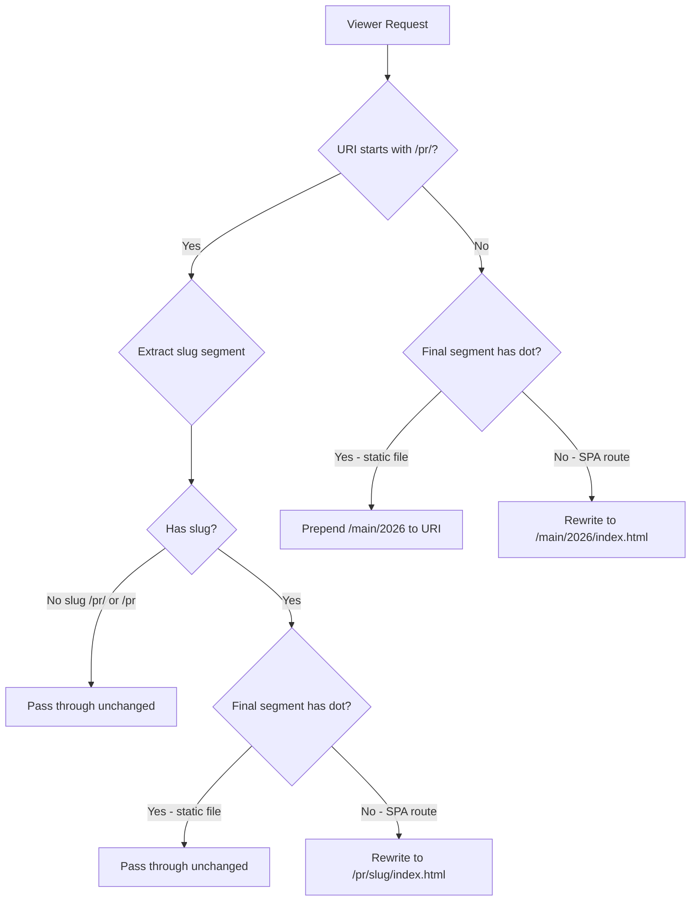

# Design Document: PR Preview SPA Routing

## Overview

The CloudFront Function `spa_rewrite` currently performs a naive SPA rewrite: if the URI has no dot in it, rewrite to `/index.html`. This breaks PR preview deployments where assets live under `pr/{slug}/` because deep links like `/pr/my-branch/dashboard` get rewritten to the root `/index.html` instead of `/pr/my-branch/index.html`.

The fix is a small change to the CloudFront Function's JavaScript code. The function must detect when a URI starts with `/pr/{slug}/` and rewrite to the correct prefix-scoped `index.html`, while preserving the existing behavior for all other requests.

### Design Rationale

- **Single function, no new resources** (for the CF function): The SPA rewrite fix lives within the existing `aws_cloudfront_function.spa_rewrite` resource's `code` attribute.
- **Two S3 origins, one bucket**: The default behavior uses the CF function to prepend `main/{year}/`. The `/assets/*` behavior uses a separate origin with `origin_path` set to `/main/{year}` — no function needed for assets.
- **Tofu `locals` block for the year**: `local.site_version = "main/2026"` is defined once and referenced by both the CF function code (via string interpolation in the heredoc) and the assets origin path. One line to update per year.
- **Prefix detection via string matching**: CloudFront Functions run in the `cloudfront-js-2.0` runtime (ES 5.1 subset + some ES6), so we use basic string operations.
- **`VITE_BASE_PATH=/`** for main builds: Asset references come in as `/assets/...` and match the `/assets/*` ordered behavior directly.

## Architecture



Note: The `/assets/*` ordered behavior matches asset requests before they reach this function. Assets are handled by the `s3-site-assets` origin with `origin_path = "/main/2026"` — no function involvement.

The function runs on the **viewer-request** event of the **default cache behavior**. The `/api/*` and `/assets/*` ordered behaviors match first and are unaffected.

## Components and Interfaces

### CloudFront Function: `spa_rewrite`

**Runtime**: `cloudfront-js-2.0`
**Event**: `viewer-request`
**Input**: CloudFront viewer-request event object
**Output**: Modified (or unmodified) request object

```javascript
function handler(event) {
  var request = event.request;
  var uri = request.uri;
  var MAIN_PREFIX = '/${local.site_version}';

  // PR preview prefix — rewrite SPA routes to prefix-scoped index.html
  if (uri.startsWith('/pr/')) {
    var segments = uri.split('/');
    // segments: ['', 'pr', slug, ...rest]
    var slug = segments[2];

    if (!slug) {
      return request;
    }

    var lastSegment = segments[segments.length - 1];
    if (lastSegment.includes('.')) {
      return request;
    }

    request.uri = '/pr/' + slug + '/index.html';
    return request;
  }

  // Root-level requests: prepend site_version prefix
  var lastSeg = uri.substring(uri.lastIndexOf('/') + 1);
  if (!lastSeg.includes('.')) {
    request.uri = MAIN_PREFIX + '/index.html';
  } else {
    request.uri = MAIN_PREFIX + uri;
  }

  return request;
}
```

Note: `${local.site_version}` is interpolated by Tofu at plan time via the heredoc. The deployed function contains the literal string `main/2026`.

### Terraform Resource Change

Changes in `deploy/cdn.tf`:

1. **Add** `local.site_version = "main/2026"` to the existing `locals` block. This is the single source of truth for the production deploy prefix.
2. **Update** the `code` attribute of `aws_cloudfront_function.spa_rewrite` — the heredoc interpolates `local.site_version` so the year is injected at plan time.
3. **Add** a second S3 origin (`s3-site-assets`) pointing to the same bucket with `origin_path = "/${local.site_version}"`. Used exclusively by the `/assets/*` ordered behavior.
4. **Update** the `/assets/*` ordered cache behavior to target the `s3-site-assets` origin.
5. The `aws_cloudfront_cache_policy.assets_cache` resource remains unchanged (1-year immutable TTL).

```hcl
locals {
  api_gateway_origin_id = "api-gateway"
  s3_site_origin_id     = "s3-site"
  s3_assets_origin_id   = "s3-site-assets"
  site_version          = "main/2026"
}
```

## Data Models

No new data models are introduced. The function operates on the CloudFront viewer-request event structure:

```typescript
// CloudFront Function event shape (for reference only)
interface ViewerRequestEvent {
  request: {
    uri: string;          // e.g. "/pr/my-branch/dashboard"
    querystring: object;  // preserved automatically by CloudFront
    headers: object;
    method: string;
  };
}
```

The function only reads and writes `request.uri`. Query strings are preserved by CloudFront automatically (the function does not need to handle them — they are separate from `uri` in the event model).

## Correctness Properties

*A property is a characteristic or behavior that should hold true across all valid executions of a system — essentially, a formal statement about what the system should do. Properties serve as the bridge between human-readable specifications and machine-verifiable correctness guarantees.*

### Property 1: PR prefix deep-link routing

*For any* valid slug and any multi-segment route path where the final segment does not contain a dot, the function SHALL rewrite `/pr/{slug}/{route}` to `/pr/{slug}/index.html`; and *for any* valid slug and route path where the final segment contains a dot, the function SHALL return the URI unchanged.

**Validates: Requirements 1.1, 1.3**

### Property 2: Root-level SPA routing

*For any* URI that does not begin with `/pr/` and whose final path segment does not contain a dot, the function SHALL rewrite the URI to `/main/{YEAR}/index.html` where `{YEAR}` is the hardcoded constant. *For any* URI that does not begin with `/pr/` and whose final path segment contains a dot, the function SHALL rewrite the URI to `/main/{YEAR}/{original_uri}`.

**Validates: Requirements 2.1, 2.2**

### Property 3: Bare prefix rewrite regardless of slug content

*For any* non-empty slug string (including slugs that contain dot characters), the function SHALL rewrite `/pr/{slug}` (no trailing path) to `/pr/{slug}/index.html`.

**Validates: Requirements 1.2, 3.1**

## Static Test Cases

Expected behavior for each request URI. The "S3 Key Fetched" column shows what CloudFront will request from the S3 origin after the function runs.

### PR preview deep links (SPA routes → rewrite)

| Request URI | Rewritten URI | S3 Key Fetched | Requirement |
|---|---|---|---|
| `/pr/my-branch/dashboard` | `/pr/my-branch/index.html` | `pr/my-branch/index.html` | 1.1 |
| `/pr/my-branch/settings/domains` | `/pr/my-branch/index.html` | `pr/my-branch/index.html` | 1.1 |
| `/pr/fix-login/accounts/123/arcs` | `/pr/fix-login/index.html` | `pr/fix-login/index.html` | 1.1 |
| `/pr/my-branch/` | `/pr/my-branch/index.html` | `pr/my-branch/index.html` | 1.2 |
| `/pr/my-branch` | `/pr/my-branch/index.html` | `pr/my-branch/index.html` | 1.2, 3.1 |
| `/pr/v1.2-hotfix` | `/pr/v1.2-hotfix/index.html` | `pr/v1.2-hotfix/index.html` | 3.1 (slug with dot) |
| `/pr/v1.2-hotfix/settings` | `/pr/v1.2-hotfix/index.html` | `pr/v1.2-hotfix/index.html` | 1.1 (slug with dot) |

### PR preview static files (pass through unchanged)

| Request URI | Rewritten URI | S3 Key Fetched | Requirement |
|---|---|---|---|
| `/pr/my-branch/assets/index-abc123.js` | *(unchanged)* | `pr/my-branch/assets/index-abc123.js` | 1.3 |
| `/pr/my-branch/assets/style-def456.css` | *(unchanged)* | `pr/my-branch/assets/style-def456.css` | 1.3 |
| `/pr/my-branch/favicon.ico` | *(unchanged)* | `pr/my-branch/favicon.ico` | 1.3 |
| `/pr/my-branch/manifest.json` | *(unchanged)* | `pr/my-branch/manifest.json` | 1.3 |
| `/pr/fix-login/robots.txt` | *(unchanged)* | `pr/fix-login/robots.txt` | 1.3 |

### PR preview edge cases (pass through unchanged)

| Request URI | Rewritten URI | S3 Key Fetched | Requirement |
|---|---|---|---|
| `/pr/` | *(unchanged)* | `pr/` (will 403) | 1.4 |
| `/pr` | *(unchanged)* | `pr` (will 403) | 1.4 |

### Root-level SPA routes (rewrite to main/{year}/index.html)

| Request URI | Rewritten URI | S3 Key Fetched | Requirement |
|---|---|---|---|
| `/` | `/main/2026/index.html` | `main/2026/index.html` | 2.1 |
| `/dashboard` | `/main/2026/index.html` | `main/2026/index.html` | 2.1 |
| `/settings/domains` | `/main/2026/index.html` | `main/2026/index.html` | 2.1 |
| `/accounts/123/arcs` | `/main/2026/index.html` | `main/2026/index.html` | 2.1 |
| `/login` | `/main/2026/index.html` | `main/2026/index.html` | 2.1 |

### Root-level static files (prepend main/{year}/ prefix)

| Request URI | Rewritten URI | S3 Key Fetched | Requirement |
|---|---|---|---|
| `/favicon.ico` | `/main/2026/favicon.ico` | `main/2026/favicon.ico` | 2.2 |
| `/robots.txt` | `/main/2026/robots.txt` | `main/2026/robots.txt` | 2.2 |
| `/manifest.json` | `/main/2026/manifest.json` | `main/2026/manifest.json` | 2.2 |

### Paths handled by ordered behaviors (never reach this function)

These are included for completeness — CloudFront matches them to ordered behaviors before the default behavior runs, so the SPA rewrite function never sees them.

| Request URI | Matched Behavior | Notes |
|---|---|---|
| `/api/accounts/123/arcs` | `/api/*` | API Gateway origin |
| `/api/openapi.json` | `/api/*` | API Gateway origin |

### Vite-generated asset paths (handled by /assets/* behavior + origin path)

The `/assets/*` ordered behavior routes to the `s3-site-assets` origin which has `origin_path = "/main/2026"`. CloudFront prepends the origin path before fetching from S3. No function involved.

| Request URI | Matched Behavior | Origin Path Prepended | S3 Key Fetched |
|---|---|---|---|
| `/assets/index-abc123.js` | `/assets/*` | `/main/2026` | `main/2026/assets/index-abc123.js` |
| `/assets/style-def456.css` | `/assets/*` | `/main/2026` | `main/2026/assets/style-def456.css` |
| `/assets/logo-789ghi.svg` | `/assets/*` | `/main/2026` | `main/2026/assets/logo-789ghi.svg` |
| `/assets/fonts/inter-400.woff2` | `/assets/*` | `/main/2026` | `main/2026/assets/fonts/inter-400.woff2` |

## Error Handling

The CloudFront Function has no external dependencies and cannot fail in the traditional sense. The only error scenario is a malformed URI, which CloudFront itself would reject before the function executes.

- **No exceptions**: The function uses only string operations (`startsWith`, `split`, `includes`, `substring`, `lastIndexOf`). None of these throw on valid string input.
- **No network calls**: The function is a pure transformation.
- **Fallback behavior**: If the URI doesn't match any prefix pattern, the existing root-level rewrite logic applies. This is the safe default.

## Testing Strategy

### Property-Based Tests

The rewrite function is a pure function with clear input/output behavior and a large input space (arbitrary URI strings). Property-based testing is the primary validation strategy.

**Library**: fast-check (already used in the project per tech stack)
**Configuration**: Minimum 100 iterations per property
**Tag format**: `Feature: pr-preview-spa-routing, Property {N}: {description}`

Each correctness property maps to a single property-based test:

1. **Property 1 test**: Generate random slugs (alphanumeric + hyphens) and random route paths. Split into two sub-assertions based on whether the final segment has a dot.
2. **Property 2 test**: Generate random URI paths not starting with `/pr/`. Split into two sub-assertions based on dot presence in final segment.
3. **Property 3 test**: Generate random slugs (including those with dots like `v1.2-fix`). Test both `/pr/{slug}` and `/pr/{slug}/` forms.

### Example-Based Tests

- `/pr/` and `/pr` pass through unchanged (Requirement 1.4, 3.2)
- Query string preservation is implicit (CloudFront event model separates URI from querystring)

### Integration Test

- `tofu plan` completes without errors (Requirement 4.4) — verified in CI pipeline

### Generators

The property tests need these generators:

- **Slug generator**: Non-empty strings of `[a-z0-9-]`, 1–63 chars (matching the CI slug computation)
- **Slug-with-dots generator**: Same as above but also allows `.` characters
- **Route segment generator**: Non-empty strings of `[a-z0-9-]` (no dots)
- **File segment generator**: Non-empty strings containing at least one `.` (e.g. `index.html`, `app.js`)
- **Root URI generator**: Paths not starting with `/pr/`, composed of random segments

