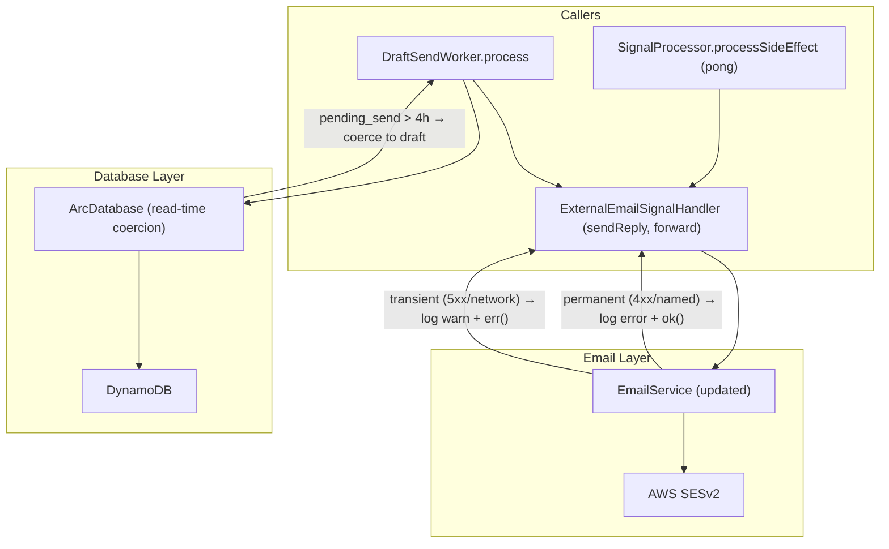

# Design Document

## Overview

Four changes to the email-catcher backend's side-effect processing pipeline:

1. The existing `EmailService` class (`src/email/email-service.ts`) is updated to classify SES errors directly in its `send` and `sendRaw` methods. Permanent failures (MessageRejected, AccountSendingPausedException, 4xx) are logged at `error` level and swallowed (returns `ok({ messageId: "" })`). Transient failures (5xx, network errors) are logged at `warn` level and returned as `err`. Successful sends are logged at `info` level with the messageId. No new class is needed.

2. All side-effect log entries in `processSideEffect` now include the full `Signal`, full `Arc`, the incoming `SideEffectPayload`, and the full error object — replacing the current pattern of partial identifiers like `accountId` alone.

3. `criticalFailure: unknown` becomes `criticalFailures: unknown[]`. On completion, if any failures accumulated, they're wrapped in an `AggregateError` (always, even for a single failure) and returned as a `ProcessorError`.

4. Stale `pending_send` coercion: When reading signals from DynamoDB, if a signal has `status: "pending_send"` and its `sendInitiatedAt` is more than 4 hours ago, the returned status is coerced to `"draft"` at read-time. This eliminates the need for DraftSendWorker to revert status on permanent failures — the signal naturally ages back to "draft".

## Architecture



## Components and Interfaces

### Updated: `src/email/email-service.ts`

The existing `EmailService.send` and `sendRaw` methods change their return type from `Result<{ messageId: string }, DbError>` to `Result<{ messageId: string }, TransientSesError>`. The classification logic moves into the catch block that currently wraps everything in `dbError`:

```ts
export class EmailService {
  constructor(
    private readonly sesv2: SESv2Client,
    private readonly from: string,
    private readonly configSetName: string,
    private readonly logger: Logger,  // NEW: logger injected
  ) {}

  async send(opts: EmailSendOptions): Promise<Result<{ messageId: string }, TransientSesError>> {
    try {
      const result = await this.sesv2.send(new SendEmailCommand({ ... }))
      const messageId = result.MessageId ?? ""
      this.logger.info("SES send succeeded.", { code: "email_service.send_success", messageId })
      return ok({ messageId })
    } catch (e) {
      const error = e as { name?: string; message?: string; $metadata?: { httpStatusCode?: number } }
      const errorName = error.name ?? "UnknownError"
      const errorMessage = error.message ?? "unknown"
      const httpStatus = error.$metadata?.httpStatusCode ?? 0

      const isPermanent =
        errorName === "MessageRejected" ||
        errorName === "AccountSendingPausedException" ||
        (httpStatus >= 400 && httpStatus < 500)

      if (isPermanent) {
        this.logger.error(`SES permanent failure [${errorName}]: ${errorMessage}.`, {
          code: "email_service.permanent_failure",
          errorName,
          httpStatus,
          error: e,
          opts,
        })
        return ok({ messageId: "" })
      }

      // Transient — caller should retry
      this.logger.warn(`SES transient failure [${errorName}]: ${errorMessage}.`, {
        code: "email_service.transient_failure",
        errorName,
        httpStatus,
        error: e,
        opts,
      })
      return err({ kind: "transient_ses_error", errorName, httpStatus, cause: e })
    }
  }
}
```

The constructor now requires a `Logger` parameter. All existing call sites already have `logger` available (handler.ts creates `EmailService` right next to `logger`).

### New type in `src/errors.ts`

```ts
export type TransientSesError = {
  kind: "transient_ses_error"
  errorName: string
  httpStatus: number
  cause: unknown
}
```

### Updated `ReplySender` interface in `processor.ts`

```ts
export interface ReplySender {
  sendReply(opts: {
    to: string
    from: string
    subject: string
    body: string
    inReplyTo: string
    accountId?: string
    signalId?: string
    arcId?: string
  }): Promise<Result<{ messageId: string }, TransientSesError>>
}
```

The return type changes from `Promise<{ messageId: string }>` (throws on error) to `Promise<Result<{ messageId: string }, TransientSesError>>`.

### Updated `ExternalEmailSignalHandler.sendReply`

No longer throws. Returns `Result` by delegating to `EmailService.send` which handles classification internally.

```ts
async sendReply(opts: { ... }): Promise<Result<{ messageId: string }, TransientSesError>> {
  return this.emailService.send({
    to: opts.to,
    fromOverride: opts.from,
    subject: `Re: ${opts.subject}`,
    textBody: opts.body,
    accountId: opts.accountId ?? "",
    headers: [
      { Name: "In-Reply-To", Value: opts.inReplyTo },
      { Name: "References", Value: opts.inReplyTo },
    ],
    tags: buildOutboundTags("reply", { accountId: opts.accountId, signalId: opts.signalId, arcId: opts.arcId }),
  })
}
```

### Updated `processSideEffect` critical failure accumulation

```ts
async processSideEffect(payload: SideEffectPayload, receiveCount = 1): Promise<Result<void, ProcessorError>> {
  const { signal, arc: payloadArc } = payload
  const criticalFailures: unknown[] = []

  // ... each critical side-effect appends:
  // criticalFailures.push(error)

  if (criticalFailures.length > 0) {
    const count = criticalFailures.length
    const message = `${count} critical side-effect failure${count > 1 ? "s" : ""}`
    return err(processorError(new AggregateError(criticalFailures, message)))
  }
  return ok(undefined)
}
```

### Updated `DraftSendWorker.process`

Remove the entire try/catch with inline SES error classification. The worker no longer needs to handle permanent failures — `EmailService` absorbs them. The signal stays in `pending_send` and ages back to `draft` via read-time coercion.

```ts
const result = await this.replySender.sendReply({ ... })
if (result.isErr()) {
  // Transient — let SQS retry
  return err(result.error)
}
// Success — mark as sent
const { messageId } = result.value
const now = DateTime.utc().toISO()!
await this.store.updateSignalSendStatus(accountId, signal.signalLookupId, {
  status: "sent",
  sentAt: now,
  sesMessageId: messageId,
})
```

The worker's return type changes from `Result<void, DbError>` to `Result<void, DbError | TransientSesError>`.

### New: Stale `pending_send` coercion in `src/database/arc-database.ts`

A helper function applied to every signal read:

```ts
const PENDING_SEND_STALE_HOURS = 4

function coerceStaleStatus(signal: Signal): Signal {
  if (signal.status !== "pending_send") return signal
  const sendInitiatedAt = signal.data.sendInitiatedAt
  if (!sendInitiatedAt) return { ...signal, status: "draft" }
  const elapsed = DateTime.utc().diff(DateTime.fromISO(sendInitiatedAt), "hours").hours
  if (elapsed > PENDING_SEND_STALE_HOURS) return { ...signal, status: "draft" }
  return signal
}
```

Applied in `getSignalById` and `getSignalByMessageId` before returning the result. The DynamoDB record is not mutated — coercion is read-time only.

## Data Models

### TransientSesError

| Field | Type | Purpose |
|-------|------|---------|
| `kind` | `"transient_ses_error"` | Discriminant for pattern matching |
| `errorName` | `string` | SES error class name (e.g. `"ServiceUnavailable"`) |
| `httpStatus` | `number` | HTTP status code from `$metadata` (0 if unavailable) |
| `cause` | `unknown` | The original thrown error object |

### AggregateError shape returned in ProcessorError

```ts
ProcessorError {
  kind: "processor_error"
  message: "2 critical side-effect failures"
  cause: AggregateError {
    message: "2 critical side-effect failures"
    errors: [Error, Error]  // individual failures in order
  }
}
```

## Error Handling — Classification Table

| Error condition | Classification | EmailService behavior |
|----------------|---------------|---------------------|
| `error.name === "MessageRejected"` | Permanent | Log error (with opts), return `ok({ messageId: "" })` |
| `error.name === "AccountSendingPausedException"` | Permanent | Log error (with opts), return `ok({ messageId: "" })` |
| `httpStatus >= 400 && < 500` | Permanent | Log error (with opts), return `ok({ messageId: "" })` |
| `httpStatus >= 500 && < 600` | Transient | Log warn (with opts), return `err(TransientSesError)` |
| No `$metadata.httpStatusCode` | Transient | Log warn (with opts), return `err(TransientSesError)` |
| Success | — | Log info (with messageId only), return `ok({ messageId })` |

**Priority**: Named error check (MessageRejected, AccountSendingPausedException) runs before HTTP status range check. A 400 with name "MessageRejected" is classified by name, not by status.

## Logging Strategy

### EmailService logging

- **Success**: `logger.info` with `messageId` only
- **Permanent error**: `logger.error` with `errorName`, `httpStatus`, full `error`, and `opts`
- **Transient error**: `logger.warn` with `errorName`, `httpStatus`, full `error`, and `opts`

EmailService does NOT include signal/arc/payload — that's the caller's responsibility per the "callers always log" skill rule.

### processSideEffect logging

Every `logger.track`, `logger.warn`, `logger.error`, or `logger.critical` call within `processSideEffect` includes:

```ts
{
  code: "processor.side_effect.<specific_code>",
  signal,          // full Signal object
  arc,             // full Arc object
  payload,         // full SideEffectPayload (the incoming SQS message body)
  error,           // full error object (when applicable)
  toAddress,       // (forward-specific)
}
```

This replaces the current pattern of `{ accountId, error: e }` which loses traceability.

## Testing Strategy

### `email-service.test.ts`

- **Permanent errors swallowed**: Mock SESv2Client to throw `MessageRejected` error → assert `EmailService.send` returns `ok({ messageId: "" })` and logger.error was called with `opts` in metadata.
- **Transient errors propagated**: Mock throwing `ServiceUnavailable` with 500 status → assert returns `err` with `kind: "transient_ses_error"` and logger.warn was called with `opts` in metadata.
- **Network error (no status)**: Mock throwing `new Error("ECONNRESET")` → assert returns `err` with `httpStatus: 0`.
- **Named error priority over status**: Error with `name: "MessageRejected"` and `$metadata.httpStatusCode: 400` → classified as permanent (by name, not status).
- **Success logs messageId**: Mock returning `{ MessageId: "ses-123" }` → assert returns `ok({ messageId: "ses-123" })` and logger.info was called with `messageId`.

### `processor.processSideEffect` tests

- **Multiple critical failures accumulated**: Mock both forward and pong to fail → assert returned `ProcessorError.cause` is `AggregateError` with `errors.length === 2`.
- **Single failure still wrapped in AggregateError**: One failure → `AggregateError.errors.length === 1`.
- **Zero failures → ok**: All side-effects succeed → returns `ok(undefined)`.
- **Log context includes full objects**: After any failure, assert logger calls contain `signal`, `arc`, `payload` keys with the full objects (not just IDs).

### `draft-send-worker.test.ts`

- **Transient failure returns err for SQS retry**: `replySender.sendReply` returns `err(transientSesError)` → assert worker returns `err`.
- **Success marks signal as sent**: `replySender.sendReply` returns `ok({ messageId: "ses-123" })` → assert `updateSignalSendStatus` called with `status: "sent"`.
- **Existing tests adapted**: Current tests that mock `sendReply` throwing need to be updated to mock it returning Result types. Remove tests for permanent-failure revert-to-draft (no longer worker's responsibility).

### `arc-database.coerceStaleStatus.test.ts`

- **pending_send within 4 hours**: Signal with `sendInitiatedAt` 2 hours ago → status remains `"pending_send"`.
- **pending_send older than 4 hours**: Signal with `sendInitiatedAt` 5 hours ago → status coerced to `"draft"`.
- **pending_send with no sendInitiatedAt**: Signal missing the field → status coerced to `"draft"`.
- **Non-pending_send statuses unaffected**: Signal with `status: "active"` → no change regardless of timestamps.
- **Coercion does not mutate original record**: Verify returned signal is a new object, original unchanged.
