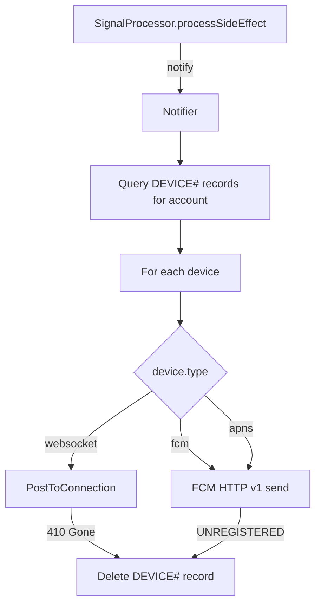

# Design Document: Rework Notifier

## Overview

The reworked Notifier replaces the existing `SesNotifier` with a unified device-based notification dispatcher. The current implementation only pushes auth OTP codes over WebSocket. The new implementation:

1. Removes the SES email notification path entirely (sending an email about an email is circular)
2. Unifies all notification targets (WebSocket connections, FCM tokens, APNs tokens) under a single `DEVICE#` model
3. Delivers to all registered devices in a single loop, dispatching by device type
4. Uses ArcUrgency to derive PushPriority, controlling sound, badge, and channel suppression

The Notifier remains a required dependency of `SignalProcessor` — no optional markers, no null checks. It accepts urgency as an explicit parameter and returns `Result<void, DbError>`.

## Architecture



The Notifier is invoked from `processSideEffect` (the SQS-dispatched side-effect handler). It queries all `DEVICE#` records for the account, then iterates them in a single loop. Each device's `type` field determines the delivery mechanism. Individual device failures are logged and do not fail the overall `notify` call unless all devices fail.

### Key Design Decisions

1. **No SES path** — The email notification channel is removed. SES usage in `SesForwarder`, `SesReplySender`, and the verification mailer is unaffected.

2. **Unified DEVICE# model** — WebSocket connections and mobile push tokens are both stored as `DEVICE#` records. The `type` field (`websocket`, `fcm`, `apns`) determines delivery strategy. This eliminates the need for separate "channels" — there's one query, one loop, one cleanup path.

3. **Urgency as explicit parameter** — The `notify` method signature gains an `urgency: ArcUrgency` parameter. The processor already has urgency on the arc; passing it explicitly avoids coupling the notifier to arc internals.

4. **Single-loop fan-out with partial failure tolerance** — Each device delivery is independent. A WebSocket failure does not prevent push delivery and vice versa. Only total failure (all devices fail) returns `Err`.

5. **FCM HTTP v1 API** — Uses OAuth2 service account credentials (Google Application Default Credentials via a service account JSON). The legacy FCM API is deprecated. FCM v1 requires a project-scoped endpoint and OAuth2 bearer token.

6. **Type-driven priority suppression** — When PushPriority is `silent`, mobile devices (`fcm`/`apns`) are skipped in the loop. WebSocket devices always receive delivery regardless of priority (the browser UI always wants real-time updates).

7. **API Gateway Management API for WebSocket** — Uses `@aws-sdk/client-apigatewaymanagementapi` `PostToConnectionCommand` for proper error typing and 410 detection.

## Components and Interfaces

### Notifier Interface (updated)

```typescript
export interface Notifier {
  notify(accountId: string, arc: Arc, signal: Signal, urgency: ArcUrgency): Promise<Result<void, DbError>>;
  notifyBlocked(accountId: string, signal: Signal): Promise<Result<void, DbError>>;
}
```

### DeviceNotifier (new implementation)

```typescript
export class DeviceNotifier implements Notifier {
  constructor(opts: {
    deviceStore: DeviceStore;
    deliverers: Record<DeviceType, Deliverer>;
    logger: Logger;
  });

  async notify(accountId: string, arc: Arc, signal: Signal, urgency: ArcUrgency): Promise<Result<void, DbError>>;
  async notifyBlocked(accountId: string, signal: Signal): Promise<Result<void, DbError>>;
}
```

The `notify` method:
1. Queries all `DEVICE#` records for the account
2. Derives `PushPriority` from urgency
3. Iterates devices — skips `fcm`/`apns` devices when priority is `silent`
4. Dispatches to the appropriate `Deliverer` by `device.type`
5. Deletes stale devices (410 / UNREGISTERED)
6. Returns `Ok` if at least one delivery succeeded (or no devices exist), `Err` only on total failure

### Deliverer Interface

Each device type has a deliverer that knows how to send to that specific transport.

```typescript
export type DeviceType = "websocket" | "fcm" | "apns";

export interface Deliverer {
  deliver(device: Device, payload: NotificationPayload, priority: PushPriority): Promise<DeliveryResult>;
}

export type DeliveryResult =
  | { status: "delivered" }
  | { status: "stale" }       // device should be deleted (410, UNREGISTERED)
  | { status: "failed"; reason: string };

export interface NotificationPayload {
  type: "signal";
  signalId: string;
  arcId: string;
  sender: string;
  senderName: string;
  subject: string;
  workflow: string;
  urgency: ArcUrgency;
}
```

### DeviceStore

Unified storage for all device types.

```typescript
export interface DeviceStore {
  listDevices(accountId: string): Promise<Result<Device[], DbError>>;
  saveDevice(device: Device): Promise<Result<void, DbError>>;
  deleteDevice(accountId: string, token: string): Promise<Result<void, DbError>>;
  countDevices(accountId: string): Promise<Result<number, DbError>>;
}

export interface Device {
  accountId: string;
  token: string;            // connectionId for websocket, FCM/APNs token for mobile
  type: DeviceType;
  createdAt: string;
  updatedAt: string;
  ttl?: number;             // TTL for websocket connections (auto-expire)
}
```

### WsDeliverer

```typescript
export class WsDeliverer implements Deliverer {
  constructor(private readonly apigw: ApiGatewayManagementApiClient);

  async deliver(device: Device, payload: NotificationPayload, _priority: PushPriority): Promise<DeliveryResult>;
}
```

Posts JSON payload to the connection via `PostToConnectionCommand`. Returns `"stale"` on 410 GoneException.

### FcmDeliverer

```typescript
export class FcmDeliverer implements Deliverer {
  constructor(private readonly fcmClient: FcmClient);

  async deliver(device: Device, payload: NotificationPayload, priority: PushPriority): Promise<DeliveryResult>;
}
```

Builds the FCM message with platform-specific priority/sound/badge fields based on `PushPriority`. Returns `"stale"` on UNREGISTERED.

### FcmClient

Thin wrapper around the FCM HTTP v1 API.

```typescript
export interface FcmClient {
  send(message: FcmMessage): Promise<FcmSendResult>;
}

export interface FcmMessage {
  token: string;
  notification?: { title: string; body: string };
  data: Record<string, string>;
  android: { priority: "high" | "normal"; notification?: { sound: string; channelId: string } };
  apns: { headers: { "apns-priority": "10" | "5" }; payload: { aps: { sound?: string; badge?: number; "content-available"?: number } } };
}

export type FcmSendResult =
  | { ok: true; messageId: string }
  | { ok: false; error: "UNREGISTERED" | "QUOTA_EXCEEDED" | "UNAVAILABLE" | "INTERNAL" | "INVALID_ARGUMENT"; detail?: string };
```

## Data Models

### Device (DynamoDB — ACCOUNTS_TABLE)

All notification targets — WebSocket connections, FCM tokens, APNs tokens — are stored as `DEVICE#` records.

| Field | Type | Description |
|-------|------|-------------|
| pk | string | `ACCT#{accountId}` |
| sk | string | `DEVICE#{token}` |
| accountId | string | Account ID |
| token | string | connectionId (WS) or FCM/APNs token |
| type | string | `"websocket"`, `"fcm"`, or `"apns"` |
| createdAt | string | ISO 8601 timestamp |
| updatedAt | string | ISO 8601 timestamp |
| ttl | number? | DynamoDB TTL epoch (set for websocket, ~2h) |

**Access patterns:**
- List all devices for account: `pk = ACCT#{accountId} AND begins_with(sk, "DEVICE#")`
- Delete specific device: `pk = ACCT#{accountId}, sk = DEVICE#{token}`
- Upsert (PutCommand with same key replaces): natural idempotency

**Limit enforcement:** Query + count before insert; reject if mobile device count >= 10. WebSocket devices are exempt from the limit (they're ephemeral, TTL-managed).

**Migration:** Existing `CONN#` WebSocket records are replaced by `DEVICE#` records with `type: "websocket"`. The handler's `$connect`/`$disconnect` routes write `DEVICE#` records instead of `CONN#` records.

### WebSocket Notification Payload

```json
{
  "type": "signal",
  "signalId": "SES#abc123",
  "arcId": "arc-uuid",
  "sender": "alice@example.com",
  "subject": "Your order has shipped",
  "workflow": "package",
  "urgency": "normal"
}
```

### FCM Push Payload

```json
{
  "message": {
    "token": "device-token-value",
    "notification": {
      "title": "alice@example.com",
      "body": "Your order has shipped"
    },
    "data": {
      "signalId": "SES#abc123",
      "arcId": "arc-uuid",
      "senderName": "alice@example.com",
      "subject": "Your order has shipped",
      "workflow": "package"
    },
    "android": {
      "priority": "normal",
      "notification": {
        "channelId": "ambient"
      }
    },
    "apns": {
      "headers": { "apns-priority": "5" },
      "payload": {
        "aps": { "badge": 1 }
      }
    }
  }
}
```

For `interrupt` priority, `android.priority` becomes `"high"`, `android.notification.sound` is set to `"default"`, `apns-priority` becomes `"10"`, and `aps.sound` is set to `"default"`.

## Correctness Properties

*A property is a characteristic or behavior that should hold true across all valid executions of a system — essentially, a formal statement about what the system should do. Properties serve as the bridge between human-readable specifications and machine-verifiable correctness guarantees.*

### Property 1: Channel selection by urgency

*For any* ArcUrgency value, the Notifier SHALL invoke the WebSocket channel, and SHALL invoke the push channel if and only if `urgencyToPushPriority(urgency)` is not `"silent"`.

**Validates: Requirements 1.3, 4.2, 4.3, 4.4, 4.5**

### Property 2: Delivery attempts all devices and tolerates partial failure

*For any* set of registered devices (including empty) and any pattern of per-device failures (410, UNREGISTERED, 5xx, timeout), the Notifier SHALL attempt delivery to every eligible device in the set, SHALL delete devices that return stale status (410 or UNREGISTERED), and SHALL return `Ok` regardless of individual failures (unless all fail).

**Validates: Requirements 2.1, 2.3, 2.4, 2.5, 3.1, 3.4, 3.5**

### Property 3: Notification payload completeness

*For any* valid Signal and Arc, the notification payload SHALL contain the fields: type="signal", signalId, arcId, sender address, senderName, subject, workflow, and urgency.

**Validates: Requirements 2.2, 3.3**

### Property 4: Stale device cleanup

*For any* device that returns a stale delivery result (WebSocket 410 or FCM UNREGISTERED), the Notifier SHALL delete that device's `DEVICE#` record from DynamoDB.

**Validates: Requirements 2.3, 3.4**

### Property 5: Push priority fields match PushPriority

*For any* ArcUrgency that maps to `interrupt`, the FCM message SHALL have high priority, sound enabled, and badge increment. *For any* ArcUrgency that maps to `ambient`, the FCM message SHALL have normal priority, no sound, and badge increment only.

**Validates: Requirements 3.2, 4.3, 4.4**

### Property 6: Overall notify result reflects delivery outcomes

*For any* combination of device delivery results where at least one device succeeds, `notify` SHALL return `Ok`. *For any* combination where all devices fail, `notify` SHALL return `Err`.

**Validates: Requirements 5.4, 5.5**

### Property 7: Device round-trip preserves data

*For any* valid Device (non-empty token, type in {websocket, fcm, apns}), saving the device and then listing devices for the account SHALL return a record containing the same token value and type.

**Validates: Requirements 6.1, 6.2**

### Property 8: Device upsert idempotency

*For any* valid Device saved N times (N ≥ 1) to the same account, listing devices SHALL return exactly one record for that token value, with the type and timestamp from the most recent save.

**Validates: Requirements 6.3, 6.5**

### Property 9: Mobile device count invariant

*For any* sequence of save operations on an account, the number of distinct mobile devices (fcm + apns) stored SHALL never exceed 10. WebSocket devices are exempt from this limit.

**Validates: Requirements 6.3, 6.7**

### Property 10: Device validation rejects invalid input

*For any* token value that is empty or whitespace-only, or *for any* type value not in {"websocket", "fcm", "apns"}, the registration SHALL return a validation error and the device store SHALL remain unchanged.

**Validates: Requirements 6.6**

## Error Handling

| Scenario | Behaviour |
|----------|-----------|
| WS device returns 410 (GoneException) | Delete `DEVICE#` record, continue to next device |
| WS device returns 5xx/timeout | Log warning, continue to next device |
| WS endpoint env var missing | Skip websocket devices entirely (log once at startup) |
| FCM returns UNREGISTERED | Delete `DEVICE#` record, continue to next device |
| FCM returns QUOTA_EXCEEDED | Log error, continue to next device |
| FCM returns UNAVAILABLE/INTERNAL | Log warning, continue to next device |
| FCM OAuth2 token refresh fails | Log error, skip fcm/apns devices for this invocation |
| All device deliveries fail | Return `Err(DbError)` with "total delivery failure" |
| At least one delivery succeeds | Return `Ok(undefined)` |
| No devices registered for account | Return `Ok(undefined)` — nothing to deliver to is not a failure |
| DynamoDB query for devices fails | Return `Err(DbError)` — cannot determine delivery targets |

## Testing Strategy

### Property-Based Tests (fast-check, minimum 100 iterations each)

The following properties are tested using `fast-check` with generated inputs:

1. **Device type selection by urgency** — Generate random `ArcUrgency` values and device lists; verify websocket devices always attempted, fcm/apns skipped when silent.
2. **Fan-out + partial failure** — Generate random device lists with random failure modes; verify all eligible attempted, stale devices cleaned up, result is Ok.
3. **Payload structure** — Generate random Signal/Arc pairs; verify payload shape.
4. **Stale device cleanup** — Generate devices with stale delivery results; verify deletion called.
5. **Push priority mapping** — Generate random urgencies; verify FCM message priority/sound/badge fields.
6. **Overall result** — Generate random delivery outcome combinations; verify Ok/Err logic.
7. **Device round-trip** — Generate random devices; save then list; verify preservation.
8. **Device upsert** — Generate random devices; save multiple times; verify single record.
9. **Mobile device count invariant** — Generate random save sequences; verify mobile count ≤ 10.
10. **Device validation** — Generate invalid tokens/types; verify rejection.

Each property test is tagged: `Feature: rework-notifier, Property {N}: {title}`

### Unit Tests (vitest, example-based)

- Verify SES is never called from the notifier (Requirement 1.1)
- Verify `notifyBlocked` is a no-op that returns Ok
- Verify the processor passes `"normal"` urgency when `arc.urgency` is undefined (Requirement 4.6)
- Verify the 11th distinct mobile device is rejected with a limit error (Requirement 6.7)
- Verify empty device list returns Ok with 0 delivered
- Verify websocket devices are always delivered to regardless of priority

### Integration Tests

- End-to-end WebSocket delivery via API Gateway Management API (localstack or real)
- FCM HTTP v1 API call with valid service account credentials (staging project)

### Library Choices

- **Property-based testing**: `fast-check` (already in devDependencies)
- **Test runner**: `vitest` (already configured)
- **Mocking**: `vitest` built-in mocks for Deliverer interface
- **FCM client**: Custom thin wrapper using `fetch` + Google Auth Library for OAuth2 token

