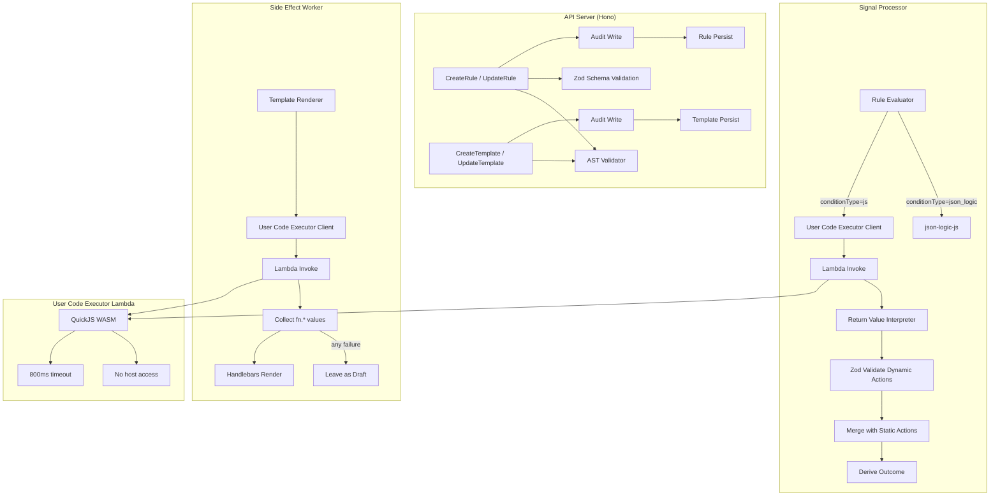

# Design Document: Rule Code Field

## Overview

This feature adds user-authored JavaScript as a rule condition mechanism and as template helper functions. It extends the existing rule evaluation pipeline with a `conditionType` discriminator, enabling users to write JS functions that run in the existing QuickJS WASM sandbox (`user_code_executor` Lambda). Template functions produce string values available as `fn.*` in Handlebars rendering.

The design preserves full backward compatibility — existing JSONLogic rules continue working unchanged. New JS rules gain dynamic action capabilities: the function's return value can include `RuleAction` objects that merge with the rule's static actions.

Key architectural decisions:
- **AST validation at write time** prevents structurally unsafe code from being stored
- **Zod validation at runtime** ensures dynamic actions conform to the `RuleAction` schema
- **Best-effort semantics** — invalid individual actions are discarded (not fatal), template function failures leave emails as drafts
- **System signals** notify users of runtime issues without blocking processing
- **Audit-first writes** — audit events are written before resource mutations (no transactions)

## Architecture



## Components and Interfaces

### AST Validator (`src/api/ast-validator.ts`)

New module responsible for parsing and validating user-submitted JavaScript at API write time.

```typescript
export interface AstValidationResult {
  valid: true;
} | {
  valid: false;
  error: string;
  location?: { line: number; column: number };
}

export function validateCodeAst(code: string): AstValidationResult;
```

Uses `acorn` (already a transitive dependency via other tools) to parse the code into an ESTree AST, then walks the tree checking for disallowed nodes.

**Allowed constructs:** ArrowFunctionExpression, FunctionExpression, ConditionalExpression, LogicalExpression, MemberExpression (on `signal`/`arc` params), CallExpression (string/array/object methods), TemplateLiteral, ObjectExpression, ArrayExpression, VariableDeclaration (const/let), IfStatement, BlockStatement, ReturnStatement, UnaryExpression, BinaryExpression, SpreadElement, AssignmentPattern (destructuring).

**Rejected constructs:** CallExpression where callee is `eval` or `Function`, ImportExpression, CallExpression where callee is `require`, MemberExpression on `globalThis`/`process`/`Deno`/`Bun`, WhileStatement/ForStatement/DoWhileStatement without a bounded iteration guard (a numeric literal upper bound in the condition or a `break` within a fixed iteration count).

**Structural requirement:** The top-level expression must be an ArrowFunctionExpression or FunctionExpression. Statements, class declarations, and other expression types are rejected.

### Return Value Interpreter (`src/processor/interpret-rule-result.ts`)

New module that interprets the raw result from user code execution and produces a structured evaluation result.

```typescript
import { z } from "zod";
import type { RuleAction } from "../types/index.js";

export const RuleActionSchema = z.object({
  type: z.enum(RULE_ACTION_TYPES),
  value: z.string().optional(),
  disabled: z.boolean().optional(),
});

export interface RuleEvalResult {
  matched: boolean;
  dynamicActions: RuleAction[];
  warnings: string[];  // validation issues for logging/signals
}

export function interpretRuleResult(raw: unknown): RuleEvalResult;
```

Logic:
1. `null` / `undefined` → `{ matched: false, dynamicActions: [], warnings: [] }`
2. Object with `type` matching `RULE_ACTION_TYPES` → validate with Zod → `{ matched: true, dynamicActions: [action], warnings }`
3. Array → validate each element with Zod → `{ matched: true, dynamicActions: validOnes, warnings }`
4. Any other truthy value → `{ matched: true, dynamicActions: [], warnings: [] }`

### Updated Rule Evaluator (`src/processor/rule-evaluator.ts`)

The existing `JsonLogicRuleEvaluator.evaluate()` method signature changes from `Promise<boolean>` to `Promise<RuleEvalResult>` (or the `RuleEvaluator` interface is extended). The `applyRules` function in `processor.ts` merges dynamic actions with static actions before calling `deriveOutcome`.

Actually — to minimize interface churn, the evaluator returns a richer result only for JS rules. The processor's `applyRules` function is updated to handle the new return shape.

### Updated API Request Schemas (`src/api/requests.ts`)

```typescript
// Rule — extended
export const CreateRuleRequest = z.object({
  name: z.string(),
  conditionType: z.enum(["json_logic", "js"]).optional(),
  condition: z.string().max(10_240).optional(),
  code: z.string().max(10_240).optional(),
  actions: z.array(RuleActionSchema).min(1),
  priorityOrder: z.number().int().min(0).optional(),
  status: RuleStatus.optional(),
  tags: z.record(z.string(), z.string()).optional(),
});

// Template — extended
const TemplateFunctionSchema = z.object({
  name: z.string().regex(/^[a-zA-Z_$][a-zA-Z0-9_$]*$/),
  code: z.string().max(10_240),
});

export const CreateTemplateRequest = z.object({
  name: z.string().min(1),
  subject: z.string(),
  body: z.string(),
  functions: z.array(TemplateFunctionSchema).optional(),
});
```

### Context Preparation (`src/processor/rule-evaluator.ts`)

The existing `stripSensitive` function is refined to produce exactly the fields specified in the requirements:

**Signal context:** `id`, `from` (object with `address` and optional `name`), `subject`, `summary`, `spamScore`, `workflow`, `recipientAddress`, `workflowData`

**Arc context:** `id`, `labels`, `urgency`, `summary`, `workflow`, `status`

### System Signal Creator

A new helper that writes a system signal to DynamoDB when user code produces invalid output:

```typescript
export interface SystemSignalCreator {
  createInvalidOutputSignal(opts: {
    accountId: string;
    resourceType: "rule" | "template";
    resourceName: string;
    functionName?: string;
    issue: string;
  }): Promise<void>;
}
```

### Audit Integration

The existing `AuditDatabase.saveAuditEvent` is called before the resource write. The `changes` object contains `{ before: previousCode, after: newCode }` for rule code changes, or `{ before: previousFunctions, after: newFunctions }` for template function changes.

Write ordering: audit write → resource write. If audit fails, log at WARN and proceed with resource write (best-effort audit).

## Data Models

### Rule (DynamoDB — extended fields)

| Field | Type | Description |
|-------|------|-------------|
| `conditionType` | `"json_logic" \| "js"` | Discriminator. Absent = `"json_logic"` |
| `code` | `string` | JS function body. Present only when `conditionType = "js"` |
| `lastError` | `string` | Error annotation from last failed execution |

### EmailTemplate (DynamoDB — extended fields)

| Field | Type | Description |
|-------|------|-------------|
| `functions` | `TemplateFunction[]` | Array of named JS functions |

### TemplateFunction (embedded in EmailTemplate)

| Field | Type | Description |
|-------|------|-------------|
| `name` | `string` | Valid JS identifier, used as `fn.{name}` in Handlebars |
| `code` | `string` | Arrow/function expression body |
| `lastError` | `string?` | Error annotation from last failed execution |

### AuditEvent (DynamoDB — existing table, new `changes` shape)

For code changes, the `before`/`after` fields contain:
- Rule: `{ conditionType, code }` (the code-relevant fields)
- Template: `{ functions: TemplateFunction[] }` (the full functions array)

### RuleEvalResult (in-memory, not persisted)

```typescript
interface RuleEvalResult {
  matched: boolean;
  dynamicActions: RuleAction[];
  warnings: string[];
}
```

## Correctness Properties

*A property is a characteristic or behavior that should hold true across all valid executions of a system — essentially, a formal statement about what the system should do. Properties serve as the bridge between human-readable specifications and machine-verifiable correctness guarantees.*

**Note:** Per project testing rules, property-based testing (fast-check, random generation) is not used in this codebase. The properties below are implemented as parameterised `it.each` tests over finite sets of meaningfully different inputs — not as randomised PBT.

### Property 1: AST validator accept/reject correctness

*For any* JavaScript source string, the AST validator SHALL accept it if and only if (a) it parses without syntax errors, (b) the top-level expression is an ArrowFunctionExpression or FunctionExpression, and (c) the AST contains no disallowed nodes (eval, Function constructor, import, require, global object access, unbounded loops). All allowed constructs (conditionals, logical operators, property access on signal/arc, string/array/object methods, template literals, destructuring, const/let, if/else) SHALL be accepted when wrapped in a valid function expression.

**Validates: Requirements 3.2, 3.4, 3.5, 3.6**

### Property 2: Context preparation produces exactly the specified fields with sensitive data excluded

*For any* Signal and Arc, the context preparation function SHALL produce a signal object containing exactly `{id, from, subject, summary, spamScore, workflow, recipientAddress, workflowData}` and an arc object containing exactly `{id, labels, urgency, summary, workflow, status}`. Sensitive fields (`s3Key`, `embeddings`, `headers`) SHALL never appear in the output regardless of their presence on the input Signal.

**Validates: Requirements 4.1, 4.2, 4.4**

### Property 3: Return value interpreter correctly classifies all result types

*For any* value returned by user code: null/undefined → non-matching with no dynamic actions; a valid RuleAction object → matching with that action appended; an array → matching with only Zod-valid elements kept (invalid ones discarded with warnings); any other truthy value → matching with no dynamic actions. Invalid elements in arrays SHALL produce warnings but SHALL NOT prevent the rule from matching.

**Validates: Requirements 5.1, 5.2, 5.3, 5.4, 5.5**

### Property 4: JavaScript identifier validation

*For any* string, the template function name validator SHALL accept it if and only if it matches `/^[a-zA-Z_$][a-zA-Z0-9_$]*$/`.

**Validates: Requirements 7.2**

### Property 5: Template function results map to fn.{name} in rendering context

*For any* template function with a valid name that returns a string value from the sandbox, the Handlebars rendering context SHALL contain a key `fn.{name}` equal to that string value, making it available for interpolation in subject and body templates.

**Validates: Requirements 8.3**

### Property 6: Any template function failure prevents auto-send

*For any* template with functions where at least one function returns a non-string value, returns null, or errors during execution (timeout, runtime error, sandbox violation), the resulting email signal SHALL have status `"draft"` (auto-send prevented) and the failed function's value SHALL be substituted with an empty string.

**Validates: Requirements 9.1, 9.5**

## Error Handling

### Rule Code Errors

| Error Source | Behavior | Logging | User Notification |
|---|---|---|---|
| AST validation failure (write time) | 400 response with error + location | None (client error) | Inline API error |
| Code size > 10KB (write time) | 400 response | None | Inline API error |
| Sandbox timeout (runtime) | Rule treated as non-matching | WARN: rule ID, account, error | `lastError` annotated |
| Runtime error (runtime) | Rule treated as non-matching | WARN: rule ID, account, error | `lastError` annotated |
| Invalid dynamic action (runtime) | Action discarded, rule still matches | WARN: rule ID, validation issue | System signal created |

### Template Function Errors

| Error Source | Behavior | Logging | User Notification |
|---|---|---|---|
| AST validation failure (write time) | 400 response with error + location | None | Inline API error |
| Function code size > 10KB (write time) | 400 response | None | Inline API error |
| Sandbox timeout (runtime) | Empty string substituted, email left as draft | WARN: template, function, error | `lastError` annotated + system signal |
| Runtime error (runtime) | Empty string substituted, email left as draft | WARN: template, function, error | `lastError` annotated + system signal |
| Non-string return (runtime) | Empty string substituted, email left as draft | WARN: template, function, type | `lastError` annotated + system signal |

### Audit Write Failures

Audit writes are best-effort. If the DynamoDB put fails:
- Log at WARN level with the audit event details
- Proceed with the resource write (do not block the user operation)

## Testing Strategy

### Unit Tests (Vitest — static expectations)

Each component gets focused unit tests with explicit inputs and expected outputs. Correctness properties are implemented as `it.each` tables over finite sets of meaningfully different inputs.

**Property → Test Mapping:**

| Property | Test File | Strategy |
|----------|-----------|----------|
| P1: AST accept/reject | `ast-validator.spec.ts` | `it.each` table: one case per allowed construct (accepted), one per disallowed construct (rejected), structural rejections |
| P2: Context fields | `rule-evaluator.spec.ts` | `it.each` table: full Signal → exactly specified fields; full Arc → exactly specified fields; sensitive fields absent |
| P3: Return value interpreter | `interpret-rule-result.spec.ts` | `it.each` table: null, undefined, valid action, array (all valid), array (mixed), truthy non-action values |
| P4: Identifier validation | `requests.spec.ts` or `ast-validator.spec.ts` | `it.each` table: valid identifiers vs invalid strings |
| P5: fn.{name} mapping | `template-renderer.spec.ts` | `it.each` table: different function names + return values → verify context keys |
| P6: Failure → draft | `template-renderer.spec.ts` | `it.each` table: non-string return, null return, timeout, runtime error → all produce draft status |

**Component Tests:**

1. **AST Validator** (`tests/api/ast-validator.spec.ts`):
   - Allowed constructs: arrow function, function expression, conditionals, logical ops, property access, string methods, template literals, destructuring, const/let, if/else
   - Rejected constructs: eval, Function constructor, import expression, require call, globalThis/process/Deno/Bun access, unbounded while/for/do loops
   - Structural: class declaration rejected, bare statement rejected, assignment expression rejected
   - Syntax errors: malformed code → error with line/column location

2. **Return Value Interpreter** (`tests/processor/interpret-rule-result.spec.ts`):
   - null → `{ matched: false, dynamicActions: [], warnings: [] }`
   - undefined → `{ matched: false, dynamicActions: [], warnings: [] }`
   - Valid RuleAction `{ type: "archive" }` → `{ matched: true, dynamicActions: [action], warnings: [] }`
   - Array of valid RuleActions → `{ matched: true, dynamicActions: [...], warnings: [] }`
   - Array with invalid element → valid kept, invalid discarded, warning generated
   - `true` → `{ matched: true, dynamicActions: [], warnings: [] }`
   - `"hello"` → `{ matched: true, dynamicActions: [], warnings: [] }`
   - `{ random: "object" }` (no `type` field) → `{ matched: true, dynamicActions: [], warnings: [] }`
   - Empty array `[]` → `{ matched: true, dynamicActions: [], warnings: [] }`

3. **Context Preparation** (`tests/processor/rule-evaluator.spec.ts`):
   - Full Signal → stripped contains exactly: id, from, subject, summary, spamScore, workflow, recipientAddress, workflowData
   - Signal with s3Key, embeddings, headers → none present in output
   - Full Arc → stripped contains exactly: id, labels, urgency, summary, workflow, status

4. **Rule Evaluator (JS path)** (`tests/processor/rule-evaluator.spec.ts`):
   - Mocked executor returns success → evaluator returns RuleEvalResult
   - Mocked executor returns error (timeout) → non-matching, lastError annotated, WARN logged
   - Mocked executor returns error (runtime_error) → same behavior
   - Dynamic actions with validation failure → system signal created

5. **Template Renderer** (`tests/processor/template-renderer.spec.ts`):
   - All functions succeed → fn.* values in context, auto-send proceeds
   - One function returns null → draft status, empty string substituted
   - One function errors → draft status, empty string substituted, lastError annotated
   - Non-string return → draft status, system signal created

6. **API Route Tests** (`tests/api/api.spec.ts` — extended):
   - POST /rules with conditionType="js" + valid code → 201, AST validated
   - POST /rules with conditionType="js" + no code → 400
   - POST /rules with code > 10KB → 400
   - POST /rules with invalid AST → 400 with error location
   - PATCH /rules clears lastError when code changes
   - POST /templates with functions → 201, each function AST validated
   - POST /templates with invalid function name → 400
   - Audit event written before resource persist (mock call ordering)
   - Audit failure doesn't block resource write

7. **Backward Compatibility** (`tests/api/api.spec.ts` + `tests/processor/rule-evaluator.spec.ts`):
   - Rules without conditionType → json_logic evaluation unchanged
   - Templates without functions → existing rendering unchanged
   - CreateRule without conditionType → succeeds (optional field)

### Integration Tests

- End-to-end rule evaluation: create JS rule → invoke processor → verify dynamic actions merged with static actions in outcome
- End-to-end template rendering: create template with functions → trigger auto_draft → verify fn.* values in rendered subject/body
- Audit trail: create/update JS rule → query audit table → verify event with before/after code

### Test Configuration

- All tests use Vitest with static, deterministic inputs
- No random generation or property-based testing libraries
- Parameterised tests use `it.each` with labelled cases explaining why each input is distinct
- Mocks for: LambdaClient (user code executor), DynamoDB (audit store, rule store), Logger
