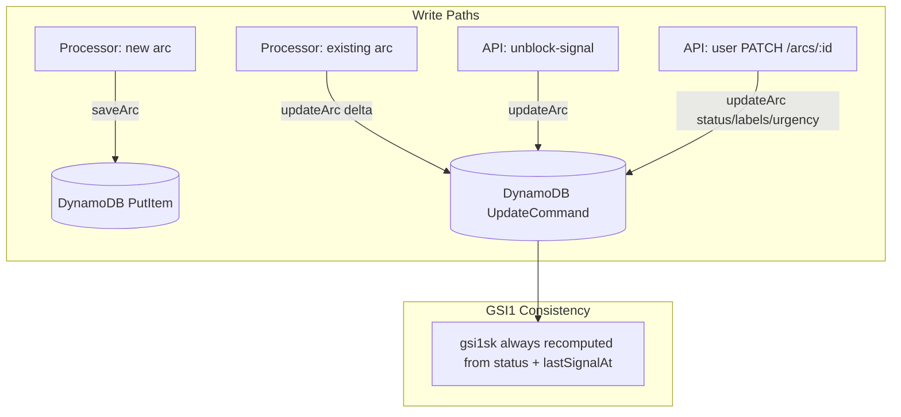

# Design Document: save-arc-partial-updates

## Overview

This refactoring replaces misuse of `saveArc` (DynamoDB `PutItem` — full item overwrite) with `updateArc` (DynamoDB `UpdateCommand` — targeted `UpdateExpression`) at call sites that only modify a subset of arc fields. The result is a clear contract:

- **`saveArc`** → used exclusively for initial arc creation (new arc, all fields written once)
- **`updateArc`** → used for all subsequent mutations (only changed fields written)

This eliminates write amplification, makes mutation intent explicit at each call site, and prevents accidental overwrites of fields modified concurrently (e.g. a user archiving an arc while the processor appends a signal).

### Key Insight

The arc matcher (`findMatch` and `findArcByGroupingKey`) can match arcs in any status — active, archived, or snoozed (never deleted, since deleted arcs have TTL expiry). When a new signal arrives on a non-active arc, the arc must be reactivated to `active`. This means every `updateArc` call from the processor or unblock-signal handler always includes `status: "active"` and `lastSignalAt`. Since both are always present, the GSI1 sort key can always be recomputed without hints or reads.

### Scope of Changes

| Layer | File | Change |
|-------|------|--------|
| Type | `src/api/requests.ts` | Extend `UpdateArcRequest` Zod schema with processor-originated fields |
| Database | `src/database/arc-database.ts` | Extend `updateArc` expression builder to handle new fields + GSI1 recomputation |
| Processor | `src/processor/processor.ts` | Replace `saveArc(arc)` with delta-based `updateArc` for existing arcs; always reactivate to `active`; remove dead `delete` rule action |
| API | `src/api/app.ts` | Replace `saveArc(arc)` with `updateArc` in unblock-signal handler |

## Architecture



The architecture remains unchanged — this is a refactoring of write semantics, not structure. The `ArcDatabase` class continues to own all DynamoDB operations. The processor and API layer call `arcDb.updateArc` directly.

## Components and Interfaces

### 1. `updateArc` method signature

`status` and `lastSignalAt` are required parameters — not optional fields in the update bag. Every caller must provide them because the GSI1 sort key depends on both:

```typescript
async updateArc(
  accountId: string,
  id: string,
  status: ArcStatus,
  lastSignalAt: string,
  update: UpdateArcFields,
): Promise<Result<Arc, DbError>>
```

Where `UpdateArcFields` contains the optional fields:

```typescript
export interface UpdateArcFields {
  urgency?: ArcUrgency;
  labels?: string[];
  summary?: string;
  workflow?: Workflow;
  retentionDuration?: string;
  sentMessageIds?: string[];
}
```

This makes the contract explicit: you cannot update an arc without declaring its status and recency. The GSI key is always consistent.

### 2. `ArcDatabase.updateArc` expression builder

```typescript
async updateArc(
  accountId: string,
  id: string,
  status: ArcStatus,
  lastSignalAt: string,
  update: UpdateArcFields,
): Promise<Result<Arc, DbError>> {
  const now = new Date().toISOString();
  const setParts: string[] = [
    "updatedAt = :now",
    "#status = :status",
    "lastSignalAt = :lastSignalAt",
    "gsi1sk = :gsi1sk",
  ];
  const exprValues: Record<string, unknown> = {
    ":now": now,
    ":status": status,
    ":lastSignalAt": lastSignalAt,
    ":gsi1sk": `LASTACT#${status}#${lastSignalAt}#${id}`,
  };
  const exprNames: Record<string, string> = { "#status": "status" };

  // --- Optional fields ---
  if (update.labels !== undefined) { setParts.push("labels = :labels"); exprValues[":labels"] = update.labels; }
  if (update.urgency !== undefined) { setParts.push("urgency = :urgency"); exprValues[":urgency"] = update.urgency; }
  if (update.summary !== undefined) { setParts.push("summary = :summary"); exprValues[":summary"] = update.summary; }
  if (update.workflow !== undefined) { setParts.push("workflow = :workflow"); exprValues[":workflow"] = update.workflow; }
  if (update.retentionDuration !== undefined) { setParts.push("retentionDuration = :rd"); exprValues[":rd"] = update.retentionDuration; }
  if (update.sentMessageIds !== undefined) { setParts.push("sentMessageIds = :smids"); exprValues[":smids"] = update.sentMessageIds; }

  // --- Execute ---
  try {
    const result = await dynamo.send(new UpdateCommand({
      TableName: SIGNALS_TABLE,
      Key: { pk: arcPk(accountId, id), sk: ITEM_SK },
      UpdateExpression: `SET ${setParts.join(", ")}`,
      ExpressionAttributeValues: exprValues,
      ExpressionAttributeNames: exprNames,
      ReturnValues: "ALL_NEW",
    }));
    return ok(result.Attributes as unknown as Arc);
  } catch (e) {
    return err(dbError(e));
  }
}
```

No conditional GSI logic. Status and lastSignalAt are always written. The GSI key is always recomputed. Simple.

### 3. Processor delta computation

In `processMessage`, after rules are applied and the arc is mutated in memory, the processor computes a delta between `matchedArc` (the original) and the mutated `arc`. The arc is always reactivated to `active` (unless a rule explicitly archives/deletes it):

```typescript
if (matchedArc) {
  // Reactivate — a new signal always brings the arc back to active
  // (unless a rule overrides to archived below)
  arc.status = "active";
  arc.lastSignalAt = timestamp;

  // Rules may override status:
  if (outcome.archive) arc.status = "archived";

  // Compute optional field delta
  const fields: UpdateArcFields = {};
  if (arc.summary !== matchedArc.summary) fields.summary = arc.summary;
  if (arc.workflow !== matchedArc.workflow) fields.workflow = arc.workflow;
  if (arc.urgency !== matchedArc.urgency) fields.urgency = arc.urgency;
  if (arc.retentionDuration !== matchedArc.retentionDuration) fields.retentionDuration = arc.retentionDuration;
  if (JSON.stringify(arc.labels) !== JSON.stringify(matchedArc.labels)) fields.labels = arc.labels;
  if (JSON.stringify(arc.sentMessageIds) !== JSON.stringify(matchedArc.sentMessageIds)) fields.sentMessageIds = arc.sentMessageIds;

  const updateResult = await this.arcDb.updateArc(accountId, arc.id, arc.status, arc.lastSignalAt, fields);
  if (updateResult.isErr()) return err(updateResult.error);
} else {
  // New arc — full PutItem
  const saveArcResult = await this.store.saveArc(arc);
  if (saveArcResult.isErr()) return err(saveArcResult.error);
}
```

**Design decision — always write on existing arc**: Unlike the previous design that skipped writes when no fields changed, we now always call `updateArc` for existing arcs because `status` and `lastSignalAt` always change (reactivation + new timestamp). The "no-op" case doesn't exist.

### 4. API layer conversion (unblock-signal handler)

```typescript
if (matchedArc) {
  const updateResult = await arcDb.updateArc(accountId, matchedArc.id, "active", signal.receivedAt, {});
  if (updateResult.isErr()) return err(c, 500, "Internal Server Error");
  arc = updateResult.value;
} else {
  // New arc — createArc (PutItem) remains unchanged
  arc = { /* ... */ };
  const createResult = await store.createArc(arc);
  if (createResult.isErr()) return err(c, 500, "Internal Server Error");
}
```

Clean — always reactivates to `active` with the signal's timestamp. No optional fields needed.

## Data Models

### UpdateArcFields (optional fields bag)

| Field | Type | Source | Notes |
|-------|------|--------|-------|
| `urgency` | `ArcUrgency?` | API + Processor | |
| `labels` | `string[]?` | API + Processor | Full replacement (not append) |
| `summary` | `string?` | Processor | Classification summary |
| `workflow` | `Workflow?` | Processor | Classification workflow |
| `retentionDuration` | `string?` | Processor | Longest retention of any signal |
| `sentMessageIds` | `string[]?` | Processor | Full replacement |

### Required parameters (always present)

| Parameter | Type | Notes |
|-----------|------|-------|
| `status` | `ArcStatus` | Always provided — reactivation or rule-set status |
| `lastSignalAt` | `string` | Always provided — timestamp of the triggering signal |

### DynamoDB GSI1 Sort Key Format

```
gsi1sk = LASTACT#${status}#${lastSignalAt}#${id}
```

Always recomputed on every `updateArc` call since both `status` and `lastSignalAt` are required.

## Error Handling

- **`updateArc` DynamoDB failure**: Returns `err(dbError(e))` — same pattern as existing `saveArc`. The processor propagates this as a batch item failure, triggering SQS retry.
- **Concurrent modification**: `updateArc` uses `UpdateCommand` which is atomic per-item in DynamoDB. Two concurrent updates to different fields both succeed without overwriting each other. Two concurrent updates to the same field follow last-writer-wins (acceptable — same as current `PutItem` behavior, but with narrower blast radius).

## Testing Strategy

**Approach**: Unit tests with static, deterministic inputs. No property-based testing (per project conventions).

### Test categories

1. **`updateArc` expression builder** (unit tests on `ArcDatabase`):
   - Status + lastSignalAt only (no optional fields) → verify `gsi1sk` recomputation, `updatedAt` set
   - Status + lastSignalAt + labels → verify all three fields + `gsi1sk`
   - `summary` + `workflow` in optional fields → verify both set
   - `updatedAt` always present

2. **Processor delta computation** (unit tests on `SignalProcessor`):
   - Existing active arc, no rule changes → `updateArc` called with `("active", newTimestamp, {})`
   - Existing archived arc → `updateArc` called with `("active", newTimestamp, {})` (reactivation)
   - Existing arc with rule that archives → `updateArc` called with `("archived", newTimestamp, {})`
   - Existing arc with changed labels → `updateArc` called with `("active", newTimestamp, { labels })`
   - New arc (matchedArc is null) → `saveArc` called

3. **Dead code removal**:
   - `delete` rule action no longer sets `arc.status = "deleted"` in the processor
   - `outcome.delete` branch removed from rule evaluation

3. **API unblock-signal handler** (unit tests):
   - Matched arc → `updateArc` called with `("active", signal.receivedAt, {})`
   - No matched arc → `createArc` called (PutItem)

### Test runner

Vitest with `vi.fn()` mocks for DynamoDB. Each test case uses a named scenario with explicit expected outputs. `it.each` for parameterised field combinations.
