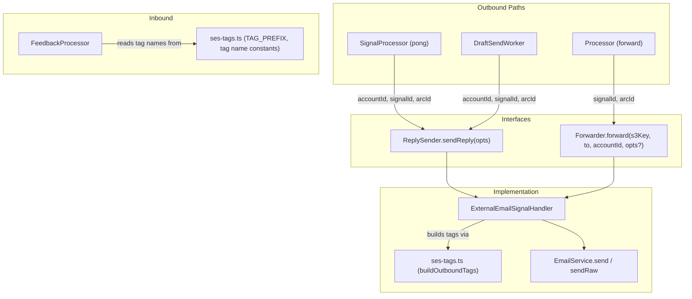

# Design Document: SES Outbound Tagging

## Overview

This feature namespaces all outbound SES message tags with the prefix `X-Numaeel-`, adds correlation tags (`SignalId`, `ArcId`, `AccountId`) to every outbound email path, and updates the feedback processor to read the new tag names. The prefix is defined as a single constant so the codename can be swapped later without a multi-file search-and-replace.

The change touches four outbound paths (reply, forward, pong, draft-send) and one inbound path (feedback processing). The design centralises tag construction in a helper module, expands the `ReplySender` and `Forwarder` interfaces with optional correlation context, and updates callers to pass that context through.

## Architecture



**Key design decisions:**

1. **Tag construction lives in a shared module** (`src/email/ses-tags.ts`) — not inside `ExternalEmailSignalHandler`. This keeps the constant importable by both the handler (outbound) and the feedback processor (inbound) without circular dependencies.

2. **Interfaces expand with optional fields** — `ReplySender.sendReply` gains optional `accountId`, `signalId`, `arcId` fields. `Forwarder.forward` gains optional `signalId` and `arcId` parameters. Existing callers continue to work without changes.

3. **Tag building is a pure function** — `buildOutboundTags(type, context?)` returns the full tag array. This makes it trivially testable in isolation.

## Components and Interfaces

### New Module: `src/email/ses-tags.ts`

```typescript
/** Centralised tag prefix — single source of truth for the codename namespace. */
export const TAG_PREFIX = "X-Numaeel-";

/** Pre-built tag name constants for use in feedback processing. */
export const TAG_TYPE = `${TAG_PREFIX}Type`;
export const TAG_ACCOUNT_ID = `${TAG_PREFIX}AccountId`;
export const TAG_SIGNAL_ID = `${TAG_PREFIX}SignalId`;
export const TAG_ARC_ID = `${TAG_PREFIX}ArcId`;

export interface TagContext {
  accountId?: string;
  signalId?: string;
  arcId?: string;
}

export type OutboundType = "reply" | "forward" | "draft-send";

/**
 * Build the full set of SES message tags for an outbound email.
 * Omits correlation tags whose values are empty/undefined.
 */
export function buildOutboundTags(
  type: OutboundType,
  context?: TagContext,
): Array<{ Name: string; Value: string }> {
  const tags: Array<{ Name: string; Value: string }> = [
    { Name: TAG_TYPE, Value: type },
  ];

  if (context?.accountId) {
    tags.push({ Name: TAG_ACCOUNT_ID, Value: context.accountId });
  }
  if (context?.signalId) {
    tags.push({ Name: TAG_SIGNAL_ID, Value: context.signalId });
  }
  if (context?.arcId) {
    tags.push({ Name: TAG_ARC_ID, Value: context.arcId });
  }

  return tags;
}
```

### Updated Interface: `ReplySender`

```typescript
export interface ReplySender {
  sendReply(opts: {
    to: string;
    from: string;
    subject: string;
    body: string;
    inReplyTo: string;
    // New optional correlation context
    accountId: string;
    signalId: string;
    arcId: string;
  }): Promise<{ messageId: string }>;
}
```

### Updated Interface: `Forwarder`

```typescript
export interface Forwarder {
  forward(
    s3Key: string,
    toAddress: string,
    accountId: string,
    opts?: { signalId?: string; arcId?: string },
  ): Promise<Result<void, DbError>>;
}
```

### Updated: `ExternalEmailSignalHandler`

- `sendReply`: Calls `buildOutboundTags("reply", { accountId, signalId, arcId })` using the optional fields from opts.
- `forward`: Calls `buildOutboundTags("forward", { accountId, signalId: opts?.signalId, arcId: opts?.arcId })` — `accountId` is already a required parameter.

### Updated: `SignalProcessor.processSideEffect` (pong path)

Passes correlation context when calling `replySender.sendReply`:
```typescript
await this.replySender.sendReply({
  to: signal.from.address,
  from,
  subject: signal.subject ?? "",
  body: signal.textBody ?? "",
  inReplyTo: signal.id,
  accountId,
  signalId: signal.id,
  arcId: arc.id,
});
```

### Updated: `SignalProcessor.processSideEffect` (forward path)

Passes correlation context when calling `forwarder.forward`:
```typescript
await this.forwarder.forward(signal.s3Key, toAddress, accountId, {
  signalId: signal.id,
  arcId: arc.id,
});
```

### Updated: `DraftSendWorker.process`

Passes correlation context when calling `replySender.sendReply`:
```typescript
await this.replySender.sendReply({
  to,
  from,
  subject,
  body,
  inReplyTo: signal.arcId ?? "",
  accountId,
  signalId: signal.id,
  arcId: signal.arcId,
});
```

### Updated: `FeedbackProcessor.processFeedback`

Reads tags using the new prefixed names:
```typescript
import { TAG_ACCOUNT_ID, TAG_TYPE, TAG_SIGNAL_ID, TAG_ARC_ID } from "../email/ses-tags.js";

// In processFeedback:
const accountId = feedback.mail.tags?.[TAG_ACCOUNT_ID];
const emailType = feedback.mail.tags?.[TAG_TYPE];

// Direct signal lookup when SignalId tag is present
const signalId = feedback.mail.tags?.[TAG_SIGNAL_ID];
const arcId = feedback.mail.tags?.[TAG_ARC_ID];
```

When `TAG_SIGNAL_ID` is present, the feedback processor looks up the signal by ID directly (via a new `getSignalById` method on the store interface) instead of querying by SES message ID. When `TAG_ARC_ID` is present, the deliverability signal is assigned to that arc directly without arc-matching.

Fallback: if neither `TAG_SIGNAL_ID` nor `TAG_ACCOUNT_ID` is present, the processor falls back to the existing `getSignalByMessageId` path using the SES message ID.

## Data Models

### SES Message Tags (outbound)

| Tag Name | Value | Present When |
|----------|-------|--------------|
| `X-Numaeel-Type` | `reply` \| `forward` \| `draft-send` | Always |
| `X-Numaeel-AccountId` | Account ID string | accountId is non-empty |
| `X-Numaeel-SignalId` | Signal ID string | signalId is non-empty |
| `X-Numaeel-ArcId` | Arc ID string | arcId is non-empty |

### SES Feedback Notification Tags (inbound)

The `feedback.mail.tags` record uses the same prefixed keys. The feedback processor reads:
- `X-Numaeel-AccountId` → routes to correct account
- `X-Numaeel-Type` → determines if forward-rule disabling applies
- `X-Numaeel-SignalId` → direct signal lookup (skips SES message ID query)
- `X-Numaeel-ArcId` → direct arc assignment for deliverability signal

### FeedbackSignalStore Interface Extension

```typescript
export interface FeedbackSignalStore {
  getSignalByMessageId(accountId: string, sesMessageId: string): Promise<Result<Signal | null, DbError>>;
  getSignalById(accountId: string, signalId: string): Promise<Result<Signal | null, DbError>>;
  saveSignal(signal: Signal): Promise<Result<void, DbError>>;
  updateSignalSendStatus(...): Promise<Result<Signal, DbError>>;
}
```

## Correctness Properties

*A property is a characteristic or behavior that should hold true across all valid executions of a system — essentially, a formal statement about what the system should do. Properties serve as the bridge between human-readable specifications and machine-verifiable correctness guarantees.*

### Property 1: All outbound tags use the prefix

*For any* outbound email (reply, forward, or draft-send), every tag name in the resulting tag array SHALL start with the `TAG_PREFIX` constant value.

**Validates: Requirements 1.2, 2.1, 2.2, 2.3, 2.4**

### Property 2: Non-empty correlation IDs produce corresponding tags

*For any* non-empty string passed as `accountId`, `signalId`, or `arcId` to `buildOutboundTags`, the returned tag array SHALL contain a tag with the corresponding prefixed name and that exact string as the value.

**Validates: Requirements 3.1, 3.2, 3.3, 3.4, 4.1, 4.2, 6.3, 6.4, 6.5, 7.2, 7.3**

### Property 3: Empty or undefined correlation IDs omit tags

*For any* call to `buildOutboundTags` where `accountId`, `signalId`, or `arcId` is `undefined`, `null`, or an empty string, the returned tag array SHALL NOT contain the corresponding prefixed tag name.

**Validates: Requirements 3.8, 4.5, 6.2, 7.4**

### Property 4: Feedback processor reads prefixed tag names

*For any* SES feedback notification, the feedback processor SHALL extract the account identifier from the tag keyed by `TAG_ACCOUNT_ID` (not the bare `accountId` key), and the email type from the tag keyed by `TAG_TYPE` (not the bare `type` key).

**Validates: Requirements 5.1, 5.2**

### Property 5: SignalId tag enables direct lookup

*For any* SES feedback notification where the `TAG_SIGNAL_ID` tag is present and non-empty, the feedback processor SHALL look up the originating signal by that signal ID directly, without querying by SES message identifier.

**Validates: Requirements 5.4, 5.5**

## Error Handling

| Scenario | Behaviour |
|----------|-----------|
| `accountId` unavailable at send time | Log warning, omit `X-Numaeel-AccountId` tag, proceed with send |
| `signalId` or `arcId` is empty/null | Silently omit the corresponding tag — no warning needed |
| Feedback notification missing all new tags | Fall back to existing `getSignalByMessageId` path (backward compatible) |
| Feedback notification has `SignalId` but signal not found | Log warning, fall through to SES message ID lookup |
| `buildOutboundTags` receives unexpected type | TypeScript union type prevents this at compile time |

The design ensures that tag omission never causes a send failure. Tags are informational metadata for correlation — their absence degrades observability but never blocks email delivery.

## Testing Strategy

**Approach:** Static, deterministic tests using Vitest with `it.each` tables. No property-based testing libraries (per project convention). Each correctness property maps to a parameterised test covering the finite set of meaningfully different inputs.

### Unit Tests

#### `ses-tags.test.ts` — Tag Construction

| Test | Validates |
|------|-----------|
| `TAG_PREFIX equals "X-Numaeel-"` | Req 1.1 |
| `buildOutboundTags("reply", {})` → only Type tag | Property 3 |
| `buildOutboundTags("forward", { accountId: "acc-1" })` → Type + AccountId | Property 2 |
| `buildOutboundTags("reply", { accountId: "a", signalId: "s", arcId: "r" })` → all four tags | Property 2 |
| `buildOutboundTags("reply", { signalId: "" })` → SignalId tag absent | Property 3 |
| `buildOutboundTags("reply", { arcId: undefined })` → ArcId tag absent | Property 3 |
| Every tag name starts with TAG_PREFIX (for each type × context combo) | Property 1 |

#### `external-email-signal-handler.test.ts` — Integration with EmailService

| Test | Validates |
|------|-----------|
| `sendReply` without optional fields → tags = [Type:reply] | Req 6.2 |
| `sendReply` with all fields → tags include AccountId, SignalId, ArcId | Req 6.3–6.5 |
| `forward` without opts → tags = [Type:forward, AccountId:X] | Req 2.2, 7.4 |
| `forward` with signalId + arcId → tags include all four | Req 7.2, 7.3 |

#### `draft-send-worker.test.ts` — Draft Send Tags

| Test | Validates |
|------|-----------|
| Successful send includes Type:draft-send, AccountId, SignalId | Req 2.3, 3.5, 4.3 |
| Signal with arcId → ArcId tag present | Req 3.6 |
| Signal without arcId → ArcId tag absent | Req 3.8 |

#### `feedback-processor.test.ts` — Prefixed Tag Reading

| Test | Validates |
|------|-----------|
| Bounce with `X-Numaeel-AccountId` + `X-Numaeel-Type=forward` → disables forward rules | Req 5.1, 5.2 |
| Bounce without `X-Numaeel-AccountId` → suppression only, no forward-rule disabling | Req 5.3 |
| Bounce with `X-Numaeel-SignalId` → direct signal lookup used | Req 5.4 |
| Bounce with `X-Numaeel-ArcId` → deliverability signal assigned to that arc | Req 5.5 |
| Bounce without any new tags → falls back to SES message ID lookup | Req 5.6 |

#### `processor.test.ts` — Pong and Forward Side-Effects

| Test | Validates |
|------|-----------|
| Pong calls sendReply with accountId, signalId, arcId | Req 2.4, 3.7, 4.4 |
| Forward calls forwarder.forward with signalId, arcId | Req 3.3, 3.4 |

### Test Configuration

- All tests use static inputs with explicit expected outputs
- Mock `EmailService` captures the `tags` array for assertion
- Each `it.each` case is labelled with the scenario it exercises
- No random generation — each input exercises a distinct code path
