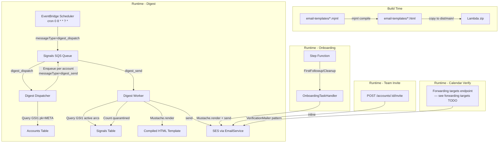

# Design: SES Transactional Notifications

## Overview

This design wires SES transactional email sending across four notification paths: digest emails, onboarding follow-ups, team invites, and calendar forwarding verification. It introduces a shared template infrastructure (MJML compiled at build → Mustache rendered at runtime), a digest dispatch/worker pipeline on SQS, and extends the existing EmailService with new error classifications.

All email paths converge on the existing `EmailService.send()` method. The digest system adds two new SQS message types (`digest_dispatch`, `digest_send`) handled by the same Lambda. Onboarding and team invite paths replace TRACK log placeholders with actual sends. Calendar verification reuses the existing `VerificationMailer` pattern.

**Design decisions:**
- Single Lambda handles all message types (existing pattern) — no new Lambdas.
- MJML compilation happens at build time in `make.ts` — zero runtime MJML dependency.
- Mustache chosen over Handlebars: spec-compliant, smaller, no logic in templates.
- Digest dispatch→send two-phase pattern avoids a single long-running invocation that queries all accounts AND sends all emails.
- EventBridge Scheduler (recurring) targets SQS directly — reuses existing `scheduler_sqs` IAM role.

---

## Architecture



---

## Components and Interfaces

### 1. Template Renderer (`src/email/template-renderer.ts`)

Reads compiled HTML from the filesystem (async) and renders with Mustache. No caching — templates are small files on local disk, re-reading is negligible.

```typescript
import Mustache from "mustache";
import { readFile } from "node:fs/promises";
import path from "node:path";

// Lambda extracts to /var/task — templates land at /var/task/email-templates/
const TEMPLATES_DIR = path.join(process.cwd(), "email-templates");

export async function renderTemplate(name: string, data: Record<string, unknown>): Promise<string> {
  const html = await readFile(path.join(TEMPLATES_DIR, `${name}.html`), "utf-8");
  return Mustache.render(html, data);
}
```

### 2. Tag Sanitizer (`src/email/tag-sanitizer.ts`)

Shared utility for SES EmailTag sanitization.

```typescript
export function sanitizeTagValue(value: string): string {
  return value.replace(/[^a-z0-9_-]/gi, "").slice(0, 255);
}

export function sanitizeTagName(name: string): string {
  return name.replace(/[^a-z0-9_-]/gi, "").slice(0, 255);
}

export interface EmailTagSet {
  accountId: string;
  fullDate: string;
  invocationId: string;
  triggerId: string;
}

export function buildEmailTags(tags: EmailTagSet): Array<{ Name: string; Value: string }> {
  return [
    { Name: sanitizeTagName("X-Numaeel-AccountId"), Value: sanitizeTagValue(tags.accountId) },
    { Name: sanitizeTagName("X-Numaeel-FullDate"), Value: sanitizeTagValue(tags.fullDate) },
    { Name: sanitizeTagName("X-Numaeel-InvocationId"), Value: sanitizeTagValue(tags.invocationId) },
    { Name: sanitizeTagName("X-Numaeel-TriggerId"), Value: sanitizeTagValue(tags.triggerId) },
  ];
}
```

### 3. Unsubscribe Header Builder (`src/email/unsubscribe-headers.ts`)

```typescript
export function buildUnsubscribeHeaders(accountId: string, apiDomain: string, jwt: string): Array<{ Name: string; Value: string }> {
  return [
    { Name: "List-Unsubscribe", Value: `<https://${apiDomain}/accounts/${accountId}/unsubscribe?code=${jwt}>` },
    { Name: "List-Unsubscribe-Post", Value: "List-Unsubscribe=One-Click" },
  ];
}
```

### 3b. Unsubscribe JWT Generator (`src/email/unsubscribe-token.ts`)

Signs a JWT with the existing Ed25519 KMS key (`AUTHRESS_KMS_KEY_ARN` env var). Reuses the same key already provisioned for Authress service client auth. The unsubscribe endpoint validates the signature and extracts claims.

```typescript
// JWT Header: { alg: "EdDSA", typ: "JWT", kid: AUTHRESS_KEY_ID }
// JWT Payload:
// {
//   sub: accountId,
//   scope: "unsubscribe",
//   resource: "/accounts/{accountId}/targets/{forwardingTargetId}/types/{emailType}",
//   iss: "https://{apiDomain}",
//   iat: <unix seconds>,
//   exp: <iat + 60 days (5184000 seconds)>
// }
// Signed via KMS Sign API (EdDSA on ECC_NIST_EDWARDS25519 key)

export async function generateUnsubscribeToken(params: {
  accountId: string;
  forwardingTargetId: string;
  emailType: string;
  apiDomain: string;
  kmsKeyArn: string;
  keyId: string;
}): Promise<string> {
  // 1. Build header + payload
  // 2. base64url encode header.payload
  // 3. KMS Sign(message: header.payload, SigningAlgorithm: ECDSA_SHA_256)
  // 4. Return header.payload.signature
}
```

### 4. Digest Dispatcher (`src/digest/digest-dispatcher.ts`)

Receives `digest_dispatch` message. Queries all accounts via GSI1 (`gsi1pk = "META"`), filters by frequency + day-of-week/month, enqueues `digest_send` per qualifying account.

```typescript
export interface DigestDispatcherDeps {
  accountDb: { queryAllAccountMetas(): Promise<Result<AccountDigestRow[], DbError>> };
  sqsClient: SQSClient;
  queueUrl: string;
  logger: Logger;
}

export interface AccountDigestRow {
  id: string;
  email: string;
  digest?: { frequency: "daily" | "weekly" | "monthly"; forwardingTargetId: string } | null;
}

export class DigestDispatcher {
  constructor(private readonly deps: DigestDispatcherDeps) {}

  async dispatch(): Promise<Result<void, DbError>> {
    // 1. Query GSI1 (gsi1pk = "META") for all account rows
    // 2. Filter: account.digest exists && frequency matches today
    // 3. Enqueue messageType="digest_send" per qualifying account
  }
}
```

### 5. Digest Worker (`src/digest/digest-worker.ts`)

Receives `digest_send` message. Re-validates frequency, queries top 100 active arcs, counts quarantined signals, renders template, sends via EmailService. Sends to the verified address on the forwarding target (resolved from `digest.forwardingTargetId`).

```typescript
export interface DigestWorkerDeps {
  accountDb: { getAccount(accountId: string): Promise<Result<Account | null, DbError>> };
  arcDb: { listActiveArcs(accountId: string, limit: number): Promise<Result<Arc[], DbError>> };
  signalDb: { countQuarantined(accountId: string): Promise<Result<number, DbError>> };
  targetDb: { getTarget(accountId: string, targetId: string): Promise<Result<ForwardingTarget | null, DbError>> };
  emailService: EmailService;
  logger: Logger;
}

export class DigestWorker {
  constructor(private readonly deps: DigestWorkerDeps) {}

  async process(message: DigestSendMessage): Promise<Result<void, DbError>> {
    // 1. Load account, verify digest still enabled
    // 2. Re-validate frequency against today (guard stale retries)
    // 3. Resolve forwardingTarget → get verified email address
    // 4. Query top 100 active arcs (GSI1 LASTACT#active# ScanIndexForward=false)
    // 5. If zero arcs → suppress, return ok
    // 6. Count quarantined signals
    // 7. Generate unsubscribe JWT (EdDSA signed with KMS Ed25519 key)
    // 8. Render digest template with arc data + quarantine count + unsubscribe code
    // 9. Build tags, headers (List-Unsubscribe with JWT), send via EmailService (terminal operation)
  }
}
```

### 6. EmailService Extension

Add `ConfigurationSetSendingPausedException` and `ConfigurationSetDoesNotExistException` to `classifyError` as permanent non-retryable errors.

### 7. Account Model Change

In `src/types/index.ts`:
- Remove `notifications?: NotificationSettings` from `Account`
- Add `digest?: { frequency: "daily" | "weekly" | "monthly"; forwardingTargetId: string } | null`

In `AccountDatabase.updateAccount`:
- Add `digest` to the update params (handle `undefined` = no-op, `null` = REMOVE, object = SET)

### 8. Build Step (`make.ts`)

Add MJML compilation + copy to `dist/main/email-templates/`:
```typescript
// After esbuild, before upload:
// 1. Glob email-templates/*.mjml
// 2. For each: mjml.compile(content) → write to dist/main/email-templates/{name}.html
// 3. Copy shared partials if needed
```

---

## Data Models

### Account (DynamoDB — Accounts Table)

```
pk: ACCT#{accountId}
sk: META
gsi1pk: META              ← NEW (enables digest dispatcher query)
gsi1sk: ACCT#{accountId}  ← NEW
```

Fields changed:
- **Remove:** `notifications` (dead field — `push.enabled` never read, `email` unused)
- **Add:** `digest?: { frequency: "daily" | "weekly" | "monthly"; forwardingTargetId: string } | null`

### Digest SQS Messages

**dispatch:**
```json
{
  "messageAttributes": { "messageType": "digest_dispatch" },
  "body": {}
}
```

**send:**
```json
{
  "messageAttributes": { "messageType": "digest_send" },
  "body": { "accountId": "acct_xxx" }
}
```

### Template File Layout

```
email-catcher/backend/
├── email-templates/
│   ├── _footer.mjml          (shared partial — included via mj-include)
│   ├── digest.mjml
│   ├── onboarding-followup.mjml
│   ├── team-invite.mjml
│   └── calendar-verify.mjml
├── dist/main/email-templates/
│   ├── digest.html            (compiled output)
│   ├── onboarding-followup.html
│   ├── team-invite.html
│   └── calendar-verify.html
```

---

## Correctness Properties

*A property is a characteristic or behavior that should hold true across all valid executions of a system — essentially, a formal statement about what the system should do. Properties serve as the bridge between human-readable specifications and machine-verifiable correctness guarantees.*

### Property 1: Tag sanitization preserves safe characters and strips unsafe ones

*For any* string input, `sanitizeTagValue(input)` should contain only characters matching `[a-zA-Z0-9_-]` and have length ≤ 255.

**Validates: Requirements 0.5**

### Property 2: Tag sanitization is idempotent

*For any* string input, `sanitizeTagValue(sanitizeTagValue(input))` should equal `sanitizeTagValue(input)`.

**Validates: Requirements 0.5**

### Property 3: Digest frequency filter correctness

*For any* date and account with digest frequency configured, the dispatch filter function returns `true` if and only if: (frequency = "daily") OR (frequency = "weekly" AND date is Sunday) OR (frequency = "monthly" AND date is 1st).

**Validates: Requirements 1.3**

### Property 4: Digest subject format matches frequency

*For any* valid frequency and date, `buildDigestSubject(frequency, date)` should return a string matching the pattern: daily → "Daily Numaeel Digest for {DayName}", weekly → "Weekly Numaeel Digest for Week {N}", monthly → "Monthly Numaeel Digest for {MonthName}".

**Validates: Requirements 1.2**

### Property 5: PATCH digest semantics — undefined is no-op

*For any* account state, calling `updateAccount(id, {})` (digest key absent) should not modify the digest field.

**Validates: Requirements 1.6**

### Property 6: PATCH digest semantics — null disables

*For any* account with an active digest, calling `updateAccount(id, { digest: null })` should result in the account's digest being null (disabled).

**Validates: Requirements 1.6**

### Property 7: Onboarding email suppression when all steps complete

*For any* account where `domainAdded && senderSetupComplete && emailsReceived` are all true, the onboarding follow-up handler should NOT send an email.

**Validates: Requirements 2**

### Property 8: Digest suppression when zero active arcs

*For any* account with zero active arcs, the digest worker should not call `EmailService.send()`.

**Validates: Requirements 1.1**

---

## Error Handling

### EmailService Error Classification

| Error | Classification | Behavior |
|-------|---------------|----------|
| `ConfigurationSetSendingPausedException` | Permanent | Log error, return `ok({ messageId: "" })`, no retry |
| `ConfigurationSetDoesNotExistException` | Permanent | Log error, return `ok({ messageId: "" })`, no retry |
| `MessageRejected` (unverified address) | Permanent | Existing behavior — log, return ok |
| All other SES errors | Transient | Return `err(transient_ses_error)` → SQS retries |

### Digest Pipeline Errors

| Scenario | Behavior |
|----------|----------|
| GSI1 query fails in dispatcher | Return err → SQS retries the dispatch message |
| SQS batch send fails in dispatcher | Log ERROR with full context → return err (quit early, no partial success) |
| Arc query fails in worker | Return err → SQS retries that account's send message |
| Forwarding target not found or unverified | Log warning → return ok (suppress, no retry) |
| SES transient error in worker | Return err → SQS retries (send is terminal — no post-send writes) |
| Account deleted between dispatch and send | Worker loads account, finds null → return ok (no-op) |
| Digest disabled between dispatch and send | Worker checks digest field → return ok (suppress) |
| Frequency mismatch on retry (stale message) | Worker re-validates date → return ok (suppress) |
| Dispatch message ack fails after successful batch send | Rare — dispatcher re-runs, accounts get duplicate `digest_send` messages → duplicate emails (accepted) |

### Idempotency Guarantees

The SES send is the terminal operation. No database writes occur after `EmailService.send()`. This means:
- Success → ack SQS → done.
- Transient SES failure → don't ack → SQS retries → possible duplicate send (acceptable for digests/onboarding).
- Permanent SES failure → ack SQS (logged, no retry).

---

## Testing Strategy

### Unit Tests (Vitest)

- **Tag sanitization:** Verify specific examples — empty string, max-length overflow, special characters, already-clean strings.
- **Digest frequency filter:** Example-based tests for each frequency on matching and non-matching days.
- **Digest subject builder:** One test per frequency with known date inputs.
- **PATCH digest semantics:** Test `undefined` (no-op), `null` (disable), object (enable) against mock DDB.
- **Onboarding suppression:** Test that all-complete accounts don't trigger send.
- **Template renderer:** Mock `readFileSync`, verify Mustache variable injection with known data.
- **Error classification:** Test that new error names (`ConfigurationSetSendingPausedException`, `ConfigurationSetDoesNotExistException`) are classified as permanent.
- **Unsubscribe headers:** Verify correct format for given accountId and domain.
- **Digest dispatcher:** Mock GSI1 query response, verify correct accounts filtered and enqueued.
- **Digest worker:** Mock arc query returning 0 items → verify no send. Mock arc query returning items → verify template rendered and sent.

### Property-Based Tests

Not used — this project uses static example-based tests only (no fast-check, no random generation).

### Integration Tests

- End-to-end digest pipeline with mocked SES: scheduler message → dispatcher → worker → verify SES call.
- MJML compilation produces valid HTML (build-time check in CI).
