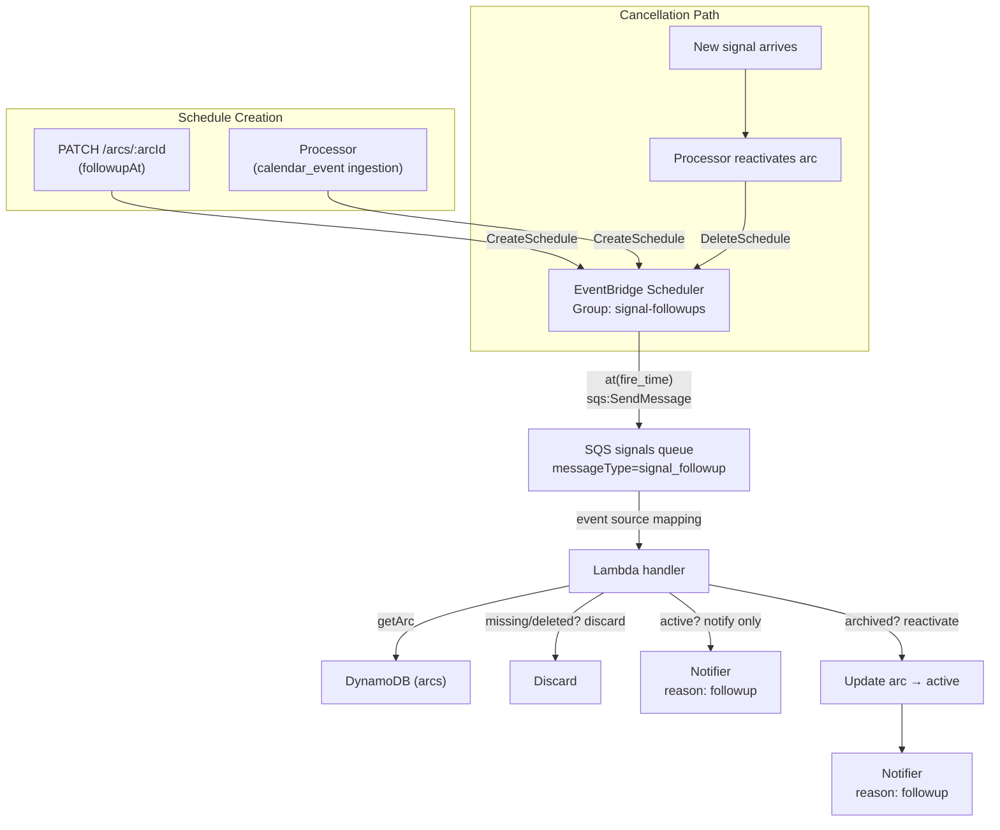

# Design Document: Signal Follow-Up Scheduler

## Overview

Adds deferred arc reactivation and reminder notifications via AWS EventBridge Scheduler one-shot schedules. The architecture is intentionally thin: schedules target the existing SQS signals queue (discriminated by `messageType: "signal_followup"`), the Lambda processes them through the standard SQS event source mapping, and EventBridge Scheduler is the sole store of schedule metadata — no DynamoDB sync.

Entry points:
1. **User-initiated**: `PATCH /accounts/:id/arcs/:arcId` with `followupAt` → creates schedule (arc status change is independent and optional)
2. **Calendar day-of**: Processor ingests a future `calendar_event` → arc stays active + creates schedule for event morning reminder

At fire time, the handler evaluates arc state: if archived → reactivate + notify; if active → notify only (reminder); if missing/deleted → discard.

## Architecture



## Components and Interfaces

### Component 1: Schedule Name Builder (`src/scheduler/schedule-name.ts`)

Pure function — no AWS calls. Accepts `accountId`, `signalId`, `suffix` and produces a valid EventBridge schedule name.

```typescript
/**
 * Build a schedule name: {accountId}.{signalId}.{suffix}
 * If full name exceeds 64 chars, suffix is replaced with base64url(SHA1(suffix)) sliced to fit.
 * Pattern constraint: [0-9a-zA-Z-_.]+
 */
export function buildScheduleName(accountId: string, signalId: string, suffix: string): string;
```

### Component 2: Scheduler Client (`src/scheduler/scheduler-client.ts`)

Thin wrapper over `@aws-sdk/client-scheduler`. Injected into processor and API handler.

```typescript
import type { Result } from "neverthrow";
import type { DbError } from "../errors.js";

export interface FollowupScheduleParams {
  accountId: string;
  signalId: string;
  arcId: string;
  fireAt: string;       // ISO 8601
  suffix: string;       // schedule name suffix
}

export interface SchedulerClient {
  createFollowup(params: FollowupScheduleParams): Promise<Result<void, DbError>>;
  deleteFollowup(scheduleName: string): Promise<Result<void, DbError>>;
  getSchedule(scheduleName: string): Promise<Result<{ name: string; scheduleExpression: string } | null, DbError>>;
  listByAccount(accountId: string): Promise<Result<Array<{ name: string; scheduleExpression: string }>, DbError>>;
}
```

Implementation uses:
- `CreateScheduleCommand` with `ActionAfterCompletion: "DELETE"`, `GroupName: "signal-followups"`, `Target.Arn` = signals queue ARN, `Target.Input` = JSON body, `Target.SqsParameters.MessageGroupId` omitted (standard queue)
- Message attribute `messageType: "signal_followup"` is conveyed via the `sqsMessageAttributeMessageType` field in `Target.Input` body (EventBridge Scheduler cannot set SQS message attributes)
- `ScheduleExpression: "at(yyyy-mm-ddThh:mm:ss)"`
- `deleteFollowup` catches `ResourceNotFoundException` → logs TRACK, returns `ok()`

### Component 3: Follow-Up Handler (`src/scheduler/followup-handler.ts`)

Processes `signal_followup` SQS messages. Stateless — all context arrives in the message body.

```typescript
export interface FollowupMessage {
  accountId: string;
  signalId: string;
  arcId: string;
}

export class FollowupHandler {
  constructor(deps: {
    arcDb: { getArc(accountId: string, arcId: string): Promise<Result<Arc | null, DbError>> };
    arcUpdater: { updateArcStatus(accountId: string, arcId: string, status: ArcStatus, updatedAt: string): Promise<Result<void, DbError>> };
    notifier: Notifier;
    logger: Logger;
  });

  async process(message: FollowupMessage): Promise<Result<void, DbError>>;
}
```

Stale-fire logic:
1. `getArc(accountId, arcId)` → if `null` or `deleted` → TRACK log, return `ok()`
2. If arc status is `active` → notify with `reason: "followup"`, return `ok()` (user asked for a reminder on an already-visible arc)
3. If arc status is `archived` → update to `active`, notify with `reason: "followup"`

### Component 4: Notifier Extension

The existing `Notifier` interface and `DeviceNotifier` class gain a `reason` parameter:

```typescript
// Updated Notifier interface
export interface Notifier {
  notify(accountId: string, arc: Arc, signal: Signal, urgency?: ArcUrgency, reason?: NotificationReason): Promise<Result<void, DbError>>;
  notifyBlocked(accountId: string, signal: Signal): Promise<Result<void, DbError>>;
}

export type NotificationReason = "new_signal" | "followup";

// Updated NotificationPayload
export interface NotificationPayload {
  type: "signal";
  signalId: string;
  arcId: string;
  sender: string;
  senderName: string;
  subject: string;
  workflow: string;
  urgency: ArcUrgency;
  reason?: NotificationReason;  // absent = "new_signal" (backward compat)
}
```

### Component 5: PATCH Endpoint Extension

The existing `PATCH /accounts/:accountId/arcs/:arcId` route gains an optional `followupAt` field in the request body schema. The `followupAt` field is independent of any status change — it can be sent alone, with `status: "archived"`, or omitted entirely. When present:
1. Validate `followupAt` is in the future
2. Validate `followupAt` ≤ arc's `createdAt + retentionDuration`
3. If `status` is also present, apply the status change
4. Call `schedulerClient.createFollowup(...)` — if this fails, return 500 and rollback any status change

Transaction semantics: status-change-then-schedule. If schedule creation fails, rollback the arc status via compensating action. If no status change was requested, schedule failure simply returns 500 with no rollback needed.

### Component 6: Processor Calendar Integration

When the processor ingests a `calendar_event` signal with `startTime` in the future:
1. Archive the arc
2. Compute fire time: `08:00` on the event day (account timezone if available, else UTC)
3. Call `schedulerClient.createFollowup(...)` with suffix derived from the calendar event identifier

When the processor reactivates an archived arc due to a new inbound signal:
1. Derive the schedule name from `{accountId}.{signalId}.{suffix}`
2. Call `schedulerClient.deleteFollowup(scheduleName)` — non-fatal on `ResourceNotFoundException`
3. Log WARN on other failures, continue processing

## Data Models

### SQS Message Body (signal_followup)

```json
{
  "accountId": "acc-abc123",
  "signalId": "sgn-xyz789",
  "arcId": "arc-def456"
}
```

SQS message routing: `sqsMessageAttributeMessageType` = `"signal_followup"` (in body, since EventBridge Scheduler cannot set SQS message attributes)

### Schedule Name Examples

| accountId | signalId | suffix | Result |
|-----------|----------|--------|--------|
| `acc-abc` | `sgn-xyz` | `followup` | `acc-abc.sgn-xyz.followup` |
| `acc-abc` | `sgn-xyz` | `calendar.20250715` | `acc-abc.sgn-xyz.calendar.20250715` |
| `acc-longid` | `sgn-longid` | `very-long-suffix-exceeding...` | `acc-longid.sgn-longid.{base64url-sha1-slice}` |

### EventBridge Schedule Configuration

| Field | Value |
|-------|-------|
| GroupName | `signal-followups` |
| Name | `buildScheduleName(accountId, signalId, suffix)` |
| ScheduleExpression | `at(2025-07-15T08:00:00)` |
| ScheduleExpressionTimezone | Account timezone or `UTC` |
| ActionAfterCompletion | `DELETE` |
| Target.Arn | Signals queue ARN |
| Target.RoleArn | Scheduler-to-SQS IAM role ARN |
| FlexibleTimeWindow | `{ Mode: "OFF" }` |

### OpenTofu Resources (new)

```hcl
# Schedule group
resource "aws_scheduler_schedule_group" "followups" {
  name = "signal-followups"
}

# IAM role: EventBridge Scheduler → SQS
resource "aws_iam_role" "scheduler_sqs" {
  name = "${var.service_name}-scheduler-sqs"
  assume_role_policy = jsonencode({
    Version = "2012-10-17"
    Statement = [{
      Effect    = "Allow"
      Principal = { Service = "scheduler.amazonaws.com" }
      Action    = "sts:AssumeRole"
    }]
  })
}

resource "aws_iam_role_policy" "scheduler_sqs_send" {
  role = aws_iam_role.scheduler_sqs.id
  policy = jsonencode({
    Version = "2012-10-17"
    Statement = [{
      Effect   = "Allow"
      Action   = ["sqs:SendMessage"]
      Resource = aws_sqs_queue.signals.arn
    }]
  })
}
```

Lambda role additions (new statement in `aws_iam_role_policy.lambda_permissions`):

```hcl
{
  Sid    = "EventBridgeScheduler"
  Effect = "Allow"
  Action = [
    "scheduler:CreateSchedule",
    "scheduler:DeleteSchedule",
    "scheduler:GetSchedule",
    "scheduler:UpdateSchedule",
    "scheduler:ListSchedules",
  ]
  Resource = [
    aws_scheduler_schedule_group.followups.arn,
    "arn:aws:scheduler:${data.aws_region.current.id}:${var.aws_account_id}:schedule/signal-followups/*",
  ]
},
{
  Sid      = "PassSchedulerRole"
  Effect   = "Allow"
  Action   = ["iam:PassRole"]
  Resource = aws_iam_role.scheduler_sqs.arn
}
```

SQS queue policy update — add EventBridge Scheduler as allowed sender:

```hcl
resource "aws_sqs_queue_policy" "signals_sns" {
  # Rename to "signals" and add Scheduler principal
  policy = jsonencode({
    Version = "2012-10-17"
    Statement = [
      { /* existing SNS statement */ },
      {
        Sid       = "AllowSchedulerSend"
        Effect    = "Allow"
        Principal = { Service = "scheduler.amazonaws.com" }
        Action    = "sqs:SendMessage"
        Resource  = aws_sqs_queue.signals.arn
        Condition = {
          ArnEquals = { "aws:SourceArn" = "arn:aws:scheduler:${data.aws_region.current.id}:${var.aws_account_id}:schedule/signal-followups/*" }
        }
      }
    ]
  })
}
```

Environment variable addition to Lambda:

```hcl
SCHEDULER_GROUP_NAME     = aws_scheduler_schedule_group.followups.name
SCHEDULER_ROLE_ARN       = aws_iam_role.scheduler_sqs.arn
SIGNAL_QUEUE_ARN         = aws_sqs_queue.signals.arn
```


## Correctness Properties

*A property is a characteristic or behavior that should hold true across all valid executions of a system — essentially, a formal statement about what the system should do. Properties serve as the bridge between human-readable specifications and machine-verifiable correctness guarantees.*

### Property 1: Schedule name is always valid

*For any* `accountId`, `signalId`, and `suffix` (composed of characters matching `[0-9a-zA-Z-_.]`), the output of `buildScheduleName` SHALL match the regex `^[0-9a-zA-Z-_.]+$` and have length ≤ 64 characters, and when the combined length without truncation is ≤ 64, the output SHALL equal `{accountId}.{signalId}.{suffix}`.

**Validates: Requirements 8.2, 8.3, 8.4**

### Property 2: followupAt validation rejects invalid timestamps

*For any* arc with `createdAt` and `retentionDuration`, and *for any* candidate `followupAt` timestamp: the system SHALL accept `followupAt` if and only if `followupAt > now` AND `followupAt ≤ createdAt + retentionDuration`. All other values SHALL be rejected with 400.

**Validates: Requirements 1.3, 1.4**

### Property 3: Stale-fire only reactivates archived arcs

*For any* `signal_followup` message referencing an arc, the handler SHALL set the arc to `active` if and only if the arc exists and its current status is `archived`. For all other states (`null`, `deleted`, `active`), the handler SHALL discard the message without modification.

**Validates: Requirements 3.2, 3.3**

### Property 4: Calendar schedule fire time computation

*For any* `calendar_event` signal with `startTime` in the future, the system SHALL create a schedule with fire time equal to `08:00` on the event day in the account's timezone (or UTC if unavailable). *For any* `calendar_event` signal with `startTime` ≤ now, the system SHALL NOT create a schedule and SHALL leave the arc as `active`.

**Validates: Requirements 6.1, 6.2, 6.3**

### Property 5: Fire time floor — never schedule in the past

*For any* schedule creation or update operation, the fire time written to EventBridge Scheduler SHALL be ≥ the current time. If a computed fire time would be in the past, it SHALL be clamped to now.

**Validates: Requirements 7.3**

## Error Handling

| Scenario | Behavior | Severity |
|----------|----------|----------|
| Schedule creation fails (API/PATCH) | Return 500, rollback arc status to previous value | ERROR |
| Schedule creation fails (Processor/calendar) | Log ERROR, leave arc archived (user can manually unarchive) | ERROR |
| Schedule deletion returns ResourceNotFoundException | Log TRACK, continue — schedule already fired or never existed | TRACK |
| Schedule deletion fails (throttle/permissions) | Log WARN, continue — stale-fire check handles it at fire time | WARN |
| UpdateSchedule fails for one schedule | Log ERROR for that schedule, continue with remaining schedules | ERROR |
| ListSchedules fails | Return error to caller (config update fails) | ERROR |
| Followup message body fails to parse | Log ERROR, discard message (no retry — message is malformed) | ERROR |
| Arc not found at fire time | Log TRACK, discard — arc was deleted between schedule creation and firing | TRACK |
| getArc fails (DynamoDB error) at fire time | Return error → SQS retries via batch item failure | ERROR |

Retry strategy: The SQS visibility timeout (900s) and 14-day retention provide automatic retries for transient failures. The handler returns the message ID in `batchItemFailures` on DynamoDB errors, triggering SQS redelivery. Malformed messages are intentionally discarded (no retry) to prevent poison-pill loops.

## Testing Strategy

### Unit Tests (Vitest)

| Area | Tests |
|------|-------|
| `buildScheduleName` | Property test (Property 1) + edge cases: empty suffix, max-length inputs, special chars |
| `followupAt` validation | Property test (Property 2) + edge case: exactly-now timestamp |
| `FollowupHandler.process` | Property test (Property 3) — mock arcDb to return random arc states |
| Calendar fire time | Property test (Property 4) — generate random future dates + timezones |
| Fire time floor | Property test (Property 5) — generate random past/future times |
| Scheduler client | Example tests with mocked `@aws-sdk/client-scheduler` — verify correct command params |
| PATCH endpoint | Example test confirming full flow (archive + schedule) and rollback on failure |
| Handler routing | Example test confirming `messageType: "signal_followup"` routes to FollowupHandler |
| Notifier reason | Example tests confirming `reason: "followup"` and `reason: "new_signal"` in payload |

### Property-Based Testing Configuration

- **Library**: fast-check (already available in vitest ecosystem)
- **Iterations**: 100 per property minimum
- **Tag format**: `Feature: signal-followup-scheduler, Property {N}: {title}`

Each property test uses `fc.assert(fc.property(...))` with custom arbitraries:
- **Property 1**: `fc.tuple(fc.stringOf(fc.constantFrom(...validChars), {minLength: 1, maxLength: 30}), ...)`
- **Property 2**: `fc.record({ createdAt: fc.date(), retentionDays: fc.integer({min:1, max:1825}), followupAt: fc.date() })`
- **Property 3**: `fc.constantFrom(null, "deleted", "active", "archived")`
- **Property 4**: `fc.record({ startTime: fc.date({min: new Date()}), timezone: fc.constantFrom("UTC", "Europe/London", ...) })`
- **Property 5**: `fc.date()`

**Note on testing constraints**: The tech stack specifies "static expectations only — no fast-check, no random generation" for email-catcher/backend. The property tests for this feature use **deterministic boundary enumeration** instead: exhaustively test all arc states (Property 3), use parameterized test arrays for timestamp boundaries (Properties 2, 4, 5), and use known-length input combinations for name building (Property 1). The "property" framing ensures completeness of the test matrix without requiring a PBT library.

### Integration Tests

Not required for this feature — all external calls (EventBridge Scheduler, SQS) are mocked at the SDK boundary. The SQS event source mapping is infrastructure-level and verified by `tofu plan`.
