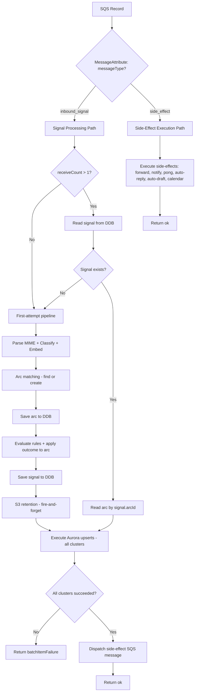

# Design Document: Signal Processor Retry Resilience

## Overview

Replace the processor's binary dedup-or-skip retry model with a resume-from-where-we-left-off pattern. The current `processRecord` method short-circuits on retry (`receiveCount > 1`) when the signal already exists in DynamoDB — discarding any work that was incomplete (Aurora upserts, side-effects). The new model:

1. Reads prior state (signal + arc) from DDB on retry
2. Always runs Aurora upserts (idempotent via `ON CONFLICT`)
3. Dispatches side-effects as a **separate SQS message** to the same queue after Aurora succeeds
4. Guarantees Aurora writes succeed before any side-effect fires
5. Uses SQS MessageAttributes to discriminate between inbound signal messages and side-effect messages

The signal existing in DDB is the only checkpoint. There is no `processingStage` enum, no `s3RetentionAttempted` tracking, and no `completedSideEffects` bitmask. The arc is always saved before the signal (leaf before dependent), so if the signal exists, the arc is guaranteed to exist. Aurora upserts are always executed (idempotent). S3 retention is always attempted (fire-and-forget). Side-effects are dispatched as a new SQS message after Aurora succeeds.

This transforms the processor from "at-most-once with data loss on partial failure" to "at-least-once with idempotent completion."

## Architecture



### Key Design Decisions

1. **DDB as sole checkpoint**: The signal record existing in DDB is the only checkpoint. No processing stage tracking. On retry, if the signal exists, we know the arc also exists (arc is always saved first). Resume from Aurora upserts.

2. **Save arc before signal**: The arc is saved to DDB immediately after arc matching (before rule evaluation and signal construction). This eliminates the "signal exists but arc doesn't" failure window. On retry, the pipeline finds the existing arc via the normal matching path and uses it — no re-derivation needed.

3. **Aurora always runs (idempotent)**: Aurora upserts use `ON CONFLICT DO UPDATE`. There is no need to track whether Aurora "completed" — just always run it. If it already succeeded on a prior attempt, the upsert is a no-op.

4. **S3 retention always runs (fire-and-forget)**: S3 retagging is idempotent. Always attempt it on every delivery. No `s3RetentionAttempted` flag needed. Errors are logged at warn level and never cause retries.

5. **Side-effects as separate SQS message**: After Aurora succeeds, the processor dispatches a NEW SQS message to the SAME queue containing the side-effect payload. This decouples side-effect execution from the signal processing transaction. If the side-effect message fails, SQS redelivers it independently without re-running Aurora.

6. **MessageAttribute discrimination**: The `process()` method inspects `MessageAttributes.messageType` on each SQS record to route between the inbound signal handler and the side-effect handler. Absent attribute = inbound signal (SES/SNS does not set custom message attributes, so inbound messages naturally have no `messageType`). Only the processor's own side-effect dispatch sets `messageType: "side_effect"`. This is backward-compatible with existing messages already in the queue.

7. **No rollback of successful Aurora writes**: If the primary cluster succeeds but a secondary fails, the primary write is preserved. The retry will re-run all upserts (idempotent) until all clusters succeed.

## Components and Interfaces

### Message type discrimination

```typescript
type ProcessorMessageType = "inbound_signal" | "side_effect";

// SQS MessageAttributes on dispatched side-effect messages
interface SideEffectMessageAttributes {
  messageType: { dataType: "String"; stringValue: "side_effect" };
}

// Payload of the side-effect SQS message — just the signal and arc
interface SideEffectPayload {
  signal: Signal;
  arc: Arc;
}
```

### Updated process() routing

```typescript
async process(event: SQSEvent): Promise<{ batchItemFailures: Array<{ itemIdentifier: string }> }> {
  const failures: Array<{ itemIdentifier: string }> = [];

  for (const record of event.Records) {
    const messageType = record.messageAttributes?.["messageType"]?.stringValue ?? "inbound_signal";

    const result = messageType === "side_effect"
      ? await this.processSideEffectRecord(record)
      : await this.processRecord(record);

    if (result.isErr()) {
      failures.push({ itemIdentifier: record.messageId });
    }
  }

  return { batchItemFailures: failures };
}
```

### Retry resumption logic (within processRecord)

On retry (`receiveCount > 1`):

```typescript
const receiveCount = Number(record.attributes?.ApproximateReceiveCount ?? "1");

// 1. On retry, check if signal already exists and load arc
let signal: Signal | null = null;
let arc: Arc | null = null;

if (receiveCount > 1) {
  signal = await this.store.getSignal(accountId, sesMessageId);
  arc = signal && await this.store.getArc(accountId, signal.arcId);
}

if (!signal) {
  // Signal not in DDB (either first attempt or retry where save hadn't completed).
  // Run the full first-attempt pipeline. Arc matching will find an existing arc
  // if one was saved on a prior attempt.
  const email = await this.parseEmail(msg);
  const workflowDataAndSummary = await this.processEmail(email);
  const arcMatcherValues = await this.generateArcMatcherValues(workflowDataAndSummary);
  arc = await this.findMatchingArc(workflowDataAndSummary, arcMatcherValues);
  if (!arc) {
    const newArcData = buildArc(workflowDataAndSummary, arcMatcherValues);
    arc = await this.store.createArc(newArcData);
  }

  const matchedRules = await this.evaluateRules(workflowDataAndSummary, arc);
  await this.store.updateArc(arc);

  signal = buildSignal(workflowDataAndSummary, arcMatcherValues, arc, matchedRules);
  await this.store.saveSignal(signal);
}

// From here, both paths converge:

// S3 retention — always attempt, fire-and-forget
await this.attemptS3Retention(signal, accountCtx);

// Aurora upserts — always run (idempotent)
const auroraResult = await this.executeAuroraUpserts(signal, arc);
if (auroraResult.isErr()) return err(processError(record.messageId));

// Dispatch side-effect SQS message
await this.dispatchSideEffects(signal, arc);
return ok(undefined);
```

The key insight: there is no early return. Both the `!signal` path and the `signal exists` path fall through to the same S3 → Aurora → dispatch sequence.

### First-attempt save ordering

The first-attempt pipeline persists in this order:

1. **Save arc** — immediately after arc matching resolves (find existing or create new). This is the leaf node. Saved before any rule evaluation so it exists for retry recovery.
2. **Evaluate rules** — applies outcome to the arc (labels, status, urgency). The mutated arc is updated in DDB.
3. **Save signal** — the dependent node, referencing `arc.id`. Contains `matchedRules` for outcome re-derivation on retry.

This ordering means:
- If the arc save fails: nothing is persisted, full retry on next delivery
- If the arc saves but rule evaluation or signal save fails: on retry, arc matching finds the existing arc, the pipeline proceeds normally
- If both save but Aurora fails: on retry, signal exists in DDB, skip straight to S3 → Aurora → dispatch

### Aurora upsert orchestration

```typescript
private async executeAuroraUpserts(
  signal: Signal,
  arc: Arc,
): Promise<Result<void, ProcessError>>
```

- Runs upserts for ALL active clusters in parallel (for throughput)
- If ANY cluster fails: logs at appropriate level (ERROR for primary, WARN for non-primary), returns err
- If ALL succeed: returns ok
- Upserts are idempotent (`ON CONFLICT DO UPDATE`) — safe to re-run on every attempt

### Side-effect dispatch

```typescript
private async dispatchSideEffects(
  signal: Signal,
  arc: Arc,
): Promise<void>
```

- Builds a `SideEffectPayload` containing the full signal and arc objects
- Sends a new SQS message to the same queue with `MessageAttributes: { messageType: "side_effect" }`
- Fire-and-forget from the signal processing perspective — if the SQS send fails, the signal processing still returns ok (Aurora succeeded, which is the critical path). The side-effect message will be dispatched again on the next retry if needed.

### Side-effect executor (new handler)

```typescript
private async processSideEffectRecord(
  record: SQSRecord,
): Promise<Result<void, ProcessError>>
```

- Parses the `SideEffectPayload` from the record body (contains signal + arc)
- Calls `deriveOutcome(payload.signal.matchedRules)` to get the outcome
- Executes all indicated side-effects: forward, notify, pong, auto-reply, auto-draft, calendar
- Side-effect failures are logged but do not return batchItemFailure (prevents infinite retry loops on permanently failing side-effects like invalid forward addresses)

### ProcessorDatabase — no additions

The existing `getSignal(accountId, sesMessageId)` method already returns the full signal record. No new database methods are needed for retry resumption.

### SQS client interface

```typescript
interface SqsDispatcher {
  sendMessage(payload: SideEffectPayload): ResultAsync<void, DbError>;
}
```

## Data Models

### Signal record — NO changes

The signal record is unchanged. No new fields are added. The signal existing in DDB is the sole checkpoint for retry resumption. The `matchedRules` field (already persisted) provides everything needed to re-derive the outcome on retry.

### SQS message discrimination

| MessageAttribute | Value | Meaning |
|---|---|---|
| `messageType` | `"inbound_signal"` (or absent) | Standard inbound email signal from SES notification |
| `messageType` | `"side_effect"` | Dispatched side-effect work after Aurora succeeded |

### Side-effect SQS message body

```typescript
{
  signal: Signal;  // full signal object
  arc: Arc;        // full arc object
}
```

The side-effect handler calls `deriveOutcome(payload.signal.matchedRules)` to determine which effects to fire. Additional context (if needed later) can be added to this payload without changing the discrimination mechanism.

### Retry flow state transitions

| Attempt | Signal in DDB? | Action |
|---|---|---|
| 1st (`receiveCount=1`) | No | Full pipeline: parse → classify → embed → match arc → **save arc** → evaluate rules → save signal → S3 → Aurora → dispatch side-effects |
| Retry (`receiveCount>1`) | No | Arc may or may not exist. Run full pipeline — arc matching finds existing arc if present, creates new one if not. |
| Retry (`receiveCount>1`) | Yes | Arc guaranteed to exist. Read signal + arc → S3 retention (fire-and-forget) → Aurora upserts (idempotent) → dispatch side-effect message |

## Correctness Properties

*A property is a characteristic or behavior that should hold true across all valid executions of a system — essentially, a formal statement about what the system should do. Properties serve as the bridge between human-readable specifications and machine-verifiable correctness guarantees.*

### Property 1: Resume from prior state on retry

*For any* signal that exists in DDB when `receiveCount > 1`, the processor SHALL read the signal and its arc from DDB, then execute Aurora upserts and dispatch side-effects, without re-parsing, re-classifying, or re-evaluating rules.

**Validates: Requirements 1.1, 1.2**

### Property 2: Missing signal on retry triggers fresh processing

*For any* SQS record with `receiveCount > 1` where the signal does NOT exist in DDB, the processor SHALL execute the full first-attempt pipeline (parse, classify, match, save) identically to a first delivery.

**Validates: Requirements 1.3**

### Property 3: DDB read failure on retry returns batchItemFailure without writes

*For any* retry attempt where the DDB read for the signal or arc record fails, the processor SHALL return the record as a batchItemFailure without executing any Aurora upserts, side-effect dispatches, or DDB writes.

**Validates: Requirements 1.5**

### Property 4: Arc saved before signal (leaf before dependent)

*For any* signal being processed on first attempt, the processor SHALL save the arc to DDB before saving the signal. If the arc save fails, no signal save, Aurora upsert, or side-effect SHALL execute, and the record SHALL be returned as a batchItemFailure.

**Validates: Requirements 2.3, 2.4**

### Property 5: Side-effects dispatch if and only if all Aurora upserts succeed

*For any* signal with side-effects indicated by its outcome, the side-effect SQS message SHALL be dispatched only after all active Aurora cluster upserts succeed. If any Aurora upsert fails, no side-effect message SHALL be dispatched for that record.

**Validates: Requirements 2.1, 2.2, 3.3, 4.2, 4.3**

### Property 6: Aurora failure returns batchItemFailure with appropriate log level

*For any* Aurora upsert failure, the processor SHALL return the record as a batchItemFailure. The log level SHALL be ERROR when the failing cluster is the primary cluster, and WARN when the failing cluster is a non-primary cluster. Both log entries SHALL include the cluster identifier and error message.

**Validates: Requirements 3.1, 3.2**

### Property 7: Partial Aurora success preserves primary write

*For any* signal where the primary cluster upsert succeeds but a non-primary cluster upsert fails, the primary cluster's write SHALL NOT be rolled back. The record SHALL be returned as a batchItemFailure so that the retry re-runs all upserts (idempotent) until all clusters succeed.

**Validates: Requirements 3.4**

### Property 8: Outcome re-derived from persisted matchedRules on retry

*For any* signal that exists in DDB on retry, the processor SHALL call `deriveOutcome()` with the signal's persisted `matchedRules` field to reconstruct the processing outcome, rather than re-evaluating rules against the current rule set.

**Validates: Requirements 4.1**

### Property 9: S3 retention failure is isolated and non-fatal

*For any* S3 retention operation that fails, the processor SHALL log at warn level, continue processing (Aurora upserts and side-effect dispatch), and SHALL NOT return a batchItemFailure due to the S3 error. The processing outcome SHALL be identical to what it would be without the S3 failure.

**Validates: Requirements 5.1, 5.3**

## Error Handling

| Error Source | Behavior | Retry? |
|---|---|---|
| DDB read (signal/arc) on retry | Return batchItemFailure | Yes (SQS redelivery) |
| DDB save (signal or arc) on first attempt | Return batchItemFailure | Yes |
| Aurora upsert (any cluster) | Log ERROR/WARN, return batchItemFailure | Yes |
| Side-effect SQS dispatch failure | Log error, return batchItemFailure (Aurora succeeded but side-effects won't fire without dispatch) | Yes |
| Side-effect execution failure (forward, notify, pong, auto-reply) | Log error, continue with remaining side-effects | No |
| S3 retention failure | Log warn, continue | No |
| SQS message parse failure | Return batchItemFailure (non-recoverable) | No (poison pill — logged at ERROR, eventually ages out of queue) |

### Error escalation

- Errors that block data consistency (DDB, Aurora) → batchItemFailure → SQS retry
- Side-effect dispatch failure → batchItemFailure (need to retry to get side-effects dispatched)
- Errors in optional operations (S3 retention) → log and continue
- Side-effect execution errors (within the side-effect handler) → log and continue. The side-effect handler does NOT return batchItemFailure for individual side-effect failures to prevent infinite retry loops on permanently failing operations (e.g., invalid forward address)

### Receive count thresholds

- `receiveCount > 30`: log at ERROR level (existing behavior, unchanged)
- The retry loop is for Aurora consistency and side-effect dispatch, not for retrying individual side-effect execution failures

### Message type handling edge cases

- Missing `messageType` attribute: treated as `"inbound_signal"` — this is the natural state for all SES/SNS-originated messages since SES does not set custom SQS message attributes. No infrastructure configuration needed.
- Malformed side-effect payload: log error, do NOT return batchItemFailure (prevents infinite retry of unparseable messages)

## Testing Strategy

### Property-based tests (fast-check, 100+ iterations each)

The feature is well-suited to property-based testing because:
- The processor has clear input/output behavior (SQS record → batchItemFailures + SQS dispatches)
- Universal properties hold across all valid signal types, classifications, and rule outcomes
- The input space is large (arbitrary signals, embeddings, rule sets, failure combinations)

**Library**: fast-check (already in use)
**Configuration**: minimum 100 iterations per property test
**Tag format**: `Feature: signal-processor-retry-resilience, Property {N}: {title}`

Each correctness property maps to one property-based test:
- `processor.retry-resume.property.spec.ts` — Properties 1, 2, 3, 8
- `processor.aurora-gate.property.spec.ts` — Properties 4, 5, 6, 7
- `processor.s3-isolation.property.spec.ts` — Property 9

### Unit tests (example-based)

- Edge case: `messageType` attribute absent on SQS record — verify treated as inbound_signal
- Edge case: malformed side-effect payload — verify logged and not retried
- Edge case: arc save succeeds but signal save fails — verify retry finds existing arc via matching
- Example: first-attempt processing when receiveCount = 1 (unchanged behavior)
- Example: receiveCount > 1 but signal not in DDB (fresh processing)
- Example: side-effect handler receives valid payload and executes all indicated effects
- Example: side-effect handler logs and continues when individual effect fails

### Integration considerations

- Aurora upsert idempotency (`ON CONFLICT DO UPDATE`) verified by existing `multi-cluster-aurora-writer.test.ts`
- SQS message dispatch verified via mocked SQS client
- MessageAttribute routing verified via unit tests with constructed SQS records
- Backward compatibility: existing messages without `messageType` attribute route correctly
