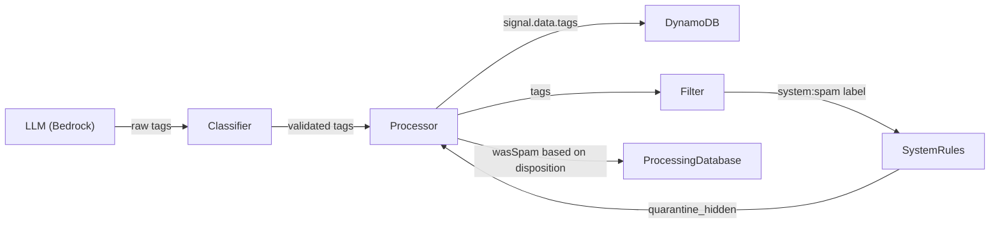

# Design Document: Spam Score to Tags

## Overview

Replace the numeric `spamScore` (0–1 float) with a `tags: string[]` system across the email-catcher backend. Tags are internal-only — they drive system label assignment and are persisted for observability, but are never exposed to users, user-defined rules, or the API.

The change touches: classifier output, prompt builder, filter/system labels, system rules, processor, rule evaluator (removal only), API schemas (removal only), and frontend types (removal only).

No database migration needed — DynamoDB is schemaless; the read layer defaults missing `tags` to `[]`.

## Architecture



Tags flow inward only: LLM → Classifier → Processor → DynamoDB. They influence the `system:spam` label which drives quarantine, but are never read back out through the API or rule evaluator.

## Components and Interfaces

### 1. Tag Vocabulary (new shared constant)

A single source-of-truth constant array of recognized tag values, used by:
- The prompt builder (to instruct the LLM what tags to emit)
- The classifier (to filter LLM output to recognized values only)

```typescript
// src/classifier/tags.ts
export const SPAM_TAGS = [
  "phishing", "bulk-unsolicited", "spoofed-sender", "tracking-heavy",
  "deceptive-subject", "credential-harvest", "malware-link",
  "impersonation", "urgency-manipulation", "hidden-content",
  "known-spam-domain", "pump-and-dump", "lottery-scam",
  "advance-fee", "sextortion", "pharming",
] as const;

export type SpamTag = (typeof SPAM_TAGS)[number];
```

Adding a tag = append to this array. No schema migration needed.

### 2. Classifier (`classifier.ts`)

**Changes:**
- Remove `spamScore` from `ClassificationOutput`
- Add `tags: string[]` to `ClassificationOutput` (validated subset of `SPAM_TAGS`, max 10)
- Remove `spamScore` clamping logic
- Add tag validation: filter to `SPAM_TAGS` vocabulary, enforce max 10, enforce format (lowercase alphanumeric + hyphens, 2–40 chars)
- **Unknown tags:** discard them AND log a TRACK message per unknown tag (observability for potential vocabulary expansion)
- If LLM response contains `spamScore`, discard it silently

### 3. Prompt Builder (`prompt-builder.ts`)

**Changes:**
- Remove `"spamScore"` from JSON output schema
- Add `"tags"` to JSON output schema with vocabulary list from `SPAM_TAGS`
- Remove the "Spam Scoring" section entirely
- Add a "Tags" section instructing the LLM to emit zero or more tags from the vocabulary

### 4. Filter (`filter.ts`)

**Changes:**
- Remove `DEFAULT_SPAM_SCORE_THRESHOLD` export
- `SystemLabelContext`: remove `spamScore` and `spamScoreThreshold`, add `tags: string[]`
- Label logic: `tags.length > 0` → assign `"system:spam"`. Otherwise no spam label.
- Remove `system:spam:high` / `system:spam:medium` assignment entirely

### 5. SystemLabel Union (`types/index.ts`)

- Remove `"system:spam:high"` and `"system:spam:medium"`
- Add `"system:spam"`

### 6. System Rules (`system-rules.ts`)

- Remove SR-04 (`system:spam:high` → `quarantine_hidden`, priority 400)
- Remove SR-06 (`system:spam:medium` → `quarantine`, priority 600)
- Add single rule: `system:spam` → `quarantine_hidden`, priority 400

### 7. Processor (`processor.ts`)

**Changes:**
- Stop reading `spamScore` from `ClassificationOutput`
- Persist `classificationOutput.tags` onto `signal.data.tags` (truncate to 50 elements)
- Pass `tags: classificationOutput.tags` to `assignSystemLabels()` instead of `spamScore`/`spamScoreThreshold`
- Remove `spamScoreThreshold` resolution logic (alias → account → default fallback)
- Remove `DEFAULT_SPAM_SCORE_THRESHOLD` import
- **Reputation `wasSpam` computation:** change from `spamScore >= threshold` to disposition-based. At each `updateGlobalReputation` call site, set `wasSpam: true` when the signal's disposition is quarantine_hidden, quarantine, block_hidden, block, or violation_report.

The processor already calls `updateGlobalReputation` at distinct exit points:
- Early sender block → `wasSpam: true` (blocked disposition)
- Post-classify sender block → `wasSpam: true` (blocked disposition)
- Rule-matched block → `wasSpam: true` (blocked disposition)
- Rule-matched quarantine → `wasSpam: true` (quarantine disposition)
- Normal delivery (end of processing) → `wasSpam: false` (delivered)

This simplifies the logic — no threshold comparison needed. The disposition itself is the signal.

### 8. EmailSignalData (`types/index.ts`)

- Remove `spamScore: number`
- Add `tags: string[]` (non-optional, max 50 elements)

### 9. Alias and AccountFilteringConfig (`types/index.ts`)

- Remove `spamScoreThreshold` from both interfaces

### 10. GlobalSenderReputation (`types/index.ts`)

- **Keep `spamCount: number`** — field name unchanged
- Semantics shift: now counts signals where disposition was enforcement (quarantine/block/violation_report)
- No interface change needed

### 11. ProcessingDatabase (`processing-database.ts`)

- Keep `wasSpam` parameter name (semantics shift to disposition-based)
- Keep `spamCount` in ADD expression — same field, new trigger logic
- No code change in this file — the logic change is in the Processor call sites

### 12. Rule Evaluator (`rule-evaluator.ts`)

**Changes (removal only):**
- Remove `spamScore` from `StrippedSignal` pick type
- Do NOT add `tags` — tags are internal-only, not exposed to user rules
- Update `stripSignalForUserCode()` to remove `spamScore` line

### 13. API Schemas (`api/schemas.ts`)

**Changes (removal only):**
- Remove `spamScore` from `InboundEmailSignalData` response schema
- Remove `spamScoreThreshold` from `Alias` schema
- Remove `spamScoreThreshold` from `AccountFilteringConfig` schema
- Do NOT add `tags` — internal-only

### 14. API Transform (`api/transform.ts`)

**Changes (removal only):**
- Remove `spamScore` from signal data transform
- Remove `spamScoreThreshold` from alias transform
- Do NOT add `tags` — internal-only

### 15. WORKFLOWS Constant Comment

- Replace `Signal.spamScore (0–1)` reference with `Signal.data.tags`
- Keep the example and rationale, update wording

### 16. Frontend Types (separate repository)

- Remove `spamScore` and `spamScoreThreshold` from types
- Remove threshold controls from settings UI
- Remove `signal.spamScore` from rule condition field definitions
- Do NOT add `tags` anywhere — internal-only

## Data Models

### ClassificationOutput (after)

```typescript
export interface ClassificationOutput {
  workflow: Workflow;
  workflowData: WorkflowData;
  tags: string[];      // Validated subset of SPAM_TAGS, max 10
  summary: string;
  labels: string[];
}
```

### EmailSignalData (after, relevant fields)

```typescript
export interface EmailSignalData {
  // ... existing fields ...
  tags: string[];      // Non-optional, max 50 elements. Internal-only.
  // spamScore: number  ← REMOVED
}
```

### SystemLabelContext (after)

```typescript
export interface SystemLabelContext {
  workflow: Workflow;
  workflowData: WorkflowData;
  tags: string[];
  senderETLD1: string;
  aliasSenderConfig: AliasSender | null;
  unknownSenderPolicy: UnknownSenderPolicy;
  hasSentMessages: boolean;
}
```

### GlobalSenderReputation (unchanged)

```typescript
export interface GlobalSenderReputation {
  domain: string;
  verdict?: "allow" | "deny";
  verdictReason?: string;
  signalCount: number;
  spamCount: number;       // NOW: incremented when disposition is enforcement
  blockCount: number;
  lastSeenAt: string;
  updatedAt: string;
}
```

## Correctness Properties

1. **Tag vocabulary is closed:** Only tags in `SPAM_TAGS` reach `signal.data.tags`. Unknown tags are logged and discarded — never persisted or acted upon.
2. **Label assignment is deterministic:** `tags.length > 0` → `system:spam`. No thresholds, no configuration, no ambiguity.
3. **Reputation reflects enforcement, not classification:** `spamCount` increments when the system actually quarantines/blocks, not when the classifier suspects spam. This means a tagged email that passes through due to sender allowlisting does NOT increment spamCount.
4. **Tags never leak externally:** API responses, rule evaluator context, and frontend types do not include tags. The compile-time type removal enforces this.
5. **Legacy data compatibility:** Signals stored without `tags` field default to `[]` on read. No backfill required.

## Error Handling

- **LLM returns unknown tags:** Filtered out + TRACK logged (Requirement 2.5). Valid tags pass through.
- **LLM omits tags field entirely:** Treated as empty array `[]`. Classifier applies fallback: `raw.tags ?? []`.
- **LLM returns > 10 tags:** Truncated to first 10 by the classifier.
- **Signal stored without tags field (legacy):** Database read layer defaults to `[]` (Requirement 6.4).
- **Processor receives > 50 tags from classifier:** Truncated to first 50 before persisting (defensive, since classifier already caps at 10).

## Testing Strategy

Static example-based tests using Vitest. No property-based testing per project convention.

**Unit tests to write/update:**

| Module | Test Focus |
|--------|------------|
| `classifier.ts` | Tag filtering (unknown tags logged + removed), empty tags, format validation, max-10 truncation, `spamScore` field discarded |
| `prompt-builder.ts` | Output schema contains `tags`, no `spamScore`; no "Spam Scoring" section; tag vocabulary present |
| `filter.ts` | `assignSystemLabels` emits `system:spam` when tags non-empty, no spam label when empty; no `system:spam:high`/`medium` |
| `system-rules.ts` | Single spam rule at priority 400 references `system:spam`; no `system:spam:high`/`medium` |
| `rule-evaluator.ts` | Stripped signal excludes `spamScore`, excludes `tags` |
| `processing-database.ts` | `updateGlobalReputation` increments `spamCount` when `wasSpam: true` |
| `api/transform.ts` | Signal transform omits `spamScore`, omits `tags`; alias omits `spamScoreThreshold` |

**Compile-time verification:** `npm run test` (runs `tsc --noEmit -p tsconfig.check.json`) is the primary correctness gate. Removing `spamScore` from interfaces causes compile errors at every stale reference.
