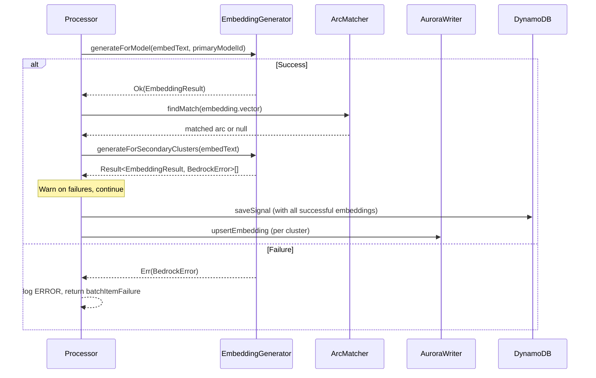

# Design Document: Split Embedding Pipeline

## Overview

This design splits the processor's embedding generation from a single parallel call (`generateForActiveClusters`) into a two-phase pipeline:

1. **Primary phase** — Generate the read cluster's embedding before arc matching. If this fails, the message is retried via batch item failure. This guarantees similarity search always operates on a valid vector.

2. **Secondary phase** — Generate embeddings for all remaining active clusters after arc matching but before signal save. Failures are logged as warnings and tolerated — the upcoming full reindex will catch any gaps.

The refactoring also:
- Converts `generateForModel` from throw-based to `Result`-based error handling
- Adds `generateForSecondaryClusters` to the generator interface
- Adds `getSecondaryClusters()` to the cluster registry
- Removes `generateForActiveClusters` from the public interface
- Removes primary/non-primary logging distinction from `executeAuroraUpserts`
- Updates the reindex worker to use Result-based `generateForModel`

## Architecture



### Key Design Decisions

1. **Primary embedding is blocking** — Without a valid primary vector, arc matching degrades to creating duplicate arcs. This is worse than retrying the message, so we fail hard.

2. **Secondary embeddings are best-effort** — These populate write-ahead indexes for a future cluster migration. The full reindex job runs before any switchover, so gaps are acceptable.

3. **Result-based `generateForModel`** — The current throw-based signature forces callers into try/catch. Returning `Result<EmbeddingResult, BedrockError>` makes error handling explicit and composable with the existing neverthrow patterns.

4. **Remove `generateForActiveClusters`** — The split pipeline makes this method obsolete. Callers now explicitly call primary then secondary, giving them control over failure semantics.

5. **Remove primary/non-primary from `executeAuroraUpserts`** — Embedding failure logging is consolidated in the generation phase. Aurora upserts just log cluster failures uniformly.

## Components and Interfaces

### EmbeddingGenerator (updated interface)

```typescript
export interface EmbeddingGenerator {
  generateForModel(embedText: string, modelId: string): Promise<Result<EmbeddingResult, BedrockError>>;
  generateForSecondaryClusters(embedText: string): Promise<Result<EmbeddingResult, BedrockError>[]>;
}
```

Changes:
- `generateForModel` returns `Result` instead of throwing
- `generateForSecondaryClusters` added — calls Bedrock for each secondary cluster in parallel
- `generateForActiveClusters` removed

### EmbeddingResult (unchanged, fields already required)

```typescript
export interface EmbeddingResult {
  modelId: string;
  vector: number[];      // required
  dimensions: number;    // required
}
```

### Cluster Registry (new helper)

```typescript
export function getSecondaryClusters(): readonly ClusterRegistryEntry[] {
  const primary = getReadCluster();
  return getActiveClusters().filter((c) => c.clusterId !== primary.clusterId);
}
```

### Processor Pipeline Changes

The processor's `processMessage` method changes from:

```typescript
// Before: single parallel call, extract primary result after
const embeddingResults = await this.embeddingGenerator.generateForActiveClusters(embedText);
const readClusterResult = embeddingResults.find(r => r.isOk() && r.value.modelId === readCluster.modelId);
const embedding = readClusterResult?.isOk() ? readClusterResult.value.vector : [];
```

To:

```typescript
// After: explicit two-phase pipeline
// Phase 1: Primary (fail hard)
const primaryResult = await this.embeddingGenerator.generateForModel(embedText, readCluster.modelId);
if (primaryResult.isErr()) {
  this.logger.error("Primary embedding generation failed...", { code: "embedding.primary_failed", ... });
  return err(processError(record.messageId));
}
const embedding = primaryResult.value.vector;

// ... arc matching uses embedding ...

// Phase 2: Secondary (warn only)
const secondaryResults = await this.embeddingGenerator.generateForSecondaryClusters(embedText);
for (const result of secondaryResults) {
  if (result.isErr()) {
    this.logger.warn("Secondary embedding generation failed...", { code: "embedding.secondary_failed", ... });
  }
}

// Compose embeddings map from primary + successful secondaries
const embeddings: Record<string, number[]> = { [primaryResult.value.modelId]: primaryResult.value.vector };
for (const result of secondaryResults) {
  if (result.isOk()) embeddings[result.value.modelId] = result.value.vector;
}
signal.embeddings = embeddings;
```

### executeAuroraUpserts Changes

Remove the `isPrimary` check and log all failures at the same level (ERROR, since Aurora failures still gate side-effect dispatch):

```typescript
for (const failure of failures) {
  if (!failure.success) {
    this.logger.error(message, { code: "processor.aurora_upsert_failed", clusterId: failure.cluster.clusterId, ... });
  }
}
```

### Reindex Worker Changes

```typescript
// Before: throws, requires try/catch and non-null assertion
const result = await embeddingGenerator.generateForModel(embedText, modelId);
await arcDatabase.addEmbeddingToCache(signal.accountId, signal.id, modelId, result.vector!);

// After: Result-based, explicit error path
const result = await embeddingGenerator.generateForModel(embedText, modelId);
if (result.isErr()) {
  return err({ signalId: signal.id, reason: `Embedding generation failed for model "${modelId}": ${result.error.cause.message}` });
}
await arcDatabase.addEmbeddingToCache(signal.accountId, signal.id, modelId, result.value.vector);
```

## Data Models

### EmbeddingResult (no change to shape)

| Field | Type | Required | Description |
|-------|------|----------|-------------|
| modelId | string | yes | Bedrock model ID that produced the embedding |
| vector | number[] | yes | The embedding vector |
| dimensions | number | yes | Vector dimensionality (matches cluster registry) |

### BedrockError (already exists in errors.ts)

| Field | Type | Description |
|-------|------|-------------|
| kind | `"bedrock_error"` | Discriminant |
| modelId | string | Which model failed |
| cause | Error | Underlying error |

### Signal.embeddings (no schema change)

```typescript
embeddings?: Record<string, number[]>;  // modelId → vector
```

The only behavioral change is that `embeddings` is now populated from the two-phase results rather than the single `generateForActiveClusters` call.


## Correctness Properties

*A property is a characteristic or behavior that should hold true across all valid executions of a system — essentially, a formal statement about what the system should do. Properties serve as the bridge between human-readable specifications and machine-verifiable correctness guarantees.*

### Property 1: Primary failure causes batch item failure

*For any* BedrockError returned by `generateForModel` for the primary cluster, the processor SHALL return a batch item failure for that message and log an ERROR with code `embedding.primary_failed`.

**Validates: Requirements 1.2**

### Property 2: Primary vector flows to arc matcher

*For any* successful primary embedding result, the exact vector from that result SHALL be passed to the arc matcher's `findMatch` method — no transformation, truncation, or substitution.

**Validates: Requirements 1.3**

### Property 3: Secondary failures are tolerated

*For any* combination of secondary cluster failures (from 1 failure up to all secondaries failing), the processor SHALL continue processing without returning a batch item failure, and SHALL log a WARN with code `embedding.secondary_failed` for each failure.

**Validates: Requirements 2.2, 2.3**

### Property 4: Embeddings map composition

*For any* set of secondary embedding results (mix of Ok and Err), `signal.embeddings` SHALL contain exactly the primary cluster's vector plus the vectors from all successful secondary results — no more, no less.

**Validates: Requirements 2.4**

### Property 5: generateForModel never throws

*For any* embed text and model ID (including invalid/missing model IDs), `generateForModel` SHALL return a `Result` and never throw an exception.

**Validates: Requirements 3.1**

### Property 6: generateForSecondaryClusters result count

*For any* embed text, `generateForSecondaryClusters` SHALL return exactly one Result per secondary cluster (i.e., `result.length === getSecondaryClusters().length`).

**Validates: Requirements 3.2**

### Property 7: Reindex worker propagates Result errors

*For any* BedrockError returned by `generateForModel` during reindex, the worker SHALL return an error result containing the signal ID and a reason string — without throwing or using non-null assertions.

**Validates: Requirements 4.1**

### Property 8: getSecondaryClusters is the set difference

*For any* cluster registry configuration, `getSecondaryClusters()` SHALL return exactly `getActiveClusters()` minus `getReadCluster()` — i.e., every active cluster that is not the read cluster, and no others.

**Validates: Requirements 5.1, 5.2**

## Error Handling

| Failure | Severity | Behavior |
|---------|----------|----------|
| Primary Bedrock call fails | ERROR | Log `embedding.primary_failed`, return batch item failure (message retried) |
| Secondary Bedrock call fails | WARN | Log `embedding.secondary_failed`, continue processing |
| Aurora upsert fails (any cluster) | ERROR | Log `processor.aurora_upsert_failed`, return process error (message retried) |
| Model ID not in registry | ERROR | Return `Err(BedrockError)` from `generateForModel` |

### Error Codes

- `embedding.primary_failed` — Primary cluster Bedrock call returned an error. Message will be retried.
- `embedding.secondary_failed` — Secondary cluster Bedrock call returned an error. Processing continues. Reindex will catch gaps.
- `processor.aurora_upsert_failed` — Aurora Data API call failed for a cluster. No primary/non-primary distinction.

## Testing Strategy

### Property-Based Tests (fast-check)

Each correctness property maps to a single property-based test with minimum 100 iterations. The project already uses `fast-check` for PBT.

| Property | Test Approach | Generators |
|----------|--------------|------------|
| 1: Primary failure → batch item failure | Mock `generateForModel` to return `Err`, verify processor returns batch item failure | `fc.record({ modelId: fc.string(), cause: fc.string() })` for BedrockError |
| 2: Primary vector flows to arc matcher | Mock `generateForModel` to return `Ok` with random vector, verify arc matcher receives same vector | `fc.float64Array({ minLength: 1024, maxLength: 1024 })` |
| 3: Secondary failures tolerated | Mock `generateForSecondaryClusters` to return random mix of Ok/Err, verify processor returns Ok | `fc.array(fc.oneof(fc.constant('ok'), fc.constant('err')))` |
| 4: Embeddings map composition | Generate random primary + secondary results, verify signal.embeddings matches expected set | Random Ok/Err results with random vectors |
| 5: generateForModel never throws | Generate random embed texts and model IDs, verify no exception escapes | `fc.string()` for embedText, `fc.string()` for modelId |
| 6: Secondary result count | Generate random embed texts, verify array length matches secondary cluster count | `fc.string()` |
| 7: Reindex worker Result propagation | Mock generator to return Err, verify worker returns err with signal ID | Random signal IDs and error causes |
| 8: getSecondaryClusters set difference | Generate random cluster registries, verify set difference property | `fc.array(fc.record({ active: fc.boolean(), ... }))` |

### Unit Tests (example-based)

- Processor call ordering: primary → arc match → secondary (integration/ordering)
- Aurora upsert failure logging has no primary/non-primary distinction
- Edge case: single active cluster → `getSecondaryClusters()` returns `[]`
- Edge case: all secondary clusters fail → signal.embeddings contains only primary

### Configuration

- PBT library: `fast-check`
- Minimum iterations: 100
- Tag format: `Feature: split-embedding-pipeline, Property {N}: {title}`
