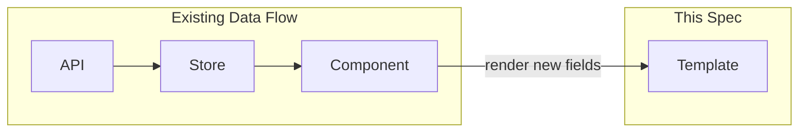

# Design Document

## Overview

Surface seven unused-but-typed backend properties across existing UI components. All fields already exist on `src/types/server.ts` — this work adds rendering logic only. No new components, no new API calls (the alias PATCH endpoint already accepts `spamScoreThreshold`), no backend changes.

Each requirement maps to a single existing file with a small template addition and (where needed) a reactive binding.

## Architecture

No architectural changes. Each item is a localised template/script addition within the existing Vue 3 + Pinia + Tailwind (Catppuccin) stack.



## Components and Interfaces

### 1. RuleEditorView.vue — Per-Action Disable Toggle

**Type source:** `RuleAction.disabled?: boolean`

**Changes:**
- In the actions list `v-for`, add a toggle button per action row that flips `action.disabled`.
- When `action.disabled === true`, apply `opacity-50` to the row and show a "Disabled" text badge.
- The `save()` function already serialises the full `RuleAction[]` including `disabled`, so no save-path changes needed.

**Template addition** (inside the action `v-for`, before the remove button):
```html
<button
  class="rounded-full px-2 py-0.5 text-xs transition-colors"
  :class="act.disabled ? 'bg-ctp-surface1 text-ctp-subtext0' : 'bg-ctp-green/15 text-ctp-green'"
  @click="updateAction(idx, { disabled: !act.disabled })"
>
  {{ act.disabled ? 'Disabled' : 'Enabled' }}
</button>
```

**Row wrapper** — add conditional class to the existing action row div:
```html
:class="{ 'opacity-50': act.disabled }"
```

### 2. TemplatesView.vue — Template Function Error Indicator

**Type source:** `TemplateFunction.lastError?: string`

**Changes (template list):**
- After the template name `<p>`, check if any function in `tpl.functions` has a truthy `lastError`. If so, render an error dot/badge.

```html
<span
  v-if="tpl.functions?.some(f => f.lastError)"
  class="ml-1.5 inline-block h-2 w-2 rounded-full bg-ctp-red"
  title="Function error"
  aria-label="Has function error"
/>
```

**Changes (editor function list):**
- Below each function's `CodeEditor`, when the loaded function has `lastError` (from server, distinct from local `fnErrors`), show it:

```html
<div
  v-if="fn.lastError && !fnErrors[fn.name]"
  class="mt-2 flex items-start gap-1.5 rounded bg-ctp-peach/10 px-2 py-1.5 font-mono text-xs text-ctp-peach"
>
  <span class="shrink-0">⚠</span>
  <span>Last execution error: {{ fn.lastError }}</span>
</div>
```

### 3. SettingsView.vue (emails tab) — Per-Alias Spam Score Threshold

**Type source:** `Alias.spamScoreThreshold?: number`

**Changes:**
- Below the filter-mode buttons for each alias, add a spam threshold row.
- A number input (0–10, step 0.1) with a "clear to use account default" button.
- On change, call `updateAlias` with `{ spamScoreThreshold }`.

**API change:** Extend the existing `api.updateAlias` body type to include `spamScoreThreshold?: number`. The backend already accepts it — the existing call signature just omits it.

**Template addition** (inside the alias `v-for`, after the filter description `<p>`):
```html
<div class="mt-2 flex items-center gap-2">
  <label :for="`spam-${alias.alias}`" class="text-xs text-ctp-subtext0">Spam threshold:</label>
  <input
    :id="`spam-${alias.alias}`"
    type="number"
    min="0"
    max="10"
    step="0.1"
    :value="alias.spamScoreThreshold ?? ''"
    :placeholder="'account default'"
    class="w-20 rounded border border-ctp-surface1 bg-ctp-base px-2 py-1 text-xs text-ctp-text focus:border-ctp-mauve focus:outline-none"
    @change="updateAliasThreshold(alias.address, ($event.target as HTMLInputElement).value)"
  />
  <button
    v-if="alias.spamScoreThreshold != null"
    class="text-xs text-ctp-subtext0 hover:text-ctp-text"
    @click="updateAliasThreshold(alias.address, '')"
  >
    Reset
  </button>
</div>
```

**Script addition:**
```ts
async function updateAliasThreshold(address: string, raw: string) {
  if (!accountStore.accountId) return
  const value = raw.trim() === '' ? undefined : Math.min(10, Math.max(0, Number(raw)))
  const result = await api.updateAlias(accountStore.accountId, address, { spamScoreThreshold: value })
  if (result.isOk()) {
    aliases.value = aliases.value.map(a => a.address === address ? result.value : a)
  }
}
```

**api.ts change:** Add `spamScoreThreshold?: number` to the `updateAlias` body parameter type.

### 4. SettingsView.vue (forwarding tab) — Verification Date

**Type source:** `ForwardingAddress.verifiedAt?: string`

**Changes:** In the forwarding list, replace the plain status text with a conditional badge:

```html
<div>
  <p class="text-sm text-ctp-text">{{ fwd.address }}</p>
  <p v-if="fwd.verifiedAt" class="text-xs text-ctp-green">
    Verified on {{ new Date(fwd.verifiedAt).toLocaleDateString(undefined, { dateStyle: 'medium' }) }}
  </p>
  <p v-else class="text-xs text-ctp-yellow">Pending verification</p>
</div>
```

### 5. CalendarEventCard.vue — External Link

**Type source:** `CalendarEventData.url?: string`

**Changes:** After the description paragraph, conditionally render a link:

```html
<a
  v-if="signal.data.url"
  :href="signal.data.url"
  target="_blank"
  rel="noopener noreferrer"
  class="mt-2 inline-flex items-center gap-1 text-xs text-ctp-blue hover:underline"
>
  View in calendar ↗
</a>
```

### 6. SystemAlertCard.vue — Deep Links

**Type source:** `InvalidRuleFunctionData.resourceName`, `InvalidTemplateFunctionData.resourceName`

**Changes:**
- Import `RouterLink` from `vue-router`.
- For `invalid_rule_function`: wrap `signal.data.resourceName` in a `<RouterLink :to="'/rules/' + signal.data.resourceName">`.
- For `invalid_template_function`: wrap `signal.data.resourceName` in a `<RouterLink to="/templates">`.

```html
<!-- invalid_rule_function -->
<template v-if="signal.type === 'invalid_rule_function'">
  <p class="text-sm text-ctp-subtext1">
    Rule <RouterLink :to="`/rules/${signal.data.resourceName}`" class="font-medium text-ctp-mauve hover:underline">{{ signal.data.resourceName }}</RouterLink> has an error:
  </p>
  <p class="mt-1 text-xs text-ctp-red">{{ signal.data.issue }}</p>
</template>

<!-- invalid_template_function -->
<template v-else-if="signal.type === 'invalid_template_function'">
  <p class="text-sm text-ctp-subtext1">
    Template function <span class="font-medium text-ctp-text">{{ signal.data.functionName }}</span>
    in <RouterLink to="/templates" class="font-medium text-ctp-mauve hover:underline">{{ signal.data.resourceName }}</RouterLink> has an error:
  </p>
  <p class="mt-1 text-xs text-ctp-red">{{ signal.data.issue }}</p>
</template>
```

### 7. ArcDetailView.vue — Deleted Arc Timestamp

**Type source:** `Arc.deletedAt?: string`

**Changes:** In the arc header metadata line, after the status span, conditionally show the deletion date:

```html
<span v-if="signalsStore.arc.status === 'deleted' && signalsStore.arc.deletedAt">
  · Deleted on {{ new Date(signalsStore.arc.deletedAt).toLocaleDateString(undefined, { dateStyle: 'medium' }) }}
</span>
```

## Data Models

No new types or stores. All fields already exist on `src/types/server.ts`:

| Field | Type | Location |
|-------|------|----------|
| `RuleAction.disabled` | `boolean \| undefined` | `server.ts` |
| `TemplateFunction.lastError` | `string \| undefined` | `server.ts` |
| `Alias.spamScoreThreshold` | `number \| undefined` | `server.ts` |
| `ForwardingAddress.verifiedAt` | `string \| undefined` | `server.ts` |
| `CalendarEventData.url` | `string \| undefined` | `server.ts` |
| `Arc.deletedAt` | `string \| undefined` | `server.ts` |

**One API signature change needed:** `api.updateAlias` body type gains `spamScoreThreshold?: number`.

## Error Handling

- Spam threshold input: clamped to [0, 10] via `Math.min/max` before sending. Empty string sends `undefined` (revert to default).
- `updateAlias` failure: no UI error banner needed — the value simply doesn't persist, matching existing alias update behaviour.
- External calendar link: `rel="noopener noreferrer"` prevents tab-napping. No validation needed — the URL comes from the backend.
- Deep links to rules/templates: if the target doesn't exist, the destination view handles the 404 case already.

## Testing Strategy

**PBT does not apply.** This feature is pure UI rendering — displaying already-available data fields in templates. There are no data transformations, parsers, or algorithms with meaningful input variation. The work is better validated by:

1. **Example-based unit tests** (Vitest + Vue Test Utils):
   - Mount each component with fixture data containing the new field → assert the expected element renders.
   - Mount with the field absent/undefined → assert the element does NOT render.
   - For the spam threshold: simulate input change → verify the emitted API call contains the correct value.

2. **Manual smoke tests:**
   - Each change is visually verifiable in the browser against real data.

3. **Type safety:**
   - TypeScript strict mode ensures we don't access non-existent fields. The types already declare these optionals, so rendering them is type-safe by construction.

**Files to test:**
| Component | Test focus |
|-----------|-----------|
| RuleEditorView | disabled toggle renders, opacity applied, save includes disabled |
| TemplatesView | error dot appears when lastError present |
| SettingsView (emails) | threshold input renders, clamp logic, reset to undefined |
| SettingsView (forwarding) | verifiedAt badge renders vs pending |
| CalendarEventCard | link renders when url present, absent when not |
| SystemAlertCard | RouterLink rendered with correct `to` prop |
| ArcDetailView | deletedAt shown only when status=deleted |
