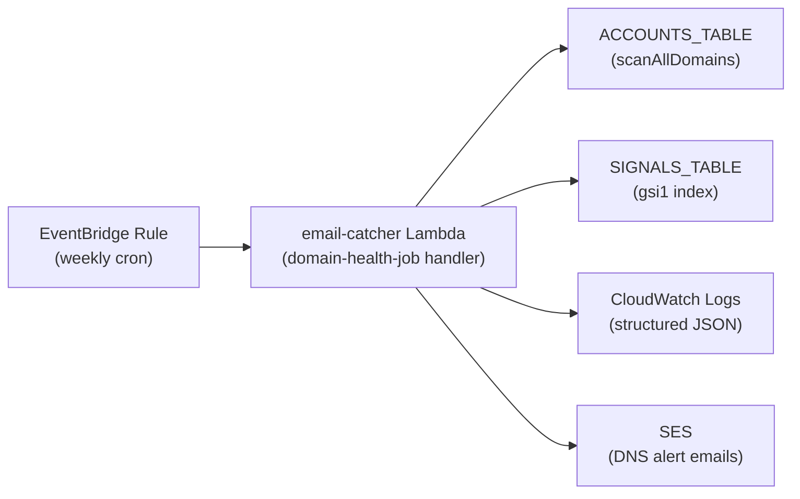

# Design Document: User Engagement Tracking

## Overview

The staleness checker is a scheduled Lambda that identifies arcs which have gone unattended for over 7 days. It queries the existing GSI on `SIGNALS_TABLE` for active arcs sorted by `lastSignalAt`, filters for outstanding arcs (active, non-silent urgency, older than 7 days), groups them by account, and emits TRACK-level structured JSON logs per account. The existing logging infrastructure handles downstream alerting (daily batch notifications per ADR 002).

The design is intentionally minimal: a single Lambda function with no new tables, no new indexes, and no per-account configuration. User actions already bump `lastSignalAt` via signals, so acted-on arcs naturally clear themselves from the outstanding set.

## Architecture



**Execution flow:**

The staleness check piggybacks on the existing `domain-health-job.ts` handler, which already loops over all accounts weekly. After checking domain DNS health for each account, the handler also queries that account's stale arcs and emits TRACK-level logs.

1. EventBridge triggers the existing weekly domain health job
2. For each account (already discovered via `scanAllDomains`):
   a. Check domain DNS health (existing behaviour)
   b. Query `gsi1` for active arcs with `lastSignalAt` older than 7 days
   c. Filter out `urgency: "silent"` arcs
   d. If outstanding arcs exist, emit a TRACK-level log entry
3. After all accounts processed, emit an INFO-level run-complete summary

**Key design decisions:**

- **No separate Lambda**: One Lambda per project. The staleness check is added to the existing weekly domain health handler.
- **No new GSI**: The existing `gsi1` already encodes `ACCT#${accountId}` as partition key and `LASTACT#${status}#${lastSignalAt}#${id}` as sort key. We query per-account active arcs sorted by `lastSignalAt` ascending.
- **No state**: The checker is stateless — it computes outstanding arcs fresh each run. No persistence needed.
- **Shared account loop**: `scanAllDomains` already discovers all accounts. The staleness query runs inside the same per-account iteration.

## Components and Interfaces

### StalenessChecker (added to domain-health-job.ts)

The staleness check is integrated into the existing `domain-health-job.ts` handler. After domain health checks complete for each account, the handler queries stale arcs:

```typescript
// Added to the per-account loop in domain-health-job.ts
const staleArcs = await arcDb.listStaleActiveArcs(accountId, cutoffDate);
const outstanding = staleArcs.filter(arc => isOutstandingArc(arc, cutoffDate));
if (outstanding.length > 0) {
  console.log(JSON.stringify(buildAccountLogEntry(...)));
}
```

### StalenessLogic (pure functions)

```typescript
// src/jobs/staleness-logic.ts

export interface OutstandingArc {
  id: string;
  accountId: string;
  lastSignalAt: string;
  urgency: ArcUrgency | undefined;
  workflow: Workflow;
}

export interface AccountStalenessReport {
  accountId: string;
  outstandingArcCount: number;
  oldestArcLastSignalAt: string;
}

/** Determine if an arc qualifies as outstanding */
export function isOutstandingArc(arc: Arc, cutoffDate: string): boolean;

/** Group outstanding arcs by accountId and compute per-account report */
export function buildAccountReports(arcs: OutstandingArc[]): AccountStalenessReport[];

/** Build the TRACK-level log entry for an account */
export function buildAccountLogEntry(report: AccountStalenessReport, timestamp: string): object;

/** Build the INFO-level run-complete log entry */
export function buildRunCompleteLogEntry(
  reports: AccountStalenessReport[],
  durationMs: number,
  timestamp: string
): object;
```

### ArcDatabase (existing, extended)

A new method to query active arcs for a specific account before a given timestamp:

```typescript
/** Query active arcs for a specific account with lastSignalAt before a cutoff, ascending order */
async listActiveArcsBefore(accountId: string, beforeDate: string): Promise<Arc[]>;
```

Account discovery is already handled by `scanAllDomains()` in the domain health job — no new method needed for that.

## Data Models

### GSI Query Pattern

The existing `gsi1` index supports the staleness query:

- **Partition key**: `gsi1pk = ACCT#${accountId}`
- **Sort key**: `gsi1sk = LASTACT#active#${lastSignalAt}#${id}`

To find stale arcs for an account:
```
KeyConditionExpression: "gsi1pk = :pk AND gsi1sk BETWEEN :start AND :end"
ExpressionAttributeValues: {
  ":pk": `ACCT#${accountId}`,
  ":start": "LASTACT#active#",
  ":end": `LASTACT#active#${cutoffDate}#`
}
```

This returns active arcs with `lastSignalAt` ≤ cutoff, sorted ascending (oldest first).

### Structured Log Entries

**TRACK-level per-account entry:**
```json
{
  "level": "track",
  "message": "staleness_checker.outstanding_arcs",
  "accountId": "acc_123",
  "outstandingArcCount": 5,
  "oldestArcLastSignalAt": "2025-04-28T10:00:00.000Z",
  "timestamp": "2025-05-11T16:00:00.000Z"
}
```

**INFO-level run-complete entry:**
```json
{
  "level": "info",
  "message": "staleness_checker.run_complete",
  "accountsWithOutstandingArcs": 3,
  "totalOutstandingArcs": 12,
  "durationMs": 4500,
  "timestamp": "2025-05-11T16:00:00.000Z"
}
```

### Outstanding Arc Criteria

An arc is outstanding when ALL of:
1. `status === "active"`
2. `urgency !== "silent"` (undefined treated as `"normal"`)
3. `lastSignalAt < now - 7 days`

All workflows are included (including `"test"`).

## Correctness Properties

*A property is a characteristic or behavior that should hold true across all valid executions of a system — essentially, a formal statement about what the system should do. Properties serve as the bridge between human-readable specifications and machine-verifiable correctness guarantees.*

### Property 1: Outstanding arc classification

*For any* arc with any combination of `status`, `urgency` (including undefined), `workflow`, and `lastSignalAt`, `isOutstandingArc(arc, cutoff)` returns `true` if and only if `status === "active"` AND `urgency !== "silent"` (with undefined treated as `"normal"`) AND `lastSignalAt < cutoff`. The `workflow` field has no effect on the result.

**Validates: Requirements 1.1, 1.2, 1.3**

### Property 2: Account report grouping correctness

*For any* non-empty list of outstanding arcs with varying `accountId` and `lastSignalAt` values, `buildAccountReports` produces exactly one entry per unique `accountId`, where `outstandingArcCount` equals the number of arcs for that account, and `oldestArcLastSignalAt` equals the minimum `lastSignalAt` among that account's arcs.

**Validates: Requirements 1.4, 3.5**

### Property 3: TRACK log entry structure

*For any* valid `AccountStalenessReport` and timestamp, `buildAccountLogEntry` produces an object containing exactly: `level: "track"`, `message: "staleness_checker.outstanding_arcs"`, the report's `accountId`, `outstandingArcCount`, `oldestArcLastSignalAt`, and the provided `timestamp`.

**Validates: Requirements 2.1**

### Property 4: Run-complete log entry structure

*For any* list of `AccountStalenessReport` values and any positive `durationMs`, `buildRunCompleteLogEntry` produces an object containing exactly: `level: "info"`, `message: "staleness_checker.run_complete"`, `accountsWithOutstandingArcs` equal to the list length, `totalOutstandingArcs` equal to the sum of all `outstandingArcCount` values, the provided `durationMs`, and the provided `timestamp`.

**Validates: Requirements 2.3**

## Error Handling

| Scenario | Behaviour | Log Level |
|----------|-----------|-----------|
| Single account query fails | Log error with accountId and error message, continue to next account | ERROR |
| All account queries fail | Run-complete log still emitted with zero counts and actual duration | INFO |
| No accounts found | Run-complete log emitted with zero counts | INFO |
| Lambda timeout approaching | Not handled — the weekly cadence and expected data volume make this unlikely. If it becomes a problem, pagination or parallel queries can be added. | — |

Error log entry format:
```json
{
  "level": "error",
  "message": "staleness_checker.account_error",
  "accountId": "acc_123",
  "error": "Query failed: ProvisionedThroughputExceededException",
  "timestamp": "2025-05-11T16:00:00.000Z"
}
```

## Testing Strategy

### Property-Based Tests (fast-check + vitest)

Each correctness property maps to a single property-based test with minimum 100 iterations:

1. **`isOutstandingArc` classification** — Generate random arcs with all valid `ArcStatus`, `ArcUrgency | undefined`, `Workflow`, and ISO timestamp values. Assert the function returns true iff all three conditions hold.
2. **`buildAccountReports` grouping** — Generate random lists of `OutstandingArc` with varying accountIds and timestamps. Assert one report per account with correct count and min timestamp.
3. **`buildAccountLogEntry` structure** — Generate random reports and timestamps. Assert output shape matches the TRACK schema exactly.
4. **`buildRunCompleteLogEntry` structure** — Generate random report lists and durations. Assert output shape matches the INFO schema exactly.

**Library**: fast-check (already in project dependencies)
**Configuration**: 100+ iterations per property, tagged with property reference

### Unit Tests (vitest)

- `isOutstandingArc` with specific edge cases: undefined urgency, exactly 7 days old (not outstanding), 7 days + 1ms (outstanding)
- `buildAccountReports` with empty input returns empty array
- Error handling: mock database to throw for one account, verify others still processed

### Integration Tests

- Query `listStaleActiveArcs` against DynamoDB Local with seeded data to verify GSI query correctness
- End-to-end handler invocation with mocked DynamoDB verifying log output

