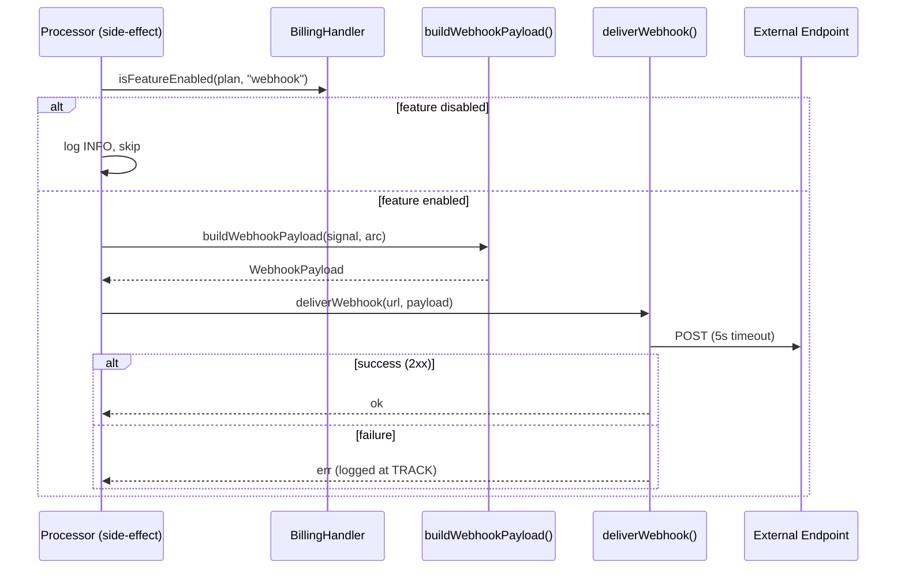

# Design Document: Webhook Rule Action

## Overview

Adds a `webhook` action type to the rule engine. When a rule fires with a webhook action, the side-effect processor POSTs a curated subset of signal/arc data to a user-configured HTTP endpoint. Delivery is fire-and-forget: single attempt, 5-second timeout, no retries, no auth headers. Failures are logged at TRACK level and swallowed.

The feature introduces three new components:
1. **BillingHandler** — a feature-gating abstraction that maps plans to enabled features, decoupling call sites from plan names.
2. **Webhook payload builder** — a pure function that projects a Signal + Arc into the explicit field subset defined in the requirements.
3. **Webhook delivery function** — HTTP POST with timeout, called last in the side-effect chain.

## Architecture



The webhook runs **last** in `processSideEffect()`, after forward, notify, pong, and auto_draft. This ensures the payload reflects the final arc state (including labels assigned by rules).

## Components and Interfaces

### 1. BillingHandler (`src/billing/billing-handler.ts`)

A standalone class with a single responsibility: mapping plan identifiers to feature sets.

```typescript
export type Feature = "webhook";

export class BillingHandler {
  private static readonly PLAN_FEATURES: Record<BillingPlan, Set<Feature>> = {
    Trial: new Set(),
    Free: new Set(),
    Beta: new Set(["webhook"]),
    Paid: new Set(["webhook"]),
    Lifetime: new Set(["webhook"]),
    Premium: new Set(["webhook"]),
    Internal: new Set(["webhook"]),
  };

  isFeatureEnabled(accountPlan: BillingPlan, feature: Feature): boolean {
    return BillingHandler.PLAN_FEATURES[accountPlan]?.has(feature) ?? false;
  }
}
```

**Design decisions:**
- Static mapping — no database lookups, no async. Pure and testable.
- `Feature` is a string literal union, extensible as new gated features are added.
- The mapping lives in one place; adding a feature to a plan is a single-line change.
- Injected into the processor via `SignalProcessorOptions` and into the API via the `createApp` options.

### 2. Webhook payload builder (`src/processor/webhook.ts`)

A pure function that projects the allowed fields from Signal + Arc into the webhook payload shape.

```typescript
export interface WebhookPayload {
  id: string;
  arcId: string | undefined;
  receivedAt: string;
  from: { address: string; name?: string };
  to: Array<{ address: string; name?: string }>;
  cc: Array<{ address: string; name?: string }>;
  replyTo?: { address: string; name?: string };
  subject: string;
  alias: string;
  workflow: string;
  workflowData: Record<string, unknown>;
  summary: string;
  labels: string[];
}

export function buildWebhookPayload(signal: Signal, arc: Arc | null): WebhookPayload {
  return {
    id: signal.id,
    arcId: signal.arcId,
    receivedAt: signal.receivedAt,
    from: { address: signal.from.address, ...(signal.from.name ? { name: signal.from.name } : {}) },
    to: signal.to.map(a => ({ address: a.address, ...(a.name ? { name: a.name } : {}) })),
    cc: signal.cc.map(a => ({ address: a.address, ...(a.name ? { name: a.name } : {}) })),
    ...(signal.replyTo ? { replyTo: { address: signal.replyTo.address, ...(signal.replyTo.name ? { name: signal.replyTo.name } : {}) } } : {}),
    subject: signal.subject,
    alias: signal.recipientAddress,
    workflow: signal.workflow,
    workflowData: signal.workflowData as Record<string, unknown>,
    summary: signal.summary,
    labels: arc?.labels ?? [],
  };
}
```

**Design decisions:**
- `alias` maps to `signal.recipientAddress` — the envelope recipient is the alias that received the email.
- `labels` comes from the arc (not the signal) because labels are assigned to arcs. If no arc exists (shouldn't happen in side-effect path, but defensive), returns `[]`.
- Explicit field projection ensures internal fields (`s3Key`, `embeddings`, `signalLookupId`, etc.) are never leaked.

### 3. Webhook delivery function (`src/processor/webhook.ts`)

```typescript
export interface WebhookDeliveryResult {
  success: boolean;
  statusCode?: number;
  error?: string;
}

export async function deliverWebhook(url: string, payload: WebhookPayload, logger: Logger): Promise<WebhookDeliveryResult> {
  try {
    const controller = new AbortController();
    const timeout = setTimeout(() => controller.abort(), 5000);

    const response = await fetch(url, {
      method: "POST",
      headers: { "Content-Type": "application/json" },
      body: JSON.stringify(payload),
      signal: controller.signal,
    });

    clearTimeout(timeout);

    if (!response.ok) {
      logger.track("Webhook delivery failed — non-2xx response.", {
        code: "processor.side_effect.webhook_failed",
        url,
        statusCode: response.status,
      });
      return { success: false, statusCode: response.status };
    }

    return { success: true, statusCode: response.status };
  } catch (e) {
    logger.track("Webhook delivery failed — network error or timeout.", {
      code: "processor.side_effect.webhook_error",
      url,
      error: e,
    });
    return { success: false, error: message };
  }
}
```

**Design decisions:**
- Uses Node.js built-in `fetch` (available in Node >=18, required >=24 for this project). No external HTTP library needed.
- `AbortController` with 5-second timeout. On abort, the catch block handles it like any network error.
- Single attempt — no retry logic.
- Returns a result object for testability, but the caller ignores it (fire-and-forget).

### 4. Webhook config validation (`src/api/validate-webhook-config.ts`)

```typescript
export interface WebhookConfig {
  url: string;
}

/** Used at API layer — returns a human-readable error string or null if valid */
export function validateWebhookConfig(value: string | undefined): string | null {
  if (!value) return "webhook action requires a value field containing the endpoint URL configuration";

  let parsed: unknown;
  try {
    parsed = JSON.parse(value);
  } catch {
    return "webhook action value must be valid JSON";
  }

  if (typeof parsed !== "object" || parsed === null || Array.isArray(parsed)) {
    return "webhook action value must be a JSON object";
  }

  const config = parsed as Record<string, unknown>;
  if (typeof config.url !== "string" || config.url.trim().length === 0) {
    return "webhook action value must contain a non-empty 'url' field";
  }

  try {
    const url = new URL(config.url);
    if (url.protocol !== "http:" && url.protocol !== "https:") {
      return "webhook URL must use http or https protocol";
    }
  } catch {
    return "webhook URL is not a valid URL";
  }

  return null; // valid
}

/** Used at processor layer — returns a Result<WebhookConfig, string> */
export function parseWebhookConfig(value: string | undefined): Result<WebhookConfig, string> {
  const error = validateWebhookConfig(value);
  if (error) return err(error);
  const config = JSON.parse(value!) as WebhookConfig;
  return ok(config);
}
```

### 5. RuleActionType enum update

In `src/types/index.ts`:
```typescript
export const RULE_ACTION_TYPES = [
  "assign_label", "assign_workflow", "archive", "delete", "forward",
  "block_hidden", "block_reject", "quarantine", "quarantine_hidden",
  "set_urgency", "suppress_notification", "pong", "approve_sender",
  "auto_draft", "webhook",
] as const;
```

In `src/api/requests.ts`:
```typescript
const RuleActionType = z.enum([
  "assign_label", "assign_workflow", "archive", "delete", "forward",
  "block_hidden", "block_reject", "quarantine", "quarantine_hidden",
  "set_urgency", "suppress_notification", "pong", "approve_sender",
  "auto_draft", "webhook",
]);
```

### 6. Integration in `processSideEffect()`

After the auto_draft block and before `this.logger.trackPoint("side_effect_all_complete")`:

```typescript
// Webhook (best-effort — never blocks or retries)
const webhookActions = (signal.matchedRules ?? [])
  .flatMap(r => r.actions.filter(a => a.type === "webhook" && a.value));
if (webhookActions.length > 0) {
  const accountCtxResult = await this.store.getProcessorAccountContext(accountId, signal.recipientAddress);
  const accountPlan = accountCtxResult.isOk() ? accountCtxResult.value.billingPlan : "Free";

  if (!this.billingHandler.isFeatureEnabled(accountPlan, "webhook")) {
    this.logger.info("Webhook action skipped — feature not enabled for plan.", {
      code: "processor.side_effect.webhook_plan_gated",
      accountId,
      plan: accountPlan,
    });
  } else {
    const payload = buildWebhookPayload(signal, arc);
    for (const action of webhookActions) {
      const configResult = parseWebhookConfig(action.value);
      if (configResult.isErr()) {
        this.logger.track("Webhook action skipped — invalid config at processing time.", {
          code: "processor.side_effect.webhook_invalid_config",
          accountId,
          value: action.value,
          error: configResult.error,
        });
        continue;
      }
      await deliverWebhook(configResult.value.url, payload, this.logger);
    }
  }
}
```

**Design decisions:**
- Webhook runs after all other side-effects so the arc's labels are final.
- Account context is fetched to get the billing plan. In the side-effect path, this is a DynamoDB read (already cached in the inbound path, but the side-effect runs in a separate SQS consumer invocation).
- If the plan check fails (e.g., account downgraded between rule creation and signal processing), the webhook is silently skipped with an INFO log.
- Multiple webhook actions on the same signal are supported (multiple rules can each have a webhook action).

### 7. API validation integration

In the rule create/update routes (`app.ts`), after the existing `validateForwardTargets` call:

```typescript
const webhookError = validateWebhookActions(body.actions as Rule["actions"], accountPlan, billingHandler);
if (webhookError) return err(c, 400, webhookError.message, webhookError.code);
```

Where `validateWebhookActions` checks:
1. For each action with `type === "webhook"`: validate the config via `validateWebhookConfig`.
2. If any webhook action exists: check `billingHandler.isFeatureEnabled(plan, "webhook")`. If not enabled, return a plan-gating error.

The account's plan is fetched via `store.getAccount(accountId)` (already available in the route context for other validations).

## Data Models

### WebhookConfig (stored in `rule.actions[].value`)

```json
{
  "url": "https://example.com/webhook"
}
```

Stored as a JSON-encoded string in the existing `value: z.string().optional()` field on `RuleActionSchema`. No schema migration needed.

### WebhookPayload (HTTP POST body)

```json
{
  "id": "sgn-mRk3oCMDhFXGF7CzHBt22Xabc",
  "arcId": "arc-abc123",
  "receivedAt": "2024-01-15T10:30:00.000Z",
  "from": { "address": "sender@example.com", "name": "Alice" },
  "to": [{ "address": "me@myalias.com" }],
  "cc": [],
  "replyTo": { "address": "reply@example.com" },
  "subject": "Invoice #1234",
  "alias": "me@myalias.com",
  "workflow": "crm",
  "workflowData": { "crmType": "invoice", "urgency": "normal" },
  "summary": "Invoice from Acme Corp for January services",
  "labels": ["system:workflow:crm", "invoices"]
}
```

### Feature mapping (in BillingHandler)

| Plan | webhook |
|------|---------|
| Trial | ❌ |
| Free | ❌ |
| Beta | ✅ |
| Paid | ✅ |
| Lifetime | ✅ |
| Premium | ✅ |
| Internal | ✅ |

## Error Handling

| Scenario | Behaviour |
|----------|-----------|
| Webhook timeout (5s) | `fetch` aborted via `AbortController`, logged at TRACK, processing continues |
| Non-2xx response | Logged at TRACK with status code, processing continues |
| Network error (DNS, connection refused) | Caught in try/catch, logged at TRACK, processing continues |
| Malformed config at processing time | Logged at TRACK, webhook skipped, processing continues |
| Plan doesn't include webhook (processing time) | Logged at INFO, webhook skipped |
| Invalid config at rule creation | 400 response with descriptive error message |
| Plan doesn't include webhook (rule creation) | 400 response with `PLAN_FEATURE_REQUIRED` error code |

All webhook failures are non-fatal. The `criticalFailure` variable (which triggers SQS retry) is never set by webhook code.

## Testing Strategy

**No property-based testing.** This project uses static deterministic tests only (per workspace conventions).

### Unit tests

| Module | Test focus |
|--------|-----------|
| `billing-handler.spec.ts` | `isFeatureEnabled` returns correct boolean for each plan × feature combination |
| `webhook.spec.ts` (payload builder) | Explicit signal/arc inputs → expected payload shape; verifies excluded fields are absent |
| `webhook.spec.ts` (delivery) | Mocked `fetch`: success (200), non-2xx (500), timeout (abort), network error |
| `validate-webhook-config.spec.ts` | Missing value, invalid JSON, missing url, non-http URL, valid config |

### Integration tests

| Test | Focus |
|------|-------|
| `processor.side-effect` tests | Webhook fires last; webhook skipped when plan-gated; multiple webhook actions |
| API rule creation tests | Webhook action accepted with valid config; rejected with invalid config; rejected when plan-gated |

### Test structure

Each test uses `it.each` with labelled cases where multiple inputs exercise distinct code paths. No random generation, no iteration counts.

Example for `validateWebhookConfig`:
```typescript
it.each([
  { label: "missing value", value: undefined, expected: "webhook action requires a value field" },
  { label: "invalid JSON", value: "not json", expected: "must be valid JSON" },
  { label: "missing url", value: '{"foo":"bar"}', expected: "must contain a non-empty 'url' field" },
  { label: "ftp protocol", value: '{"url":"ftp://x.com/hook"}', expected: "must use http or https" },
  { label: "valid https", value: '{"url":"https://example.com/hook"}', expected: null },
  { label: "valid http", value: '{"url":"http://localhost:3000/hook"}', expected: null },
])("$label", ({ value, expected }) => {
  const result = validateWebhookConfig(value);
  if (expected === null) {
    expect(result).toBeNull();
  } else {
    expect(result).toContain(expected);
  }
});
```
