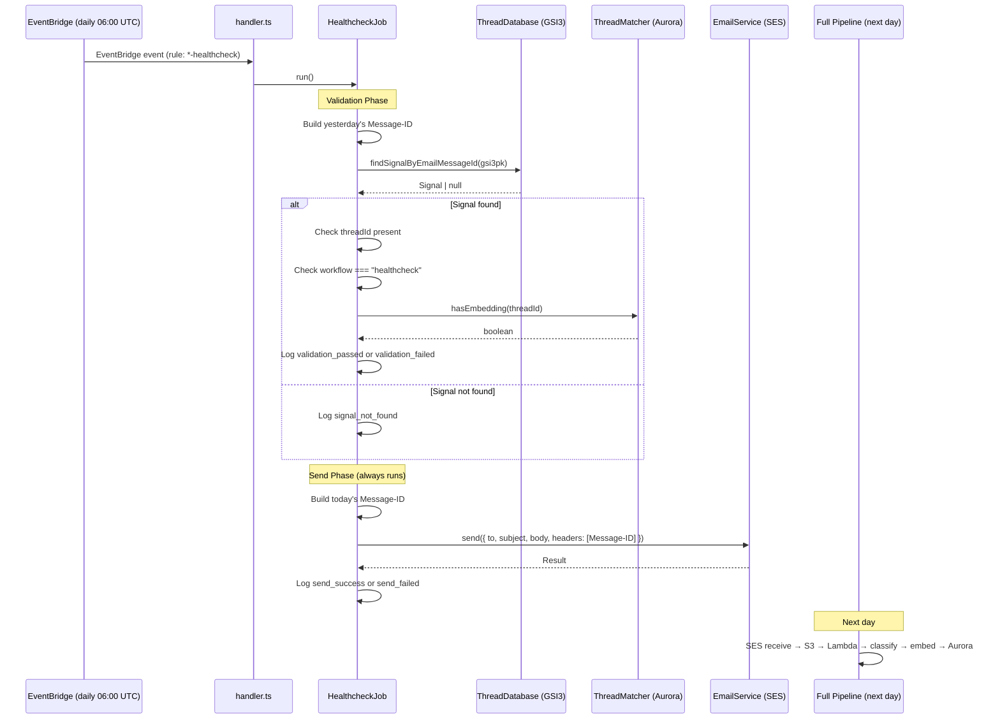
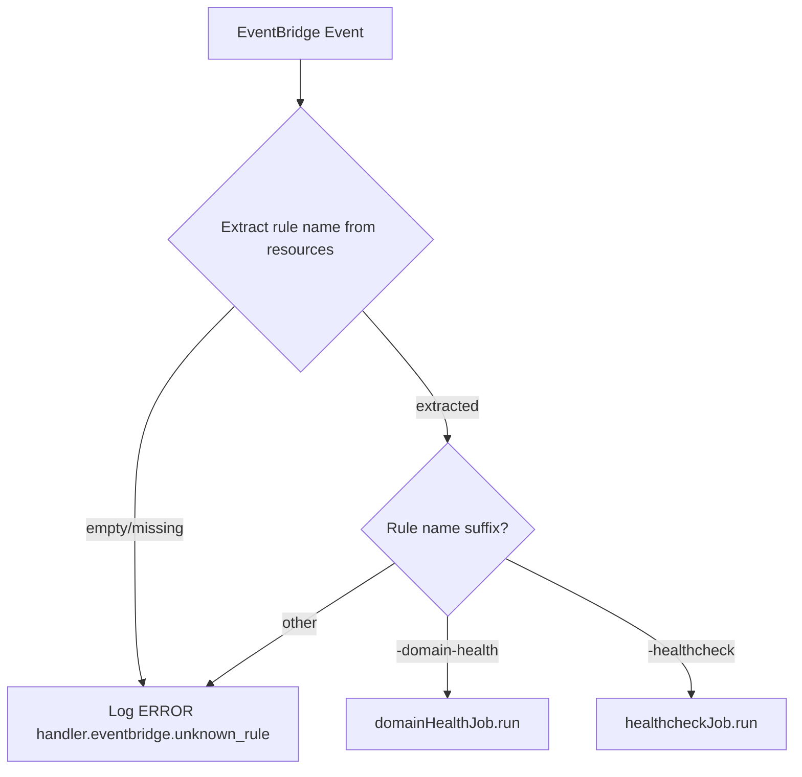

# Design Document: Daily Healthcheck

## Overview

A daily production integration test that validates the full email-catcher pipeline end-to-end. Each morning at 06:00 UTC, an EventBridge rule triggers the existing Lambda. The `HealthcheckJob` validates that yesterday's healthcheck email was fully processed (signal exists, has a threadId, correct workflow, embedding indexed in Aurora pgvector), then sends today's test email through the live pipeline.

The design follows the existing `DomainHealthJob` pattern: a standalone class with a `run()` method, injected dependencies, instantiated in `handler.ts`.

Key design decisions:
- **No new env vars** — everything derived from existing `MAIL_DOMAIN`
- **No processor changes** — the processor is unaware of SYSTEM accounts
- **Full pipeline execution** — LLM classifier and Bedrock embedding run normally (not short-circuited), because validating these is the point
- **SystemAccountDb as delegation target** — `AccountDatabase` delegates to it for `SYSTEM` account ID, short-circuiting DynamoDB for account-config only
- **Signals/threads stored normally** — needed for next-day validation via GSI3
- **Deterministic Message-ID** — enables stateless validation via existing GSI3 index
- **MJML email template** — rich body with logging context, validation results, explanatory text
- **7-day TTL** — healthcheck signals auto-expire to prevent accumulation
- **Internal billing plan** — no artificial limits on retention or features

## Prerequisites (processor changes)

### Multi-row Embeddings

Change the Aurora pgvector schema from one-row-per-thread to one-row-per-signal:

```typescript
// processor.ts — executeAuroraUpserts
// BEFORE: .onConflictDoUpdate({ target: [threadEmbeddings.threadId, ...], set: { embedding: ... } })
// AFTER:  plain INSERT (no ON CONFLICT) with signalId included

await tx.insert(threadEmbeddings).values({
  signalId: signal.id,  // NEW column in unique constraint
  threadId: opts.threadId,
  accountId: opts.accountId,
  recipientAddress: opts.recipientAddress,
  embedding: toVector(opts.embedding),
  updatedAt: sql`now()`,
});
```

Thread matching query changes to deduplicate by threadId:

```sql
SELECT DISTINCT ON (thread_id) thread_id
FROM thread_embeddings
WHERE account_id = $1 AND recipient_address = $2
  AND embedding <=> $3::vector < 0.5
ORDER BY thread_id, embedding <=> $3::vector
LIMIT 1
```

### Test Detection Fix

Replace the single-lookup approach:

```typescript
// BEFORE:
const fromDomain = getETLD1(parsed.from.address);
const fromDomainResult = await this.accountDb.getDomainByName(accountId, fromDomain);
const isTestEmail = fromDomainResult.isOk() && fromDomainResult.value !== null;

// AFTER:
const fromETLD1 = getETLD1(parsed.from.address);
const domainsResult = await this.accountDb.listDomains(accountId);
const isTestEmail = domainsResult.isOk() &&
  domainsResult.value.some(d => getETLD1(d.domain) === fromETLD1);
```

### assign_workflow Updates Signal

After `applyRules` completes, propagate workflow changes to the signal shell:

```typescript
const matchedRules = await applyRules(rules, { signal: signalShell, thread, isMatchedThread }, ...);

// NEW: propagate assign_workflow to signal data
const finalWorkflowAction = matchedRules
  .flatMap(r => r.actions)
  .findLast(a => a.type === "assign_workflow" && a.value);
if (finalWorkflowAction?.value) {
  signalShell.data.workflow = finalWorkflowAction.value as Workflow;
  signalShell.data.workflowData = { workflow: finalWorkflowAction.value } as WorkflowData;
}
```

### SYSTEM Account Workflow Override

After the `isTestEmail` block, before thread matching:

```typescript
// After isTestEmail block:
if (isSystemAccount(accountId)) {
  classificationOutput.workflow = "healthcheck";
  classificationOutput.workflowData = { workflow: "healthcheck" };
}
```

---

## Architecture



### Handler Routing

The existing EventBridge routing in `handler.ts` uses rule name suffix matching:



## Components and Interfaces

### File Structure

```
src/
├── database/
│   ├── system-account-db.ts    # NEW — SystemAccountDb class + SYSTEM_ACCOUNT_ID + isSystemAccount
│   ├── account-database.ts     # MODIFIED — delegates to SystemAccountDb at method start
│   └── thread-database.ts      # UNCHANGED — signals/threads stored normally for SYSTEM
├── jobs/
│   └── healthcheck-job.ts      # NEW — HealthcheckJob class
├── types/
│   └── index.ts                # MODIFIED — add "healthcheck" to WORKFLOWS + HealthcheckData interface
├── classifier/
│   └── classifier.ts           # MODIFIED — add healthcheck workflow to prompt
├── handler.ts                  # MODIFIED — routing + instantiation
email-templates/
└── healthcheck.mjml            # NEW — MJML template for healthcheck email
deploy/
└── storage.tf                  # MODIFIED — EventBridge rule + target + permission
```

### HealthcheckJob

```typescript
// src/jobs/healthcheck-job.ts

import { DateTime } from "luxon";
import type { Logger } from "../logger.js";
import type { ThreadDatabase } from "../database/thread-database.js";
import type { EmailService, EmailSendOptions } from "../email/email-service.js";
import { buildSignalGsi3pk } from "../processor/message-id.js";
import { SYSTEM_ACCOUNT_ID } from "../database/system-account-db.js";

export interface HealthcheckJobDeps {
  threadDb: ThreadDatabase;
  emailService: EmailService;
  searchDatabase: { hasEmbedding(threadId: string): Promise<boolean> };
  mailDomain: string;
  logger: Logger;
}

export class HealthcheckJob {
  constructor(private readonly deps: HealthcheckJobDeps) {}

  async run(): Promise<void> {
    const now = DateTime.utc();
    const today = now.toFormat("yyyy-MM-dd");
    const yesterday = now.minus({ days: 1 }).toFormat("yyyy-MM-dd");

    // --- Validation Phase ---
    await this.validate(yesterday);

    // --- Send Phase ---
    await this.send(today);
  }

  private buildMessageId(date: string): string {
    return `healthcheck-${date}@${this.deps.mailDomain}`;
  }

  private async validate(date: string): Promise<void> {
    const expectedMessageId = this.buildMessageId(date);
    const gsi3pk = buildSignalGsi3pk(SYSTEM_ACCOUNT_ID, expectedMessageId);

    let signal: { threadId?: string; id: string; status: string; source: string; type: string } | null;
    try {
      const result = await this.deps.threadDb.findSignalByEmailMessageId(gsi3pk);
      if (result.isErr()) {
        this.deps.logger.track("Healthcheck validation query failed — DynamoDB error.", {
          code: "healthcheck.validation_error",
          messageId: expectedMessageId,
          error: result.error,
        });
        return;
      }
      signal = result.value;
    } catch (e) {
      this.deps.logger.track("Healthcheck validation threw unexpected error.", {
        code: "healthcheck.validation_error",
        messageId: expectedMessageId,
        error: e,
      });
      return;
    }

    if (!signal) {
      this.deps.logger.track("Yesterday's healthcheck signal not found in signals table.", {
        code: "healthcheck.signal_not_found",
        messageId: expectedMessageId,
      });
      return;
    }

    // Run all checks, collecting results
    const checks = {
      hasThreadId: Boolean(signal.threadId && signal.threadId.length > 0),
      workflowIsHealthcheck: false, // checked below via signal data
      hasEmbedding: false,
    };

    // Workflow check requires full signal — findSignalByEmailMessageId returns minimal fields.
    // We'll need to enhance the query or accept the fields available.
    // For now, the signal from GSI3 includes the full item (ALL projection).
    const fullSignal = signal as unknown as { threadId?: string; workflow?: string; data?: { workflow?: string } };
    const workflow = fullSignal.data?.workflow ?? fullSignal.workflow;
    checks.workflowIsHealthcheck = workflow === "healthcheck";

    // Embedding check
    if (signal.threadId) {
      try {
        checks.hasEmbedding = await this.deps.searchDatabase.hasEmbedding(signal.threadId);
      } catch (e) {
        this.deps.logger.track("Aurora connectivity/timeout error during embedding existence check.", {
          code: "healthcheck.embedding_check_error",
          messageId: expectedMessageId,
          threadId: signal.threadId,
          error: e,
        });
        checks.hasEmbedding = false;
      }
    }

    const allPassed = checks.hasThreadId && checks.workflowIsHealthcheck && checks.hasEmbedding;

    if (allPassed) {
      this.deps.logger.track("Healthcheck validation passed — yesterday's email fully processed.", {
        code: "healthcheck.validation_passed",
        messageId: expectedMessageId,
        checks,
      });
    } else {
      this.deps.logger.track("Healthcheck validation failed — one or more checks did not pass.", {
        code: "healthcheck.validation_failed",
        messageId: expectedMessageId,
        checks,
        signalState: { id: signal.id, threadId: signal.threadId, workflow },
      });
    }
  }

  private async send(today: string): Promise<void> {
    const messageId = this.buildMessageId(today);
    const recipient = `healthcheck@${this.deps.mailDomain}`;
    const subject = `Healthcheck ${today}`;
    
    // Render MJML template with full context
    const templateData = {
      date: today,
      messageId,
      invocationId: this.deps.logger.getInvocationId(),
      containerId: process.env["AWS_LAMBDA_LOG_STREAM_NAME"] ?? "unknown",
      timestamp: DateTime.utc().toISO()!,
      validationResults: this.lastValidationResults, // captured during validate phase
    };
    const { html, text } = renderHealthcheckEmail(templateData);

    try {
      const result = await this.deps.emailService.send({
        to: recipient,
        subject,
        textBody: text,
        htmlBody: html,
        headers: [{ Name: "Message-ID", Value: `<${messageId}>` }],
        accountId: SYSTEM_ACCOUNT_ID,
      });

      if (result.isErr()) {
        this.deps.logger.track("Healthcheck email send failed — SES returned error.", {
          code: "healthcheck.send_failed",
          messageId,
          error: result.error,
        });
        return;
      }

      this.deps.logger.info("Healthcheck email sent successfully.", {
        code: "healthcheck.send_success",
        messageId,
        sesMessageId: result.value.messageId,
      });
    } catch (e) {
      this.deps.logger.track("Healthcheck send phase threw unexpected error.", {
        code: "healthcheck.send_error",
        messageId,
        error: e,
      });
    }
  }
}
```

### SystemAccountDb

```typescript
// src/database/system-account-db.ts

import type { Account, Domain, Alias, Rule } from "../types/index.js";
import type { Result, DbError } from "../errors.js";
import { ok } from "../errors.js";
import { SYSTEM_RULES } from "../processor/system-rules.js";

export const SYSTEM_ACCOUNT_ID = "SYSTEM";

export function isSystemAccount(accountId: string): boolean {
  return accountId === SYSTEM_ACCOUNT_ID;
}

/**
 * Provides hardcoded responses for the SYSTEM account.
 * AccountDatabase delegates to this class when isSystemAccount(accountId) is true.
 * 
 * The SYSTEM account is used by the daily healthcheck. Its signals/threads are
 * stored normally in DynamoDB (needed for validation), but account-config lookups
 * (rules, filtering, domains, aliases) are short-circuited here.
 */
export class SystemAccountDb {
  private readonly mailDomain: string;

  constructor(mailDomain: string) {
    this.mailDomain = mailDomain;
  }

  getAccount(): Result<Account | null, DbError> {
    return ok({
      id: SYSTEM_ACCOUNT_ID,
      name: "System",
      retentionDuration: "P7D",
      filtering: { defaultUnknownSenderPolicy: "allow_all" as const },
      digest: null,
      onboarding: { completed: true },
      billingPlan: "Internal" as const,
      createdAt: "2025-01-01T00:00:00.000Z",
      updatedAt: "2025-01-01T00:00:00.000Z",
    });
  }

  listEnabledRules(): Result<Rule[], DbError> {
    return ok(SYSTEM_RULES.filter(r => r.status === "enabled"));
  }

  getDomainByName(domainName: string): Result<Domain | null, DbError> {
    if (domainName === this.mailDomain) {
      return ok({
        accountId: SYSTEM_ACCOUNT_ID,
        domain: this.mailDomain,
        receivingSetupComplete: true,
        senderSetupComplete: true,
        receivingHealthy: true,
        senderHealthy: true,
        createdAt: "2025-01-01T00:00:00.000Z",
        updatedAt: "2025-01-01T00:00:00.000Z",
      });
    }
    return ok(null);
  }

  getDomainOwner(domain: string): Result<Domain | null, DbError> {
    if (domain === this.mailDomain) {
      return this.getDomainByName(domain);
    }
    return ok(null);
  }

  getAliasByGlobalAddress(recipientAddress: string): Result<Alias | null, DbError> {
    const healthcheckAddress = `healthcheck@${this.mailDomain}`;
    if (recipientAddress === healthcheckAddress) {
      return ok({
        id: "system-healthcheck",
        accountId: SYSTEM_ACCOUNT_ID,
        address: healthcheckAddress,
        domain: this.mailDomain,
        unknownSenderPolicy: "allow_all" as const,
        createdAt: "2025-01-01T00:00:00.000Z",
        updatedAt: "2025-01-01T00:00:00.000Z",
      });
    }
    return ok(null);
  }

  // --- Default/empty responses for all other lookups ---

  listAliases(): Result<Alias[], DbError> { return ok([]); }
  listDomains(): Result<Domain[], DbError> {
    return ok([{
      accountId: SYSTEM_ACCOUNT_ID,
      domain: this.mailDomain,
      receivingSetupComplete: true,
      senderSetupComplete: true,
      receivingHealthy: true,
      senderHealthy: true,
      createdAt: "2025-01-01T00:00:00.000Z",
      updatedAt: "2025-01-01T00:00:00.000Z",
    }]);
  }
  listRules(): Result<Rule[], DbError> { return ok(SYSTEM_RULES); }
  listViews(): Result<never[], DbError> { return ok([]); }
  listLabels(): Result<never[], DbError> { return ok([]); }
  listForwardingTargets(): Result<never[], DbError> { return ok([]); }
  listTemplates(): Result<never[], DbError> { return ok([]); }
  listSenders(): Result<never[], DbError> { return ok([]); }
  getAccountFilteringConfig(): Result<{ defaultUnknownSenderPolicy: "allow_all" }, DbError> {
    return ok({ defaultUnknownSenderPolicy: "allow_all" as const });
  }
}
```

### Handler Routing Changes

```typescript
// In handler.ts — modified EventBridge routing section

if (isEventBridgeEvent(event)) {
  const ebEvent = event as EventBridgeEvent<string, unknown>;
  const ruleName = ebEvent.resources?.[0]?.split("/").pop();
  
  if (ruleName?.endsWith("-domain-health")) {
    await domainHealthJob.run();
    return;
  }
  
  if (ruleName?.endsWith("-healthcheck")) {
    await healthcheckJob.run();
    return;
  }

  // Unrecognised rule — log and return without invoking any job
  logger.error("EventBridge event received with unrecognised rule name. No job will be invoked.", {
    code: "handler.eventbridge.unknown_rule",
    ruleName: ruleName ?? null,
    resources: ebEvent.resources,
  });
  return;
}
```

### ThreadMatcher — hasEmbedding method

A new method on `ThreadMatcher` to check embedding existence:

```typescript
// Added to ThreadMatcher class in src/database/thread-matcher.ts

async hasEmbedding(threadId: string): Promise<boolean> {
  const cluster = getPrimaryThreadMatcherRegistry();
  const db = getDbForCluster(cluster);

  const rows = await withRetry(async () => {
    return db
      .select({ threadId: threadEmbeddings.threadId })
      .from(threadEmbeddings)
      .where(eq(threadEmbeddings.threadId, threadId))
      .limit(1);
  });

  return rows.length > 0;
}
```

### AccountDatabase Delegation

At the start of each relevant method in `AccountDatabase`, add the SYSTEM guard:

```typescript
// Example pattern applied to each method:

async getAccount(accountId: string): Promise<Result<Account | null, DbError>> {
  if (isSystemAccount(accountId)) return this.systemDb.getAccount();
  // ... existing DynamoDB logic
}

async getAliasByGlobalAddress(recipientAddress: string): Promise<Result<Alias | null, DbError>> {
  // Check if the address resolves to SYSTEM first
  const systemResult = this.systemDb.getAliasByGlobalAddress(recipientAddress);
  if (systemResult.isOk() && systemResult.value !== null) return systemResult;
  // ... existing DynamoDB logic
}

async getDomainOwner(domain: string): Promise<Result<Domain | null, DbError>> {
  const systemResult = this.systemDb.getDomainOwner(domain);
  if (systemResult.isOk() && systemResult.value !== null) return systemResult;
  // ... existing DynamoDB logic
}

async listEnabledRules(accountId: string): Promise<Result<Rule[], DbError>> {
  if (isSystemAccount(accountId)) return this.systemDb.listEnabledRules();
  // ... existing logic
}
```

The `AccountDatabase` constructor gains a `systemDb` field:

```typescript
private readonly systemDb = new SystemAccountDb(process.env["MAIL_DOMAIN"] ?? "");
```

## Data Models

### Signal (existing, no schema changes)

The healthcheck signal is stored in the existing signals table with the standard schema:

| Field | Value |
|-------|-------|
| `accountId` | `"SYSTEM"` |
| `gsi3pk` | `ACCT#SYSTEM#MSGID#healthcheck-2025-07-07@platform.email.rhosys.cloud` |
| `threadId` | Auto-assigned by processor |
| `data.workflow` | `"healthcheck"` |
| `source` | `"email"` |
| `type` | `"email"` |
| `status` | `"active"` |
| `ttl` | 7 days from creation (epoch seconds) |
| `retentionDuration` | `"P7D"` (from SYSTEM account config) |

The processor computes TTL from the account's `retentionDuration` (`P7D`) as usual — no special handling needed.

### WORKFLOWS Array

```typescript
export const WORKFLOWS = [
  // ... existing workflows ...
  "healthcheck",   // System-generated pipeline validation emails — daily automated checks
  "test",          // Emails sent by the account owner to their own domain — triggers pong
  "unspecified",   // Classification failed or was skipped
] as const;

export interface HealthcheckData {
  workflow: "healthcheck";
}
```

### Terraform Resources

```hcl
# deploy/storage.tf — new resources

resource "aws_cloudwatch_event_rule" "healthcheck" {
  name                = "${var.service_name}-healthcheck"
  description         = "Daily pipeline healthcheck — validates yesterday's signal and sends today's test email"
  schedule_expression = "cron(0 6 * * ? *)"
}

resource "aws_cloudwatch_event_target" "healthcheck" {
  rule      = aws_cloudwatch_event_rule.healthcheck.name
  target_id = "healthcheck-lambda"
  arn       = aws_lambda_alias.production.arn
}

resource "aws_lambda_permission" "healthcheck_eventbridge" {
  statement_id  = "AllowHealthcheckEventBridge"
  action        = "lambda:InvokeFunction"
  function_name = aws_lambda_function.main.function_name
  qualifier     = aws_lambda_alias.production.name
  principal     = "events.amazonaws.com"
  source_arn    = aws_cloudwatch_event_rule.healthcheck.arn
}
```

## Correctness Properties

*A property is a characteristic or behavior that should hold true across all valid executions of a system — essentially, a formal statement about what the system should do. Properties serve as the bridge between human-readable specifications and machine-verifiable correctness guarantees.*

### Property 1: Unrecognized EventBridge rules are rejected

*For any* EventBridge event whose rule name does not end with `-healthcheck` or `-domain-health` (including empty/missing resources), the handler SHALL log an error with code `handler.eventbridge.unknown_rule` and SHALL NOT invoke any job class.

**Validates: Requirements 2.2, 2.3**

### Property 2: Deterministic Message-ID generation

*For any* UTC date, the `buildMessageId` function SHALL produce a Message-ID in the exact format `healthcheck-YYYY-MM-DD@{MAIL_DOMAIN}`, and *for any* two invocations on the same UTC date (regardless of time of day), the output SHALL be identical.

**Validates: Requirements 3.1, 4.2, 4.6, 5.1, 5.3**

### Property 3: Validation failure detection

*For any* signal returned from GSI3 that is missing a non-empty `threadId`, OR has a workflow other than `"healthcheck"`, OR lacks an embedding in Aurora pgvector, the job SHALL log a track-level message with code `healthcheck.validation_failed` including which specific checks failed.

**Validates: Requirements 3.3, 3.4, 3.5, 3.7**

### Property 4: Graceful degradation — send always executes

*For any* outcome of the validation phase (success, failure, signal not found, DynamoDB error, Aurora error, unexpected exception), the job SHALL proceed to the send phase. Furthermore, *for any* error occurring in the send phase, the job SHALL catch it and return normally without re-throwing.

**Validates: Requirements 4.1, 9.1, 9.2, 9.3, 9.4**

### Property 5: SystemAccountDb delegation

*For any* method on `AccountDatabase` that accepts an `accountId` parameter, calling it with `"SYSTEM"` SHALL return the hardcoded response from `SystemAccountDb` without performing any DynamoDB operation.

**Validates: Requirements 6.2, 6.9**

## Error Handling

| Phase | Error Source | Behavior | Log Code |
|-------|-------------|----------|----------|
| Validation | DynamoDB query error | Log track, skip validation, proceed to send | `healthcheck.validation_error` |
| Validation | Signal not found | Log track, proceed to send | `healthcheck.signal_not_found` |
| Validation | Aurora connectivity/timeout | Mark embedding check as failed, continue other checks | `healthcheck.embedding_check_error` |
| Validation | Unexpected exception | Log track, proceed to send | `healthcheck.validation_error` |
| Send | SES transient error (Result.err) | Log track, return normally | `healthcheck.send_failed` |
| Send | Unexpected exception | Log track, return normally | `healthcheck.send_error` |
| Routing | Unknown EventBridge rule | Log error, return without invoking jobs | `handler.eventbridge.unknown_rule` |

The job **never** throws. The Lambda invocation always reports success to EventBridge, preventing retry storms.

## Testing Strategy

**Unit tests** (vitest):
- Handler routing: verify `-healthcheck` suffix routes to `HealthcheckJob.run()`
- Handler routing: verify unknown suffixes log error and don't invoke jobs
- Handler routing: verify empty/missing resources logs error
- HealthcheckJob: full happy path (signal found, all checks pass, send succeeds)
- HealthcheckJob: signal not found → logs track, still sends
- HealthcheckJob: validation checks partially fail → logs correct failures
- HealthcheckJob: Aurora error during embedding check → treats as failed
- HealthcheckJob: DynamoDB error during validation → logs and sends anyway
- HealthcheckJob: send phase error → catches and returns
- SystemAccountDb: getAccount returns expected shape
- SystemAccountDb: listEnabledRules returns system rules
- SystemAccountDb: getDomainByName returns domain for MAIL_DOMAIN
- SystemAccountDb: getAliasByGlobalAddress resolves healthcheck address
- SystemAccountDb: other methods return empty/default
- AccountDatabase delegation: SYSTEM accountId short-circuits to SystemAccountDb
- SR-18 (pong) does not match workflow `"healthcheck"`

**Property-based tests** (vitest with fast-check):

Per tech stack steering, this project uses "static expectations only — no fast-check, no random generation." Therefore property-based tests will be implemented as parameterized example-based tests covering representative input ranges rather than true PBT. The correctness properties above define the invariants that the example-based tests must verify exhaustively.

**Integration verification** (manual/production):
- First deploy: run job manually, confirm signal appears in DynamoDB next day
- Confirm Aurora embedding exists for the healthcheck thread
- Confirm classifier assigns workflow `"healthcheck"` (LLM-dependent)

**Infrastructure tests**:
- Terraform plan shows exactly 3 new resources (rule + target + permission)
- Cron expression matches `cron(0 6 * * ? *)`
