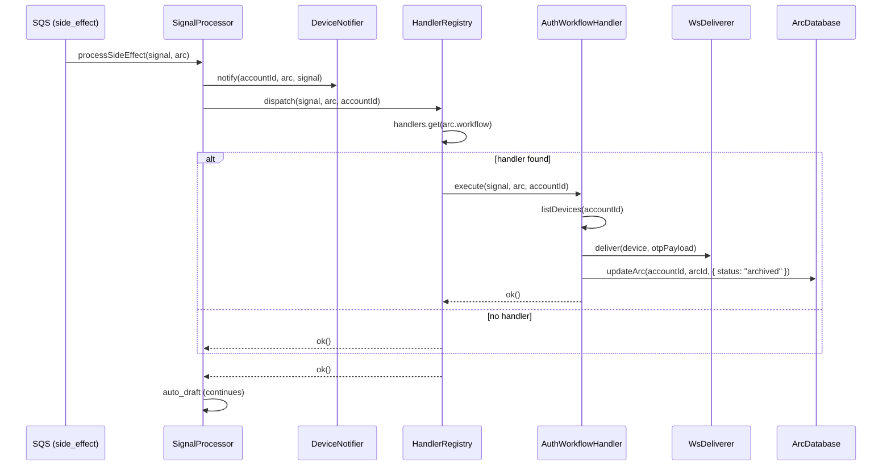

# Design Document: Workflow Side-Effects

## Overview

A per-workflow side-effect dispatcher that runs inside the existing `processSideEffect` pipeline, after notify and before auto_draft. Each workflow gets a handler that can enrich signals, push structured data to clients, or schedule future actions. The framework uses a registry pattern — adding a new workflow handler requires one file and one registration entry.

The first concrete handler is `auth`, which constructs an OTP payload from the signal's `workflowData.code` and pushes it to all connected WebSocket clients. This enables browser extensions and mobile apps to auto-fill codes without the user navigating to their inbox.

### Design Decisions

1. **HandlerRegistry owns dispatch** — the registry is a class with a `dispatch(signal, arc, accountId)` method. No separate dispatcher function. The owner dispatches.
2. **Constructor injection, no context bags** — handlers receive dependencies (DeviceStore, Deliverer, ArcDatabase, Logger) via constructor. The `execute` method takes only domain data: `(signal, arc, accountId)`.
3. **No no-op handlers** — if no handler is registered for a workflow, the registry's `dispatch` returns `ok()` immediately. No placeholder implementations.
4. **Handler-owned error semantics** — the registry doesn't classify handlers. If a handler returns `err()`, the registry propagates it (triggering SQS retry). If a handler returns `ok()`, processing continues. The handler decides what's retriable.
5. **Auth handler is best-effort** — OTP push always returns `ok()`. Delivery failures are logged but never block the pipeline. The handler archives the arc after pushing.
6. **OTP-only** — the auth handler pushes `code` payloads. No `actionUrl` handling (that's a future "confirmation" workflow).
7. **Map keys from handler metadata** — the registry builds its map from `handler.workflow`, not string literals.
8. **Composition root assembles** — the composition root constructs each handler with its deps and passes the assembled array to the registry. The registry is just a lookup structure.

## Architecture



### Integration Point

The `HandlerRegistry.dispatch()` call is inserted into `processSideEffect()` between the notify block and the auto_draft block:

```
forward → notify → **workflow dispatch** → auto_draft
```

The dispatch result follows the same pattern as forward/pong: if it returns `err()`, the processor sets `criticalFailure` and the Lambda fails (triggering SQS retry).

## Components and Interfaces

### WorkflowHandler Interface (`src/workflow/types.ts`)

```typescript
import type { Result } from "neverthrow";
import type { DbError } from "../errors.js";
import type { Signal, Arc, Workflow } from "../types/index.js";

export interface WorkflowHandler {
  readonly workflow: Workflow;
  execute(signal: Signal, arc: Arc, accountId: string): Promise<Result<void, DbError>>;
}
```

### HandlerRegistry (`src/workflow/registry.ts`)

```typescript
import type { Result } from "neverthrow";
import { ok } from "../errors.js";
import type { DbError } from "../errors.js";
import type { Signal, Arc, Workflow } from "../types/index.js";
import type { WorkflowHandler } from "./types.js";

export class HandlerRegistry {
  private readonly handlers: Map<Workflow, WorkflowHandler>;

  constructor(handlers: WorkflowHandler[]) {
    this.handlers = new Map(handlers.map(h => [h.workflow, h]));
  }

  async dispatch(signal: Signal, arc: Arc, accountId: string): Promise<Result<void, DbError>> {
    const handler = this.handlers.get(arc.workflow);
    if (!handler) return ok(undefined);
    return handler.execute(signal, arc, accountId);
  }
}
```

### AuthWorkflowHandler (`src/workflow/auth-handler.ts`)

```typescript
import type { Result } from "neverthrow";
import { ok } from "../errors.js";
import type { DbError } from "../errors.js";
import type { Signal, Arc, AuthData } from "../types/index.js";
import type { WorkflowHandler } from "./types.js";
import type { DeviceStore } from "../notifier/device-store.js";
import type { Deliverer, DeliveryResult } from "../notifier/types.js";
import type { ArcDatabase } from "../database/arc-database.js";
import type { Logger } from "../logger.js";
import { getETLD1 } from "../processor/filter.js";

export interface OtpPayload {
  type: "otp";
  signalId: string;
  code: string;
  authType: AuthData["authType"];
  expiresInMinutes?: number;
  originDomain: string;
  subject: string;
}

export class AuthWorkflowHandler implements WorkflowHandler {
  readonly workflow = "auth" as const;

  constructor(
    private readonly deviceStore: DeviceStore,
    private readonly wsDeliverer: Deliverer,
    private readonly arcDatabase: ArcDatabase,
    private readonly logger: Logger,
  ) {}

  async execute(signal: Signal, arc: Arc, accountId: string): Promise<Result<void, DbError>> {
    const workflowData = signal.workflowData as AuthData;

    if (!workflowData.code) {
      return ok(undefined);
    }

    const payload = this.buildOtpPayload(signal, workflowData);
    await this.deliverToAll(accountId, payload);

    // Archive — auth arcs don't need to stay in the inbox
    const archiveResult = await this.arcDatabase.updateArc(accountId, arc.id, { status: "archived" });
    if (archiveResult.isErr()) {
      this.logger.warn("Failed to archive auth arc after OTP push", {
        code: "workflow.auth.archive_failed", accountId, arcId: arc.id, error: archiveResult.error,
      });
    }

    return ok(undefined);
  }

  private buildOtpPayload(signal: Signal, data: AuthData): OtpPayload {
    return {
      type: "otp",
      signalId: signal.id,
      code: data.code!,
      authType: data.authType,
      expiresInMinutes: data.expiresInMinutes,
      originDomain: getETLD1(signal.from.address),
      subject: signal.subject,
    };
  }

  private async deliverToAll(accountId: string, payload: OtpPayload): Promise<void> {
    const devicesResult = await this.deviceStore.listDevices(accountId);
    if (devicesResult.isErr()) {
      this.logger.warn("Failed to list devices for OTP push", {
        code: "workflow.auth.list_devices_failed", accountId, error: devicesResult.error,
      });
      return;
    }

    for (const device of devicesResult.value) {
      const result: DeliveryResult = await this.wsDeliverer.deliver(device, payload as any, "interrupt");
      if (result.status === "stale") {
        await this.deviceStore.deleteDevice(accountId, device.token);
      } else if (result.status === "failed") {
        this.logger.warn("OTP delivery failed", {
          code: "workflow.auth.delivery_failed", accountId, token: device.token, reason: result.reason,
        });
      }
    }
  }
}
```

### Composition Root Integration

```typescript
// In the Lambda handler composition root:
const authHandler = new AuthWorkflowHandler(deviceStore, wsDeliverer, arcDatabase, logger);
const handlerRegistry = new HandlerRegistry([authHandler]);

// Passed to SignalProcessor constructor
const processor = new SignalProcessor({ ..., handlerRegistry });
```

### File Layout

```
src/workflow/
├── types.ts              # WorkflowHandler interface
├── registry.ts           # HandlerRegistry class (owns map + dispatch)
└── auth-handler.ts       # AuthWorkflowHandler + OtpPayload type
```

## Data Models

### OTP Payload (WebSocket message)

```typescript
interface OtpPayload {
  type: "otp";           // Distinct from "signal" used by DeviceNotifier
  signalId: string;      // Signal ID for client-side dedup/linking
  code: string;          // The OTP code
  authType: AuthData["authType"];  // "otp" | "password_reset" | "magic_link" | etc.
  expiresInMinutes?: number;       // Undefined if classifier couldn't extract
  originDomain: string;  // eTLD+1 of sender (e.g. "github.com")
  subject: string;       // Email subject line
}
```

The `originDomain` is extracted from `signal.from.address` using the existing `getETLD1()` utility. This gives the client enough context to display which service the OTP is for.

### AuthData Type Extension

The `AuthData.authType` union needs a new member for security alerts:

```typescript
export interface AuthData {
  workflow: "auth";
  authType: "otp" | "password_reset" | "magic_link" | "verification" | "two_factor" | "security_alert" | "other";
  code?: string;
  expiresInMinutes?: number;
  service: string;
  actionUrl?: string;
}
```

### SystemLabel Type Extension

```typescript
export type SystemLabel =
  | /* ...existing... */
  | "system:auth:security_alert";
```

### System Rule SR-25

A new system rule that quarantines security alert auth signals:

```typescript
{
  id: "SR-25",
  accountId: "SYSTEM",
  name: "Quarantine security alert emails",
  condition: JSON.stringify(in_("system:auth:security_alert")),
  actions: [{ type: "quarantine_hidden" }],
  status: "enabled",
  priorityOrder: 5,  // after onboarding/status blocks, before medium-spam quarantine
  createdAt: "",
  updatedAt: "",
}
```

This requires `assignSystemLabels()` to emit `"system:auth:security_alert"` when the signal's workflow is `"auth"` and `workflowData.authType` is `"security_alert"`.

## Correctness Properties

*A property is a characteristic or behavior that should hold true across all valid executions of a system — essentially, a formal statement about what the system should do. Properties serve as the bridge between human-readable specifications and machine-verifiable correctness guarantees.*

### Property 1: Dispatcher routes to the correct handler

*For any* arc whose workflow has a registered handler, the registry's `dispatch` method SHALL invoke exactly that handler's `execute` method and no other.

**Validates: Requirements 1.1, 2.1**

### Property 2: OTP payload construction and fan-out

*For any* auth signal where `workflowData.code` is present and *for any* set of connected WebSocket devices, the auth handler SHALL deliver a payload to each device containing: `type: "otp"`, `signalId` matching the signal's ID, `code` matching `workflowData.code`, `authType` matching `workflowData.authType`, `expiresInMinutes` matching `workflowData.expiresInMinutes`, `originDomain` equal to the eTLD+1 of the sender's email domain, and `subject` matching the signal's subject.

**Validates: Requirements 4.1, 4.2, 4.3, 4.4**

### Property 3: Best-effort delivery invariant

*For any* auth signal processed by the auth handler, the handler SHALL return `ok()` regardless of whether individual device deliveries succeed, fail, or encounter stale connections.

**Validates: Requirements 4.8**

## Error Handling

| Scenario | Behaviour | Rationale |
|----------|-----------|-----------|
| Handler returns `err()` | Registry propagates → SQS retry | Handler decides what's retriable |
| Handler returns `ok()` | Continue to auto_draft | Handler swallows non-critical failures |
| No handler registered | Return `ok()` immediately | No work to do |
| WS delivery returns `stale` | Delete stale device, continue | Stale connections are normal |
| WS delivery returns `failed` | Log warning, continue | Best-effort — don't block pipeline |
| Arc update fails after OTP push | Log warning, return `ok()` | OTP already delivered; archival is non-critical |
| Device store `listDevices` fails | Log warning, return `ok()` | Best-effort — can't deliver but shouldn't retry |

### Error Propagation Flow

```
Handler returns err(dbError(...))
  → registry.dispatch returns err(...)
    → processSideEffect sets criticalFailure
      → Lambda returns failure
        → SQS retries with backoff
```

## Testing Strategy

### Unit Tests (Vitest, static deterministic inputs)

**Registry tests (`registry.spec.ts`):**
- Routes to correct handler for a registered workflow
- Returns `ok()` when no handler registered for the workflow
- Propagates `err()` from handler
- Passes signal, arc, and accountId to handler's execute method

**Auth handler tests (`auth-handler.spec.ts`):**

Property 1 (routing) — `it.each` over registered workflows:
```typescript
it.each([
  { workflow: "auth", handlerClass: "AuthWorkflowHandler" },
])("routes $workflow to $handlerClass", ...)
```

Property 2 (payload construction + fan-out) — `it.each` over meaningfully different inputs:
```typescript
it.each([
  { label: "single device, otp type", devices: 1, authType: "otp", code: "123456", domain: "noreply@github.com", expectedOrigin: "github.com" },
  { label: "multiple devices, magic_link type", devices: 3, authType: "magic_link", code: "ABC-DEF", domain: "security@accounts.google.com", expectedOrigin: "google.com" },
  { label: "subdomain sender", devices: 1, authType: "two_factor", code: "9999", domain: "no-reply@auth.stripe.com", expectedOrigin: "stripe.com" },
  { label: "with expiresInMinutes", devices: 2, authType: "otp", code: "000000", domain: "noreply@example.co.uk", expectedOrigin: "example.co.uk" },
])("delivers correct OTP payload — $label", ...)
```

Property 3 (best-effort invariant) — `it.each` over delivery outcomes:
```typescript
it.each([
  { label: "all delivered", results: ["delivered", "delivered"] },
  { label: "all stale", results: ["stale", "stale"] },
  { label: "all failed", results: ["failed", "failed"] },
  { label: "mixed outcomes", results: ["delivered", "stale", "failed"] },
  { label: "listDevices fails", listDevicesFails: true },
])("returns ok() regardless of delivery outcome — $label", ...)
```

Additional example-based tests:
- Skips push when `workflowData.code` is undefined → returns `ok()`, no delivery
- Deletes stale device on `{ status: "stale" }` response
- Archives arc after processing (`updateArc` called with `{ status: "archived" }`)
- Pushes code even when `expiresInMinutes` is 0 (no expiry filtering)
- Logs warning when arc archive fails but still returns `ok()`

**System rule tests:**
- SR-25 exists in SYSTEM_RULES with condition matching `system:auth:security_alert` and action `quarantine_hidden`
- `assignSystemLabels` produces `"system:auth:security_alert"` for auth signals with `authType: "security_alert"`
- `assignSystemLabels` does NOT produce `"system:auth:security_alert"` for other authTypes

### Integration Considerations

- The registry is tested in isolation (mocked handler)
- The auth handler is tested in isolation (mocked deliverer + device store + arc database)
- End-to-end ordering (notify → dispatch → auto_draft) is verified by the existing processor integration test pattern with mocked dependencies
