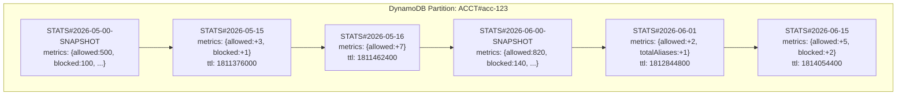
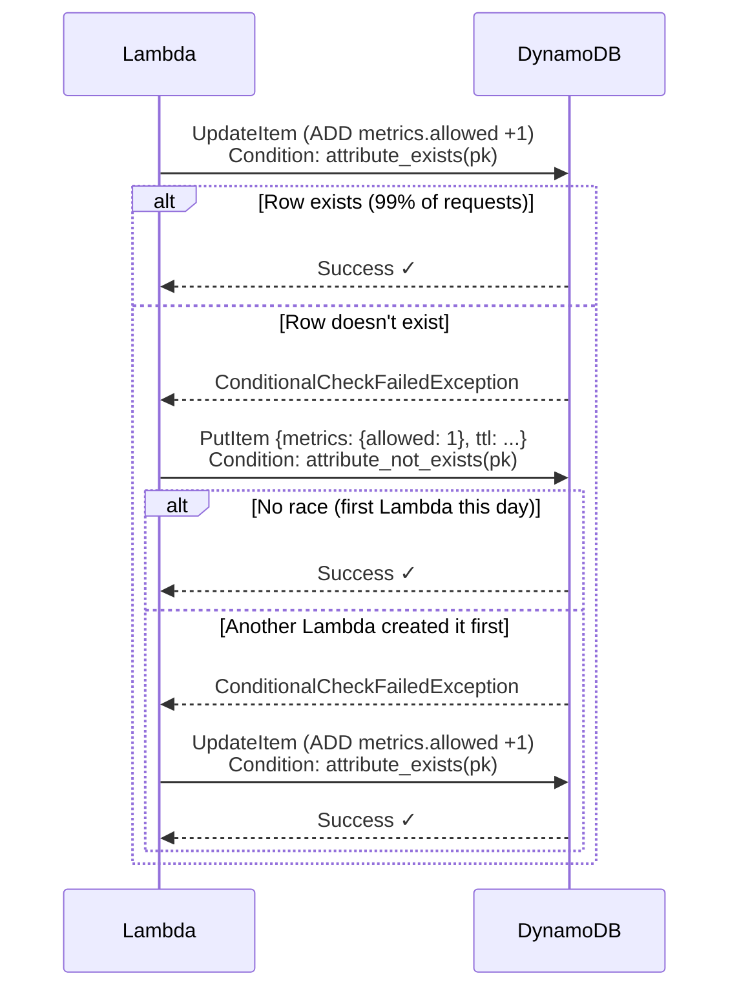
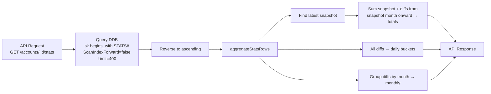
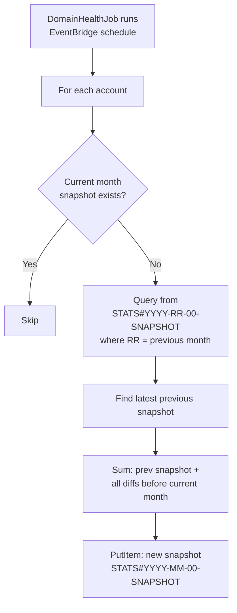
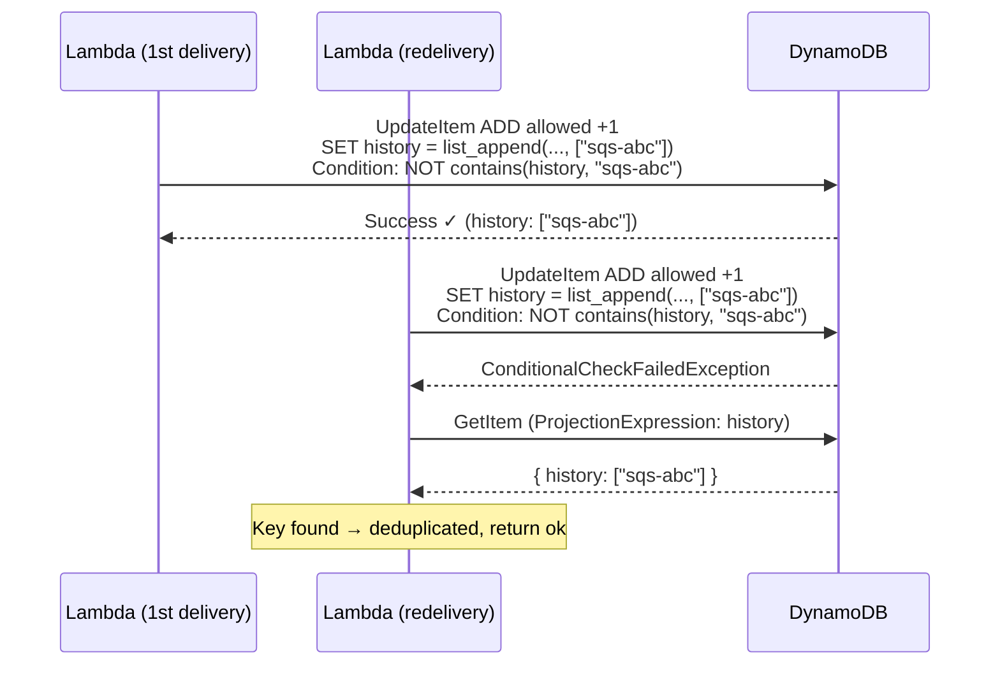

# ADR: DynamoDB Stats Metrics — Diff-Based Time Series with Monthly Snapshots

## Business Challenge

The email-catcher dashboard needs to display account-level metrics: how many emails were allowed, blocked, quarantined over time, plus resource counters like total aliases. The frontend renders:

- **Lifetime totals** — cumulative counts since account creation
- **Daily breakdown** — stacked area chart (last 365 days)
- **Monthly rollups** — bar chart for longer-term trends

These metrics must be:
- Updated in real-time as emails are processed (sub-second write latency)
- Queryable in a single API call (sub-100ms read latency)
- Extensible — new metrics can be added without migrating existing data
- Accurate — concurrent Lambda invocations processing emails for the same account must not lose increments

## Technical Challenge

DynamoDB imposes constraints that make naive approaches fail:

1. **400KB item size limit** — a single item accumulating daily attributes for 365 days × N metrics exceeds this quickly
2. **No native time-series aggregation** — DynamoDB has no SUM/GROUP BY; all aggregation happens in application code
3. **Concurrent writes** — multiple Lambda invocations process emails for the same account simultaneously. `ADD` on a nested map attribute fails if the parent map doesn't exist
4. **Cost at scale** — reading a year of daily data must not require scanning the entire partition

The previous design packed everything into a single `sk=STATS` item using DynamoDB `ADD` expressions. This hit the 400KB ceiling and required complex `REMOVE` expressions to prune old data.

## Implementation: Row-Per-Day Diffs with Monthly Snapshots

### High-Level Design

Instead of one fat item, we store one row per day containing only the **deltas** for that day. A separate **snapshot** row, created monthly, records cumulative totals — an optimization checkpoint that bounds how many rows need summing at read time.



### Why This Is Novel

**1. Append-only event sourcing in DynamoDB without streams.**
Most DynamoDB time-series designs use either: (a) one item per record with a GSI for time-range queries, or (b) time-bucketed items (hourly/daily) with pre-aggregated totals requiring read-modify-write. Our design is purely append-only — each write touches exactly one row (today's diff), uses only `ADD` (commutative, order-independent), and never reads before writing. This eliminates read-modify-write races entirely.

**2. Snapshots as materialized checkpoints, not source of truth.**
Snapshots are derivable from diffs — they exist purely to bound read cost. If a snapshot is missing or corrupt, the system gracefully degrades: it just sums more diffs. This makes the system self-healing and the snapshot generation idempotent.

**3. Forward-compatible metric registry.**
New metrics can be added to `STATS_METRICS` at any time. Old snapshots that don't contain the new metric are treated as having zero for that metric. No backfill migration needed — the system naturally converges as new diffs accumulate and new snapshots are generated.

**4. Three-level conditional write eliminates the nested-map bootstrap problem.**
DynamoDB `ADD` on `metrics.allowed` fails if the `metrics` map doesn't exist. Rather than using `SET metrics = if_not_exists(metrics, :empty)` (which races with concurrent writers), we use a three-level fallback that handles all concurrency cases without read-modify-write.

## Implementation Detail

### Schema

| Sort Key Pattern | Type | Contents | TTL |
|---|---|---|---|
| `STATS#YYYY-MM-DD` | Diff | `metrics: { allowed: +N, blocked: +M, ... }` | 5 years |
| `STATS#YYYY-MM-00-SNAPSHOT` | Snapshot | `metrics: { allowed: N, blocked: M, ... }` (cumulative) | None |

All rows share partition key `ACCT#{accountId}`.

### Write Path: Three-Level Conditional Strategy



**Why three levels, not two?**
- Step 1 (Update) is the fast path — covers all subsequent writes on the same day (vast majority of traffic)
- Step 2 (Put) handles the first write of the day — creates the row with TTL
- Step 3 (Update retry) handles the race: two Lambdas both fail Step 1, both attempt Step 2, one wins and one loses — the loser retries Step 1 which now succeeds

This guarantees exactly-once semantics for the row creation while allowing concurrent `ADD` increments without coordination.

### Read Path: Reverse Scan + Aggregation



The reverse scan (`ScanIndexForward=false`) fetches the **newest** 400 rows. For a 365-day display with monthly snapshots, this covers the full display window. The function defensively sorts the result before processing, eliminating any order-dependency bugs.

### Snapshot Generation: Background Job



The optimized range query (`sk >= STATS#YYYY-RR-00-SNAPSHOT`) fetches only ~60 rows instead of the full 400, reducing read cost for the background job.

Key properties:
- **Idempotent** — if the snapshot already exists, the job skips. Multiple runs produce the same result.
- **Self-healing** — if a previous month's snapshot is missing, `computeSnapshot(null, diffs)` starts from zero and sums all available diffs. The result is still correct (assuming diffs haven't TTL-expired).
- **Non-blocking** — snapshot generation is fire-and-forget from the API's perspective. The API always works without snapshots (just sums more rows).

### Metric Extensibility

```typescript
export const STATS_METRICS = ["allowed", "blocked", "quarantined", "violationReport", "totalAliases"] as const;
```

Adding a new metric (e.g. `totalForwardedEmails`):
1. Add the string to `STATS_METRICS`
2. Call `incrementStatMetric(accountId, "totalForwardedEmails", 1)` from the relevant code path
3. Done. No migration, no backfill.

Old snapshots that predate the new metric will have it missing. `computeSnapshot` fills missing metrics with zero before applying diffs:

```typescript
for (const metric of STATS_METRICS) {
  if (!(metric in result)) {
    (result as Record<string, number>)[metric] = 0;
  }
}
```

### TTL Strategy

- **Diff rows**: 5-year TTL from creation date. DynamoDB automatically deletes them after expiry. This provides natural data lifecycle without manual cleanup jobs.
- **Snapshot rows**: No TTL. They're the checkpoint that prevents data loss when old diffs expire. A snapshot captures all historical state accumulated before it.

### Correctness Guarantees

| Property | Mechanism |
|---|---|
| No lost increments under concurrency | `ADD` is commutative; three-level write handles row bootstrap |
| No double-counting in totals | Snapshot represents "through end of previous month"; diffs from snapshot month onward are summed exactly once |
| Order-independent aggregation | Defensive sort in `aggregateStatsRows` |
| Forward-compatible metrics | Registry-based iteration + zero-fill on missing keys |
| Graceful degradation without snapshots | `computeSnapshot(null, allDiffs)` produces correct result |
| Idempotent snapshot generation | Existence check before write; pure function of input rows |

### Cost Profile

| Operation | DynamoDB Cost | Frequency |
|---|---|---|
| Write (increment) | 1 WCU (Update) or 1 WCU (Put) | Per signal processed |
| Read (API) | ~1-2 RCU (400 items, eventually consistent) | Per dashboard page load |
| Snapshot generation | 1 RCU (query ~60 items) + 1 WCU (put snapshot) | Once per account per month |

For an account processing 100 emails/day: 100 WCU/day for stats writes (amortized across 86,400 seconds = negligible). The read cost is identical regardless of account age — always bounded by the 400-item query limit.

---

### Idempotency Layer: Per-Row History

#### The Problem

SQS delivers messages at-least-once. When the same message is redelivered, the processor re-runs and fires `incrementStats` again — double-counting the metric. The `ADD` operation is commutative but not idempotent: `ADD 1` twice = 2, not 1.

API operations are less risky (HTTP is request-response, not queue-based), but network timeouts can cause client retries against the same endpoint, producing duplicate increments.

#### The Solution: `history` Array with `contains()` Guard

Each diff row carries a `history: string[]` attribute — a bounded list of idempotency keys that have already been applied to this row. Every write atomically checks the key isn't present and appends it in the same expression:

```
UpdateExpression: "ADD #metric :delta SET history = list_append(history, :keyList)"
ConditionExpression: "attribute_exists(pk) AND NOT contains(history, :key)"
```

If the key is already in history, the condition fails → no increment → return ok (deduplicated).



#### Disambiguation After Condition Failure

`ConditionalCheckFailedException` doesn't reveal *which* condition failed. Two possible causes:
1. `attribute_exists(pk)` failed — row doesn't exist yet (first signal of the day)
2. `NOT contains(history, :key)` failed — key already processed (duplicate)

A GetItem after the failure disambiguates:
- Item exists + key in history → **deduplicated** (return ok, no write)
- Item exists + key NOT in history → **transient race** (retry the UpdateItem)
- Item doesn't exist → **row creation needed** (PutItem with history seeded to `[key]`)

#### Idempotency Key Sources

| Call Site | Key Source | Example Value |
|---|---|---|
| Processor (signal allowed/blocked/quarantined) | SQS message ID | `"abc123-def456-..."` |
| Processor (alias auto-created) | SQS message ID + suffix | `"abc123-def456-....alias"` |
| API (quarantine response creates alias) | Signal ID | `"sig-xyz789"` |
| API (POST /aliases, DELETE /aliases) | Lambda invocation ID | `"CF...-API...-L..."` |

The suffix `.alias` distinguishes the alias-creation increment from the signal-category increment when both fire on the same SQS message (same day, same diff row).

#### History Trimming

After every successful write, a fire-and-forget trim check runs:
1. GetItem (projection: `history`)
2. If `history.length > 100` → `REMOVE history[0], history[1], ..., history[9]`

This keeps the list bounded at ~100 entries. Old entries being trimmed cannot cause false-negative dedup because:
- Daily diff rows accumulate entries for at most one day (a single row's history covers one calendar day)
- SQS message visibility timeout is 6× the processing time — redeliveries happen within minutes, not days
- By the time an entry is trimmed (position 0–9 in a 100+ list), it's hours old and will never be retried

#### Why Not a Set?

DynamoDB supports `SS` (String Set) which has native `contains()` and `ADD` (add-to-set, idempotent). However:
- String Sets don't preserve insertion order — trimming "oldest N" is impossible
- `ADD` on a Set has different semantics than `ADD` on a Number — can't combine both in one expression cleanly
- `list_append` + `REMOVE history[0..9]` gives FIFO trimming naturally

#### Correctness Under All Concurrency Scenarios

| Scenario | Outcome |
|---|---|
| Normal write (row exists, key fresh) | Step 1 succeeds, metric incremented, key appended |
| Duplicate (row exists, key already seen) | Step 1 fails, GetItem confirms dedup, return ok |
| First write of day (row doesn't exist) | Step 1 fails, GetItem returns no item, PutItem creates with history |
| Two Lambdas race to create row | One PutItem wins, other fails, loser retries Step 1 which now succeeds |
| Duplicate after row creation race | Final retry's `NOT contains` catches it → ConditionalCheckFailed → return ok |
